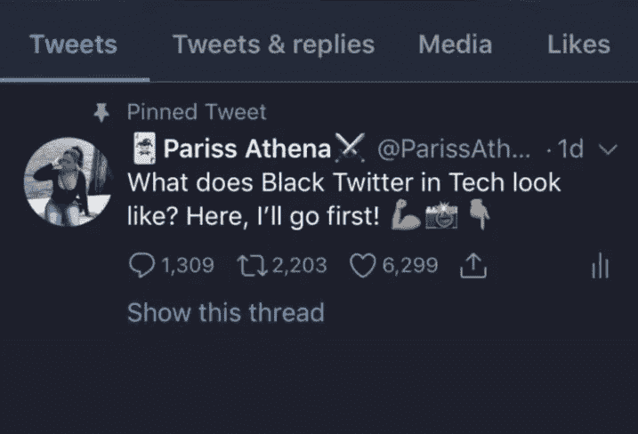

# 科技中的黑色是什么样子的？

> 原文：<https://medium.com/hackernoon/what-does-black-in-tech-look-like-652db1e5c43c>

在过去的 30 年里，科技行业经历了巨大的发展，并在全球范围内处于创新和进步的前沿。科技的繁荣带来了发展，并为全世界数百万人创造了机会。虽然超越天空是技术和开发人员的极限，但多样性——或者更确切地说，缺乏多样性是一个越来越令人担忧的问题。软件团队似乎主要由白人和亚洲人组成。黑人、妇女和西班牙裔在很大程度上代表不足。

***有趣的是，谷歌、微软、脸书和推特的多元化报告显示，这些公司平均有 56%的白人、37%的亚裔、3%的西班牙裔和 1%的黑人。***

科技应该是一个种族或性别应该处于次要地位的行业。技能、经验和结果是客户和雇主的主要兴趣。那么为什么黑人很难进入呢？还是他们只是缺席？

据《环球邮报》报道，Nymi 的创始人兼首席技术官卡尔·马丁说，很少有申请人是黑人。“我认为这既是一个管道问题，也是一个人们一旦进入现场后如何受到对待的问题。”

@ParissAthena 在 twitter 上发了一条病毒式的帖子，标签为:*科技领域的黑色 twitter 看起来像什么*嘲笑了所谓的管道问题。

这些推文有超过 3000 次转发，10000 个赞和 5000 条评论(截至本文撰写之时)，黑人自豪地展示了他们的照片和资格。一些人已经获得了工作机会的证明，并获得了导师。这些黑人正在整装待发。他们可以提供很多东西。

> 科技领导者不仅需要认识到工作场所多元化的必要性，还需要在内部倡导这一问题。

# 我们要怪谁呢？

虽然许多原因导致了黑人社区在技术领域的代表性不足——种族主义、工作文化、骚扰、缺乏熟练技能、恐惧和缺乏意识——但我感兴趣的是，黑人也可能会阻碍自己。如果我们内心不强大，我们就无法对外作战。对外，有种族主义和工作文化。

在内部，黑人总是觉得他们在对抗一个系统。他们不会费心去追求他们已经知道不会得到的东西。即使是计算机专业的毕业生，在求职时也很少去追求技术职位。

根据 nytimes.com 的说法，当公司去校园招聘时，黑人和西班牙裔学生通常不会出现在信息发布会上，而是可能会参加研讨会，比如写简历或准备面试。

黑人对科技产业的认知度也普遍较低；利益、努力、回报和机会。他们不是编程长大的。没有人告诉他们可以做到，机会也很少出现在他们面前。

黑人社区缺乏编程领域的榜样或导师也限制了对它的兴趣或认可。这个领域里没有任何图标能激发黑人儿童的幻想、想象和欲望。

不过，我想知道，要让黑人在科技领域得到认可，他们是否需要一个专属的黑人科技系统，就像黑人娱乐界那样？

*更新:CISO 平台刚刚公布了全球 100 名 IT 安全影响者***，没有一个有色人种被提及。**

# *发展中国家的黑科技*

*当发达国家的黑人与管道问题和种族主义斗争时，生活在黑人国家的黑人除了上述问题之外，还面临一个更危险的问题“什么是编程？”，‘我在做什么？’，‘我为什么要这么做？’、‘没有谷歌，我到底能做什么？’*

*非洲程序员应该能够回答这些问题，并充分地将他的答案传达给他的邻居，以产生意识，因为不知何故，一般公众的普遍共识是，计算机科学毕业生的工作是打字，或者他想在计算机中心或网吧工作。他的最高成就是能够熟练使用微软的 Word。*

*很少有人意识到编程是关于什么的，程序员到底在做什么。程序员/学生不确定他们的技能和经验应该是什么。学校里的讲师只是浏览表面或者教授过时的东西，让非洲程序员没有核心和不稳定的基础。对学生来说，计算机科学的乐趣在于“有了学位，我可以在任何地方工作”。但是他们真的能做什么呢？*

**

*没有促进学习或雇用有实际技能的人的结构。在成千上万走上自学这条狭窄道路的人中，有一万人落选了，因为老实说，编程是一个漫长而乏味的旅程，当每一个因素——权力、互联网接入、合适的电脑或笔记本电脑、导师、榜样、鼓励、赞助、投资——都与学习者作对时，这就更令人沮丧了。父母和朋友不理解为什么一个程序员总是在他的系统上什么也不做，这鼓励了轻微的欺凌和评论。*

*本地公司和雇主看到了对技术基础设施的需求，但他们也限制了程序员的成就，因为归根结底，雇主自己也不确定他们真正想要的是什么——技术方面的。*

*非洲有令人惊叹的程序员，尤其是尼日利亚和肯尼亚，但他们是如此之少，这很可悲。像 Andela 这样的组织试图为年轻的开发人员，尤其是女性开发人员开辟一条学习的道路和环境，但要让黑人国家的黑人技术脱颖而出，还有很多基础工作要做。*