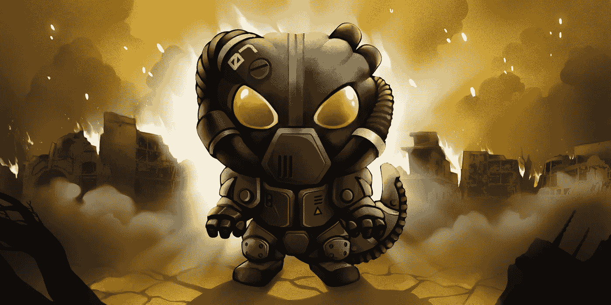

# 区块链 Cuties game 正在模糊开发者和玩家之间的界限。区块链技术对游戏行业意味着什么？

> 原文：<https://medium.com/hackernoon/what-does-blockchain-technology-mean-for-the-gaming-industry-91816787776c>

具有持久用户档案的在线游戏，无论是大型多人游戏如魔兽世界还是休闲游戏如 Farmville 或 Candy Crush，都基于一个基本原则，即用户在游戏中花费的时间以用户档案的形式记录，甚至可能是游戏中的角色。游戏的目标是以成就或等级的形式创造游戏中的价值，以便将他或她自己与大众区分开来。换句话说，当玩家试图将这个价值转移到开发者定义的边界之外时，他们发现他们实际上并不是自己作品的所有者。他们会发现所产生的价值已经完全计入了游戏开发者的账户，只要他或她的账户存在，玩家就有权利使用它，顺便说一下，这也取决于开发者的自由裁量权。

在某种程度上，这是底层技术的结果，这使得资产所有权必须由开发者集中管理，以防止骗子简单地复制游戏中的资产。这就是为什么大多数游戏玩家接受这是世界的方式，尽管有些人试图在灰色市场上出售他们的帐户，当他们逃脱时，能够获利。

[区块链 Cuties](https://blockchaincuties.com/?utm_source=google&utm_medium=article&utm_campaign=BlockchainCutiesisblurringthe%20distinctionbetweendevelopersandplayers&utm_content=textlink) 完全不一样。这是一个加密游戏，这意味着它使用区块链技术，使中央资产管理过时。正因为如此，玩家终于可以对自己产生的价值拥有完全的所有权。这种价值，以化身的形式出现，在游戏中恰当地命名为可爱，不能从他们那里拿走，任何人也不能规定他们的使用条款。换句话说，玩家可以以他们想要的任何方式出售他们的收藏品，不管别人愿意出多少钱。所有收藏品都有 ERC 721 代币的地位。

区块链可爱是一个密码游戏，你可以繁殖你独特的区块链宠物，如小狗，蜥蜴，小熊，猫和其他真实和幻想的生物。每个小可爱都有一个独特的基因组，它基本上是人类 DNA 的类似物。在繁殖时，人工智能负责不同基因的特殊组合，以创建头发、胡子、眼睛颜色等属性。当你送他们去战场上测试他们的技能或者把他们放在市场上出售时，这些特征会直接影响他们。

如果玩家想要收回他们所有的资产(也就是收藏品)，他们可以在游戏中直接提供的市场上出售他们的区块链宠物，或者他们可以使用像 OpenSea 这样的第三方市场。更不用说，少数非官方的交易平台存在，没有所谓的干扰。

人们就可以随心所欲地发布他们想找的东西，想卖的东西。— G Sh 又名 Jewel，尊贵而神秘的可爱者

因为玩家实际上拥有他们的小可爱，他们甚至可以和小可爱形成牢固的联系，正如玩家 ChakraFox 所说:*“我必须有一只狐狸。它有一双魔鬼般的眼睛，所以我给它取名为霜狐。而且一直是我的最爱”。*然而，所有权并不是[区块链 Cuties](https://blockchaincuties.com/?utm_source=google&utm_medium=article&utm_campaign=BlockchainCutiesisblurringthe%20distinctionbetweendevelopersandplayers&utm_content=textlink) 的唯一方面。让这个游戏区别于其他加密游戏的是游戏体验本身。询问玩家，每个人都会给出不同的选择玩游戏的理由。对于 ChakraFox 来说，是艺术风格让游戏与众不同*“Cuties 拥有非常棒的经过深思熟虑的艺术，这是一个很大的乐趣，可以不断回来”*。Light511 热爱这个社区，热爱在娱乐的同时赚钱的能力*“我喜欢小可爱们有一个真实的游戏，所以当我玩的时候，我也在“赚钱”和娱乐。开发者非常努力地让社区成为游戏开发的一部分”。*虽然 Fishojoy 喜欢区块链小可爱独特繁殖系统的刺激和挑战*“我对繁殖高贵的小可爱感到非常兴奋。我认为贵族很有收藏价值，因为不会有另一个一模一样的了。我仍然没有运气打开贡品。而是在做这件事。*

然而，最终是社区的力量、开发者的参与以及玩家的团结和开放将推动这个游戏向前发展。Bofur 是一名长期的球迷，他说:“他们一直和球员保持联系。补丁/直播每周一次。我们知道他们的名字，可以随时向他们提出任何问题/建议。有时我的问题不到 5 分钟就被开发人员解决了。我不能强调这一点不够，开发团队正在推动这个游戏不断发展/增加，他们愿意听取玩家的反馈。此外，该社区非常友好，从免费赠送开胃菜/比赛，到在 telegram 应用程序上提供建议，每个人都非常友好。这真是一次独特的经历”。