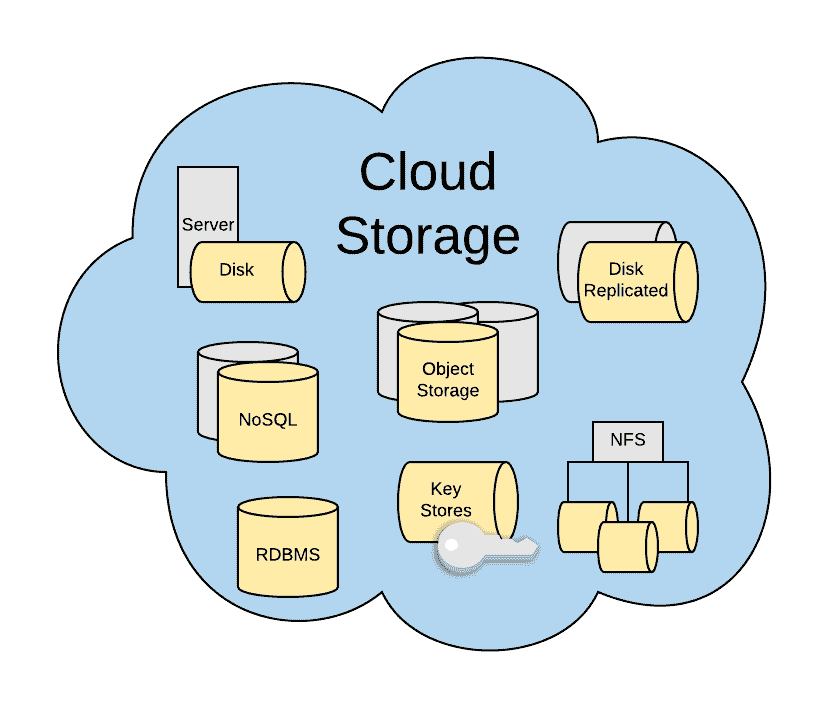

# 云存储对你来说意味着什么？

> 原文：<https://medium.com/hackernoon/what-does-cloud-storage-mean-to-you-78d4841b7baf>

在过去的十年中，云技术已经从简单的基础设施即服务产品发展到多样化的服务和中间件产品组合。其中一个主要的进步领域是云存储产品。

> 当讨论云存储时，一个常见的问题是云存储对某人意味着什么。

如果我们看看现代云存储，它的范围从面向服务器的通用块存储到更高级别的存储服务，如关系数据库、NoSQL。此外，云为底层基础架构提供了不同的存储配置。如您所见，云存储是一个更广泛的主题，在为不同的使用情形选择存储时需要进一步了解。

本文重点提供不同云存储选项和应用程序上下文的更高层次的概述，以便帮助您在云中做出有效的存储选择决策。我还将使用 AWS 云存储服务作为云存储选项的示例，以便找到关于实际用例的更多细节。

# 物理存储选项(基础存储)

从物理存储的角度来看，这是我们了解的最常见的存储特征。如果我们考虑不同的物理存储选项，我们会想到磁性硬盘存储、固态硬盘和磁带机等常见配置。在云环境中，这些存储配置作为专用产品或共享磁盘存储提供给消费者，其中输入和输出(IOPS)以及存储容量与其他人共享。

在云中启动服务器时，您更有可能使用预定义的物理存储配置，或者为运行操作系统的磁盘存储使用定制的配置。还可以在需要时为这些服务器附加额外的存储或扩展存储。

> 如果我们以 AWS 为例，它提供了[固态存储(SSD)、磁硬盘存储](https://docs.aws.amazon.com/AWSEC2/latest/UserGuide/EBSVolumeTypes.html)(两个子类型称为吞吐量优化和冷启动存储)和 NVMe 存储。

# 虚拟存储选项(存储构造块)

使用云服务时，它的优势之一是通过为应用程序开发提供方便的构建块来实现虚拟化。这对于存储也是一样的。虽然需要物理存储配置，但大多数应用程序需要更高级别的功能，如可用性、容错性、耐用性、安全性等。由于大多数云提供商使用商用硬件，所以提供这些抽象来简化用例是非常重要的。

很少常见的存储构建块大多数云服务提供商提供的是块存储(具有冗余和可重用的可靠性)、对象存储(具有冗余和更高级 API 的可靠存储)、网络文件系统(可靠的共享存储)。

其中一些存储构造块甚至能够选择物理存储配置，如物理存储类型(例如:SSD 或磁性硬盘)。

> 在 AWS 中， [EBS](https://docs.aws.amazon.com/AWSEC2/latest/UserGuide/AmazonEBS.html) 是可以附加到 EC2 实例(虚拟机)的块存储产品。由于内置了冗余，物理磁盘故障不会影响存储的可用性。 [AWS S3](https://aws.amazon.com/s3/) 是对象存储的流行选项之一，它公开了一个 REST API 来与服务进行通信，其中有多个数据中心级别的冗余。 [AWS EFS](https://cloud.netapp.com/blog/ebs-efs-amazons3-best-cloud-storage-system) 是他们为共享存储提供的网络文件系统，可以在运行时跨几个 EC2 实例共享。Amazon Glacier 是基于磁带的数据存档存储选项。AWS KMS 是专用存储产品，支持虚拟和物理硬件安全模块来存储加密密钥。您可以在 [AWS EBS 与应用程序用例实例存储模式](https://codeburst.io/aws-ebs-vs-instance-storage-patterns-for-application-use-cases-796bbc1faceb)文章中找到这些存储选项的一些应用。

# 应用存储服务

这些存储服务通常被各种云提供商视为平台即服务产品，包括托管或云原生关系数据库服务、NoSQL 数据库服务、缓存存储、队列存储服务等。

虽然我已经将亚马逊 S3 存储构建模块归类为对象存储选项，但由于它们提供的功能范围广泛，很难在一些存储构建模块(如 S3 和应用程序存储服务)之间划清界限。

这些存储服务可直接用作设计解决方案的应用程序级构建块。如果我们看一下底层基础架构，大多数都使用虚拟存储选项来提供可靠性、安全性等。

如果您考虑建立自己的关系数据库系统，而不是使用这些应用程序存储服务，这应该是可能的。但是，当涉及到管理那些需要进行安全修补、实施对灾难恢复的支持、实施容错和高可用性等需要专业知识和持续承诺的领域时，这可能会变得很有挑战性，因为这些领域会增加总拥有成本。

> 在 AWS 中， [Amazon RDS](https://aws.amazon.com/rds/details/) 提供一系列托管关系数据库产品，包括 MySQL、MariaDB、Oracle、Microsoft SQL Server、PostgreSQL 和云原生 Amazon Aurora 数据库。 [AWS DynamoDB](https://aws.amazon.com/dynamodb/) 是亚马逊提供的 NoSQL 产品，这是一个简单的基于键值的数据库，可大规模扩展。[亚马逊 elastic cache](https://aws.amazon.com/elasticache/)为缓存存储提供完全托管的 Redis 和 Memcached。