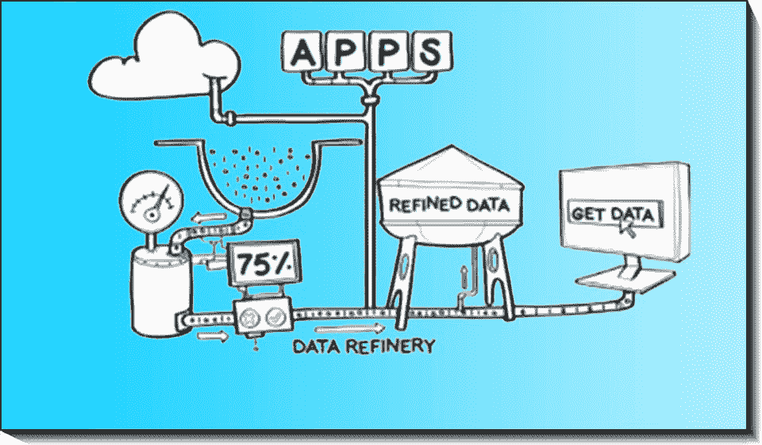

# 数据精炼对 2018 年的业务意味着什么

> 原文：<https://medium.com/hackernoon/what-does-data-refinery-mean-for-business-in-2018-9880ff28cf43>

美国著名科幻作家艾萨克·阿西莫夫曾经说过:“任何一个傻瓜都能在危机到来时分辨出它。对国家的真正服务是在胚胎中检测它。”

许多商业领袖都有在危机发生前发现和管理危机的想法。随着 2018 年的到来，企业领导人正在积极寻找能够准确预测危机(或成功)的解决方案。

Image Source: [IBM Big Data and Analytics](http://www.ibmbigdatahub.com/blog/time-saving-data-refining-just-application-developers)

# 有可能在危机到来之前预测它吗？

谢天谢地，现在我们有了数据科学来检测模式并做出预测。

各行各业越来越多的公司正在采用数据驱动的决策方法。商业领袖依靠人工智能和机器学习技术(AI)等技术从大量数据中提供有意义的见解。

这导致各种数据驱动解决方案的使用增加，如数据即服务、分析即服务和洞察即服务。据估计，[2018 年](https://www.forbes.com/sites/gilpress/2017/11/09/10-predictions-for-ai-big-data-and-analytics-in-2018/3/#5dca87cc7827)，随着 AI & ML 的到来，洞察即服务市场将会翻倍。

**人工智能技术——彻底转变的机会**

尽管大多数市场部门将从采用人工智能和人工智能技术中受益，但我们在这里概述了正在被人工智能技术彻底改变的三个部门:

# 1.银行业——人工智能让人们更好地理解购买模式

高级分析使金融分析师和银行家能够为客户提供更多价值。例如，由于使用了人工智能，银行可以更好地理解客户的行为模式。这使得银行能够避免客户流失(即留住现有客户)，并主动向他们提供满足其需求的产品。许多[银行采用聊天机器人(人工智能技术)](https://bitrefine.group/industries/finance-insurance/106-articles/ml-articles/finance-ml-article/250-banks-say-hello-to-machine-learning)来确保现有客户和新客户在购买新的金融产品或服务时得到支持。

金融机构也采用人工智能技术来监控欺诈活动，并预测贷款违约等风险。这些举措有助于节约成本，并最终带来积极的客户体验。

总之，银行部门的运营效率通过在其工作流程中采用高级分析得到了提高。2018 年，随着银行甚至信用社采用数据科学进行决策，这一趋势将继续。

# 2.保险—使用数据科学构建更好的客户体验

保险公司正在使用数据科学来构建更好的客户体验。例如，在汽车保险行业，计算机视觉等技术有助于对碰撞进行图像分析，从而有效地评估维修成本。维修店以合理的价格提供服务，最终为客户节省了成本。

人工智能和 ML 技术使保险公司能够在提供保险之前发现风险因素。[2018 年](http://www.propertycasualty360.com/2018/01/23/5-insurance-and-artificial-intelligence-prediction?slreturn=1519221908)，保险公司在为家庭或租户提供保险之前，正在从无人机图像中获取有关屋顶损坏等风险的数据。此外，保险公司可能能够使用实时分析(如天气、交通等)提供个性化警告，以防止事故发生。

# 3.制造——ML 优化了生产

预测性维护是一种极大地有利于制造行业公司的 ML 应用。机器故障或过度维护活动会导致停机，最终降低利润。基于实时数据输入，如温度、原材料类型和压力，ML 解决方案预测所需机器维护的正确时间和类型。这导致可用资源的最佳利用，从而优化生产。[2018 年](http://www.information-age.com/2018-hold-manufacturing-industry-123470409/)，中小型公司也将采用预测性维护。

一个组织的人工智能解决方案取决于公司规模、手头的业务问题和可用的专业知识。大型、中型或小型公司都在寻找人工智能解决方案，以满足他们特定的业务问题，如客户获取。许多公司没有自己的数据科学部门，而是选择与外部[数据科学公司](https://bitrefine.group/machine-learning/104-articles/ml-articles/264-data-science-consulting-from-big-data-to-business-insights)合作，这些公司可以提供必要的专业知识来构建人工智能解决方案。

人工智能和人工智能技术不仅在发达市场，而且在全球范围内都被接受。据估计，到 2020 年，全球人工智能市场的价值将达到 1.2 万亿美元。要成为这一美好未来的一部分，现在就是将高级分析纳入贵公司工作流程的时候了。时光不等人。

.