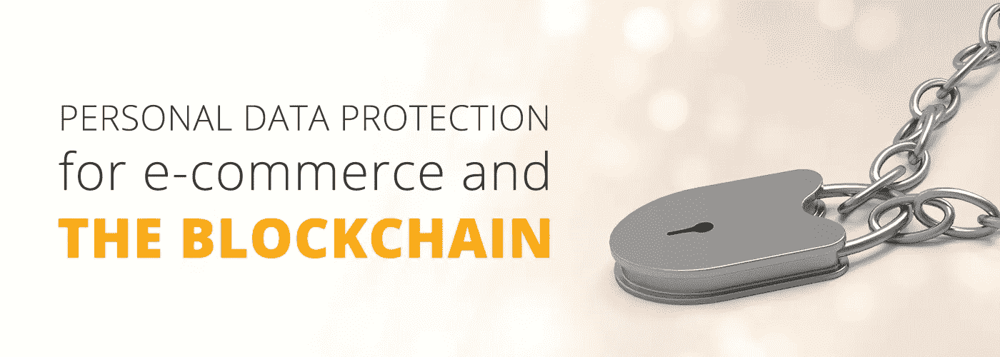

# 在公共区块链上，隐私意味着什么？

> 原文：<https://medium.com/hackernoon/what-does-privacy-mean-on-a-public-blockchain-1243776df22f>

针对处理个人数据的机构，严格的新法律已经生效。对于那些将信息存储在透明、公开和永久账本上的企业来说，这意味着什么？

剑桥分析公司[盗用约 8700 万脸书用户数据的新闻](http://www.bbc.co.uk/news/technology-43649018)将数据保护问题重新推到聚光灯下。多年来，消费者一直在用个人数据换取在线服务:数据被视为互联网的“石油”，社交网络、电子商务平台和几乎所有其他免费服务的用户都支持这种心照不宣的交易。

在过去的几周里，我们已经看到了它的发展方向——事实上，它总是而且不可避免地会走向何方。我们个人数据的代价已经变得非常明显:自由和民主本身。事实证明，现实生活可能离狂热的网飞秀[黑镜](https://www.netflix.com/gb/title/70264888)中描绘的那种科技反面乌托邦并不遥远。知识就是力量这一格言已被证明是正确的，如果这种说法是正确的话，剑桥分析公司能够利用从大规模数据挖掘活动中获得的洞察力，通过高度定制的宣传来瞄准少数犹豫不决的选民，从而扭转唐纳德·特朗普的选情。

**GDPR**

Blockchain developers should start addressing GDPR, if they want to avoid unwelcoming consequences.

监管总是落后于技术，所以新的 [**欧盟通用数据保护条例(GDPR)**](https://www.eugdpr.org/)**——号称 20 年来数据隐私监管方面最重要的变化——来得太迟了，无法阻止席卷脸书的丑闻。然而，这是非常及时的。它酝酿了四年，实施日期已经迫在眉睫。企业必须在 2018 年 5 月 25 日前合规。**

***“欧盟通用数据保护条例(GDPR)取代了数据保护指令 95/46/EC，旨在协调整个欧洲的数据隐私法律，保护和授权所有欧盟公民的数据隐私，并重塑该地区组织处理数据隐私的方式。”***

**[针对企业处理个人数据的法律的主要变化](https://www.eugdpr.org/key-changes.html)包括:**

*   **在发生数据泄露的情况下，及时通知受影响者的义务**
*   **“数据主体”有权知道存储了哪些个人数据以及这些数据是如何使用的**
*   **数据主体被遗忘的权利——删除他们的个人信息**
*   **数据主体访问个人数据并将其提供给另一控制者的权利(数据可移植性)**
*   **设计隐私现在是数据控制器的一个要求**
*   **必须任命数据保护官员并保存适当的记录。**

**这将产生远远超出欧洲范围的影响，因为许多企业与欧洲客户打交道，并在欧洲拥有基础设施。正如《连线》杂志评论的那样，法律保护欧盟 28 个成员国的个人，即使数据是在别处处理的。这意味着 GDPR 将申请像《连线》这样的出版商；银行；大学；财富 500 强中的大部分；通过网络、设备和应用程序跟踪你的广告技术公司的字母汤；和硅谷科技巨头。**

**但是，对于那些将区块链——一个公共的、不变的数据库——作为日常活动一部分的企业来说，这一切意味着什么呢？**

****打开区块链和‘公共’数据存储器****

****

**Public blockchain networks (such as Ethereum) are pseudonymous by design. Nevertheless, this feature is not enough to comply with GDPR.**

**尽管在一个中央集权的系统中，这些规则的应用可能足够清晰，但在区块链管理它们却完全不同。首先，存储在区块链上的所有信息对网络中的每个节点都是可用的——实际上，任何人、任何地方都可以查看这些信息。存储和管理信息的责任分布在许多不同的辖区，并且可能适用不同的数据保护法。实际上，*任何在区块链存储个人数据的企业都应该遵守欧盟的 GDPR——因为很有可能在某个时候，数据会被位于欧盟内部的节点和/或用户存储。***

**区块链在设计上是假名的:节点由一个简单的字符串地址来标识。使用区块链不需要任何个人信息(如电子邮件地址)。因此，一定程度的保护是内在的。如果像电子商务提供商这样的企业在处理客户信息，账户之间的交易和互动仍然是匿名的，个人数据可以完全在他们的控制之下(按理说应该如此)。**

**这里有一个警告，GDPR 仍然认为假名数据是个人数据，这很可能包括区块链的公钥。还有一项要求是，如果可以通过收集和组织匿名数据来识别用户，则应采取进一步的保护措施。这一点非常重要，因为网上购物可以公开追踪到区块链的一个地址，然后这个地址又可以链接到同一平台上的其他公开信息。假名是链条中最薄弱的一环。**

**为了防止这种情况，存储在区块链上的任何个人信息可以通过进一步加密来保护，并且使得没有权利或需要访问它的任何人都无法访问。负责启动和维护平台的公司可能希望确保他们*不能*查看该信息，并且该信息只授予那些客户选择直接联系的人——例如，在线市场上的卖家，或涉及争议解决的第三方。可以通过智能合同临时提供对相关交易的访问，直到必要的事件已经发生。**

****区块链不变性和被遗忘权****

****

**The “right to be forgotten”, as stated by GDPR, is a real challenge for blockchain developers. Good news is it is not an unsurmountable one.**

**在开放和不可改变的分类账的背景下，特别相关的要求是，在下列情况下，用户有权要求从互联网上删除其个人信息:**

1.  **就最初收集/处理该个人数据的目的而言，该个人数据不再是必需的。**
2.  **当个人撤回同意时。**
3.  **当个人反对处理，并且没有压倒一切的合法利益继续处理。**
4.  **如果个人数据被非法处理(即违反 GDPR)。**
5.  **如果为了遵守法律义务而必须删除个人数据。**
6.  **如果处理的个人数据属于孩子。**

**区块链从设计上来说是不可改变的，因此数据无法从其中擦除。任何在区块链公开存储客户数据的组织都会发现自己陷入了严重的麻烦。然而，对于擦除权在适用于区块链时实际上意味着什么，有一些讨论。《T4 区块链和数据保护指南》(由 Hogan Lovells 于 2017 年发布)指出，“什么构成‘擦除’仍有待讨论。一些数据保护机构发现不可逆加密构成了擦除。在区块链环境中，擦除在技术上是不可能的，因为系统是为防止擦除而设计的。然而，智能合同将包含管理访问权限的机制。因此，智能合同可以用来撤销所有访问权限，从而使内容对其他人不可见，尽管不会被删除。**

****结论****

**GDPR 已经对全球网络公司的活动产生了深远的影响，一旦新的法律在下个月生效，我们可以期待看到各种企业的努力，因为执法开始认真。**

**和其他公司一样，区块链的企业需要快速适应，但同时也面临独特的机遇和法律挑战。其中包括:**

*   **区块链的假名性质。**
*   **强大的加密和智能合约提供了广泛的功能，有可能为用户提供前所未有的控制。**
*   **相反，区块链的开放性意味着必须特别小心。**
*   **区块链的不变性意味着最严重的错误不容易被纠正。**

**目前，GDPR 对区块链倡议的影响仍有一些不确定性。期待在不久的将来看到进一步的澄清和不受欢迎的测试案例。**

****