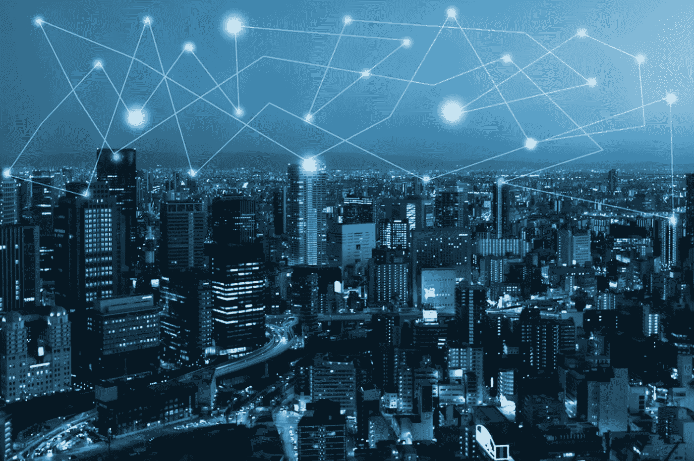
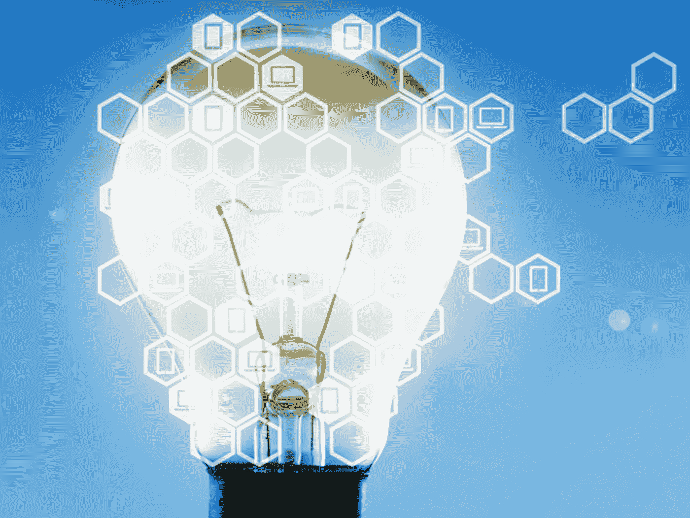
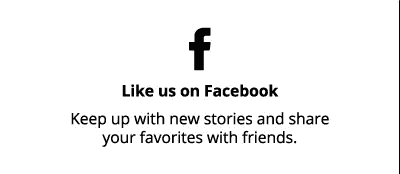
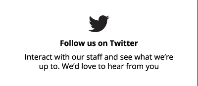

# 区块链除了比特币还能做什么？想想太阳能。

> 原文：<https://medium.com/hackernoon/what-else-other-than-bitcoin-can-a-blockchain-do-think-solar-energy-9852ee5b88cb>

## **SolarCoin:启动全球能源转型的数字资产，作者 Franç ois Sonnet，ElectriCChain**

*本文发表于梁#5 —* [*现在就订阅*](https://the-beam-magazine.myshopify.com/products/subscribe-now) *获取更多关于这个话题的内容。*

想知道需要多少阳光才能为你的房子提供能量吗？如果一个本地的微电网可以为你的街区甚至整个社区提供清洁的太阳能，并且你可以和你的邻居分担费用，那会怎么样？

让我们更进一步:我们需要多少太阳能来为这个世界提供能源——安装这么多太阳能需要多长时间？当我睡觉的时候，太阳在地球的另一边发电有关系吗？我怎样才能让电池和现有的电网一起工作呢？想象一下，如果我把能源放在家里的电池里，基本上是脱离电网，当地公用事业的市场会受到多大的干扰。

好吧，看起来，有一种新的[技术](https://hackernoon.com/tagged/technology)即将出现——它将引发一场新的工业革命。系好安全带，我们要进入(不那么)星际迷航技术…

**介绍区块链**

[区块链](https://hackernoon.com/tagged/blockchain)是一个点对点的网络数据库。想想 Napster，或者一个公共团体内的文件共享，但在区块链的情况下，它伴随着实时和分布式更新。和它的非欺骗！

在区块链中，每一笔交易和数据都直接记录在这个数据库中。一个非常有前途的区块链是比特币，因为它的区块链是一种记录这种“互联网”货币发生的数字交易的工具。无法破解。为什么？因为所有这些交易不仅记录在你的电脑上，也记录在其他所有人的电脑上——完全匿名——而且每笔交易都经过同一网络中所有参与者的验证。

**太好了——区块链除了比特币还能做什么？**

区块链也可以用来记录数据，并为嵌入这种技术的公司提供效率。金融行业的一个例子是 R3 财团，该财团正在开发区块链技术，以简化和流动市场商品和资产的结算、清算和托管流程，从而使交易在几分钟内发生(并在区块链技术下进行清算)，而不是几天。因此，它允许这些相同的银行-和你！—在世界任何地方安全地即时发送和接收资产和资金。

看起来，每个行业都将受到区块链技术的影响:从供应链管理到审计和会计。在最后一个行业，想象一下你的账户报表是自我审计的——因为当它们被记录在区块链上时，它可以(在线和实时)提供给你的审计员。不再摆弄书本…不再兼职…

另一个与区块链技术积极合作的行业是能源行业，这是一个传统上“不创新”的行业，几乎垄断。

在这个领域，区块链已经实现了邻居之间的点对点能源交易。想象一下，你的太阳能电池板将在最方便的时候向电网输送能量和/或给你的电池充电。这一切都掌握在你的手中。事实上，一个简单的应用程序将分析以最佳价格向电网供电的最佳时机，或者给你的电池充电和/或使用你的洗碗机和互联网连接设备。如果你碰巧需要能量来为你的电动汽车充电和/或启动烤箱，应用程序(及其背后的区块链)将实时适应，对公用事业完全透明。

这对您、电力公司和您的网络运营商来说代表了一种新的商业模式。

## 对——但是太阳能呢？

最近，总部位于布鲁塞尔的欧洲太阳能协会 SolarPowerEurope 成立了一个数字工作组，研究数字化及其在太阳能行业的应用。即将投入使用的一个引人注目的工具是这种点对点能源交易平台，它能够为消费者提供能源账单和交换服务，这些消费者参与设计或定制符合自己需求的产品。

## 好的——所以我在给电网供电……当每个人同时得到阳光时会发生什么？

预计能源价格会下降，这是合乎逻辑的…这就是 SolarCoin 数字资产的前景。

事实上，在一个将主要生产太阳能的世界——根据国际能源署的数据，未来 20 年内将生产 5,000GWp 的太阳能——一个寻求启动清洁能源转型的国际和基于社区的倡议已经在开发 SolarCoin 数字资产中使用了这种颠覆性的区块链技术。

SolarCoin 本质上类似于一个航空里程计划，太阳能发电商在网络上注册他们的太阳能装置，每生产一兆瓦时的太阳能就能获得 1 SLR(即 SolarCoin)。你可以把你的太阳币换成硬通货，就像任何数字货币一样。

你的平板电脑，你的汽车，你的房子，你的手机，你的窗户，也许还有你的墙壁，都将产生太阳能。

## 对——但是我们现在在太阳能方面处于什么地位呢？

看起来，在过去的 20 年里，已经安装了大约 300GWp 的太阳能发电能力…

## 那么…你是说一个新的基于区块链的全球上网电价可以和太阳能币一起制定出来？

是啊！

## **弗朗索瓦十四行诗**

太阳能区块链顾问、电子链和 Solcrypto

弗朗索瓦是可再生能源业务发展方面的专家。2007 年，他在比利时联合创立了 SunSwitch SA 公司，当时德国以外的地区很少关注可再生能源。弗朗索瓦目前在东欧的项目中担任太阳能顾问，并建议 Solcrypto 开发区块链工具，以启动清洁能源过渡。

