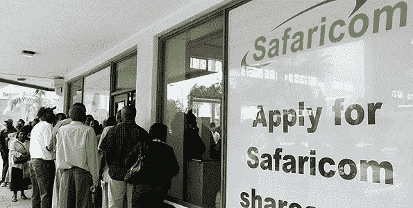

# 以太坊对我意味着什么

> 原文：<https://medium.com/hackernoon/what-ethereum-means-to-me-a4be57fcb7d9>

When moon? …Jk

我出生并成长在金融界。我这么说的意思并不是说我的家庭从事金融，而是说从很小的时候起，我就被全球资本市场的吸引力所吸引。

从 12 岁起，我就开始管理自己的投资组合，在我父亲位于肯尼亚的肉店和小酒馆工作时，我尽可能地节省每一点投资，并把它们全部投入股票市场——内罗毕证券交易所。

我记得排队等待 Safaricom 的 IPO，没错，是实体排队——这很有趣。

Waiting in line for the IPO

不仅如此，他们还说 Y 世代不知道熊市是什么样子。让我告诉你，当我 14 岁的时候(2008 年)，我不知道卖什么，结果是我看着我的投资组合在金融危机中下跌了-60%，只是在接下来的几年里坚持住一切，看着随着时间的推移，这是迄今为止世界上最长的牛市之一。

很自然的，我上学的时候学的是金融，之后参加了 CFA 项目。这给 CIBC、加拿大皇家银行自治领证券和哨兵投资公司带来了工作机会。所有的地方都很棒，我有幸和优秀的团队一起工作。那次经历让我对金融体系的内部运作和缺点有了更多的了解。

我一直热爱技术，从年轻时起，我总是编写一些程序，一些 C++游戏，随着年龄的增长，我越来越多地参与 Python 和数据科学应用程序，因为它们与金融和前沿市场有关。

## 以太坊。

以太坊向世界提供的解决方案的范围和灵活性深深吸引了我。价值转移系统与支撑全球电脑的智能合约层相结合——这是科技和金融的演变，绝对让我着迷。

当我们开始做 iComply 的时候，我们能想到的应用是无限的。从合作模式，到资本市场基础设施，再到公司治理应用，一切都让我们大吃一惊。

> 出生在这个时候，我觉得自己好幸运。

以太坊使我能够将我的思维和过程提升到一个真正的全球基础上，当每个人都在同一个系统上时，相互交谈和开发工具来协助这一点变得容易和简化。

将我对权力下放和开放金融的热爱，与一个也能服务于更广泛公众的系统结合起来，绝对是最佳选择。

可以用以太坊结算私募和公开发行的股票吗？

当然…而且这比现在购买私人股票要快得多。

我们能有抵制审查的信息传递和信息分发吗？绝对的。

像 Status 这样的项目和他们对 Embark 的收购让我眼前一亮，因为它们允许人们轻松地创建 Dapps，以及在移动设备上向轻型以太坊节点的持续发展，采用是关键。

像 0x 这样的第 2 层基础设施以及它为所有资产的对等价值创造的机会，无论是基于公用事业、资产还是不可替代的，都是我每天醒来都兴奋不已的事情。

让我们回到用代币作为价值转移手段的一般概念，这太棒了——当然这不仅限于以太坊。

当你可以带着一群得不到充分服务的人，当场给他们一个与任务挂钩的钱包，带着报酬，这就是我们如何开始平等的基础。这就是 Code to Inspire 发起的一个项目的成果——使用 Bounties Network 和 Metamask 等应用程序。

*我提到过 Bittorrent 协议给我的生活带来的巨大变化吗？点对点传输，定制的客户端，块，群网络，甚至没有让我开始。*

以太坊让我打造了一条新的不可逆转的人生之路。关于这个项目的一切，未来的实现和改进，无论是 Casper，Sharding，Plasma 还是改善网络的一般小改动，都是对支配我生活的直接核心有吸引力的东西。

编写经济激励模型，将现实生活中的应用应用到真实的商业中，这是一个超越下一个酷应用的目标。

谈论下一个大型项目和网络很容易，但事实仍然是，生态系统是驱动因素。试着找到一些渗透并与以太坊竞争的东西。大量的应用程序、框架、测试套件、钱包、聪明人等等——这就是我的归属。

谢谢你，以太坊，我希望在我职业生涯的剩余时间里致力于开发应用和基础设施，为网络带来持续的信誉和采用，这个网络能够并且正在引领一个前所未有的全球金融交流水平。

开发人员可能不总是这样看，生态系统很容易陷入炒作和模型和证明中。但当你知道现实世界是如何运作的，以及资本市场的模糊性和分离程度时，你就会忍不住真的真的笑了。