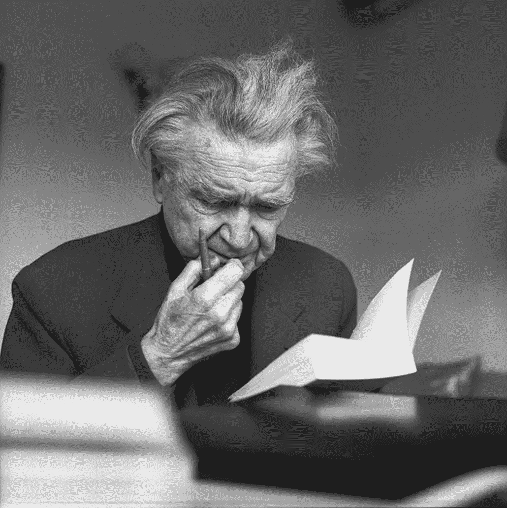

# 存在主义能教会我们如何处理焦虑

> 原文：<https://medium.com/hackernoon/what-existentialism-can-teach-us-about-dealing-with-anxiety-2013b3834ea2>

Photo from [Unsplash](https://unsplash.com/photos/rX12B5uX7QM)

存在主义哲学家的想法都有一些东西可以教我们如何思考和处理焦虑。

我将在这篇文章中介绍的哲学家是萧沆和索伦·克尔凯郭尔，他们对焦虑这个话题提供了令人难以置信的独特而敏锐的见解。

你有没有感到焦虑，那种胃里有疙瘩、手心冒汗的感觉，并对自己说:*“我现在绝对没有理由焦虑”*？或者你可能感到焦虑，但意识到此刻逻辑上的焦虑是没有意义的。或者可能——就像其他人焦虑一样——他们感到焦虑，并对自己说*“我因为 X 而焦虑”*，这里 X 是他们认为导致他们焦虑的一些事件、人或事。

# 萧沆如何看待焦虑

罗马尼亚存在主义哲学家和散文家萧沆提出了人们无缘无故感到焦虑的问题。乔兰的作品主要关注我们生活中的苦难、腐朽和虚无主义，以及如何面对它们。

如果这听起来令人难以置信地郁闷，那是因为它是——乔兰以推广“哲学悲观主义”的观点而闻名，他写了一本名为*出生的麻烦*的书，他的母亲对她儿子的不快乐如此心烦意乱[她告诉他](https://www.itinerariesofahummingbird.com/e-m-cioran.html) *“如果我知道【你会有多不快乐】，我会去堕胎的”。*

鉴于乔兰的背景，人们可能会觉得他不太可能对焦虑有什么有用的说法。然而，他的作品对我帮助极大，让我更彻底地理解焦虑的微妙之处。关于焦虑是如何产生的，乔兰在他的书中写道:

> “焦虑不是被挑起的:它试图为自己找一个正当的理由，为了这样做，它抓住任何最卑鄙的借口，一旦它发明了这些借口，它就抓住不放。。。。焦虑激发它自己，产生它自己，它是“无限的创造”。"

焦虑不一定是由任何特定的原因引起的，而是经常简单地发生的事情。只有在我们感到心结的时候，我们才开始想出为什么我们会经历焦虑的原因。在这个过程中，我们可能会指出“导致”我们焦虑的事件和人，告诉自己这就是我们感到焦虑的原因，这可能会导致我们感到更加焦虑。

处理焦虑的第一步是认识到以下几点:焦虑不一定是由某事发生引起的，也不一定是基于现实。感到焦虑并不意味着你的生活出了问题。

一旦你意识到焦虑仅仅是你感觉到的，并不表明你是一个怎样的人，这种意识会帮助你放下对焦虑的担心。

乔兰还称焦虑为“最坏的狂热”。这与我之前提到的他的观点一致，即当我们感到焦虑时，我们会关注生活中最糟糕的方面，以努力证明焦虑是合理的。焦虑使人们成为生活中最坏方面的狂热分子，而忽略了生活中积极和美好的方面。为了摆脱这种攻击性焦虑循环，有必要停止关注一种情况下可能发生的最糟糕的事情，而开始关注一种情况下潜在的积极方面。

# 内省、心理治疗和自我反省有助于缓解焦虑

Photo from [Unsplash](https://unsplash.com/photos/JhdWve4dA_g)

许多人只是试图用处方药来治疗他们的焦虑，而不是试图进行一些内省或心理治疗来发现他们为什么焦虑并减轻症状。我认为这对那些感到焦虑的人造成了巨大的伤害。

我想在这里完全澄清一点——我并不主张每个患有焦虑症的人都停止使用处方药。有合法的例子表明处方药可以减轻焦虑症状，并且是唯一有效的解决方案。但也有很多例子表明，潜在的心理创伤和个人问题导致了从未得到解决的焦虑。在某些情况下，使用处方药来减轻焦虑只能掩盖症状，并不能解决焦虑的根源。

对于患有焦虑症的人，我建议他们除了已经在做的事情之外，还应该包括一些内省、自我反省和心理治疗，作为治疗焦虑症的一种方法。存在主义者大力提倡自我反省和内省。这意味着留出一个小时左右的时间来真正关注你自己和你的过去，以及你焦虑的潜在原因。内省和心理治疗可以帮助你理解你内心焦虑的潜在原因。一旦你理解了焦虑的根源，你就可以开始解决它，消除焦虑。

也许当你做一些自省时，你会意识到你今天感到的焦虑部分是因为你年轻时因为从未受到鼓励而产生的低自尊——并且这种低自尊一直持续到今天。

然后，你可以开始通过各种方式来解决自卑的问题——例如，让自己周围有更多积极的、鼓励的人。或者尝试冥想和治疗。当焦虑的潜在原因解决后，你会发现不仅你感到焦虑的情况会减少，而且你生活的其他方面也会改善。

# 试图完全消除焦虑是错误的目标

Photo from [Unsplash](https://unsplash.com/photos/EV9Io66tDm0)

许多患有焦虑症的人可能会试图找出彻底消除他们焦虑感的方法，但这甚至可能不是正确的目标。

丹麦哲学家克尔凯郭尔被许多人认为是第一个存在主义者，他曾将焦虑描述为*“自由的眩晕，当精神想要假设综合，自由向下看自己的可能性，抓住有限性来支持自己时出现”*。

也就是说，只有通过体验焦虑，我们才明白我们是自由的存在，有做出自己选择的自由。可能性是无穷无尽的——结果令人眼花缭乱。

例如，如果一个人站在一座很高的楼顶上，他很可能会感到焦虑。这是因为他知道自己有可能会跳楼或从楼上摔下来。这并不是说他真的会跳下去——只是这种可能性引起了焦虑。

克尔凯郭尔认为，焦虑帮助我们开始了解自己，以及我们面临的众多选择和可能性。焦虑意味着我们选择了自己。他还认为，焦虑有助于我们获得与众不同的个人身份。个人对不同的事件和项目感到焦虑——他们并不总是对完全相同的事情感到焦虑。焦虑揭示了我们作为真实个体的存在。

那么彻底消除焦虑是一件好事吗？不一定。焦虑有助于向我们展示我们真正是谁，并向我们展示我们是独一无二的个体。消除焦虑意味着消除我们的个性。

*克尔凯郭尔写道:“焦虑。。。是人性完美的表现。是对更高者的尘世生活的乡愁。”*也就是说，当我们意识到我们不是我们应该成为的人时，我们也会感到焦虑。虽然一开始很难承认，但理解这一点是有希望的，因为这意味着我们知道有办法自我提高，成为一个更好的人。克尔凯郭尔写道:

> “尽管如此，每个人内心深处都有一种焦虑，害怕孤独地生活在这个世界上，害怕被上帝遗忘，害怕被这个大家庭中成千上万的人忽视。人们通过观察他们周围的许多人来抑制这种焦虑，这些人与他们有着家人和朋友的关系；。。。人们几乎不敢想象，如果所有这些都被拿走，人们会有什么感受”

这样看来，焦虑其实代表了人性的完美和理想主义。我们希望得到他人的认可。焦虑告诉我们，我们总是想要争取更多，我们正在努力争取更大的东西，这些东西就在地平线之外，我们看不见，但知道就在那里。

你不应该害怕焦虑。我知道我没有。你的人生目标不应该是完全消除焦虑，而是成为一个真实的人，尽管有焦虑，但还是按照真实的自己行事。你应该害怕成为一个与众不同的空虚、空洞的人，害怕成为你知道自己能成为的人。

克尔凯郭尔说，对于那些没有经历焦虑的人，*“那是因为他是没有精神的。”最重要的是，焦虑反映了人类对完美和达到最高境界的渴望。它是从我们的生活中消除痛苦和问题的愿望。极度焦虑会让人变得虚弱——但是没有焦虑也一样糟糕。*

# 最后

尽管你可能会感到焦虑和恐惧，行动起来**。你可能无法完全消除焦虑，但无论如何你也不应该想这么做。你应该努力成为真实的自己。**