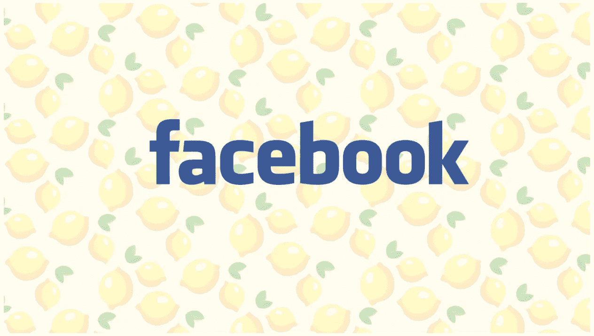
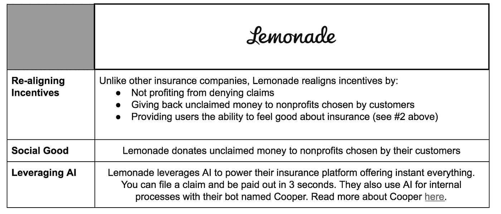
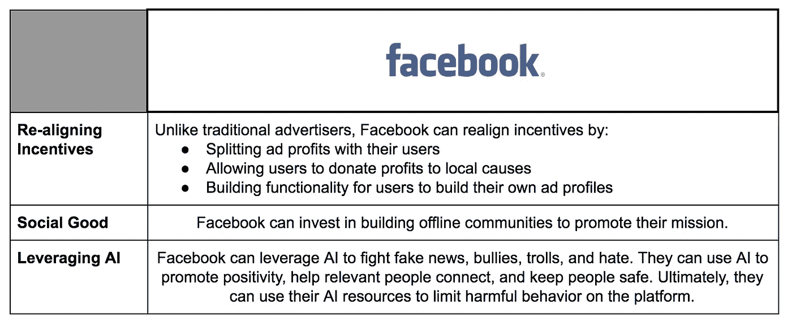

# 脸书能从柠檬水中学到什么

> 原文：<https://medium.com/hackernoon/what-facebook-can-learn-from-lemonade-6653091045cc>

对于千禧一代来说，脸书是我们成长的一部分。我记得小学时的脸书热，当时同学们会捏造他们的年龄和高中“关系网”来进入平台。哦，我们已经走了多远！作为世界上最常用的保持朋友、家人和社区联系的工具，很难相信脸书现在是美国最不受信任的科技公司。

因此，我不是问他们是如何来到这里的，而是问他们从这里去哪里？

## 脸书和保险业

有一些“讨厌”的行业。人们喜欢讨厌航空公司、无线网络和手机提供商、公用事业公司等等。但我心目中最讨厌的还是保险行业。众所周知，他们在人们最困难的时候从中渔利。科技行业也没有落后太多。自从剑桥分析公司的故事曝光后，人们开始反对收集用户数据的产品和服务。我们在优步、塔吉特、家得宝以及现在的脸书身上看到了这一点。

当考虑脸书何去何从时，他们真的有两个选择。

1.  **第一个选择**是保持现状。保持低调，安抚媒体、政府和用户，继续一切如常。这可能需要一两个月，但风暴会过去。
2.  **第二个选择**是用新的商业模式进行创新。照照镜子，理解你创造的野兽。分解拼图，重新组织碎片，描绘出一幅用户会喜欢的更好的图画。

虽然他们肯定有可能躲在 1 号门后面，但我相信扎克真的想为他服务的数十亿人做得更好。那么，他可以从哪里寻求建议呢？

保险业。

是的，你没看错。作为最讨厌的行业之一，人们普遍认为保险公司利用他们的权力来利用他们的客户，并认为头痛并不总是值得提供的服务。但幸运的是，对于大公司来说，保险是必须的。人们需要接受并处理它。脸书也是如此。他们的网络效应已经变得如此强大，拥有超过 20 亿的活跃用户，如果没有这个平台，许多人就无法与他人无缝连接。

## 当生活给你柠檬时…

2016 年初，丹尼尔·施赖伯(Daniel Schreiber)和谢·威宁格(Shai Wininger)质疑如何修复保险业。他们一起与著名的行为经济学家丹·艾瑞里合作，打开了第二扇门，创新了严重受损的保险模式。虽然保险和社交网络不一样，但我相信脸书可以采取类似的方法来打破这个难题，重组这些碎片，并描绘出一幅令人惊叹的新画面。丹尼尔和夏伊的照片叫做[柠檬水](http://lemonade.com)它很特别。

Learn more about ☝️by [clicking here](https://www.lemonade.com/)

柠檬水吸收了人们通常讨厌保险公司的一切——缺乏同情心、激励不当、漫长的索赔过程——并制造了一种人们喜爱的保险产品。脸书也可以做同样的事情。脸书可以分解这些问题，并再次取悦用户。是的，他们必须赚钱。可以理解。但是他们可以帮助他们的用户在做的时候自我感觉良好。

以下是脸书可以从柠檬水中学到的一些经验:

这并不容易做到，但这是扎克可以开始头脑风暴会议的几个想法。

对脸书如何修复他们的商业模式有别的想法吗？我想听听！发推特给我 [@jordanodinsky。](http://twitter.com/jordanodinsky)

**免责声明:我是脸书和柠檬水的投资者。这些意见是我自己的，不构成任何形式的建议或恳求。**

*嗨！我叫乔丹，在以色列做 VC。风险投资/创业领域发生了很多事情，我想我应该在这里发表我的观察。* ***以上所有观点均为本人观点。*** *在 Twitter 上随意关注:*[*@ jordanodinsky*](https://twitter.com/jordanodinsky)*。*