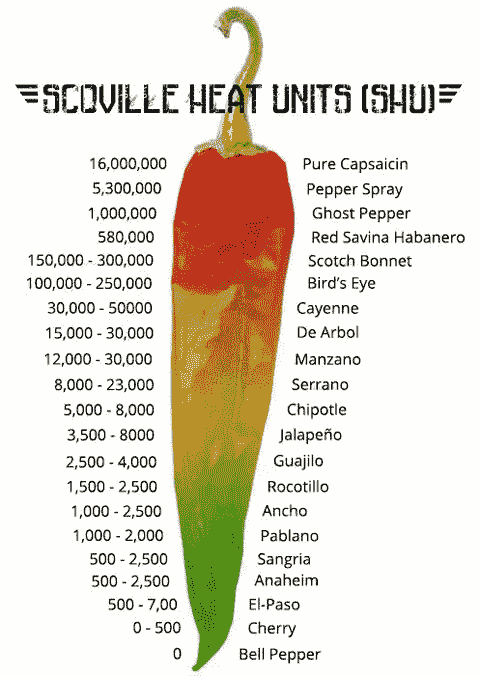

# 关于如何最好地给投资者发电子邮件，金发女孩能教给我们什么

> 原文：<https://medium.com/hackernoon/what-goldilocks-can-teach-us-about-how-best-to-get-in-touch-with-investors-a23e4cc0ad5>

We all know this story right?

如果你不像大多数人一样生活在科技、创业、企业家和风险投资的世界中，有时与投资者接触会很有挑战性。当你开始第一轮融资时——朋友、家人和傻瓜——这可能是你第一次向你认识的人、你的第一次分居的人寻求投资。

一般来说，如果您将与会面，这将是

There is and will always be questions about how to get in touch with investors who you want to pitch at every stage. Almost every panel, podcast, post etc will generally mention that a warm intro through someone they know is the best way. Generally, that’s true but there really should be a sliding scale…

Ice cold — A copy/pasted email with different colors, texts and super long that starts with “Dear Investor” or “To whom it may concern.” We’ve all seen these and it’s basically spam.

Cold — Better formatted than above, maybe even with our name but still mostly copy/paste and no mention of why this pertains specifically to us. Long paragraphs, still not sure what you do and what you want

Mild — Short and sweet with action items outlining what you’ve done, who you are and what you want. Deck attached and mention of what we invested in that pertains to you or something we wrote/tweeted. I try to respond to most of these when you put the effort in.

Luke Warm — An intro from someone we kind of know, maybe met at an event or connected with on Linkedin. Their friend is working on something they think we will like, so they just want to forward it to you. Always ask for permission and double-opt in!

Warm — Someone we know, have worked with, trust and are happy to help. They send over some info about you and your company, maybe forward an email from them tailored to us and then intro us regardless. Will definitely check it out and let you know if we’re interested.

Heating up — Other investors we know, really close friend or even a founder we’ve invested in wants you to look at this. They might be considering an investment, previously invested or are investing in this round. Time to dive in!

Too hot — Top investor, founder or professionals sent you something or wants to make an intro and the answer to *，默认情况下是。除非是基于行业、条款等方面的明确拒绝，否则你会努力满足他们，并给他们一个深思熟虑的回复。也要小心 FOMO 拿着这些。*

正如你所知，没有正确的方法可以走到投资者面前，但肯定有更好的方法。需要说明的是，并不是每个热情的介绍都能保证带来会面，我们也会忽略这些。有时候，即使是一封温和冷淡的电子邮件也比一封热情的介绍要好——我遇到过一堆冷淡的电子邮件，虽然我还没有投资过一封，但肯定是越来越接近了。

无论你决定如何去做，请清楚地表明你付出了努力，关心和尝试。这是一个漫长和令人疲惫的过程，但有时它可以表明你的毅力和销售能力，我们会考虑到这一点。不是每个创始人都是伟大的资金筹集者——这肯定是一些人更擅长的技能，所以你只需要发挥你的优势。

如果你愿意分享你的经历，我很想知道你是如何做到的，什么是有效的，以及你的旅程。创业/风险投资的世界有时可能是一个黑匣子，所以我们可以照亮它的任何光，只会让其他人受益！

[https://twitter.com/Trace_Cohen/status/1065396642029948928](https://twitter.com/Trace_Cohen/status/1065396642029948928)

*☞以后想听更多我的想法:* [*在 Twitter 上关注我*](https://twitter.com/Trace_Cohen)

*☞如果你喜欢这篇文章，* ***请“鼓掌”*** *帮助向他人推广这篇文章，或者在评论中告诉我你的想法*