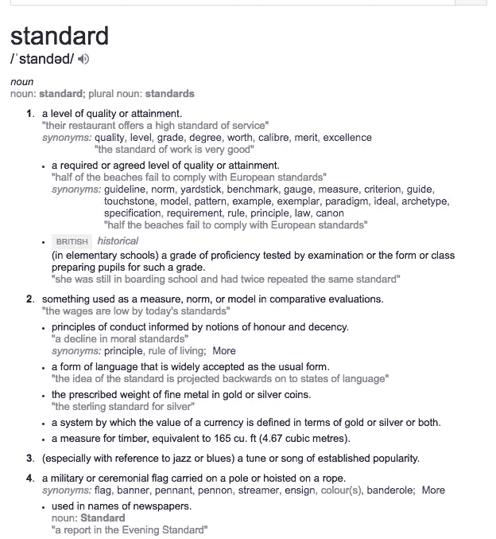

# 如果我们不遵守标准，标准有什么用？

> 原文：<https://medium.com/hackernoon/what-good-are-standards-if-we-dont-follow-them-f118ed674b8>


From Randall Munroe’s XKCD comic: [https://xkcd.com/927/](https://xkcd.com/927/)

最近，我一直在做一个项目，在这个项目中，我不得不与一群使用标准 XML 格式 REAXML 的机构打交道。你可以在这里看到‘标准’。我们来说说这有什么好的。首先，澳大利亚几乎每个房地产经纪人都使用这种格式将他们的房产数据发送到一堆网站(包括他们的)，这很棒。也就是说大家用的格式都一样，大家的数据互相兼容，对吧？

**错了。**

你看，REAXML 有一个非常宽松的标准。它接受输入和价值的广泛可能性——多到令人心痛。这里有一个例子:一处房产可以有多个“特征”,比如壁炉、游泳池、空调等。如果您确实想显示一个属性具有这些属性，只需将它添加到一个`features`节点即可，如下所示:

```
<features>
  <airConditioning>1</airConditioning>
  <openFirePlace>yes</openFireplace>
  <pool>2</pool>
</features>
```

等等，什么？

是的。这三个例子基本上都表示“它有 ____”。不信的话，[看看](http://reaxml.realestate.com.au/docs/reaxml1-xml-format.html#airConditioning)！

> 大于或等于零的整数被视为有效。任何大于 1 的值都被认为是 1。或者，接受“是”或“真”,而“否”或“假”被视为不存在。空值被认为是该物业内没有空调。

好吧。所以说你有一个有空调的房产，你可以给这个节点一个值`1`、`yes`、`true`，或者其他任何正整数。**哇**。

我知道其中大部分是由一整队非常聪明的人完成的，他们很可能比我聪明。我知道有些机构可能希望选择“这个房产有 2 个游泳池和 3 个壁炉”，但是既然这是一个 XML 文件，为什么不把它作为一个属性添加进去，并把它的值作为一个布尔值呢？而我说的布尔，指的就是这个或者那个:**真**或者**假**。不是 1 或 0。或者`yes`或者`no`。我的意思是，这只会给其他人的代码/解释器带来很多复杂性！

他们在这里，几乎垄断了所有的代理，基本上强迫他们使用 REAXML，但是为什么我们这么宽容呢？对我来说，标准是一套硬性的规则。



A quick google shows us the definition of “standard”

从快速搜索的结果中，我们看到了“标准”的前两个定义:**质量或成就的水平**和**在比较评估中用作衡量标准、规范或模型的东西**。质量。正常。这两个词在我看来都叫“严格”。如果你有一个标准，**严格要求它**！反正大家都在跟着你，为什么不强迫他们接受呢？"嘿各位，既然你们都是美丽聪明的人，**遵守规则**！"

这实际上触发了我早期作为前端开发人员的一系列闪回:W3C 标准。谁还记得 IE6？

所以问题是，即使我们有 W3C 来设定标准，浏览器都有他们不同的观点和实现！看一下之前的[箱子模型。如果每个人都在使用它的不同版本，它怎么能成为标准呢？](https://en.wikipedia.org/wiki/Internet_Explorer_box_model_bug)

没有共识，大家都输了。现在，每个人都必须涵盖其他不符合他们所用格式的案例。我记得在 CSS3 的早期，`border-radius`是一个相当新的属性，并不是所有的浏览器都支持它。然后他们都有了实现自己产品的好主意，所以 [Mozilla (Firefox)](https://www.mozilla.org/en-US/firefox/new/) 有一个厂商前缀`-moz`，而 [Webkit 浏览器](https://webkit.org/) ( [Chrome](https://www.google.com.au/chrome/) 和 [Safari](https://www.apple.com/au/safari/) )都有`-webkit`。

标准到此为止！

# 解决方案？

说实话，上面的 XKCD 条总结的最好。通常的解决方案是创建另一个标准。但这真的是解决方案吗？我认为解决的办法就是遵循标准。如果有什么困惑，那就去解决它。这意味着标准可能太模糊或者它有太多的选项(就像上面 REAXML 中的布尔选项)。只要严格，执行，并遵循它。传播信息和知识。

如果你发现自己在使用一个标准，而另一个人或组织也在使用它，但有不同的解释，那么这是一个开始对话的信号——因为你们可能都做错了。