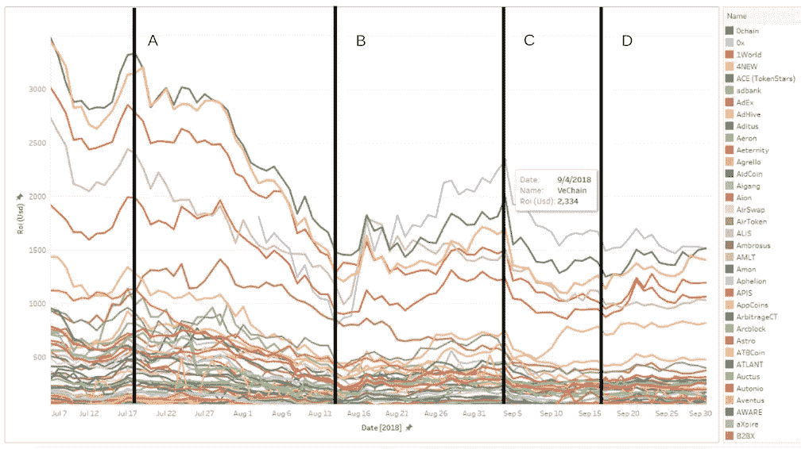
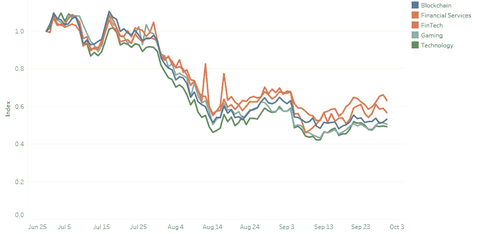

# 如果 SEC 批准比特币的 ETF 会怎么样？

> 原文：<https://medium.com/hackernoon/what-happens-if-the-sec-approves-the-etf-for-bitcoin-65532630b35c>

这个问题已经困扰了每一个加密投资者和所有的数字货币爱好者一段时间了！

## 让我们通过分析来结束这一切。

这将允许机构投资者和投资银行对密码进行投机。他们将能够增加他们现有的资产类别，并通过在加密资产中建立头寸来进一步多样化他们的投资组合。

来自 InWara 的 [Q3 报告](https://www.inwara.com/report)的下图对事情进行了透视。

Source: InWara ICO database

该图绘制了 2018 年 7 月 1 日至 2018 年 9 月 30 日之间排名靠前的 ico 的 ROI。

垂直线 A、B、C 和 D 代表可能影响加密货币市场的事件或新闻。线“ **A** ”代表 SEC 正式推迟比特币交易所交易基金批准听证会的日期。

正如你所看到的，这种延迟导致了加密领域的大规模崩溃，ICOs 下降了 50%以上。

source: InWara’s ICO database

该图显示了 ico 五大行业的总体平均市场趋势。在证交会推迟听证会后的一段时间内，所有这些股票的指数价格总共下跌了一半。

> 如果 ETF 这一次获得批准，我们至少可以期待趋势反转，然后市场恢复到 7 月初的高点，如果不是更高的话！

这将为资金雄厚、研究能力强的投资者打开投资密码的闸门。比特币在普通投资组合资产中的应用将会增加，这将推动该行业的发展。

这将创造的一个关键机会是像 [InWara](http://www.inwara.com/?utm_source=wallstreet&utm_medium=wallstreet&utm_campaign=wsj) 这样的数据公司的繁荣，因为缺乏对加密市场的准确、汇总的知识是金融市场情报的一个主要空白。