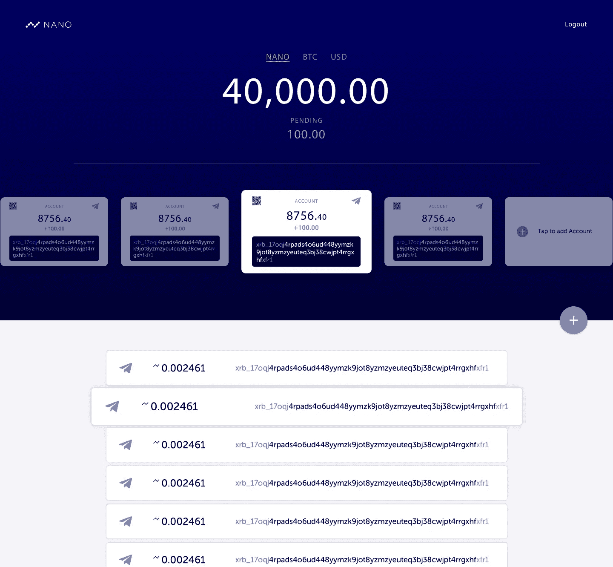

# Nano 更名后，我的 XRB 会怎么样？

> 原文：<https://medium.com/hackernoon/what-happens-to-my-xrb-after-nano-rebranding-c6492d07cfc9>

## 自从 Raiblocks (XRB)正式宣布通过新网站[nano.org](http://nano.org)更名为纳米货币以来，每个人心中都有很多疑问。这里有一些问题的答案。

## 我的 XRB 会自动转换成 Nano 吗？

是啊！你什么都不用做。如果您有 10 个 RaiBlocks(有时称为 10 mrai)，现在您有 10 个 Nano。你可以像往常一样持有、发送、请求或交易它们。

一些交易所可能正在升级，以显示 XRB 现在是纳米。您可以小心等待，直到他们的升级完成，或者继续进行。

## 面额有变化吗

№10 XRB(或 10 mrai)就是 10 纳。唯一改变的是滚动条(记得在 Twitter 上使用$NANO)

## 我的钱包地址是一样的吗？

是啊！你的钱包地址短期内会继续是 xrb_…。您仍然可以像以前一样进行交易。

## 如果我的资金在 RaiWallet 上怎么办

RaiWallet 更名为 https://nanowallet.io/ T2 T3，但仍有相同的后端和相同的代码。唯一不同的是网站名称、设计和网址。它仍然是我们的官方网络钱包。

## 如果我的资金在旧的桌面钱包里怎么办

你的资金在那里还是安全的。我们也将很快推出新的桌面和移动钱包。只要您备份了您的钱包种子，您就可以在我们的任何新钱包上使用这些资金。我们鼓励您升级到我们的新钱包，这样您就可以使用最新最棒的纳米技术。

## @Raiwalletbot 会怎么样？

现在你必须使用@NanoWalletBot 来管理你的资金。打开并找到你的旧 raiwalletbot 帐户，一切都完好无损，除了它有一个新的标志和名称。

> 这篇文章是从 [Reddit](https://www.reddit.com/r/RaiBlocks/comments/7ubfm6/faq_about_nano/) 上发布的信息复制来的，以吸引更多的读者，因为大多数秘密投资者都是中等水平的。原帖是[这里](https://www.reddit.com/r/RaiBlocks/comments/7ubfm6/faq_about_nano/)

一旦你的问题都有了答案，不知道如何购买纳米(以前称为 Raiblocks)。根据您想购买的交易所，浏览以下文章。

## 币安

 [## 哪里和如何购买纳米(纳米或 XRB)

### 了解什么是纳米货币(以前称为 RaiBlocks)，目的和如何购买 XRB 代币的综合指南…

hackernoon.com](https://hackernoon.com/where-to-buy-nano-raiblocks-xrb-binance-kucoin-6a9a64672bf4) 

## 库科恩

 [## 如何购买 RaiBlocks 又名 XRB

### 综合指南了解什么是纳米(RaiBlocks)，它的令牌，目的以及如何购买 XRB 令牌从…

hackernoon.com](https://hackernoon.com/how-to-buy-raiblocks-aka-xrb-8bfaac294364) 

> "使用 [BearTax](https://bear.tax) 提交您的加密货币税！"

 [## BearTax -您的加密税务助理

### 易于使用的平台，密码交易员进口交易，计算收益和文件税。

熊税](https://bear.tax) 

感谢阅读。希望你已经发现它的信息。如果你想收到我的新文章的更新，请在[Twitter](http://twitter.com/confusedcoin)&[Medium](/@vvkr)上关注我