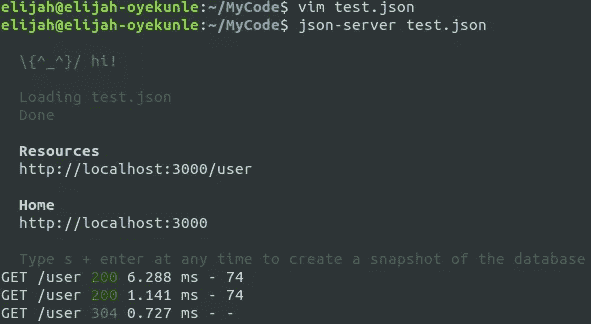
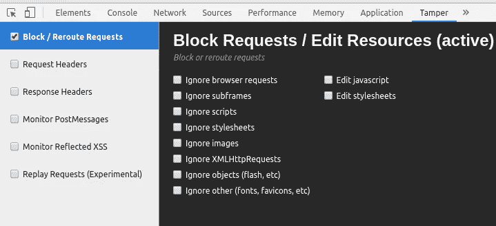
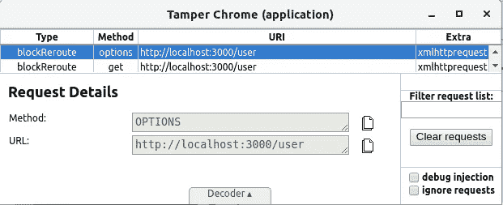

# 当一个低劣的编码器构建你的后端时会发生什么

> 原文：<https://medium.com/hackernoon/what-happens-when-a-shitty-coder-builds-your-backend-4cb0a57ff6ef>


**注:** *出于安全考虑，这里涉及的实际 web 服务就不具名了，所以为了这篇文章我将虚构一个* ***虚构的*** *网络游戏商店，名为*忒修斯游戏 *(TG)与* ***虚构的****URL:*`https://theseus-games.co.uk`*。*

我最近试图从 TG 购买一款新游戏，不幸的是它只提供给*高级*会员(TG 有两个会员级别，*基本*和*高级*)，而高级会员贵得要命。我咬了一会儿我的指甲，不知道我能做什么，因为我未来的幸福严重依赖于尽快玩几个小时的游戏。因为我自己是一名软件工程师，所以我决定尝试一下是否可以暂时使用一下 TG 的服务，看看它是如何工作的。

我打开 Chrome DevTools 重新加载了 TG 的游戏购买页面，以便查看网站提出了哪些请求。我注意到的第一件事是 TG 使用 AJAX 加载它的一些 Javascript 资产，大约有一打。其中两个剧本引起了我的注意:`user.js`和`purchase.js`，我迅速打开它们，看看里面埋着什么宝藏。

```
// snippet from *https://theseus-games.co.uk/assets/js/user.js*componentDidMount() {
  **this**.retrieveContactInformation();
  **this**.retrieveUserInfo();
}

retrieveUserInfo() {
  axios.get(**this**.appUrl + '/user').then(
    **function** (response) {

      **this**.setState({
        application: response.data.application,
        active: response.data.active,
        isLoaded: **true** });

    }.bind(**this**)
  );
}
```

当然，我已经用 React 和 React Native 构建了几个应用程序，我立即意识到 web 前端是用 React 构建的，与 Laravel 后端通信(我从会话 cookies 中获得这一点)。如果你懂一点 Javascript(或者几乎任何一种网络语言，哈哈)，你可以通过这些代码片段来工作。

```
// snippet from *https://theseus-games.co.uk/assets/js/purchase.js*purchaseGame = (evt) => {
  evt.preventDefault();

  **if** (**this**.state.active == 2 || **this**.state.active == 33) {
    **this**.setState({
      isLoaded: **false** });

    **var** newGame = {
      gameId: **this**.state.gameId,
      session: **this**.state.session
    };

    axios({
      method: 'post',
      url: **this**.appUrl + "/purchaseGame",
      data: newGame
    }).then(
      **function** (response) {
        **this**.setState({
          isLoaded: **true** });
      }.bind(**this**)
    );
  } **else** {
    **this**.setState({
      message: 'Sorry! This game is only available to our premium members.'
    });
  }
}
```

显然，用户会员信息是通过`**User**`实体中的`active`字段来表示的，只有`active`为 **2** 或 **33** 的用户才可以获得游戏。当然，数字必须代表会员级别，或者是 **2** 或者是 **33** 表示*高级*会员，因为我得到的信息是:*‘对不起！这个游戏只对我们的高级会员*开放，我的`active`领域绝对不是 **2** 或 **33** 。

在 DevTools 的 request 选项卡中，我看到了实际的 **GET** `*/user*` API 请求，并发现了以下响应:

```
// response for **GET** *https://theseus-games.co.uk/application/user*{
    "application":"182718048",
    "active":22,
    "userId":60088
}
```

显然，我的`active`字段是 **22** ，这就是 web 应用程序知道拒绝我访问的原因。

我立即启动了 Postman，以便发出 API 请求来更新我的`active`字段。从 DevTools 中，我将当前会话 cookie 和`X-XSRF-TOKEN`头值复制到 Postman 中，并尝试向`https://theseus-games.co.uk/application/user/60088`发出一个 **PUT** 请求，其有效负载为:

```
// payload to **PUT** *https://theseus-games.co.uk/application/user*{
    "application":"182718048",
    "active":2,
    "userId":60088
}
```

但是我立即收到一个 405(不允许方法)错误，这意味着用户以不同的方式更新。依次试了**贴**贴`/application/updateUser`、**贴**贴`/application/updateUserInfo`，两个都得了 404。在这一点上，我决定完全放弃这种方法，尝试别的方法。(如果我想继续，我会检查通过 AJAX 下载的其他`*.js`文件，以获得更新用户的具体路径，或者只是转到我的帐户页面，尝试更新我的帐户，然后检索路径；但是剥大象的皮有很多种方法哈哈。)

我有这个很酷的 Chrome 扩展，叫做 [Tamper Chrome](https://chrome.google.com/webstore/detail/tamper-chrome-extension/hifhgpdkfodlpnlmlnmhchnkepplebkb) ，用来(惊喜！)篡改浏览器中的请求，修改请求头、有效载荷等。我尝试的下一种方法是篡改实际的 API 请求，我可以很容易地尝试两件事:

**1。**下载`https://theseus-games.co.uk/assets/js/purchase.js`的副本，修改`if`条件检查`active`字段，然后放入我的本地服务器(如`/var/www/html/web/purchase.js`)，然后修改外发请求为`https://theseus-games.co.uk/assets/js/purchase.js`并将请求路径改为`http://localhost/web/purchase.js`，所以它改为服务于我的本地版本。对于我的局部修改，我可以简单地更改:

```
if (this.state.status == 2 || this.state.status == 33) {...}
```

收件人:

```
if (true) {...}
```

**2。**以类似于 *(1)* 的方式，我可以提供一个本地版本的`https://theseus-games.co.uk/application/user`并简单地返回一个带有方便修改的`active`字段的用户对象，然后修改 AJAX 请求路径到我的本地版本。我的意思是:

```
// response for GET *http://localhost/api/user.json*{
    "application":"182718048",
    "active":2,
    "userId":60088
}
```

我选择了 *(2)* ，并用漂亮的`[json-server](https://github.com/typicode/json-server)`节点包完成了这项工作。我创建了一个简单的`test.json`文件，内容如下:

```
{
    "user": {
        "application":"182718048",
        "active":2,
        "userId":60088
    }
}
```

然后我启动了 json-server:



接下来，我激活了 Tamper Chrome，以便从当前选项卡重新路由所有进一步的请求:



我重新加载了页面。很快，`https://theseus-games.co.uk/application/user`的 AJAX 请求出现了，我简单地将其修改到我的本地 json 服务器:



当然，这个请求击中了我的 json 服务器，它愉快地响应了几个可爱的字节。

这就是我所需要做的，所以我决定再次点击*购买*按钮，当然，所有前端可以看到的是我是一个特权 TG 成员(哈哈！);然后出现了一个加载指示器，接下来是一个感谢我使用 Theseus 游戏的弹出窗口(*我的荣幸，朋友们*)，游戏很快就被下载到了我的电脑上。

我迅速抛弃了所有世俗的顾虑，将接下来的几个小时投入到游戏中，当我身心俱疲时，我躺在床上，严肃地思考着 TG 的不幸的人们本可以做些什么来进一步保护他们的商品。

女士们先生们，这里的**黄金法则**是始终对 web 应用程序的所有敏感组件进行客户端和服务器端检查。在 TG 的情况下，在服务器端，在`https://theseus-games.co.uk/application/purchaseGame`，他们没有，但应该只是再次验证我的`active`字段，以确保我被授权购买所述游戏，这实际上是一个微不足道的检查。不幸的是，这是一些 web 开发人员(新手*甚至老手*)在构建 web 服务时仍然会犯的错误，并且经常无法加强他们的安全性，所以如果您构建 web 服务，请在将来多加注意。

感谢阅读，乡亲们。与朋友分享，并在下方留下您的反馈。非常爱。

**PS** : *如上所述，没有忒修斯游戏(TG)和* `*https://theseus-games.co.uk*` *不存在。我已经通知了有问题的实际公司(抱歉，不是游戏商店)，他们已经解决了这个问题。*

*原载于*[*https://elijahoyekunle.com*](https://elijahoyekunle.com/node/31)*。*

您的 web 应用程序需要帮助吗？[联系我！](https://elijahoyekunle.com/contact)——[推特](https://twitter.com/elijahoyekunle)——[Github](https://github.com/eloyekunle/)——[LinkedIn](https://www.linkedin.com/in/elijahoyekunle)