# 我在斯里兰卡亚瑟·C·克拉克的书架上发现了什么

> 原文：<https://medium.com/hackernoon/what-i-found-on-arthur-c-clarkes-bookshelf-in-sri-lanka-71c602bc1fdc>

所以我在斯里兰卡度过了假期。一部分是度假，一部分是商务旅行(我在麻省理工的一个同学 Prasath 在那里开了一家公司，我投资了这家公司，多年来我一直承诺要去看看)。

对于英国和亚洲的居民来说，斯里兰卡是一个相当知名的目的地；在美国没这么多。我对它的悠久历史知之甚少:在古代，在朱利叶斯·凯撒的时代，安纳德拉普王国向罗马派遣了特使，波斯人称这个岛为塞伦迪布岛(这迂回地引出了“意外之喜”这个词)，在殖民时期，这个岛被称为锡兰。

当我在中西部长大时，我第一次对斯里兰卡感到好奇是在亚瑟·C·克拉克的科幻小说中:我发现这位受欢迎的英国作家住在斯里兰卡很奇怪。

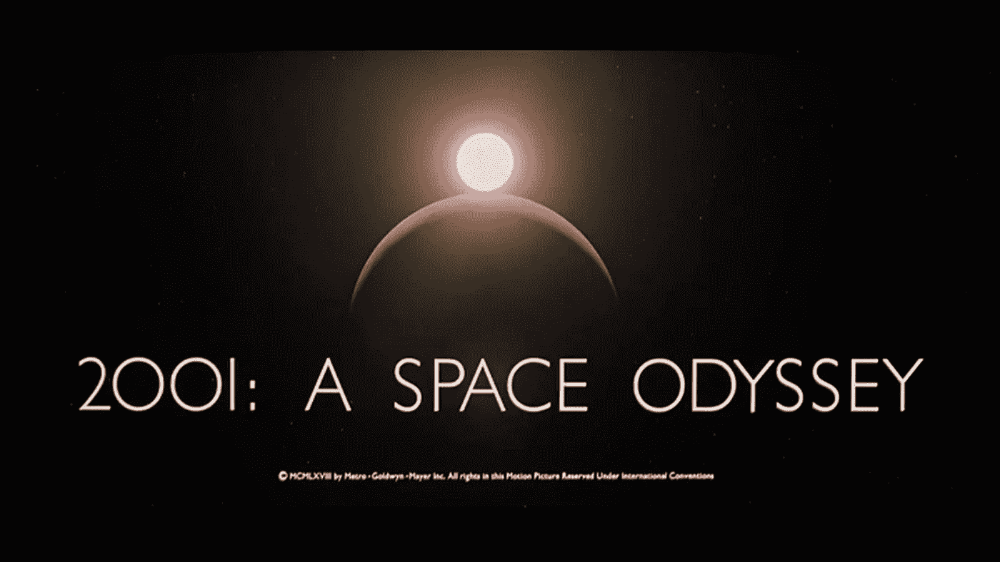

The opening scene from 2001: A Space Odyssey

克拉克最著名的作品是电影《2001:太空漫游》的素材。由于我是在小说出版后的第二年出生的，所以我没能在电影院看到它，但是当我长大到能够欣赏“严肃”科幻小说的时候，我就迫不及待地阅读了小说及其续集(《T2》2010:奥德赛 2，这本书是 1982 年我上初中的时候出版的，还有《T4》2061:奥德赛 3，这本书是 1987 年我上高中的时候出版的，还有最后一部 *3001*

ACC(如他所知)是一位多产的科学和科幻作家。事实上，许多人认为他是通信卫星的发明者；在 20 世纪 40 年代，他提出了从地球同步卫星上反射无线电信号以到达地球每个角落的想法。

所以，正如我所说的，我在斯里兰卡度过了假期，我在重读 ACC 的书，想知道如果能见到他该有多有趣。当然那是不可能的(他在 2008 年去世了)，但是当我问起他的时候，我的朋友 Prasath 告诉我 ACC 在科伦坡非常有名；在作家去世之前，Prasath 实际上已经和他以前的天文学教授去过 ACC 的房子。

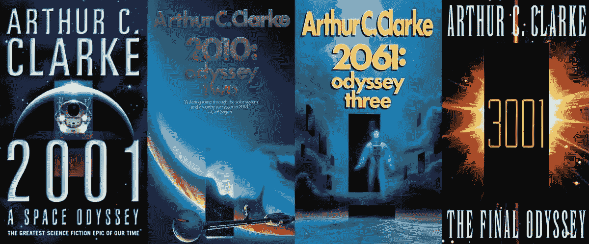

The 2001 Series of Books

自从我在加勒·法斯酒店重读《3001:最后的奥德赛》后，我有了一个灵感:我们可以去他以前的房子吗？我在想，开车路过，拍一张他住过的房子的照片，可能是一种不错的纪念方式。

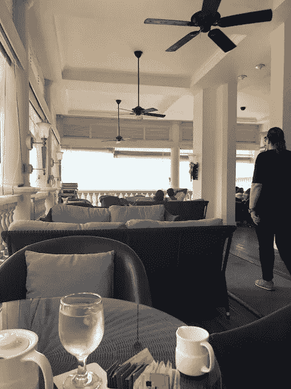

Sitting at the Galle Face Hotel, reading 3001, where ACC had written most of that book!

Prasath 查找了这个地址，并在谷歌上做了一点研究，这让我们找到了《亚洲暗箱》的一篇旧文章，那篇文章的作者在 2013 年贿赂(呃，小费)进入了 ACC 的办公室，这在 2008 年 Clarke 去世后或多或少没有受到干扰。自从那篇文章发表以来，五年过去了，我觉得他的办公室仍然被保留下来的可能性似乎很小，找到一种方法似乎更小，但我们受到鼓舞，去尝试。

当我们找到房子的时候，有一个保安。普拉萨特和他聊了起来，并指着我告诉他，我来自美国，是阿瑟·C·克拉克的超级粉丝。门卫似乎很同情他，并说他会看看能做些什么。与此同时，我看到了上面的题词，莱斯利的房子，上面写着亚瑟·C·克拉克和赫克托都是这里的居民。我觉得很奇怪，这么多年过去了，这块牌子还在。

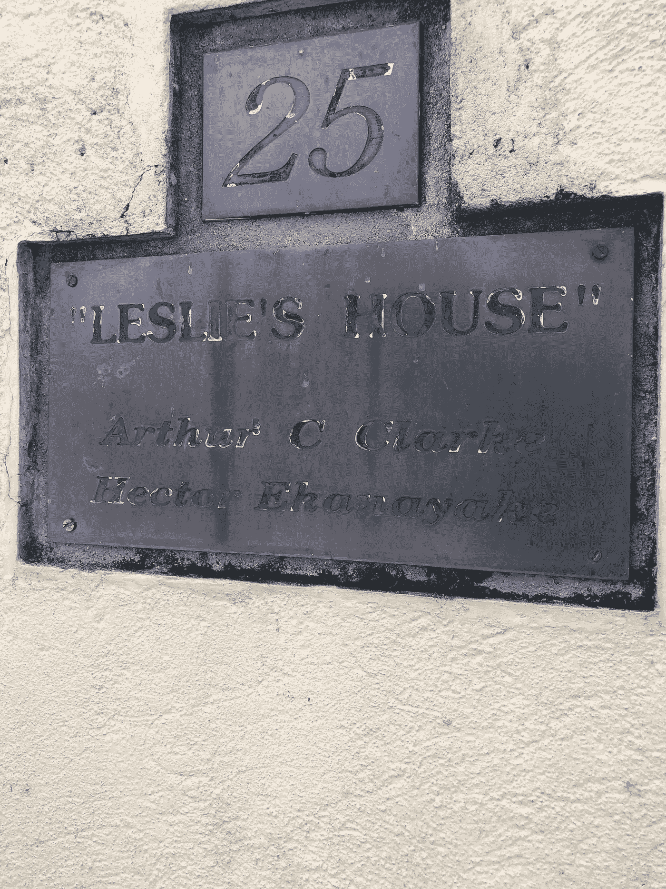

Plaque outside “Leslie’s House”

房子与办公区分开，有几只狗在我们走近时开始吠叫。警卫用我听不懂的僧伽罗语说了些什么，然后走向大门。那里有一个老妇人，她告诉 Prasath 她是管理员，在看到我是如此的一个大粉丝之后，决定让我们进去看看他的办公室！

当我们进入大门时，一个小电话/扬声器旁边有一个写着“亚瑟·C·克拉克”的标志，大概是为了让他能屏蔽访客。

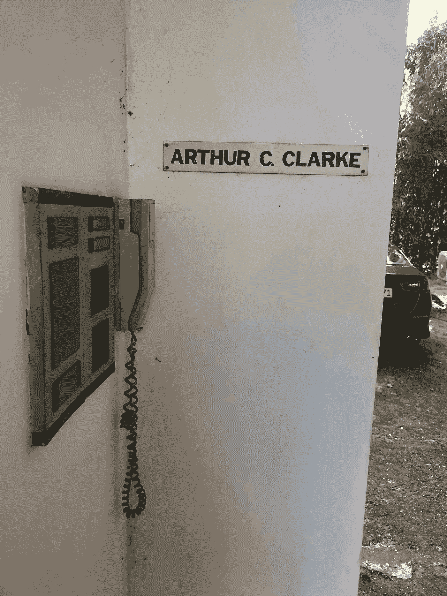

Where visitors would call up to ACC inside the gate but just outside the office

当你走进去的时候，有一个小门厅，里面有两把扶手椅，后面有一幅画，看起来好像居住者在月球上，仰望着地球。一开始我太害羞了，不敢坐在上面，惊叹于我们的好运气，不敢进去，但在参观结束时，我们鼓起勇气问是否可以坐下来拍张照，我们照做了。

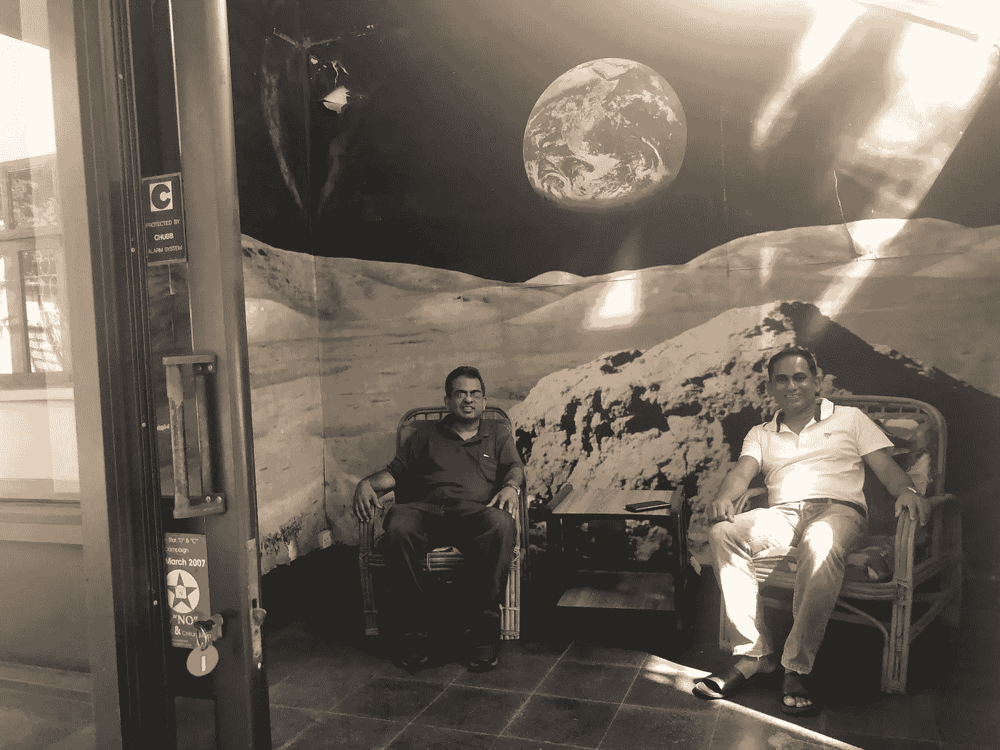

Prasath and I sitting in the “moon” welcome area !

在这个入口区域之后，有一张 2001 年的海报:

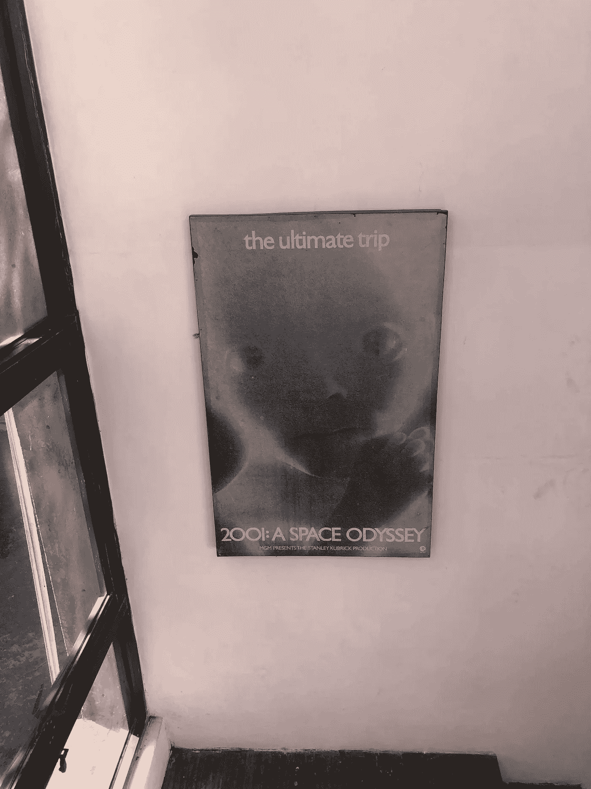

当你走上台阶时，有一个通往火星的路标，接着是一个开放的房间，里面有许多证书和其他授予 ACC 的奖项。

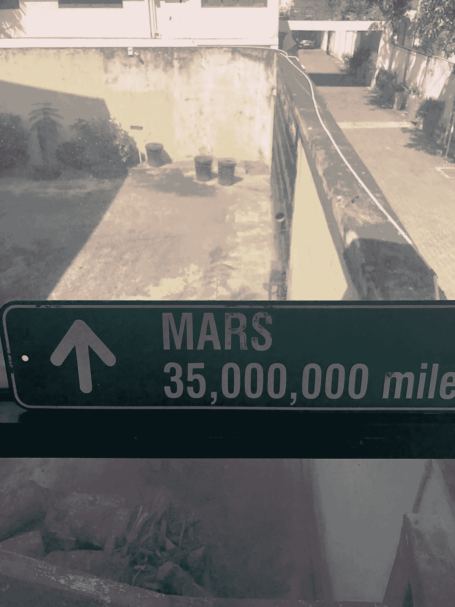

墙上的一件物品是 ACC 在 20 世纪 40 年代的原始文件，内容是如何利用地球同步卫星向全球发送无线电信号，这在 20 世纪 60 年代随着 Intelsat 的 Early Bird 卫星而成为现实。

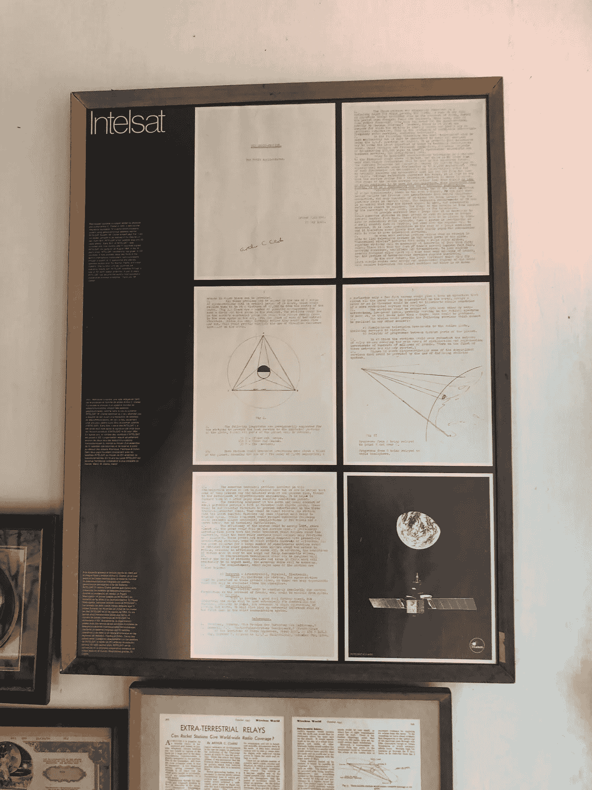

Copies of the original article ACC wrote about putting a satellite in geostationary orbit to send radio signals

直到那时，ACC 办公室的门才打开——它看起来很像 2013 年的样子，我被告知，很像 2008 年 ACC 去世时的样子。

有几个书架——最显眼的是他书桌后面的两个书架。他桌子后面有两个书架。他晚年常坐的地方不是椅子，而是轮椅。我忍不住拍了张照片。

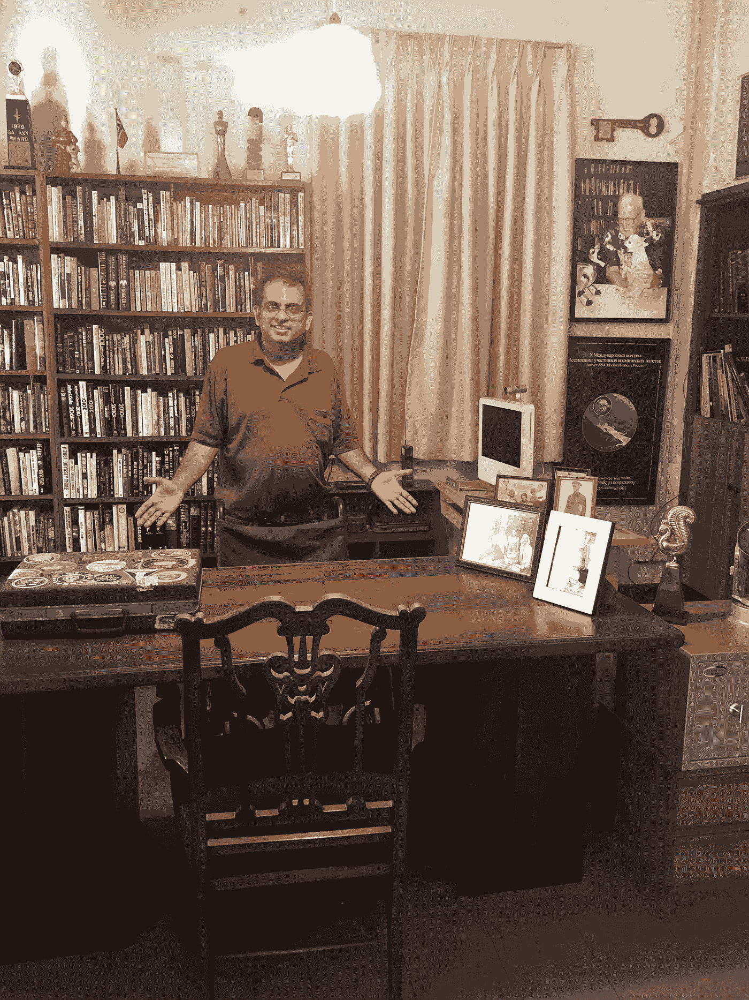

Felt like I was a famous sci fi writer for a moment!

他的书架上有什么？

原来他身后的两个书架上有他所有书籍的版本。右边的书架是献给 2001、2010、2061、3001 的——包括许多英文和其他语言版本——精装版和软装版。这里有一些特写镜头。

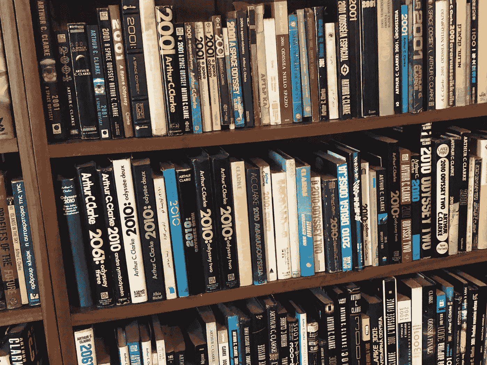

Just behind his desk, on the right were all the various editions of the 2001 series

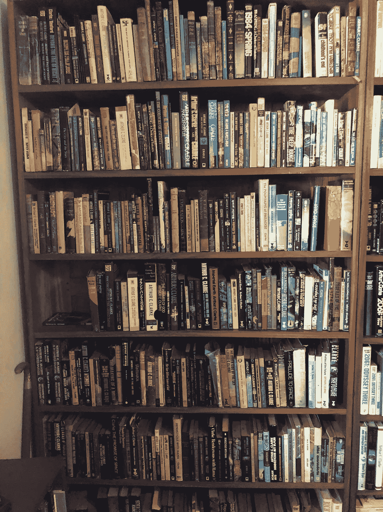

The left bookshelf had copies of many of his other works

书架顶上是各种奖项和纪念品，包括 1979 年的银河奖。

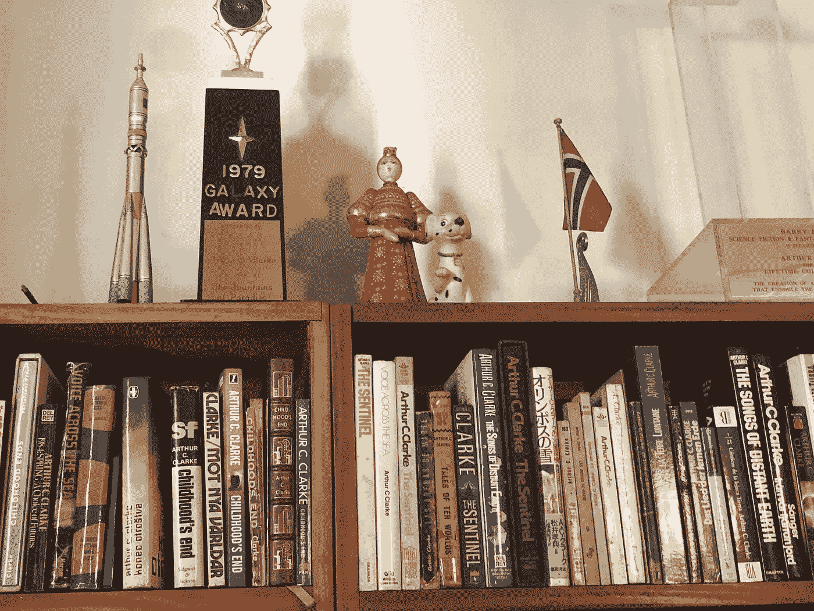

Lots of awards and memorabilia sat on top of the shelves

墙上有许多纪念品——包括许多名人给他签名的照片，虚拟的科学和科幻小说名人录。由于 ACC 被认为是有史以来最好的(如果不是最好的)科幻小说作家之一，大多数科幻冒险都是受他的启发。例如，有一条署名的信息/图片来自在《星球大战》中扮演达斯·维德的大卫·鲍罗斯。

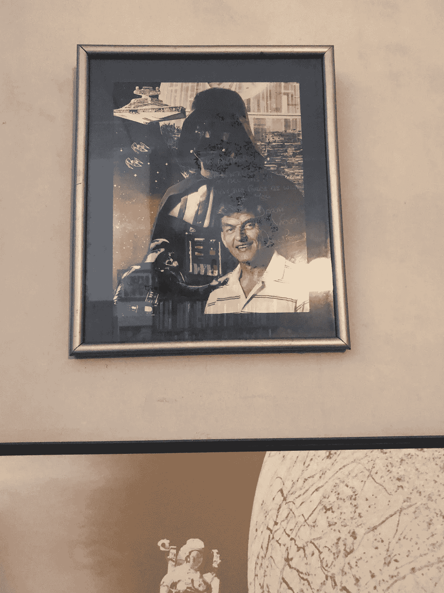

A signed picture by Darth Vader actor, Dave Prowse, above an image of a spacewalk above Europa?

旁边有一张 ACC 与 Patrick Stuart 的照片，Patrick Stuart 在《星际迷航:下一代》中扮演让·卢克·皮卡德船长，旁边是一张 ACC 的一本书漂浮在航天飞机上的照片，旁边是一名现实生活中的宇航员！

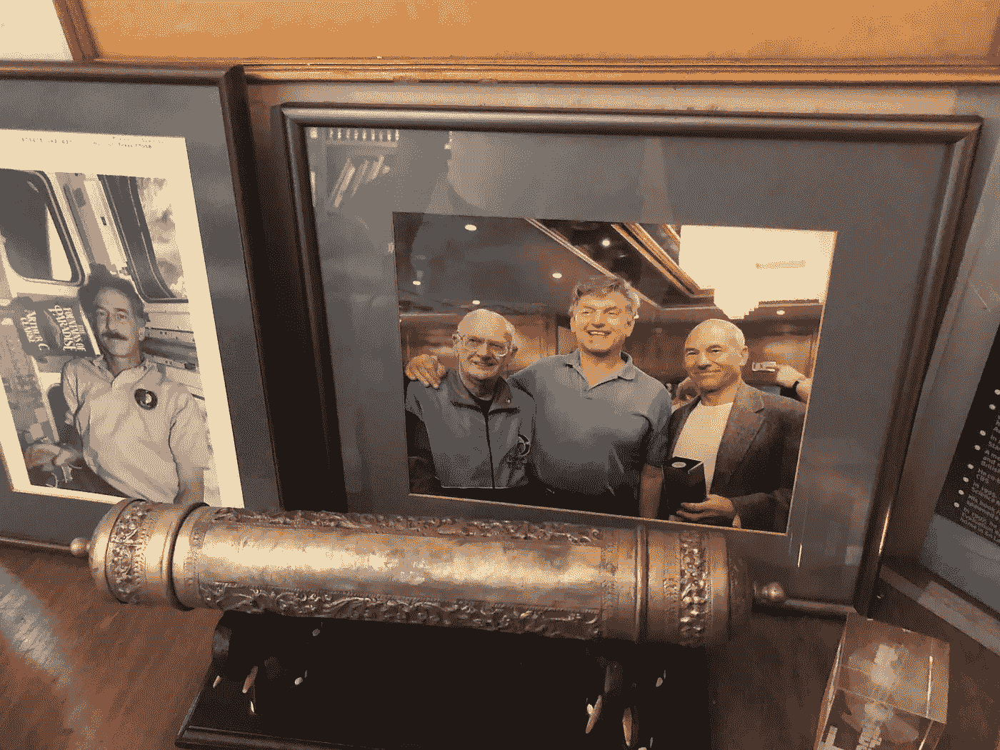

Left: Shuttle astronaut with ACC book, Right: ACC, Patrick Stewart, and?

有一张照片上有巴兹·奥德林的签名，他是第二个在月球上行走的人。当然，月球是 2001 年电影/小说中发现的第一块巨石的所在地(根据 ACC 写的早期短篇小说《哨兵》改编)，并在照片和他的书中扮演了重要角色。

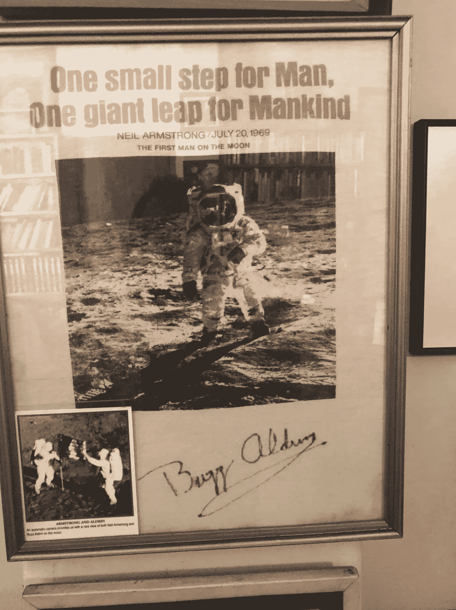

Signed by Buzz Aldrin himself, second man on the moon!

除了他自己的书，ACC 的办公室里还有什么书？

房间的右边是一个小书架，里面有小说和非小说类书籍；我认出了许多书，因为我有许多相同的书。，包括地球人(巴兹·奥德林)，接触(卡尔萨根)和许多其他人。

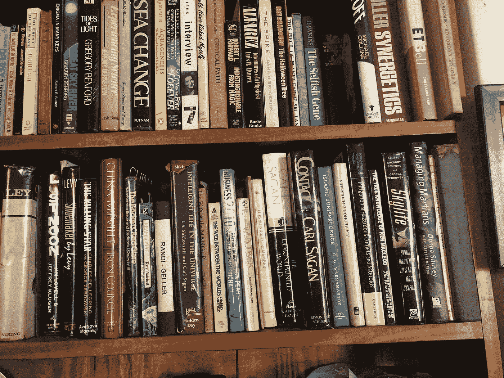

其中一个书架专门放艾萨克·阿西莫夫的书。被认为是三大科幻作家之一的艾萨克·阿西莫夫，据说和 ACC 有一个约定，如果被问到谁是最好的科幻作家，他们都会回答阿西莫夫；但是如果问他最优秀的科幻小说作家是谁，他们会一起回答。其中一个书架上有阿西莫夫的传记。

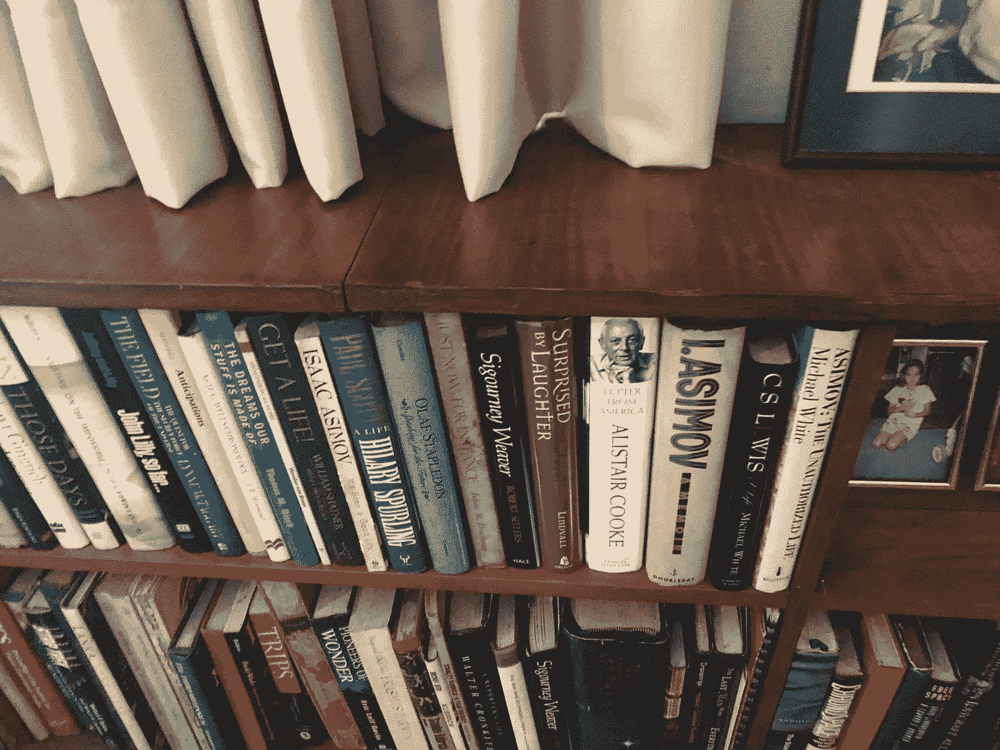

右边的墙上是录像——大部分是 VHS 录像带。这些似乎是从电视节目《亚瑟·C·克拉克的神秘世界》到《哈尔的世界 2001》到随机录制的电视节目的录音。我想知道这些收藏品是否会被数字化？

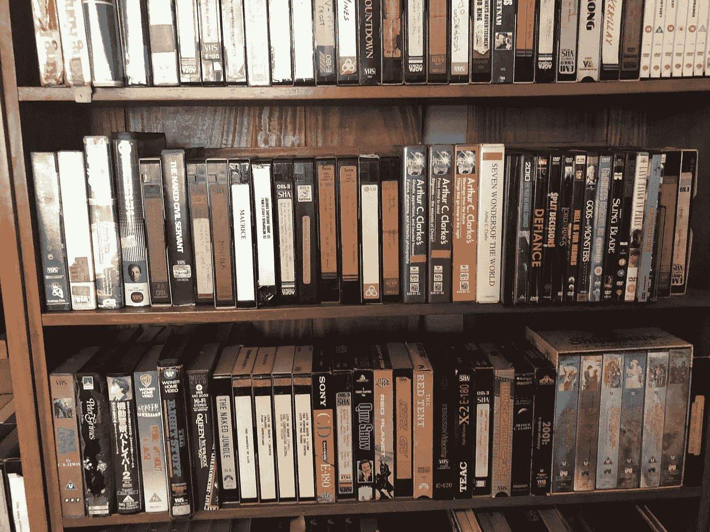

A big collection of VHS tapes was there — wonder how many of these have been digitized?

墙上贴着许多证书、奖章和杂志文章。其中一本书的标题是《亚瑟·c·克拉克，天才》

这是一个有点势不可挡，我点击了尽可能多的照片。

然后，就在我要离开的时候，我被一个架子吸引住了，上面有一堆随意摆放的小摆设。出于某种原因，我还没有被吸引去拍摄它们，也没有看到任何值得注意的东西。我正要离开，这时我从眼角的余光里注意到了它。我有一种奇怪的感觉，好像房间里有什么外星人。

在我看来，我听到了 2001 年的主题曲(施特劳斯的《查拉图斯特拉如是说》)。

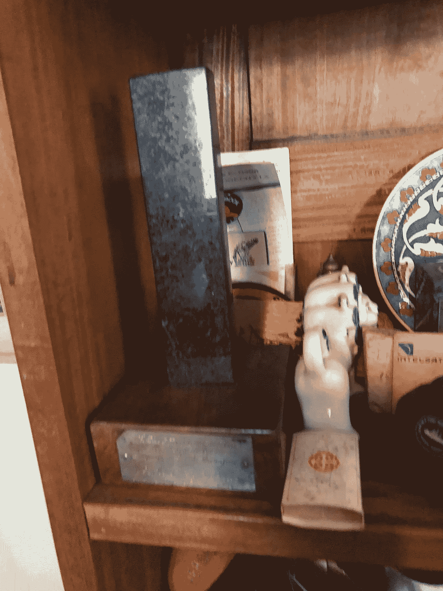

A replica of the Tycho Monolith

就在那里！隐藏在金克-卡克家族中的是那块巨石——或者说是它的复制品。它让我想起了很久以前隐藏在第谷上的原始巨石，被一些深不可测的智慧所移动，只是在他们离开后的遥远未来被探险家发现。感觉像是*这个*巨石也被某种形式的超级智慧生命留下了，它们曾经居住在月球的这个角落，事实上就是这个办公室，但是很久以前就搬到其他维度去了！

当我走出去，再次看到月球表面的入口时，我一直保持着参观别人居住的地方的那种有趣的感觉。

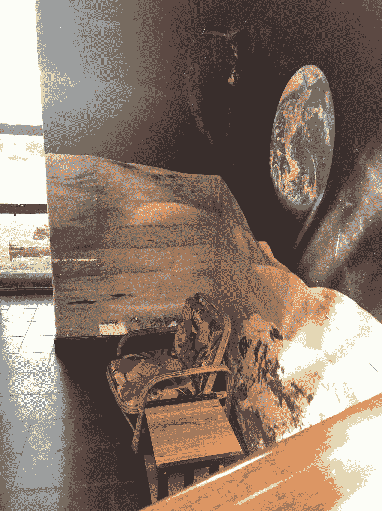

在离开的路上，我们感谢了保安和管理员，并给了他们一点小费，感谢他们让我度过了愉快的一天。

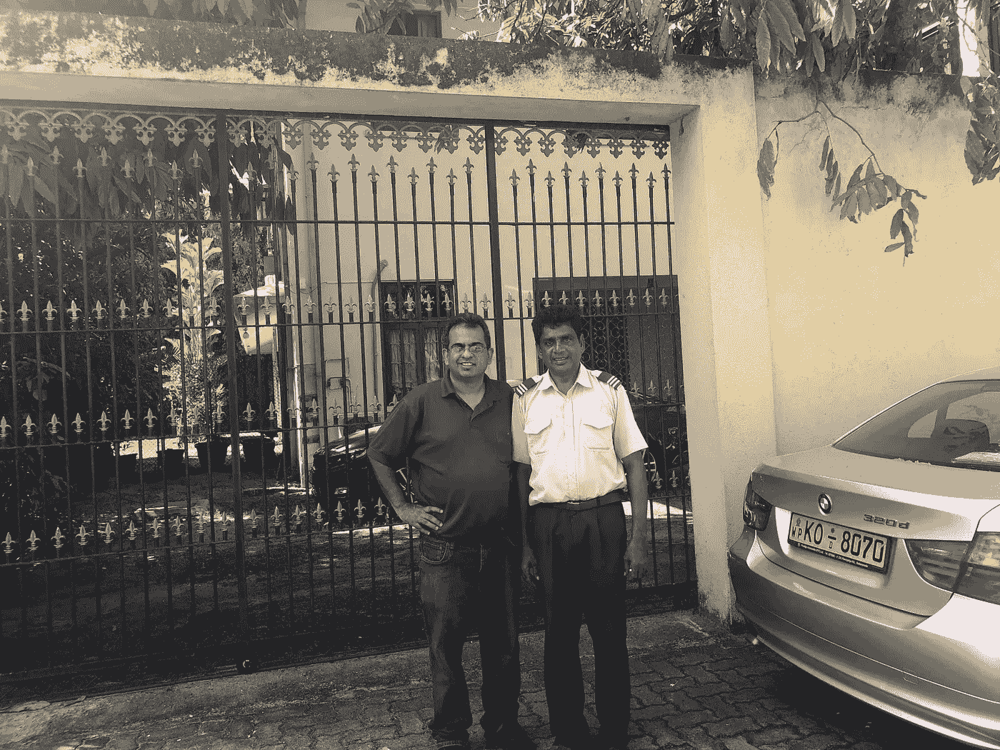

对于像我这样的科幻迷来说，总的来说，这是一次无与伦比的经历，当我阅读 ACC 关于太阳系和外星生命的书籍时，带回了我童年的奇迹！