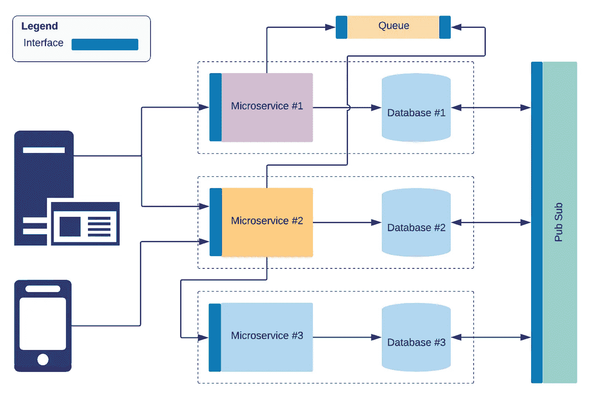

# 我从微服务架构中学到了什么

> 原文：<https://medium.com/hackernoon/what-i-have-learned-architecting-microservices-cbccc2182530>

在过去几年中，将应用程序设计为微服务的集合正在成为一种常见的架构模式。重要的是要明白微服务不是解决所有软件问题的灵丹妙药。然而，软件行业中有许多大公司采用微服务的成功故事，这推动了这一上升趋势。

同样，也有许多失败的故事，而且数字可能会更高，因为其中许多故事没有公之于众。我见过的失败的主要原因之一是在设计微服务架构时缺乏对我们正在处理的事情的理解。

> 我在设计微服务时学到的一个重要经验是，它需要对分布式系统有深刻的理解，如果没有这方面的知识，很可能会在微服务之间进行错误的抽象和通信。

# 那么什么会出错呢？

我见过很多这样的情况，开发者声称他们已经采用了微服务架构风格，但当深入细节时，情况并非如此。让我们看看人们在设计微服务时会犯的几个常见错误。

*   使用容器(例如；Docker)并不代表你在采用微服务。它只是一个可以用来实现它的工具。
*   如果不同的服务在项目中直接共享代码(没有将依赖关系外部化并通过版本化的存储库访问它们)，那么你这样做是错误的。
*   依赖太多微服务来执行一项任务，可能会导致依赖性和性能问题。比如我见过的单页面 web 应用，调用很多微服务来执行单个事务。
*   使用中间件(API 网关、消息队列等)有一个常见的误解。)微服务是不好的做法。理解这一点很重要，问题不在于使用中间件，而在于如何将其用于微服务。例如，有人可能会说，建立中间件服务对于微服务来说成本太高。这背后也有一个事实，但如果我们看看基于云的中间件，例如 AWS API Gateway，它可以为每个微服务 API 端点、基于[消费的成本模型](https://aws.amazon.com/api-gateway/pricing/)(例如:每百万次 API 调用 3.50 美元，每传输 GB 数据 0.09 美元)，成本超过了收益。
*   对于某些应用程序，微服务通过 REST APIs 进行通信并不是强制性的。API 作为契约的概念可以在不同的层次上实现。例如，如果几个微服务需要在彼此之间共享文件，可以使用共享网络文件系统，如[亚马逊 EFS](https://cloud.netapp.com/blog/ebs-efs-amazons3-best-cloud-storage-system) 或对象存储，如[亚马逊 S3](https://aws.amazon.com/s3/) 来实现与治理的合同，使用版本良好的库来连接访问以及对库的向后兼容修改的策略。
*   同样重要的是要明白，在设计微服务时，我们过去在开发单片时遵循的一些最佳实践可能会受到挑战。如果我们采用使用单个数据库实现一致性而不复制数据的概念，这将成为微服务上下文中的反模式，如果他们访问同一个数据库，最终使这些微服务与数据依赖高度耦合。
*   基于技术层划分微服务也被认为是一种不好的做法。我看到一些人将数据访问层作为单独的服务分离出来，这导致了重大的性能问题。

# 最佳实践

设计微服务时，有几个关键点，我在设计阶段反复验证。

*   我应该把业务能力分成多少个微服务从领域驱动设计的角度来思考。
*   使用不同的数据库解决方案将数据划分到不同的服务中，并了解每个服务需要在本地保留哪些数据段。
*   数据如何在冗余数据的微服务之间同步。
*   数据的一致性要求。(无论是要求强一致性的事务还是实现最终一致性的可能性)。
*   为服务之间的通信和交互选择正确的接口、通道和中间件。
*   考虑成本时所需的安全性、可靠性、性能和效率水平。
*   用于个体微服务的工具和技术。(无服务器、容器、网络技术等。)
*   如何版本化和[共享代码](https://codeburst.io/can-we-reuse-code-between-microservices-508fa4c1d06d)(如果需要的话)以库的形式使用像 NPM 这样的库。
*   团队和流程(开发、DevOps、变更管理等)如何。)是围绕微服务构建的。

> 另一方面，试图在前期做一个大的设计，为大量的微服务划分业务领域也是不实际的。寻找微服务的黄金数量总是具有挑战性，但最好从小规模开始，以后再分。

你还可以考虑安全性、数据隐私(尤其是 GDPR 需求、T2 领域驱动设计实践，最重要的是开发团队和子团队的组成)来激发你的想法。

> 我所看到的微服务的一个明显优势是，尽管考虑到需要专业设计技能的整体服务和交互，整体架构很复杂，但实施单个服务在其生命周期内变得更简单，从长远来看提高了开发人员的工作效率。

## 中间件

如果你正在云中设计微服务，[无服务器技术](/99xtechnology/full-stack-serverless-web-apps-with-aws-189d87da024a)和托管服务有可能解决大部分挑战，而无需编写代码或使用第三方中间件。例如，我经常使用 AWS SNS 和 Lambda(受消息格式契约的 SNS 策略控制)作为发布-订阅消息解决方案，在微服务的数据库之间同步数据。对于需要部署在内部数据中心的微服务，有像 [Apache Kafka](https://kafka.apache.org/) 这样的开源消息中间件可能会取代 AWS SNS。

## 证明

使用身份服务器(例如；Amazon Cognito UserPools)也是一个很好的选择，而不是从零开始将其作为微服务来实现。使用无状态令牌(如 JWT)进行身份验证和授权(使用声明)也很有用，这可以由不同的微服务进行验证，而无需显式依赖。

我经常在多个项目中使用 [OpenID Connect](http://openid.net/connect/) 来实现跨微服务的认证(使用 OAuth2.0 的标准授权流)，从长远来看，这被证明是非常方便的。

## DevOps

在微服务实现中，您可以将每个服务视为一个单独的项目，并围绕每个服务组织代码工件和 CI/CD 设置。然而，识别服务之间的公共交互通道也很重要(例如；RestAPIs、发布-订阅主题、队列等。)并分别对待它们，让它们拥有自己的变更管理流程。这对于确保服务之间的交互而不会导致应用程序接口的改变起着至关重要的作用。