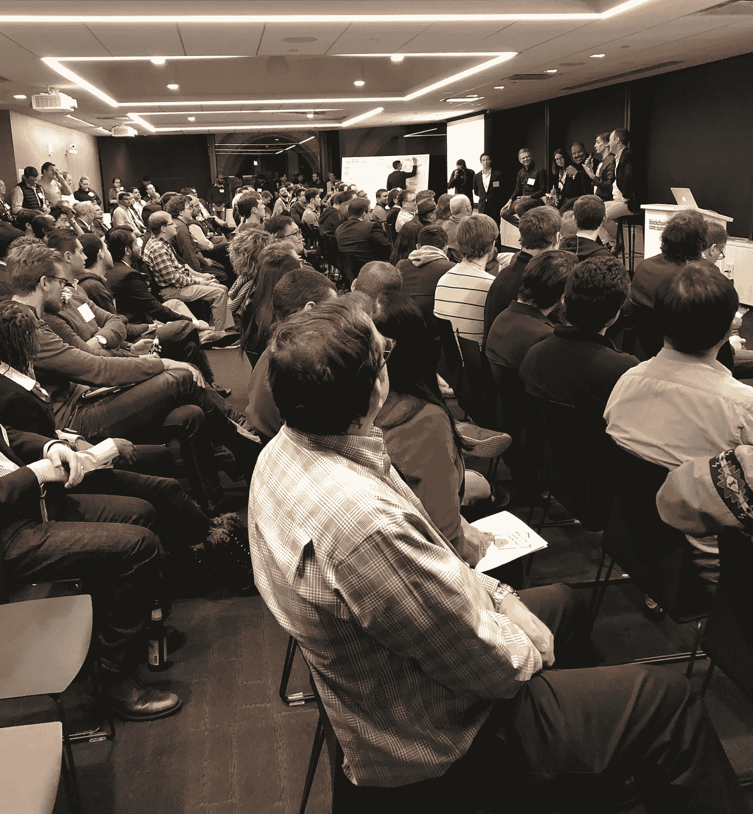

# 参加 15 场区块链活动后我学到了什么

> 原文：<https://medium.com/hackernoon/what-i-learned-after-attending-15-blockchain-events-7fa8c305b3a4>

这与商业无关，许多工程师不同意区块链技术的独特性。

Underscore.VC Blockchain Core Summit — March 22, 2018 — Boston

哇哦。[区块链](https://hackernoon.com/tagged/blockchain)无处不在。

我在企业[软件](https://hackernoon.com/tagged/software)领域有 20 年的经验，但作为一名区块链的新手，我在波斯顿地区参加了 15 场活动(在麻省理工学院和风险投资公司的 4 场不同的全天会议，在麻省理工学院、哈佛的演讲，以及不同的聚会),来自学区块链的应用。加密交易不是我的重点。以下是我学到的东西。

**区块链是“狂野的西部”,由热情的信徒推动**
大多数与会者都非常非常兴奋，每次区块链会议的门票都销售一空。这种强烈的兴奋是由许多密码百万富翁、初创公司通过首次发行硬币(ico)筹集的数百万美元以及对主导供应商和政府权力的强烈厌恶所驱动的。超过 2000 家初创企业在不放弃股权或控制权的情况下，通过 ico 融资 70 亿美元。一些人估计，这些公司中的大多数现在都不活跃，监管机构已经介入，但初创企业融资仍在快速增长。

**这场运动是关于交易和新应用，而不是商业**
比特币和区块链不是关于在线销售。我天真地问许多与会者，他们用比特币购买了什么，只有一个人曾经用加密货币购买过任何东西。没有一个付费会议提供使用比特币支付的选项。事实上，在过去一年中，接受比特币的在线商家数量有所下降。

**区块链技术非常新颖和原始**
大多数非加密交易应用程序都是使用领先的区块链应用工具以太坊构建的。这项技术目前非常慢，交易成本高，用户体验非常繁琐(私钥和浏览器钱包插件)。许多人都在努力改善这一点，但至少在 12 到 18 个月内不会有改善。在推出时，一个名为 CryptoKitties 的简单游戏使用了以太坊网络的 15%，这导致一些交易需要三十个小时才能完成。

**区块链只是数据层的创新**
区块链并没有给用户体验或物理设备(笔记本电脑或手机)带来新的客户价值。区块链应用程序由专有的 web 应用程序构建而成，该应用程序与区块链进行交互，以实现防审查、易于审计的数据存储。

很少有人能解释区块链技术的独特性
这是最令人惊讶的发现。技术社区对区块链在非交易应用方面的独特性表达了强烈的怀疑(Kai Stinchcombe 的两篇文章(分别发表在 12 月的和 4 月的)和 Clemens Vasters 的[帖子](https://twitter.com/clemensv/status/987266940887535616)对区块链提出了批评，基本上没有受到质疑)。我发现在业务方面有许多热情的信徒，但在技术方面却少得多。

**消费者应用是学习的好方法，但还不够吸引人**
目前，除了加密交易之外，还没有杀手级的区块链应用。我尝试了几个正在运行的消费者区块链应用程序，包括 Peepeth(类似 Twitter 的微博)、CryptoKitties(数字猫游戏)、LBRY(“YouTube 的区块链”)、Graphite(工作处理)和 dock . io(“Linkedin 的区块链”)。这些早期的应用程序是学习的好方法，也是对早期团队工作的肯定。为了换取不可变数据事务的好处，每个用户事务都有实际成本(我用 Peepeth 为每个帖子支付了三到八美分)，更新公共区块链需要四到十分钟。随着时间的推移，用户体验和速度会提高，但每次交易的费用可能不会。

**大公司正在试验私有区块链应用**
一些大公司，如沃尔玛和摩根大通，正在测试私有区块链在供应链和公司间的应用。虽然其中一些私人应用前景看好，但关于区块链技术独特优势的问题依然存在。

总的来说，我发现现实并不符合所有的宣传，但防审查功能和低信任度参与者之间的数据存储的好处值得更多的实验。我计划作为一个“好奇的怀疑者”继续关注这个领域。

*Paul Baier 在四家风投支持的公司拥有 20 年的企业软件经验。他在哈佛商学院获得 MBA 学位，毕业于凯尼恩学院。他与任何区块链公司都没有关联，并且拥有不到 1000 美元的 BTC 股票。*

**保罗参加的区块链活动**

*   3 月 22 日:(全天)[下划线. vc 区块链核心峰会](https://underscore.vc/blockchain)
*   4 月 5 日:[algrand:由 IEEE 发起的麻省理工学院的真正分布式分类帐](https://www.csail.mit.edu/event/algorand-truly-distributed-ledger-0)
*   4 月 10 日:LoopRing 创始人丹尼尔·王在麻省理工学院比特币俱乐部发表演讲
*   4 月 15 日:(全天)[由 IDEAS 赞助的波士顿区块链节](https://www.ideassn.org/boston-2018/blockchainfest/)
*   4 月 17 日:麻省理工学院比特币俱乐部会议
*   4 月 23 日:(全天)[麻省理工科技评论的区块链商业](https://events.technologyreview.com/presents/business-of-blockchain/2018/)
*   4 月 24 日:[Hubspot 的区块链崛起](https://www.eventbrite.com/e/the-rise-of-blockchain-cryptocurrency-tickets-42869184886#)
*   4 月 24 日:[新英格兰风险投资简报:区块链和 ICOs](https://newenglandvc.org/event/nevcas-vc-briefing-blockchain-and-icos/)
*   4 月 24 日:[建立区块链公司](https://cic.com/new-events/2018/4/24/building-a-blockchain-company-ecosystem-boston-blockchain-week)，3 位高管组成的小组
*   4 月 25 日:场外早餐:[合格投资者策略](https://www.bostonblockchainweek.com/events/2018/4/24/flipside-crypto-intro-to-crypto-investing)
*   4 月 25 日:[IDEO 设计区块链未来或 ICO](https://www.eventbrite.com/e/designing-for-a-blockchain-based-future-tickets-43691420214#)
*   4 月 26 日:(全天)[(关)柱子顶链](https://www.bostonunchained.com/)
*   4 月 27 日:[区块链上的身份和隐私](https://www.eventbrite.com/e/identity-and-privacy-on-a-blockchain-tickets-44651334343#)
*   5 月 7 日:[在麻省理工学院与 CryptoKitties](https://www.eventbrite.com/e/fireside-chat-with-cryptokitties-tickets-45402690670?utm_campaign=order_confirmation_email&utm_medium=email&ref=eemailordconf&utm_source=eb_email&utm_term=eventname#) 的首席技术官进行炉边谈话
*   5 月 11 日:(全天)[区块链+AI+人类](http://blockchaininaction.org/)在麻省理工学院媒体实验室