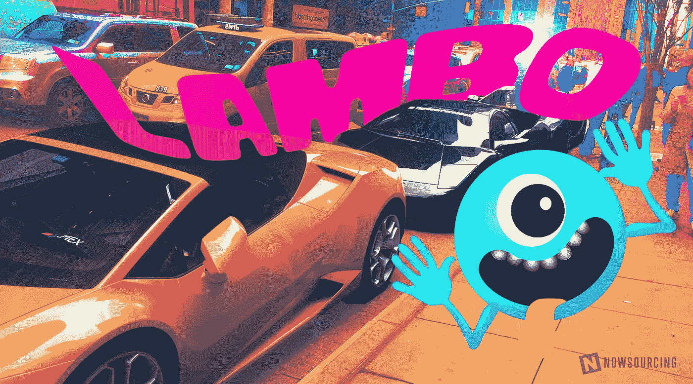

# 我在 BlockchainWeekNYC 的共识中学到了什么

> 原文：<https://medium.com/hackernoon/what-i-learned-at-consensus-at-blockchainweeknyc-f8bf9e7852b1>

Yes, there were lambos.

## 这里有一些有前途的技术。

是到纽约的时候了。不仅[共识](https://www.coindesk.com/events/consensus-2018/register/)正在发生，而且还有许多其他加密货币和区块链事件同时发生，而且不全是关于兰博基尼的。基本上，如果你认识世界上任何地方的人，在区块链附近的任何领域工作，你很可能会碰到他们。那一周，我花了大部分时间讨论共识，以下是几个亮点:

*   [盐](https://saltlending.com/)正在以一种大的方式解决一个大问题。许多拥有大量加密货币投资组合的人极度缺乏现金——如果你不愿意获得任何资本，成为账面上的百万富翁对你没有多大好处。Salt 正在提供一个贷款平台，借款人可以将加密货币作为抵押品，让他们可以将有价值的投资留在原地。
*   Yinc 有可能通过加密货币将评论货币化，同时在区块链上存储工作证明和基于支付的评论，使其可验证，从而彻底改变服务提供商的评论。
*   Intercoin 正在创建开源系统，为任何类型的社区制作本地加密货币，从度假胜地到国家或民族。这将对加密货币的可持续性和可用性产生重大影响，因为它将限制共识规模，从而消除在老一代加密货币交易上花费的时间和精力。
*   [Cprop](https://cprop.io/) 旨在通过消除对信任的需求来改变房地产业务，同时确保记录不变。这将是稳定世界上由于政府腐败而经常发生土地纠纷的地区的重要一步。
*   [Loyalcoin](https://loyalcoin.io/) 正致力于简化忠诚度计划，并通过将一切组织到一个应用程序中并允许奖励的数字转移，使其对消费者更具功能性。

区块链及其相关技术确实在快速发展，这些创新的企业解决方案就是证明。你认为我还需要检查其他基于区块链的技术吗？下面给我留个评论吧！