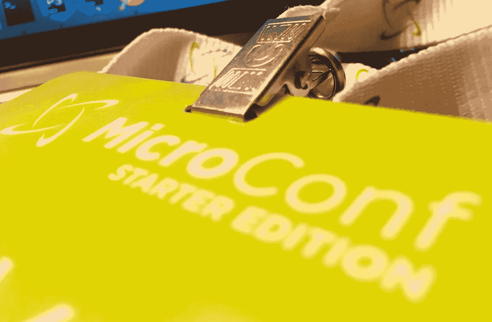

# 我在 MicroConf 2018 学到的

> 原文：<https://medium.com/hackernoon/what-i-learned-at-microconf-2018-62cc3817e2d6>

> *[……]因为我们知道，已知有***；有些事情我们知道我们知道。我们也知道有***；也就是说，我们知道有些事情我们不知道。但也有* ***未知的未知****——那些我们不知道我们不知道的。[……]后一类往往是困难的。***

**去年年初，我开始从事一个兼职项目，从零开始创建一个 websocket 服务器。我想知道为大规模的数百万并发连接提供服务的技术限制是什么。好吧，我找到了我的答案，同时我也发现了一些需要解决的额外问题。最终的结果是 [recv.io](https://recv.io/) (receive eye oh)，一个全球分布的发布/订阅网络，不会丢失你的消息。**

**那年晚些时候，我决定辞去工作，全职专注于 recv.io。我知道这是老生常谈，但还有一整篇博客帖子说明了为什么辞职是正确的选择。为了准备从开发人员到创始人的转变，我决定分析一下[不]知识。**

*   **我知道如何制造产品**
*   **我不知道如何创建或运营一家公司**
*   ****未知的未知:**关于建立和运营一家公司，我不知道具体有哪些我不知道的。**

**对于已知的未知，有许多可用的资源。我尽可能多地阅读独立黑客网站上的创始人故事和论坛帖子。我将自己推出舒适区，寻找关于[营销](https://hackernoon.com/tagged/marketing)和[创业者](https://hackernoon.com/tagged/bootstrappers)财务策略的文章。是的，我从这些资源中学到了很多。但是这个等式中还缺少了一些东西。一个隐藏的变量，代表了我知识中的一些无形的差距。后来偶然发现了 MicroConf，一拍即合。我缺少的是*人类*元素。**

# **什么是 MicroConf？**

**直接来自他们的[网站](https://www.microconf.com/):**

> ***全球最小的自费软件公司的全球最大会议***

**基本上，它是一个让“自举”软件公司(主要是 SaaS)的创始人见面、分享他们的知识和经验、互相帮助和支持的地方。**

**我还是不太记得是怎么找到的。可能是黑客新闻或者只是随机搜索。但是当我一消化它，我就知道如果有一个地方可以发现那些未知的未知，那就是这里。这有点贵(尤其是对一个创业者来说)，但在互联网上体验了一会儿后，几乎一致认为这种体验是值得的，无论是对于讲座还是讲座之间的“走廊通道”，在那里你可以见到其他与会者和演讲者并与之交谈。**

**于是，我订了 5 月 1 日—3 日的首发版机票，再也没有回头。**

**事实上，正如承诺的那样，会谈和走廊轨道都非常值得一游。你可以在这里找到完整的演讲者名单和他们的演讲笔记。**

**以下是我在那里学到的一些经验。请注意，其中夹杂了一些未经编辑的谈话内容。这是为了避免过于关注“谁说的”而不是“他们说了什么”，但如果你恰好是我引用的演讲者之一，并希望得到认可，请让我知道。**

# **第一课:这不仅仅是关于产品**

***“我想为谁服务？”***

**像许多其他与会者一样，我对我正在建设的东西充满热情。如果我不是百分百支持的话，我是不会辞职的。作为一名开发人员，recv.io 想要解决的问题既具有挑战性，又令人兴奋，而且非常有用。这种激情是我开发它的动力。**

**但是，当你开发一个可以用来创业的产品时，对产品的热情是不够的。这是关于你想要吸引的客户类型，每天醒来都知道你的业务是围绕着为他们服务而建立的，以及这种想法是否会让你快乐和满足。**

**此外，用新的特性和功能来推进你的产品应该总是以不断帮助你的客户解决他们的问题为中心。*我想为谁服务？*这个问题能够验证你的产品从第一个版本到最后一个版本。**

**想要放弃你的日常工作，在你讨厌的事业上建立一种全新的生活方式是没有意义的，对吗？你的工作应该继续是一件苦差事，还是应该成为成就感的来源？**

**对于 recv.io 来说，答案显而易见。我为开发人员和团队构建这个，让他们的生活更轻松。将他们的难题转化为解决的问题。对此我感到很满足。**

# **第二课:建立受众**

***“在互联网上有用”***

**这是你经常听说的事情之一，看起来很明显，但是它的重要性似乎被像我这样的人所忽略了(孤独的开发人员倾向于避免社交，即使是在互联网上)。**

**这是我最初的发布策略:**

1.  **打造出色的产品**
2.  **发布产品搜索+黑客新闻**
3.  **祈祷它能像病毒一样传播**
4.  **???**
5.  **利润！**

**这几乎是一种“赢得彩票”的策略，我怀疑许多其他人也相信这种策略，当然，他们中的大多数人都感到失望。**

**但是，如果我已经有了一份清单，上面的人我有合理的把握会对我的产品感兴趣，并且足够信任我，不仅会听我的话，还会尝试我的产品(任何人甚至可能会为我的产品付钱)，那该怎么办呢？这就是理想，对吧？这也恰好是一个有效的观众的样子。**

**那么你如何建立一个呢？在互联网上有用。**

**创建公众可用的(免费)内容，让**真正**帮助人们。示例包括博客帖子、推文、论坛帖子、邮件列表回复、堆栈溢出答案、Quora 答案、视频教程、播客、电子书等。有许多媒体可供选择。**

**当然，你应该选择最适合情况的媒体。这里有一些关于这方面的小经验:**

# **2.1:坚持自己的优势**

**如果你不是一个优秀的演讲者，不要开始做视频或播客。同样，如果你不是最擅长的，就不要写冗长的博客。例如，我热爱写作，所以博客帖子是一个自然的选择。**

**[亚当·瓦森](https://microconf.gen.co/adam-wathan)也展示了简单、有用的推文是如何帮助你的粉丝数量级增长的。**

**然而，Twitter 让我非常困惑，所以我还不太习惯用它作为媒介。在与因独立黑客而出名的考特兰·艾伦(Courtland Allen)的一次圆桌会议上(他精通建立观众群)，我被鼓励使用电子邮件简讯，直到 Twitter 对我来说变得更加自然。**

# **2.2:了解你的受众**

**你的内容是针对谁的？他们在哪里闲逛？什么样的内容最能引起他们的共鸣？他们的痛点是什么？回答这些问题会告诉你应该创建什么样的内容、呈现这些内容的合适媒体以及分发这些内容的最有效渠道。**

**Patrick McKenzie 在为服务不足的观众创造内容方面也有很好的观点。你的内容不仅可以帮助那些尚未得到帮助的人，而且缺乏竞争也意味着你成为了那些服务不足的社区的事实上的资源。**

# **2.3:制定战略**

**预先考虑一系列话题。每个话题都应该有一个特定的目标:为什么我的观众应该消费这个，我希望他们在消费后有什么理想的反应？您还可以将您的主题与您的产品时间表保持一致，这样新产品或新功能的发布就会被相关内容抢先。**

**有一个主题列表也可以确保你的内容流不会停滞，只要你继续填满主题的缓冲区。一个死去的博客比没有博客更糟糕。**

**我想重申，你的内容应该是真正有用的。采取第 34 街的【T2 奇迹】方法，关心某人的问题，然后为他们解决问题，建立信任，他们会自然而然地接受你的产品，而不是向他们推销。销售是有时间和地点的，但创造有帮助的内容通常不是这样。此外，它让世界变得更美好，即使是逐渐变得更美好。**

# **第三课:与人交谈**

***“给每个人发电子邮件。”***

**这意味着与你的观众互动。一旦你有了客户，也要与他们互动。**

**不要害怕问问题。收集反馈不仅可以帮助您完善产品及其功能，还可以减少客户流失，例如改进入职流程或重新考虑定价。他们还可以在开始新产品之前帮助验证想法和假设。**

**问题也打开了更好地理解你的观众/客户的大门，这反过来可以帮助你创造更多相关的内容和产品供他们消费。你也可以通过分析你的回答来创建细分，从而更清楚地了解到底是谁在听你说话。这些数据中可能有你没有预料到的部分。然后，您可以使用这些信息来寻找适合您的细分市场的新渠道，以收集更多的成员。**

**这一课不仅限于你邮件列表上的人。冷冰冰的给潜在客户发邮件并不像看起来那么可怕。发送给社交媒体影响者的正确电子邮件可以帮助你的受众或潜在客户在一夜之间增长几个数量级。向每个人发送电子邮件。**

**当你给别人发邮件时，尽可能多写些关于收件人的内容。尽可能个性化。使用明文邮件。让提问尽可能简短明了。如果是冷冰冰的邮件，记得跟进。**

# **最后的想法**

**我带着满脑子的教训、新想法和策略离开了 MicroConf。是的，说你不需要去参加会议来了解我做了什么是很容易的，事实仍然是这种友好的环境，这种独特的体验，这种知识共享的社交方式使我从一个不知道自己在做什么的想要成为企业家的人变成了一个对自己在做什么有一些想法的想要成为企业家的人。这使得一切都不同了。**

**附注:我要感谢 MicroConf 的所有演讲者(他们都让我受益匪浅)，感谢所有我与之交流想法和反馈的与会者，还要特别感谢启动实验室的 Josh Ledgard，他在 recv.io 的登录页面上给了我非常有用的反馈。**

**肖恩**

***最初发表于*[*【shaunasaservice.com】*](https://shaunasaservice.com/blog/what-i-learned-at-microconf-2018)*。***