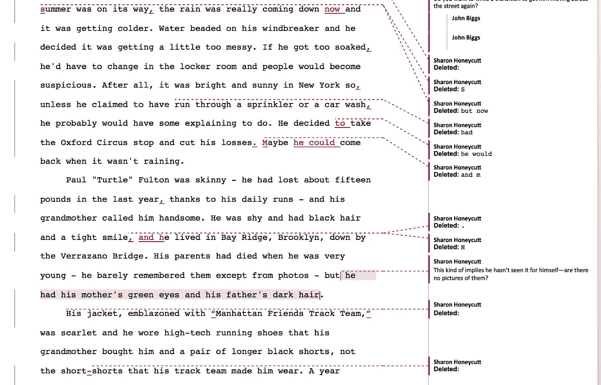

# 编辑你的作品让我学到了什么

> 原文：<https://medium.com/hackernoon/what-i-learned-editing-your-writing-161f03b04149>

Photo by [Thomas Martinsen](https://unsplash.com/photos/4H9IuFBIpYM?utm_source=unsplash&utm_medium=referral&utm_content=creditCopyText) on [Unsplash](https://unsplash.com/search/photos/red-pen?utm_source=unsplash&utm_medium=referral&utm_content=creditCopyText)

在过去的两年里，自从我和我的妻子创办了 [Typewriter.plus](http://typewriter.plus) 以来，我一直在编辑书籍、博客、手册、白皮书和电子邮件。这是一次疯狂的旅行，我被人们对这项服务的兴趣淹没了。我们编辑了一本关于为什么在挪威生活很棒的书，发布了宣布大规模消息系统重大升级的博客帖子，我们甚至为一家大型软件公司的一个独特项目采访了一些出色的软件工程师。简而言之，我已经能够看到各种写作、写作风格和技能水平，并且我已经发现了一些关于我所选择的职业的事情。首先，坏消息是…

1.  **文字正在消失……但没有我们想象的那么快。我是文字的坚定信徒。我每天都在写作，为此我一直心存感激。但是我担心，就像《永无止境的故事》中的虚无一样，一场风暴即将来临，它会把书写的文字夷为平地。**

问题？我们人类不喜欢读书。当然，你们中有很多人根本不同意这一点，但随着我们离印刷文字越来越远，我们会发现自己消费的视频比文本更多。YouTube 之所以受欢迎，是因为它正在迅速取代电视成为我们的日常活动，而且，如果我们要让所有关于事物的 [*娱乐至死*](https://amzn.to/2KsZ8mT) ，人类的大脑仍然首先渴望视觉刺激。但是，来自视觉网络的大量视频是压倒性的。能看的时候为什么要读书？

也就是说，我们可以通过支持和奖励伟大的作品来阻止这种情况。我一直知道写作是困难的，但大规模写作是一项困难的工作。我最近同时订阅了《华尔街日报》和《华盛顿邮报》,并且无论在哪里看到网站，我都会尝试付费订阅。我想奖励好的、认真的写作，如果我们不想让书面文字消亡，我们都需要参与进来。永远不要低估人们对优秀作品的渴望。过去几个世纪，正是它让我们度过了黑暗时代，只要我们支持它，它将继续这样做。

2.好的写作可以成就一个产品，也可以毁掉一个产品。我合作过的一个客户对他们的应用程序进行了大量的修改。他们试图用简单的英语解释这些变化，但他们不能正确地表达。这些变化令人印象深刻——想想数百万用户受到影响——但他们无法解释新版本的重要性。

清晰、简洁的解释是最好的，但你在写作时也必须人性化。网站文案或者一篇博文不是一套立体的指令。它是一份活文档，是您与客户接触的第一道防线。如果写得不好或者编辑得不好，那么你最终会弄得一团糟。

人们喜欢好的作品，他们忽视不好的作品。写得不好，后果自负。

3.教练不仅仅是运动员的事。我一直在帮助大大小小的公司制定媒体和展示计划，我发现每个人——从最大的公司到最小的初创公司——都需要一名教练。我现在实际上通过我自己的服务运行我自己的写作，允许我的编辑评论和修改我写的东西。这是令人谦卑但令人兴奋的，我学到了很多。

看看这个:

这是我最新小说[中经过编辑的一页。我以为这将是一个干净的编辑，但它充满了错误。我那令人惊叹的编辑](https://www.indiegogo.com/projects/nayzun-books-fantasy)[莎伦·霍尼卡特](http://editorsharonhoneycutt.com)，用细齿梳子仔细翻看我的文章。没有她，我的书会很糟糕。每个人都需要那种细心的关注。

4.你需要多写点东西。你需要一天写[1000 字](https://www.linkedin.com/pulse/1000-word-rule-john-biggs/)。我知道这是令人生畏的，我知道这是可怕的，但如果你打算为你的业务或个人生活写点什么，这是必须的。就像他们说的，练习，练习，再练习。

我每天写 1000 多字，但这就是我的生活方式。但是，如果你发现自己卡住了，就写吧。如果你发现自己很沮丧，就写吧。如果你发现你的产品或业务一成不变，就写吧。把它拿出来，修理好，放在外面。与世界交流，世界会回应。

5.**你已经写好了。**不用那么担心。只要你写得像你说的那样，你就会没事。我写作的经验是一次全部倒出来，尽可能写得糟糕，然后回去编辑。我喜欢用 Scrivener 勾勒出我较长的作品，然后我只是填充东西。我这里做了一个[教程](https://hackernoon.com/how-to-write-a-book-2065b6e807d3)。这种非线性编辑让我一次处理几个部分，必要时从一个地方跳到另一个地方。这是一种很棒的写作方式，它帮助我几十年来远离写作瓶颈。

事实是:你已经是一个好作家了。你只需要一点点帮助。无论是我们帮助你还是你的同事在你发货前检查你的作品都是无关紧要的。但是，只要做一点点工作，我们就可以准确地表达我们的意思，这是一个比我们大多数人想象的要重要得多的壮举。

—

需要帮助吗？[给我们打电话](http://typewriter.plus)或者发邮件给我。