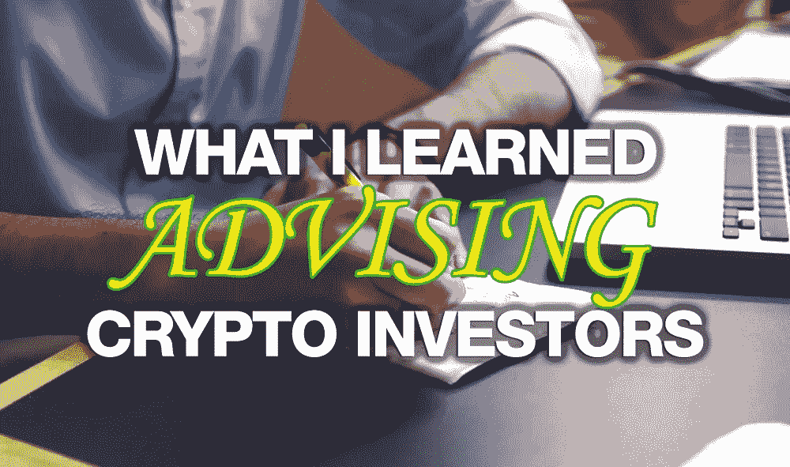
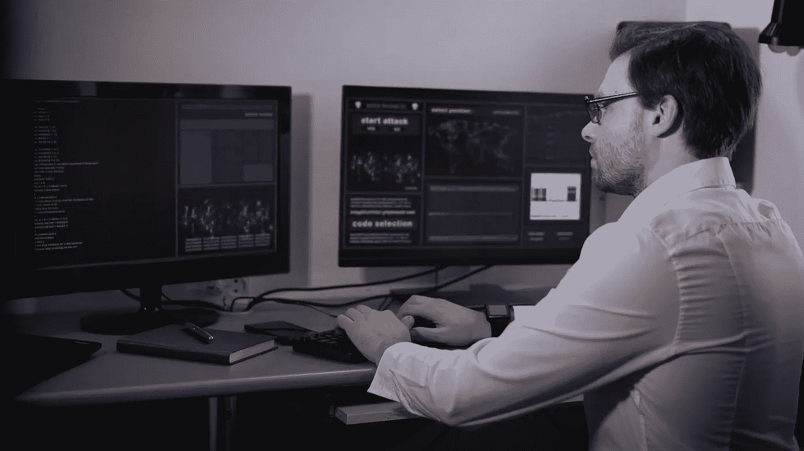
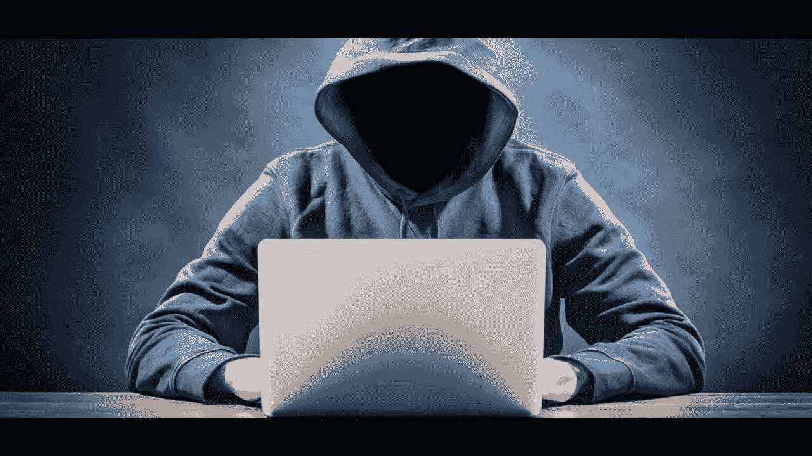

# 我从为加密货币投资者提供建议中学到了什么

> 原文：<https://medium.com/hackernoon/what-i-learned-from-advising-cryptocurrency-investors-e69e2317ffdc>

在 2017 年的加密货币牛市期间，我不断被问及如何参与加密货币。我的投资正以前所未见的速度激增，大多数人只是想尽快进入，这样他们就可以体验类似的事情，我总是很乐意提供帮助。

我很幸运地很早就接触了比特币，至少比大多数人都要早。早在 2013 年，当我想将比特币与我的购物车公司整合时，我联系了一家名为比特币基地的新创业公司，以达成交易，同时试图了解关于这种新货币形式的一切。幸运的是，比特币随着我的兴趣一起成长。

我在金融行业工作了近 15 年，非常专注于股票和期权，同时有幸与一些业内最好的场内交易者共事。但是加密货币是新的，令人兴奋的，并且它们在每个转折点都慢慢地获得了更多的动力。直到 2017 年，当训练轮离开时，人们第一次开始意识到区块链技术实际上可以做什么。

起初，只是我的朋友寻求帮助，但大约在年中，我的期权研究公司开始收到大量加密货币培训的请求，以及一个大问题:**购买哪些加密货币？**

在研究了近一半的加密货币，采访了一些出色的工程师，与其他金融专家交谈，并有了理解颠覆的背景后，我已经能够在这个领域取得巨大的成功，如果我是为自己做研究，我也可以与其他人分享，所以今年早些时候我创办了网站【CryptoInvestingInsider.com 来帮助其他人了解加密货币投资，我个人投资的内容和原因，以及在考虑投资特定区块链时应该寻找或避免什么。

在区块链投资并不适合每个人，但这里是我在这个领域取得最大成功的三个秘诀。

# **1。** **大多数人不喜欢自己做研究或投资**

当谈到其他类型的投资时，人们可以通过一些途径来避免对他们投资的东西花太多心思。购买管理型共同基金、ETF，甚至只是把钱交给经纪人或基金经理，让他们为你做所有的工作。大多数人都可以接受，即使费用很高，这样他们就不用自己做了。

问题？没有人比你更在乎你的钱。人们很忙，不想为可能令人困惑或难以学习的事情而烦恼，但这是一个痛苦的教训，大多数人没有意识到这将使他们多年来付出高昂的代价。

不幸的是，或者幸运的是，取决于你如何看待它，当涉及到加密货币投资时，除了自己做，没有其他选择，这导致要么猜测投资，要么找到真正投入时间来寻找那些获胜机会的人。一些区块链是彻头彻尾的惊人项目，我希望在短短几年内就能赚到 10 倍的钱，这可能是一个保守的估计。重点是——猜测不是一个人应该参与的投资策略。

# **2。不要被骗**

随着越来越多的政府打击行动继续进行，越来越少的诈骗项目进入市场，但一旦我们感到安全，不再寻找或担心可能的诈骗，我们就可能会上当受骗。去年，我的一位值得信赖的同事向我推荐了一款名为 AriseBank 的新 ICO，但我并没有被 AriseBank 的炫目光芒和承诺所吸引。我建议我的朋友不要投资。对于初学者来说，这似乎是一个太大的项目，没有增加，如果有些事情看起来好得不像是真的，它可能是真的，但这些不是唯一的警告信号。

首先要找的是谁是这个项目的幕后黑手。他们有经验吗？他们的简历能保证这样的项目吗？他们熟悉区块链吗？他们的团队中有声誉好的顾问吗？发现大多数加密货币投资者甚至不评估核心团队，这可能会令人震惊。只要在谷歌上简单搜索一下 AriseBank 的主要成员 Jared Rice，就会发现他不值得信任。

团队中缺乏真正的人才通常会受到名人推广者的攻击。虽然名人执法在技术上没有任何问题，但这并不意味着什么。一个名人真的知道一个项目是否有价值吗？不要！这只是一面红旗。伊万德·霍利菲尔德支持 AriseBank ICO，说够了吧！

研究社区，看看谁参与了这个项目。他们的合作关系建立了吗？他们的监管文件有记录吗？如果该项目是一个真实的项目，它可以通过一点研究来验证。在 AriseBank 的案例中，他们什么都没有做，没有合伙，没有备案，什么都没有！不幸的是，由于缺乏尽职调查，所有投资者都损失了资金。

# **3。教练是为任何想擅长任何事情的人准备的**

有些人会接受辅导，有些人拒绝承认自己需要帮助。教练不仅仅是为运动员服务的，也是为那些厌倦了艰苦道路，想要比他们自己更快好起来的人服务的。事实上，我认识一个人，他报名参加了如何泡妞的培训，他只是厌倦了出局。当他不在的时候，我们可能会窃笑一两声，但尽管如此，他还是在不久后给自己找了一个漂亮的女朋友。

我多年来一直在指导投资者，首先是期权交易，现在是加密货币投资，我注意到的一件事是，每个人在有教练的时候都会更成功。那些想要在更高水平上竞争的人最需要教练。无论谁在奥运会上赢得金牌，都无疑是他们所做的事情中世界上最好的，你猜怎么着？他们有教练。我认为自己非常擅长追踪成功的投资，但即使是我也是围绕着业内我尊敬的其他人来运作想法，而且新的观点引起我的注意并不罕见。

坏习惯很难改变。最好是学会如何以正确的方式做事，并从一开始就获得成功，而不是在艰难困苦中学习，尤其是在金钱方面。

如果你知道要寻找什么，选择优质的加密货币项目并不困难。大多数人只需要一点指导，一旦他们明白了选择投资项目的关键因素，一切就都明白了。事实是，我们是一个应该互相支持的团体，当我们中的一个人赢了，我们就都赢了。

-

有问题吗？联系我或者给我发电子邮件，地址是 CryptoInvestingInsider.com 的克里斯