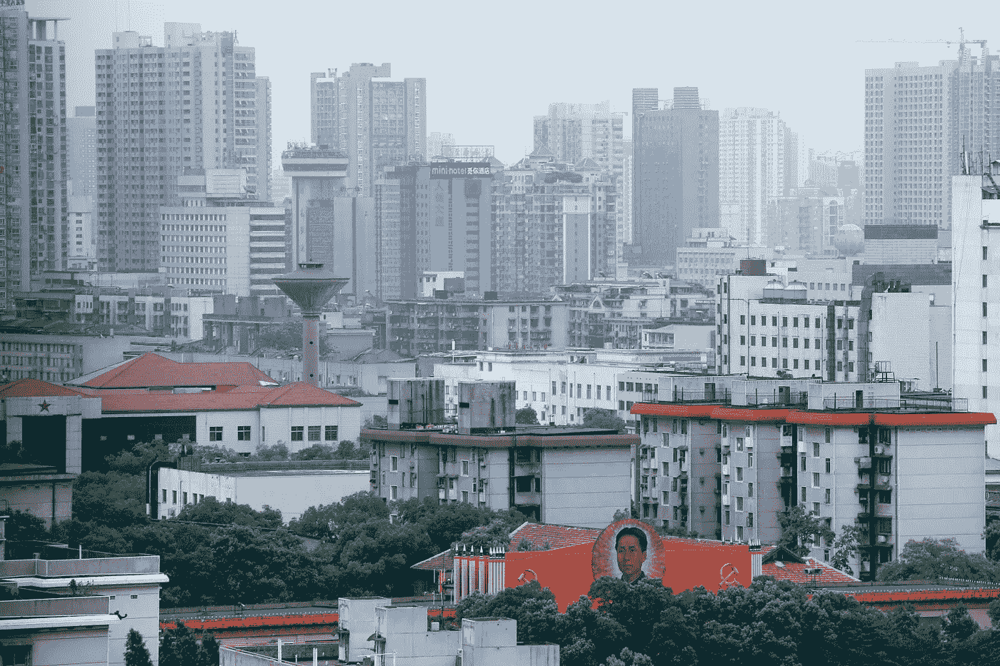

# 我从为 3 家中国区块链初创公司工作中学到了什么

> 原文：<https://medium.com/hackernoon/what-i-learned-from-having-worked-for-3-chinese-blockchain-startups-ce8f56a10372>

My hometown city of Changsha, home to China’s sixth Blockchain Industrial Park and first blockchain safety testing center. Getty images

中国以其对国内加密货币市场的强硬立场而闻名，尽管它对 T2 区块链 T3 技术领域持积极态度。在过去的一年里，我在中国为 3 家区块链初创公司工作，见证了这个重视在先进技术方面领先的国家整个行业的繁荣。

进入一家拥有“双重身份”的政府支持的区块链公司，是一次超级怪异的经历。在一个完全不关心技术本身的极端加密驱动的市场中，有社区建设的惯例。发现一个伟大的团队真正关心推动区块链前进，这也是一种巨大的喜悦。

在这个政策限制重重的国家，这个新兴行业的混乱场面中，人们总是带着持续的怀疑、困惑和偶尔的惊喜。然而，这种经历本身与大多数人从局外人的角度所想象的完全不同，我从这次旅程中学到的教训很少，这些教训反过来可以成为我想与他人分享的有用建议。

我们走吧。

# 成为一家区块链公司并不意味着拥有“区块链思维”

创建一家区块链初创公司至少在某种程度上意味着，创始人团队相信技术可以创造未来，或者对世界有一个愿景，而技术是其中的一部分。人们可以很容易地感觉到，一家公司是生活在未来，开拓新的领域，还是停留在过去，强化过时的东西。这通过公司的文化、公司的使命宣言以及公司雇佣的一群人来表达。

任何人都可以用优秀的技术团队建立一家区块链公司，但如果你没有与改变世界的技术相对应的积极主动、充满激情和积极的心态，你将很难让人们相信你正在做的事情确实会改变世界。

我曾在一家非常有声望的区块链公司工作过一段时间，该公司有国防技术背景，项目本身也得到当地政府的支持。这实际上使其成为区块链 R&D 科技领域最具竞争力的公司之一，不仅是在中国，而且是在全世界。我知道这将是一个很好的平台，让我可以利用我的技能帮助公司将业务发展到全球水平。但后来，我意识到，尽管该公司拥有区块链最强的团队之一，但它也面临着许多中国老牌初创公司所面临的问题——官僚主义。

你可能会问:区块链的初创公司怎么会是老古董？或者甚至是一个初创公司怎么可能本质上是官僚主义的？

答案并不像问题看起来那么复杂。我来给你解释一下。该公司强大的技术背景可不是闹着玩的。据我所知，他们的技术团队拥有全球区块链领域最多的博士和硕士。还记得我说过这家公司的声誉吗？这些技术人员在一所中国军事国防技术大学有着近乎严肃的背景(出于显而易见的原因，我不会透露姓名)。所以我要说的是，他们的技术资质是可靠的。

然而，正是这种背景使得这个团队缺乏在美国车库创业中更自然地发现的敏捷性、严谨性和兴奋感。一家美国区块链初创公司可能会羞于展示他们的技术实力，但他们的激情、贪婪和对成功的渴望是多年来保守的政府层级塑造的官僚、高调的对手所无法比拟的。

他们很可能在技术资质上更胜一筹，但在区块链这样一个快速发展的领域，激情和敏捷胜过了繁琐的官僚主义。几天前，我查看了他们的社区，嗯，除了付费的追随者，他们的社区没有移动一英寸。

***第一课*** : **在区块链这样的新兴领域，你可以拥有世界上最合格的科技团队，但如果没有激情和愿景做后盾，你是无法击败竞争对手的。**

# 你正在建立一个区块链公司，来吧…让它全球化！

区块链技术本质上是去中心化的。它应该打破边界和限制性政策等人为障碍。如此多的区块链初创公司能够在如此短的时间内席卷全球受众，这对于传统互联网领域来说是非常新鲜的。传统互联网公司在向国际市场扩张时通常不得不面对政府的限制，因此往往会输给当地的竞争对手。然而，就技术本身的本质而言，区块链公司可以在更少限制的情况下在全球范围内发展。

一家区块链初创公司需要在全球范围内建立一个由开发者、粉丝和用户组成的应用、加密货币和技术社区，如果他们想充分利用这项技术的话。

然而，对于许多中国初创企业来说，这并不是一个非常熟悉的概念。我见过许多中国区块链初创企业陷入了增长悖论——他们希望扩大自己的社区，但又不想进行全球扩张。这两者并不相互排斥，但这显然是一种抑制宏大思维的思维模式。

此外，这里还有一个文化障碍。也就是说，需要更高水平的商业透明度，而中国的创业公司不习惯提供这种透明度。在自由民主的西方市场，商业透明度是一种有根有据的做法。然而，大多数中国公司缺乏这方面的专业知识和文化意识。我见过许多中国区块链初创公司，它们局限于国内市场，没有足够的海外运营文化意识。他们不知道“透明”意味着什么，也没有人力资源来实现它。这听起来可能会让你感到惊讶，但在中国区块链初创公司中使用 Twitter、Medium 和 Reddit 等全球社交媒体只是最近的现象。中国区块链空间对这方面的人才有巨大的需求。

因此，我们更经常看到西方区块链初创公司进入中国市场，而不是中国区块链公司面向全球受众。

在我最近工作的公司里，我看到了这种文化障碍的影响。我在西方和中国都呆过，我不得不反复向我的老板和同事强调文化意识和与社区保持透明的重要性。更重要的是，我竭尽全力确保它在我们的产品和与我们社区的交流中得到严格执行。这需要很多时间和耐心。

好的一面是，它结出了果实。现在，我们看到中国越来越多的区块链社区越来越多地参与全球活动。我可以看到，区块链西部的初创公司正不知疲倦地向全球扩张，而他们的中国同行在思维和实践上仍然停留在本地，这种情况已经不复存在。越来越多的区块链行业先驱表示，中国区块链初创企业不再满足于其已经庞大的国内市场，而是与国际社会携手解决全球问题。

我们看到 EOSForce [在 EOS 区块链](/@eosforce/bridging-the-chasm-between-eastern-and-western-block-producers-286141bbdd24)上解决区块生产商勾结问题，我们看到[华人社区参加全球 BP 峰会](https://www.cryptofinance.no/)。

这是进步。这就是区块链技术应该被使用的方式。

***第二课*** : **走向全球，区块链的技术在全球范围内使用要比限制在一小群几乎没有透明度的人身上有效得多。**

如果你问我在过去 3 家区块链公司的经历中，在创业和区块链空间方面学到了什么最有价值的经验，以上是最重要的。但是也有无数的小教训让整个旅程变得更有价值。比如:

*   建立联系——区块链空间很小，很可能只需要一两个朋友就能把你介绍给那个能给你想要的机会的人。所以不要害怕认识新的人。
*   不要害怕展示你的才能——这绝对是帮助我更快成长的最有用的技巧之一。由于区块链只是一个新兴产业，有一个巨大的人才库等待填补。如果我在向人们展示我的技能和才华时犹豫不决，我就不会有机会在过去的一年里获得这三份工作，也不会对中国乃至全球的区块链空间有所了解。
*   忠于你自己的愿景——在区块链这个领域，有太多的事情正在发生。那么多有自己梦想的人。如果你面临一个好机会，但它没有带你去你想去的地方，你可以说不。继续寻找，不要停留。只要你坚持努力，心中有目标，你就会成功。区块链空间足够小，但同时又很大。

… …

以上是我在过去的一年里，在中国区块链太空这个动荡的世界中所学到的一些经验。你怎么想呢?是否反映了自己的经历？请在下面发表您的评论。我很想听你的故事！

## 我是谁？

**我的名字是 JC。我是一名在中国的区块链营销人员。我在区块链和加密领域工作了一年多，现在正在帮助中国和西方企业进行全球扩张。在那之前，我是一名社交媒体影响者，向人们传授加密货币和区块链。除此之外，我喜欢写区块链和密码。**

随时联系我在 [**推特**](https://twitter.com/jc_zhang_)**:****@ JC _ Zhang _
邮箱:**

~ ~ ~ ~ ~~ ~ ~ ~ ~ ~ ~ ~ ~ ~ ~ ~ ~ ~ ~ ~ ~ ~ ~ ~ ~ ~ ~ ~ ~ ~ ~ ~ ~
我以前的文章:
[为什么加密梦想行不通，就目前而言](https://hackernoon.com/why-the-crypto-dream-does-not-work-for-now-f561fc21784)
[从最流行的基于加密的应用](https://hackernoon.com/lessons-from-the-most-popular-crypto-based-application-9f926798da29)
[中吸取教训 ShapeShift 会员制背后的经济学倒退](https://hackernoon.com/the-economics-behind-shapeshifts-membership-backpedal-bfe524567f71)
[让中国成为全球最大的区块链市场](https://hackernoon.com/state-of-decay-and-opportunity-a-constructive-approach-to-blockchain-development-in-china-a83f3513a58f)