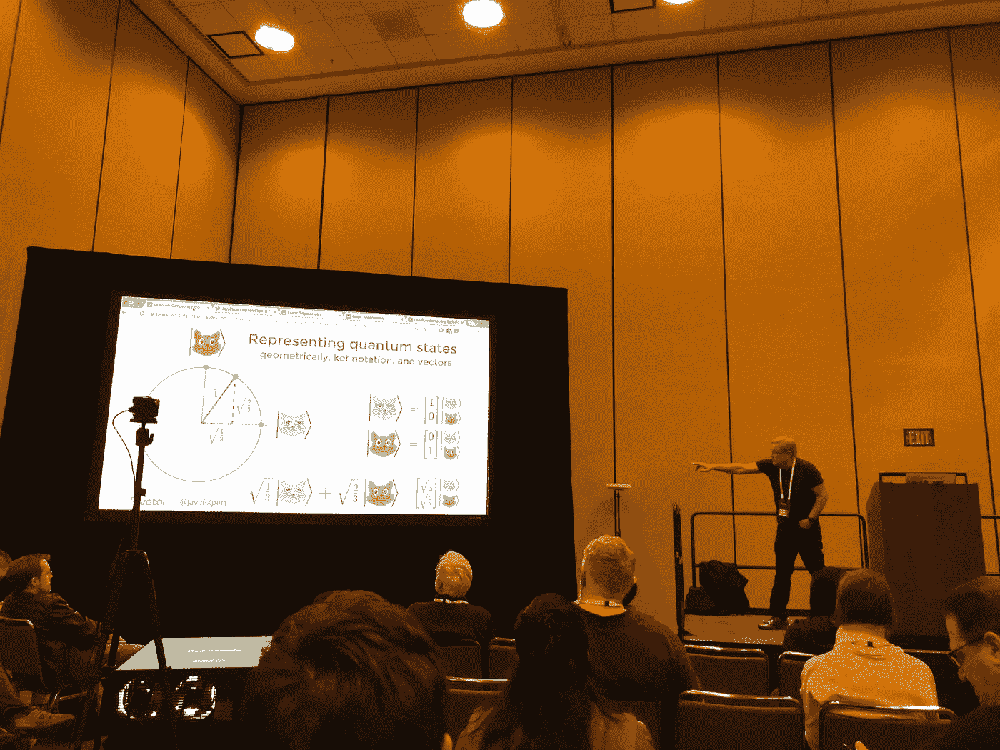

# 我从指数会议中学到了什么

> 原文：<https://medium.com/hackernoon/what-i-learned-from-index-conference-9a34d80c8177>

今天是星期五，我认为星期五是假日。一年只有 52 个！我感觉好极了。早上做了一次很好的锻炼，现在我正在分享我在 CONF 指数中学到的一些惊人的事情。所以，让我们进入正题。[指数发布会](https://developer.ibm.com/indexconf/)我最喜欢的部分。免责声明:这将依次涵盖公众演讲、和其他随机想法。

James Weaver a.k.a. JavaFXpert using cats to represent quantum states

# 和 CATS 一起学习量子计算

是的，你没听错。詹姆斯·韦弗或[设计文档](https://medium.com/u/7487ef242d34#)。这种整合的影响是巨大的！这意味着已经在以太坊平台上编写的智能合同可以被移植到一个私有的商业网络区块链中使用。不仅如此，如果你已经习惯于在以太坊平台上编写智能合约，并希望使用 Hyperledger 创建一个应用程序，你可以简单地将这些智能合约迁移过来。我真的很兴奋地看到这个概念证明将走向何方，以及其他人将用它来构建什么。

好了，时间不早了，我真的很想享受我的周五之夜，所以我不得不长话短说了。我只想以这样一个事实来结束我的演讲，即 Index Conference 的一些最令人难忘的部分是对话。仅仅因为你没有参加会议，并不意味着你错过了。不管怎样，我要享受假期，为下周充电。Horea 区块链出。Horea 乒乓在！