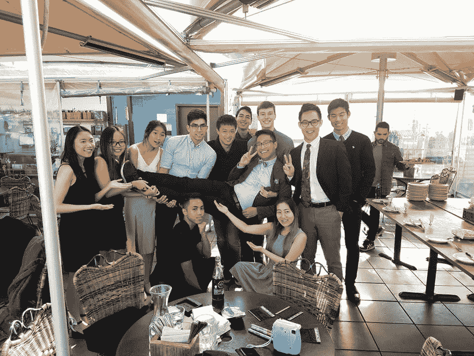

# 我从高盛和 Yelp 的实习中学到了什么

> 原文：<https://medium.com/hackernoon/what-i-learned-from-internships-at-goldman-sachs-and-yelp-b37b9ee53d43>

Yelp Headquarters at 140 New Montgomery Street: you made it here, now what?

这篇文章是给你们这些实习医生的。首先:祝贺你！你可能非常努力才取得今天的成就。然而，就像进入大学一样，你的录取通知书只是一个开始。现在你需要进行一次成功的实习。下面，我根据之前在高盛和 Yelp 的实习，整理了一些关于如何成功的想法。

这里有一些唾手可得的水果给你。不要错过站立或会议，不要问容易被发现的问题，诚实地努力实现你的估计！

# 设定期望并坚持到底。

你去实习。久而久之，你可能会不知不觉地养成坏习惯。也许你开始错过一些站立。也许你会在下午和你的实习朋友喝咖啡休息很长时间。也许你在会议上对别人变得麻木不仁了。你的项目好像没有方向，不知道该怎么办。你的团队注意到了，但是没有人说什么或者命令你改变，所以你没有。在实习期结束时，你的导师抛出了一个惊人的消息，你将不会得到一份回报。

不要让这种事发生在你身上！积极主动，不断寻求对你表现的反馈。根据你公司的结构，最大限度地利用你和你的经理/导师一对一的时间。明确地告诉那些对你的地位有发言权的人，告诉他们你的目标是得到一个回报。然后和他们一起工作，按照让你达到目标的速度进行专业发展。

具体来说，这意味着在每次进度会议上，讨论您的成长和需要改进的领域，并贯彻上次会议的行动项目。你通过写下会议讨论的内容来记住这些项目。随着你实习的进展，你的行动项目会与你一起成长。例如，早期我的导师指出我在站着说话不清。后来，随着我成为一名开发人员，我的导师要求我承担更多的责任，为我的队友做代码评审。不要因为在整个实习过程中你不知道自己在某个方面有所欠缺而在最后措手不及。

I always make sure to have a legal pad in my work area.

一般来说，把一切都记在笔记本上是有益的。例如，我记录了一天中的进展、难点、问题的答案、会议记录、嘉宾发言记录等。这有助于我在工作中集中思想，并在几个月后向招聘人员展示我的工作时变得非常有价值。

# 你是你团队的一员。

你大部分时间都是学生，所以很容易和你的团队陷入相似的视角。不要把这个当成吹毛求疵的课。你的团队不是给你布置任务的老师，你也不是去勉强及格的。你的团队希望你学习一些东西，但是他们不是来照看你和强迫你做工作的。如果你工作效率不高，他们可能会完全避免正面冲突，干脆不再雇佣你。请记住，你是团队的付费成员，你在那里是因为你想在那里。你越是将自己是队友的想法内化，你的团队就越会接受你。

进一步考虑这个想法，你可能不会得到一个具体的规范去做什么。你应该有想法，所以分享它们并尊重它们。如果你看到另一种做事方式，提出来，不要贬低你的队友。通常，由于缺乏经验，你会错过一些东西。通过尊重地提出想法，对你来说，往坏里说是一次学习经历，往好里说是对你团队工作的宝贵贡献。沟通风格是一种团队依赖的东西，所以和你的导师一起努力，积极寻求改进。

# 超越自我思考。

过去的两个提示都集中在你自己身上。当然，振作起来很重要！然而，这次实习是一个机会，可以让你更多地了解公司和整个行业的运作方式。实习生经常有机会见到高水平的董事和高管，他们喜欢激励下一代人才。这些机会是宝贵的经验，你可以学到很多关于公司如何运作的知识。然而，我的观点是，最相关和最适用的职业指导来自你周围的人——那些最近经历过类似职业转型的人。因此，和你的导师建立良好的关系。他们投资于你的成功，所以你也应该投资于他们。如果你们关系比较亲密，可以考虑问问他们的职业生涯是怎么发展到现在这个地步的，下一步是什么。这是一条超越“获得全职工作”阶段的职业洞察力的途径。

在你的团队之外，认识其他实习生和在你之外工作的员工。这可能是显而易见的，但请记住，伟大的产品不仅仅是编写伟大的代码。您有机会了解您公司的不同角色，这使您能够成为产品的合作者，而不仅仅是单纯的实现。我在实习中结交了工程、设计和产品方面的朋友，我仍然会向他们寻求建议。他们对我来说是无价的，因为我在学校的大部分同龄人都和我一样:后端/全栈工程师。

A few intern friends and I at the Yelp intern-executive social event!

另一种超越自我的思考方式是参加可选活动。这将有助于你接触各种各样的人，更好地了解这家公司。例如，高盛在 GS 的*演讲中邀请了各种各样的演讲者:教授、运动员、记者和高管。从这些谈话中，我得出的结论是，高盛是一家非常致力于理解世界如何运转的公司。更好地理解一家公司的价值观将有助于你决定自己是否适合这个职业。*

# 把未来放在心上。

实习很有趣，你也应该享受你的实习！只要记住这段经历影响你的未来。即使你不打算回到一家公司，你从正面印象中获得的[网络](https://hackernoon.com/tagged/network)也会对你以后的职业生涯非常有帮助。如果不知何故你认为你对网络没有用处，在专业环境中练习提高效率仍然是好的。相对于全职工作，实习的风险更低，所以现在尽你最大的努力去犯错误会让以后变得更容易。努力工作和表现良好会给你带来回报，并有可能给你增加薪酬的筹码。

如果你有进一步的实习机会，强烈考虑换公司。实习是尝试新事物的时候。我遇到的每一位经理都对此表示支持，他们为我回来全职工作敞开了大门。良好的职业关系通常就是这样运作的。一旦你成为全职员工，预计你会在一份工作上至少呆上一两年，而不是每四个月实习一次。

祝你今年夏天实习顺利！如果您有任何意见或其他建议，请留下回复。这个夏天我最后一次实习，我很想听听你和你的团队是怎么做的！