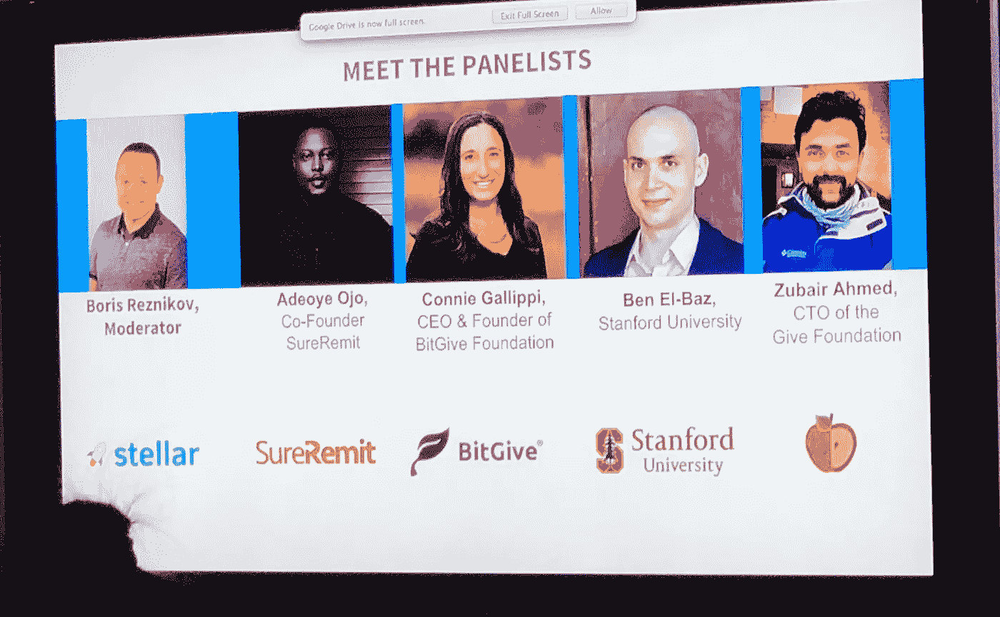
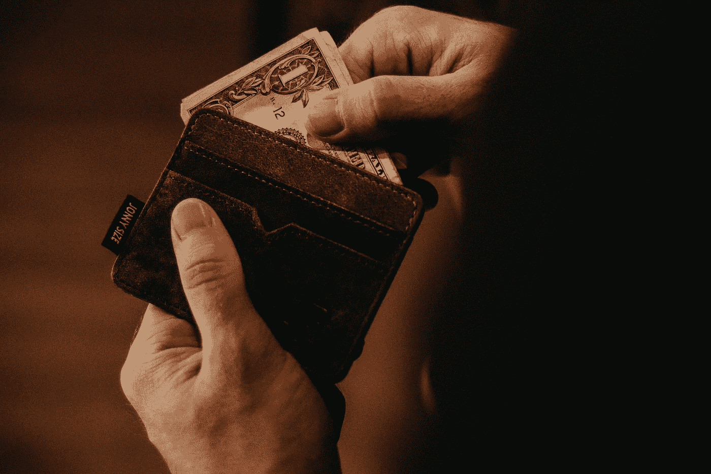
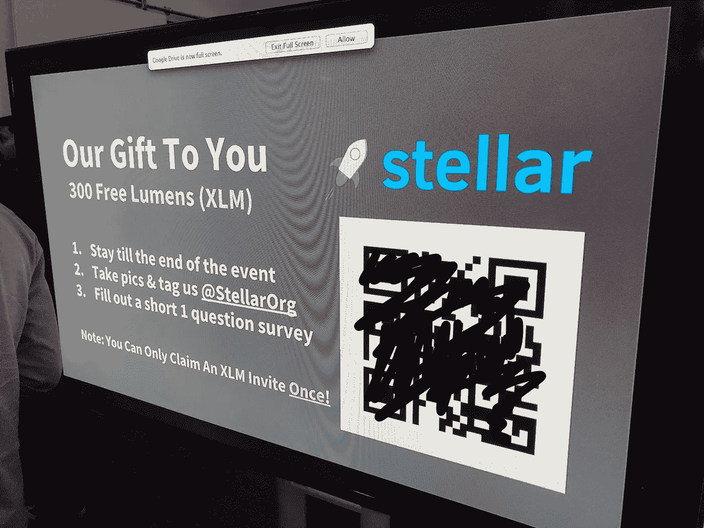

# 我从第一次区块链聚会中学到了什么

> 原文：<https://medium.com/hackernoon/what-i-learned-from-my-first-blockchain-meetup-308d4e74f634>

我刚从一个区块链聚会回来。男孩，我很激动。今天是 9:15，我基本上从早上 7:00 就开始工作了。但是我真的需要在我中风之前把这些想法从我的脑海中赶走。所以在这里。我们。走吧。

Chatting before the meetup starts.

# 利用区块链进行捐赠跟踪

闭上眼睛。深呼吸。想象 10 年后的世界。就区块链而言，它看起来像什么？这是小组成员提出的问题。

No caption needed.

> 我想象有一个全球公共仪表板，每个人都可以实时看到，人们可以立即向他们选择的慈善机构捐款，并在记分牌上看到他们的贡献。此外，人们可以即时提供救灾，并在全球记分牌上看到他们的贡献。——康尼·加利皮，比特给予基金会的首席执行官和创始人

哇哦。那确实使我深受感动。那该多酷啊。这将使给钱游戏化。(P.S. Gameify 的意思是做成游戏。)我的意思是，这对我来说很酷，我不知道你怎么样。Connie 正在开发一个捐赠平台，通过实时共享财务信息和结果，使非营利组织能够向捐赠者提供透明度。

Photo by [Allef Vinicius](https://unsplash.com/photos/fJTqyZMOh18?utm_source=unsplash&utm_medium=referral&utm_content=creditCopyText) on [Unsplash](https://unsplash.com/search/photos/send-money?utm_source=unsplash&utm_medium=referral&utm_content=creditCopyText)

# 用区块链跨境汇款

会议上出现的另一个有趣的使用案例来自 Adeoye Ojo，属于汇款市场。想象一下，你的父亲在海外，在外国，他有一大笔医疗费需要支付，他需要你的帮助。你是做什么的？转账费用通常是总价值的 7-10%左右。你在开玩笑吗？你的意思是如果我寄一万美元，我会损失其中的一千美元？没错。不仅如此，付款可能需要 48 小时才能真正完成。这就是 SureRemit 的用武之地。该公司使用 RMT 令牌使用户能够发送电子优惠券，用于在某些商家购买商品和服务。关于 SureRemit 最重要的事情:

1.  **零手续费汇款。**您发送的金额就是您的家庭成员将收到的金额。
2.  **即时配送。**你可以在应用程序中访问零售店的电子代金券，并支付数百份水电费。
3.  **支付的透明度。**您可以根据特定需求发送电子优惠券，并查看兑换详情。

Photo by [Arnaud Jaegers](https://unsplash.com/photos/5CoOYSxILSw?utm_source=unsplash&utm_medium=referral&utm_content=creditCopyText) on [Unsplash](https://unsplash.com/search/photos/voting?utm_source=unsplash&utm_medium=referral&utm_content=creditCopyText)

# 其他有趣的区块链用例

1.  **土地注册处。它登记在纸上，人们会忘记这些文件。**
2.  **投票。**既然有这么多关于选举被操纵的猜测，那么让每张选票的实际计票过程透明化不是很好吗？
3.  **数字身份。** BankU 已经在这么做了。他们为发展中国家创造数字身份。他们把人们的身份放在区块链上，以减少身份盗窃。

How to get blockchain to the next level.

# 区块链的路障

1.  **可扩展性**。在没有合适的基础设施的情况下，我们如何把大量的信息放到区块链上呢？
2.  **环境影响。**工作证明是行不通的。它用了太多的电。
3.  **共识机制**。没有完美的解决方案。如此多不同的机制，如此多不同的用例。
4.  **用户采用。人们购买硬币是为了赚钱，而不是为了它原本的目的。例如，人们会购买 RMT 只是为了看价值上升，而不会用它来购买电子代金券。**
5.  **Crypto 不是主流。没有足够的企业接受加密货币。**
6.  **老一辈。老年人不愿去想区块链。**

Food for Thought: What if you get crypto tokens from attending a FREE meetup?

# 精神食粮

1.  如果银行与密码提供商合作，帮助将密码兑换成法定货币会怎么样？这就是 [Stellar](https://www.stellar.org/) 正在做的事情。
2.  谷歌之后的世界会是什么样子？
3.  在委内瑞拉，跨境获得报酬的人用比特币获得报酬。
4.  如果你通过参加聚会得到免费的钱呢？我今天运气不错:)

再次感谢你的阅读。我累了，我想玩玩使命召唤。Horea [区块链](https://hackernoon.com/tagged/blockchain)出。