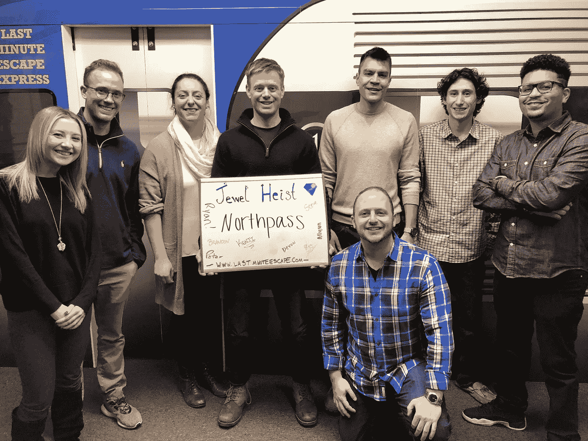

# 我在远程工作的第一年学到了什么

> 原文：<https://medium.com/hackernoon/what-i-learned-from-my-first-year-working-remotely-fc146c403a3f>

Me at Max Patch, North Carolina.

> “远程工作开启了自由和奢华新时代的大门。一个超越工业时代办公室理念的美丽新世界。”
> ― [我一头扎进了远程工作头](https://medium.com/u/c030228809f2#2f9ff03a3f6d)之后就再也没有回头。
> 
> 随着我逐渐适应了在有网络连接的地方工作的新现象，我想我应该分享一下我到目前为止学到的东西。
> 
> # 沟通是关键
> 
> 
> 
> Collaborating on a project in [Slack](https://slack.com/).
> 
> 拥有强大的沟通技巧([特别是写作](https://hackernoon.com/tools-ive-used-to-improve-my-communication-and-writing-skills-1217f2a296c1))已经被证明是远程工作成功的关键。你和你的团队在网上的关系就是一切。
> 
> 当你不能走到某人的办公桌前问他们一个问题时，你需要找到一种方法来虚拟地完成同样的任务。
> 
> 这通常会以一个简短的信息或者一个 T21 缩放电话而告终，但是不管怎样——你需要找到一种与你的团队沟通的方式。
> 
> 这可能以几种不同的方式发生:
> 
> **异步通信**
> 
> 这是大多数[分布式团队](https://www.formassembly.com/blog/remote-teams-communicate/)的神奇之处(尤其是那些跨越多个时区的团队。)这种类型的交流是在没有现场对话的情况下进行的。相反，这是一个来回交换，发生在每个人的时间表允许的情况下。
> 
> 对于几乎所有协作都主要在网上进行的远程团队来说，[异步通信](https://www.process.st/asynchronous-communication/)看起来最像是一个人在消息应用或谷歌文档中留言，这样他们的队友就可以在方便的时候阅读、回复和编辑。因此，这种方法最适用于对时间不敏感的问题或对话。
> 
> 异步沟通的一些例子包括——电子邮件、直接消息( [Slack](https://slack.com/) )、在项目管理平台上发布更新或问题( [GitHub](https://github.com/) 、 [Trello](https://trello.com/) 、 [Basecamp](https://basecamp.com/) 、 [Google Docs](https://www.google.com/docs/about/) 等。)
> 
> **同步通信**
> 
> [同步通信](https://remote.co/synchronous-and-asynchronous-communication/)是指两个或两个以上的人同意同时使用相同的方法进行通信。
> 
> 最初的同步交流方式是打电话或面对面交谈，但是现代科技给了我们很多其他的选择。
> 
> 当事情需要更快地发生时，或者当提出问题并立即获得答案或使参与者能够相互交流想法并获得积极反馈很重要时，同步沟通是一个好的选择。
> 
> 同步通信的一些例子包括——实时聊天([松弛](https://slack.com/))、视频呼叫或会议([缩放](https://zoom.us/))、在线语音呼叫、电话呼叫。
> 
> 参见[vision](https://www.invisionapp.com/blog/online-collaboration-tools-remote/)中的远程员工在线协作工具列表。
> 
> # 大图片项目需要面对面的活动
> 
> 
> 
> Team Northpass attempting an escape room as a team bonding exercise in Parsippany, NJ (Northpass HQ)
> 
> 我知道，我知道，我们讨论的是远程工作，我刚才说了亲自见面很重要。但是让我告诉你一个小秘密…的确如此！
> 
> 让我这么跟你说吧。从执行层面来看，在线合作非常有效，但从战略层面来看——很难胜过面对面的活动。
> 
> 这就是为什么我们每个季度聚在一起回顾我们的目标并为下一季度做计划。能够亲自去做这件事，而不是通过医生，真是令人耳目一新。
> 
> 亲临现场甚至有助于:
> 
> *   建立团队友谊
> *   亲自会见新的团队成员
> *   激励员工
> *   放松，找点乐子
> 
> (甚至像 [Buffer](https://open.buffer.com/remote-work-retreats/) 、 [HotJar](https://www.tortugaretreats.com/case_study/hotjar/) 和 [Zapier](https://zapier.com/learn/remote-work/how-run-company-retreat-remote-team/) 这样更大的远程团队也定期进行现场活动。)
> 
> 在设定你的高层次目标并确保每个人都在同一页上之后，你可以支付并开始执行。
> 
> # 孤立的利与弊
> 
> 
> 
> My dog Pando and I hiking Sams Throne, AR.
> 
> 孤立对我来说是个新话题，因为我总是被人包围着。我从来没有真正经历过长时间的独处。
> 
> 经过几个月的远程工作，我突然意识到，我可能会一周不出门，也不和现实世界中的任何人说话。
> 
> 这种新习惯就这样形成了，因为我再也不需要离开我的房子了。我需要做的一切，都可以在家做。
> 
> 我的新认识使我开始有意识地努力不那么孤立。人际互动是授权的最终形式。
> 
> 为了帮助对抗这种孤立，我养了一只名叫潘多的狗(如上图。)我们每天在我工作的时候出去玩。
> 
> 我还自我承诺，每个周末开始和朋友一起徒步旅行，走出家门。
> 
> (如果我不出去或者没有任何人际交往，我会用我的一生去寻找创造性的方法来获得更多的比特币。)😅
> 
> # 过自己的生活|做最好的自己
> 
> 
> 
> Me, my brother, and my cousin hiking Chimney Tops in the Smoky Mountains National Park.
> 
> > 有活下去的理由的人几乎可以忍受任何方式。
> > 
> > — [弗里德里希·尼采](https://bambooinnovator.com/2014/02/03/the-human-search-for-meaning-he-who-has-a-why-to-live-for-can-bear-almost-any-how-nietzsche/)
> 
> 我认为用这句话开始这一部分是至关重要的，因为 [*实在是太重要了*](https://www.psychologytoday.com/blog/hide-and-seek/201205/mans-search-meaning) 。
> 
> 在生活中，我们都有自己的“为什么”,我们为实现“为什么”所做的一切都是我们找到满足感的地方。
> 
> 远程工作让你有机会拥有灵活的工作生活，并专注于对你来说重要的事情。
> 
> 无论是家庭、旅行、志愿服务等等。工作应该让你专注于“为什么”,而不是把它从你身上拿走。
> 
> 如果你想了解更多，我推荐你读维克多·弗兰克尔的《人类对意义的探索》。
> 
> # 这真是太棒了
> 
> 
> 
> Me hiking in Medellin, Colombia.
> 
> > “我坚信，当你感到舒适时，你就开始死亡。如果你不努力让自己变得更好，那么你就会慢慢变得更差。”
> > 
> > — [**彼得·施罗德**](https://hackernoon.com/micro-habits-changed-my-life-47f572bfc153)
> 
> 远程工作已经成为现实。
> 
> 它让我有机会:
> 
> *   旅行
> *   多花点时间和家人在一起
> *   平衡工作与生活
> *   实行自律
> *   住在对我和我的家人有意义的地方
> 
> 我要感谢 Northpass 公司给我这个难以置信的机会，为一家重视员工幸福的大公司工作。
> 
> 如果你想了解更多关于远程工作的情况，如何获得远程工作，或者其他任何事情——欢迎在下面发表评论！