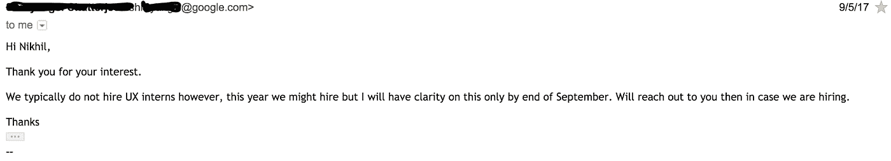
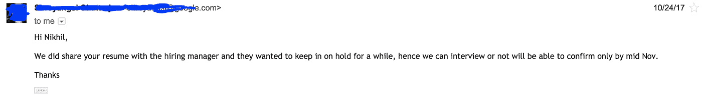
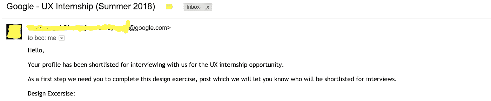
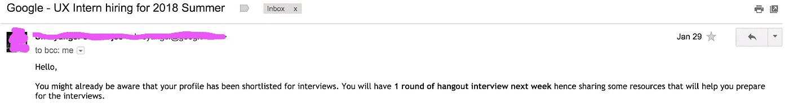
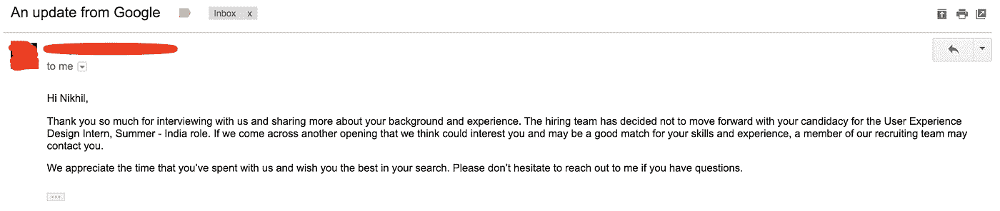

# 我从谷歌 UX 实习面试过程中学到了什么

> 原文：<https://medium.com/hackernoon/what-i-learned-from-my-google-ux-internship-interview-process-f58174dff077>

## 一个难以讲述的故事

历时 6 个月的面试终于结束了。很难大声说出结果。我生命中这意想不到的一章没有好的结局，因为我没能通过最后一轮。然而，我相信我的故事可以帮助潜在的候选人在面试中脱颖而出，并避免我可能犯的错误。

通过这个博客，我将分享我的面试经历和我在实习过程中学到的东西。

# 申请 UX 设计实习

作为一名自学成才的设计师，没有任何计算机/交互/ [设计](https://hackernoon.com/tagged/design)的专业学位，我从未想过我会有机会参加[谷歌](https://hackernoon.com/tagged/google)的面试。嗯，生活是不可预测的，所以我在 9 月初申请了谷歌 UX 实习，希望公司重视技能胜过我们的学位。第二天，我收到了谷歌的回复，希望他们可以考虑我的资料。

几个月过去了，但我没有收到招聘经理的任何消息。我的焦虑越来越大，每隔 2-3 周我就给人力资源部发邮件，了解申请情况。

在此，我要感谢我的招聘经理，她亲切友好，支持我处理所有的后续邮件，从百忙之中抽出时间，并不断更新我的状态。

# 瞧啊。谷歌的回复

4 个月过去了，当我对谷歌实习完全不抱任何希望时，1 月 3 日，一封回复邮件发到了我的收件箱，通知我的个人资料被列入实习候选名单，我需要在 1 月 9 日之前完成任务。我很高兴谷歌真正重视技能而不是学位。

# 谷歌招聘流程

谷歌有一套独特的招聘流程，与我之前经历的完全不同。这是一个耗时数周的漫长过程，不断考验着我的耐心。在这个过程中，他们会努力让你了解最新情况，但如果你有任何问题，请不要犹豫，立即联系招聘人员。

面试结束后，由谷歌公司各级员工组成的独立招聘委员会将审查你的候选人信息包，其中包括你的面试反馈和分数、你的简历、推荐信以及你提交的任何工作样本。

欲知更多请访问:[https://careers.google.com/how-we-hire/](https://careers.google.com/how-we-hire/)

我的实习过程分为三个阶段-

1.  提交作业
2.  与两位设计师的访谈(45 分钟)
3.  与招聘设计团队进行访谈(30 分钟)

# 第一轮-提交作业

对于这项任务，我被要求从给定的 3 个选项中选择一个问题陈述，并在一周内提交问题陈述。考虑到任务的保密性，我不能告诉你问题陈述的细节。在这里，我试着整理了一些有用的提示-

1.  清楚你正在做的每一个设计决定。
2.  分析问题陈述，并在需要强调的重要单词下画线。你应该能够清楚地定义和理解你正在解决的问题陈述。
3.  你将有一周的时间提交你的作业，在得出任何解决方案之前，尝试做一个适当的用户研究。
4.  分析调查并适当解释结果。
5.  不管你用什么方法，简明扼要地描述你的建议是很重要的，这样可以帮助你的招聘团队在远程查看时理解你的工作和流程。
6.  试着提交比要求更多的内容。我被要求提交一份堆芯流程的低保真度概述和流程的两个关键高保真度屏幕。我另外提交了用户研究表，它的回答和流程的一个可视化原型。
7.  正确地列出你在提交的文档中的任何死角和假设。

> "一份完整的提交文件是成功提交作业的关键."

# 第二轮-与 2 名设计师的面谈

经过一个月的提交，我被告知我进入了第一轮面试的候选名单。我的招聘经理分享了一些资源来帮助我准备面试。

一天后，我被告知面试的日期和时间。他们还设置了一个测试 hangout 会话，以检查 hangout 链接是否工作正常，以及我对使用 Hangout 是否感到舒适。

## 面试(45 分钟)

面试前 15 分钟，我坐在椅子上，以确保互联网、摄像机和麦克风都正常工作。招聘团队的两位设计师(设计主管和交互设计师)参加了我的面试。访谈总共 45 分钟，从设计负责人解释如何分配访谈时间开始-

1.  简要介绍自己(10 分钟)
2.  详述您过去的项目/投资组合概述(15 分钟)
3.  提交作业问答(15 分钟)
4.  任何疑问(5 分钟)

以下是我从这次采访中学到的东西-

1.  **简单介绍你自己-** 准备你的电梯间推介。讲述你的背景，你是如何开始设计的，你到目前为止学到了什么，你未来的抱负是什么，谷歌如何帮助你实现你的目标——所有这些都以故事的形式呈现。
2.  **详述你过去的项目-** 专注于你最好的一两个项目。讲述问题陈述、使用的方法，解释 1-2 个核心流程/解决的问题、获得的结果和收获。最重要的部分不是试图涵盖你准备的每一个方面，而是确保你已经向你的听众传达了你自己——他们已经听了，理解了，参与了。准备在很短的时间内快速浏览剩余的幻灯片。
3.  **Q & A 关于提交的任务**——明确设计决策。你应该准备好回答每一个“为什么”。例如，你应该清楚你为什么在卡片上使用图像，你如何分析问题陈述，对流程的适当澄清，可以做什么来进一步改善流程，以及任何其他的极端情况。还要考虑用户使用你的产品的环境/情况，与之相关的社会和个人问题是什么，以及如何解决这些问题。这是我在面试中漏掉的一点。
4.  **任何疑问-** 这是最重要的部分，不应该跳过。向面试官问尽可能多的问题和疑问。让他们参与谈话。了解他们的故事。你可以问的一些问题是他们对你的期望是什么，你会做什么类型的项目，实习期间你会做多少个项目，工作文化是什么，你的面试官在组织工作的这些年学到了什么，任何改善自己的反馈，你什么时候会得到你的结果等等。问问题表明你真的有兴趣和他们一起工作，并希望改善你在面试中犯下的错误。
5.  记住名字- 永远记住你的面试官的名字。这有助于轻松地让他们参与对话。好的面试就是好的对话。

在这次面试中，我非常感谢我的面试官，他花时间对我的设计挑战提供了反馈。设计主管也赞赏并鼓励我继续做我正在做的事情。他还提到我的故事也让他想起了他的故事。

# 第三轮(最后一轮)-与招聘设计团队进行面谈

面试不到一周，我就通过电话得知了结果。我既兴奋又紧张，因为这将是最后一轮面试，我想为这次面试付出 200%的努力。

我开始在 LinkedIn 上研究招聘团队。这次面试我是持怀疑态度的。我认为这次面试将主要关注我在团队中的适应程度，因为技术和产品组合概述已经在第一轮面试中完成了。因此，我开始在笔记本上写下一些与文化相关的问题的答案，比如我最重视的价值观是什么，我最喜欢的实习生有什么优点，为什么我想加入谷歌，我如何看待 5 年后的自己，为什么谷歌应该选择我，等等。

## 最后一次面试(30 分钟)

与我的预期相反，这次面试出现了不同的转折，因为这一次整个团队都想就我完成的任务问一些更深入的问题。他们想知道我是如何得出一个特定的解决方案的。

与第一次采访相似，这次采访也是从团队中的一名设计师开始，他解释了采访的时间分配-

1.  **简单介绍自己(5 分钟)-** 他们想知道更多关于我的志向，以及我想在未来成为什么样的人。
2.  **任务中的问题&答(15 分钟)-** 这一次，问题更多地集中在我所做的用户研究、采访的人群样本，以及如果我没有参加调查，我的设计会有什么变化。
3.  **一般问题(5 分钟)——**这些问题基于我对设计的理解，设计对我来说是什么，我最喜欢设计过程的哪个部分，在我看来设计过程的重要阶段是什么，等等。
4.  **怀疑，如果有的话(5 分钟)-** 我告诉了我的加入日期和可用性，并询问了一些关于我将加入的团队的疑问。

# 登陆日

当我急切地等待结果时，我觉得白天变长了，我无法入睡。我每个小时都在查看我的收件箱，寻找结果。我太紧张和焦虑了。终于，结果到了，我在最后一轮被拒绝了。心灰意冷的我向招聘经理寻求反馈。她会在下周内回复我。我会根据反馈更新博客。

正如所言，演出必须继续。我会继续我的实习生涯，希望能尽快见到谷歌。

# 一些帮助你准备面试的资源

google.com 有一些基本的东西:

1.  谷歌招聘网站:[http://www.google.com/about/jobs/](http://www.google.com/about/jobs/)
2.  我们如何招聘:[http://www . Google . com/about/jobs/lifeat Google/hiring process/](http://www.google.com/about/jobs/lifeatgoogle/hiringprocess/)
3.  YouTube 播放列表:[认识那些做重要的酷事情的谷歌员工](http://www.youtube.com/playlist?list=PLllx_3tLoo4fd1deqnzvyZrIrJzRdSC6-)

**文章:**

1.  [如何成为一名 UX 专业人士，以及如何雇佣一名员工](http://www.nngroup.com/reports/user-experience-careers/)(尼尔森诺曼集团，2014 年)
2.  如何在谷歌找到工作(纽约时报，2014 年 2 月 22 日)
3.  [谷歌如何自学优秀的设计](http://www.fastcodesign.com/3016268/google-the-redesign) (Co.Design，2013 年 9 月)
4.  [重新设计谷歌:拉里·佩奇如何策划一场美丽的革命](http://www.theverge.com/2013/1/24/3904134/google-redesign-how-larry-page-engineered-beautiful-revolution) (The Verge，2013 年 1 月)。“这可能是谷歌有史以来关于设计进化的最深入的文章。”(jwiley)

**我挑选的一些文章:**

1.  [总结我的设计故事#2](https://blog.prototypr.io/summarising-my-design-story-2-3a4332b9a25b)
2.  [制作我的作品集网站](https://blog.prototypr.io/making-of-my-portfolio-website-66b97f14de8)
3.  [我们如何在 Indiez 使用以用户为中心和组件驱动的方法构建 MVP](https://blog.prototypr.io/how-we-used-user-centred-and-component-driven-approach-to-build-the-mvp-at-indiez-9dc7187ee42f)

感谢您阅读本文。如果你喜欢这篇文章，请点击👏按钮，并让其他人也知道这一点。请继续关注我在 [Dribbble](https://dribbble.com/yadavnikhil012) 、 [Medium](/@yadavnikhil012/) 和 [twitter](https://twitter.com/yadavnikhil012) 上的更新。🔥 🔥 🔥我目前正在寻找 UX 暑期实习机会。如果有空缺，请务必打电话到 yadavnikhil012@gmail.com 与我联系。