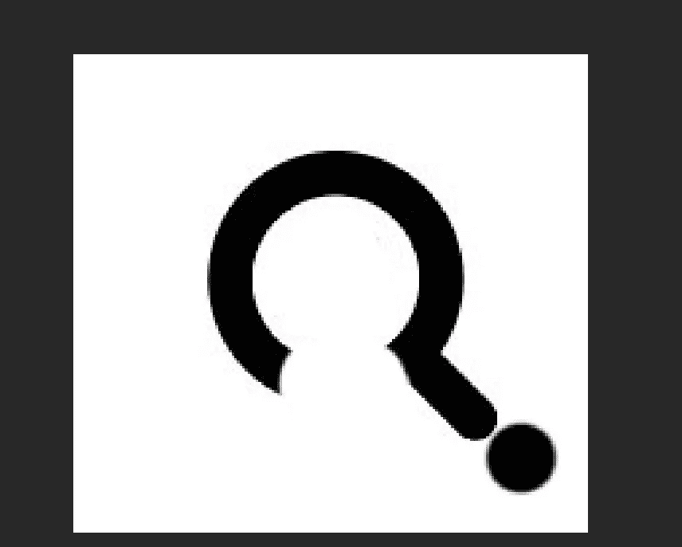
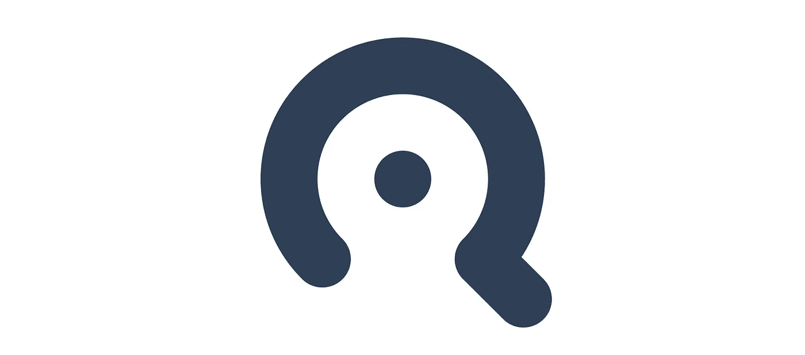

# 我在建造 SaaS 中学到了什么

> 原文：<https://medium.com/hackernoon/what-i-learnt-building-a-saas-e02dd3318cf5>

## 我的创业之旅

## 第 0 周—回顾

当我开始我的 [SaaS](http://findbetterquestions.com/) 的时候，我的大部分动力来自于写[这个 30 天挑战](/@EmilBruckner/day-0-zero-to-mvp-in-30-days-what-its-all-about-c39215a531f7)。但是后来就不写进展了。思考我为什么停下来，我本可以写些什么，我得出结论，我可能应该重新开始写作。

## 我为什么停下来

《30 天文章》中我的 MVP 的问题是，在某些日子里我没有太多可说的。其他日子都很好，但平均来说，它不像是超高质量的内容，我不确定我是否会建议任何人阅读每篇文章。

## 我现在要做什么

为了解决这个问题，我将每周写一篇关于我的项目的文章。这不仅能让我总是写一些至少有点激动人心的东西，还能让我有机会反思过去的一周，并更好地传达你可以如何实施我所使用的策略。

# 过去几个月是什么样的

如果我继续每天的旅程，有很多事情我完全可以写下来，但是我没有:

*   标志
*   智能营销堆栈
*   我的试运行
*   我的营销活动
*   统计数据(用户、网络分析、电子邮件等)

# 标志

对于第一个登录页面，我使用了一个单词标记。它的白色版本已经在黄色背景上放了几个月了。下周我会开始处理登陆页面。

这个标志还不错，但我需要一些更方的图标。“发现更好的问题”是一个桌面应用程序，所以我不可能没有一个合适的图标。
我发现更好问题的第一个想法是一个放大镜放大一个问号，发现更好的问题。

这看起来超级无聊，而且对于一个 favicon 来说太复杂了(这个图标也是用来做这个的)。谢天谢地，我把我的想法发给了提莫(他的网站上说即将推出，现在已经两年多了。为什么我要链接到它？).他想出了一个绝妙的设计:

他把问号和放大镜结合在一起。差不多完成了。就是不够方，所以我把圆点移到中间。

这是最后一个:

# 分段太贵

甚至在我开始之前，我就知道所有的营销分析工具都必须和我所有的资源链接在一起，比如网站和应用程序。 [Segment](https://segment.com/) 是一款神奇的工具，它可以让你在几乎零配置的情况下集成 200 多种工具。问题是:一旦你想跟踪超过 1000 个用户，这就变得非常[昂贵。1000 个用户听起来很多，但是吸引 1000 个访问者到你的网站并不难。此外，Segment 并不与每个工具集成，所以它对我来说并不是一个真正的选择。](https://segment.com/pricing)

Photo by [Marius Masalar](https://unsplash.com/@mariusmasalar?utm_source=medium&utm_medium=referral)

因此，我需要一种不同的方式来整合我的营销组合，但是什么需要整合呢？

*   [App](http://findbetterquestions.com/) —前端
*   App —服务器( [graph.cool](http://graph.cool/) )
*   [网站](http://findbetterquestions.com/)
*   支付提供商([收款人](https://www.chargebee.com/))
*   CRM ( [Streak](http://get.streak.com/emil) (附属链接))
*   ESP ( [滴漏](https://www.drip.com/)
*   分析([混合面板](https://mixpanel.com/))

在写下我想要的所有不同的自动化之后，我简单地用 [webtask.io](http://webtask.io) 建立了一个无服务器解决方案，它拥有我需要的所有端点，比如:

*   从滴滴到 CRM 的事件
*   客户账户在我的后端、Chargebee、Drip 和 CRM 之间保持同步
*   一些分析数据保存在 CRM
    中，以便 CRM 知道用户处于哪个阶段(试用、客户以及他们是否实际使用了该工具)
*   所有发送的电子邮件都有记录

我很高兴我把这些代码放在一起，这样我也可以在以后的项目中使用它们。我总是很乐意听到其他解决方案。如果你想知道更多关于我的，也请告诉我。

Photo by [Tanja Heffner](https://unsplash.com/@tanjaheffner?utm_source=medium&utm_medium=referral)

# 入职培训

让人们从 A 地到 B 地，并在人们第一次尝试时解释这个工具的整个过程比我想象的要困难得多。甚至在设计应用程序的时候让它变得清晰

Photo by [Anna Kolosyuk](https://unsplash.com/@anko_?utm_source=medium&utm_medium=referral)

# 寻找更好的问题🚀

还没有风筝表情符号😔
我只是在推出这个工具的时候发布了这个[微小的公告](https://hackernoon.com/find-better-questions-launched-e4afc2dbb4c9)，但并没有真正谈论它背后的任何细节。这真的不是一个大的启动。我只是觉得这个产品已经准备好让人们使用了，而不需要我亲自参与，所以我在网页上提供了下载。那天我确实试图通过发送邮件让很多人使用它，但是效果远不如我想象的那么好。

在营销方面，我会继续做和发布前一样的事情。对我来说真的没有太大的改变。但是添加一个下载链接可能会让人们在听说这个应用后更容易尝试。

# 统计数据

你在这里没有错过很多。在我的 [30 天挑战](/@EmilBruckner/day-0-zero-to-mvp-in-30-days-what-its-all-about-c39215a531f7)之后，邮件列表的浏览量和新注册人数直线下降。距离我的试运行还有不到 14 天的时间，但是我还没有任何客户。我希望在接下来的几周内改变这种情况。对我来说这将是一个激动人心的时刻。

> 感谢阅读！这篇文章涵盖了许多不同的主题。如果我经常这样做，我肯定可以写更多关于我的旅程的具体文章，我会在未来这样做的。

[→第 1 周](/p/3bd4abf586d9/)