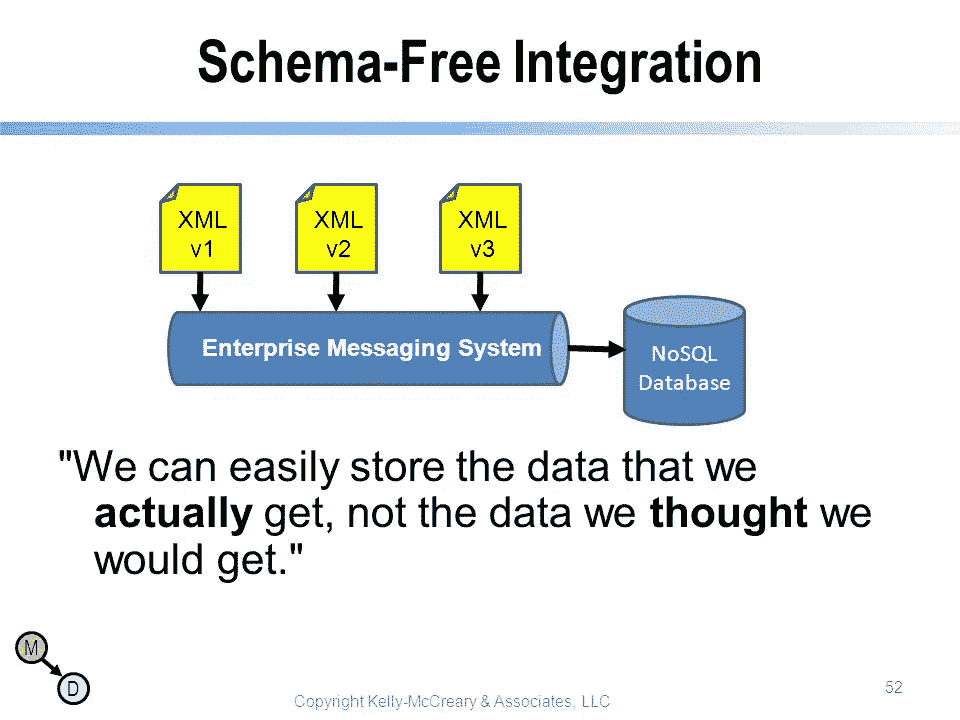

# 我从在嵌入式键值存储上构建 3 个高流量 web 应用程序中学到了什么。

> 原文：<https://medium.com/hackernoon/what-i-learnt-from-building-3-high-traffic-web-applications-on-an-embedded-key-value-store-68d47249774f>

我成长于所有 web 应用程序都必须建立在适当的架构之上的潮流中，通常涉及一个经过良好测试的稳定的 sql 数据库，如 postgres，或者在某些情况下，一个 nosql 数据库，如 mongodb。原因很简单:

*   它们可以被缩放，缩放，缩放。当你的应用程序在一夜之间拥有第一个 10 亿用户时，这一点非常重要。
*   SQL 是访问数据的最佳方式。您总是需要一个复杂的消息层来访问这些数据。
*   如果不使用 sql，您将如何执行连接？你将如何在复杂的搜索中构建？你将如何防止你的代码变得过于复杂，以至于掉下来砸死你的猫？

Your cat is scared of your code.

*   为什么要构建这样一个应用程序，它不需要雇用有经验的数据库管理员来创建复杂的模式和执行非常重要和复杂的数据库维护任务。

2015 年，我偶然发现了 golang [**BoltDB 数据库库**](https://github.com/boltdb/bolt) ，并首次用于基本的服务器端应用中保存状态。然后偶然发现了[bleve search，恍然大悟。大多数数据库提供的最基本的东西是存储，以及对存储数据的灵活搜索。有了 boltdb，我可以高效地存储我的数据，有了 bleve，我可以用有趣的方式搜索和访问我的数据。](https://github.com/blevesearch/bleve)

blevesearch

在此基础上，我在 boltDB 和 blevesearch 上构建并推出了 [Calabar 黄页](http://calabarpages.com)，然后当我看到它在生产中的运行和扩展是如此顺利时，我继续在 badger DB(bolt DB 的一个更快的替代方案)和 blevesearch 上构建了[shop 440](https://shop440.com)(Shopify 和 Aliexpress 的合并)用于索引。

# 我学到了什么:

# 关键价值存储速度很快

首先，NoSQL 键值存储很快，比类似的关系数据库快得多。它的速度来自于它的简单。键值数据库使用一个主键存储数据记录。该键表示记录是唯一可识别的，并且可以直接访问。除此之外，由开发人员来设计访问数据的复杂性。

此外，因为我使用的键值存储是嵌入式数据库，所以我能够去掉更多已建立的数据库中的一些处理。在 mongoDB 这样的数据库中，**大量的资源和延迟用于序列化数据，并通过网络将其传递给客户端应用程序，然后客户端应用程序对其进行反序列化和解码**。这是一种资源浪费，尤其是当客户机和数据库运行在同一台服务器上，而不是运行在不同的服务器上时，在这种情况下，客户机和数据库可以通过 http 进行通信。嵌入式数据库消除了所有这些额外的序列化甚至 tcp 传输成本。

# 出色的可扩展性—一致性如何？

其次，NoSQL 键值数据库也是高度可伸缩的。这也是其简单性的一个功能。与关系数据库不同，NoSQL 键值数据库不必垂直扩展。它可以在几台机器或设备上扩展几个数量级，而不需要重大的重新设计。从财务上来说，这也是一个很大的优势。

但是在我的例子中，由于使用了嵌入式键值存储，大多数扩展都是垂直进行的，甚至持续了很长时间。目前，即使数据库大小接近 1tb，应用程序仍然保持强劲。对于 badger，我想出了一个拥有多个 badger 数据库的策略，每个数据库代表一个集合。这样，如果我需要将系统扩展到单台服务器之外，我可以将每个单独的数据库及其相应的程序逻辑隔离到一个单独的微服务中。(以后我会多写这方面的内容。)

# 节省时间和精力

扩展关系数据库解决方案通常意味着成本不成比例地增加；改变数据库模式也需要时间和精力(以及服务器停机时间)。相比之下，键值数据库使价格曲线保持线性，而不是指数曲线，它被设计成在没有任何预定义模式的情况下处理数据。一些(不是全部)关键值数据库，像其他 NoSQL 数据库一样，也是为“**最终一致性**而设计的。这意味着数据会在不同机器上的副本之间“在某个时间点”同步，但不会立即同步。

# 无模式的行和列

# 嵌入式键值存储的案例

据 https://www.sqlite.org/whentouse.html 的

> SQLite 非常适合作为大多数中低流量网站(也就是说，大多数网站)的数据库引擎。SQLite 能够处理的网络流量取决于网站使用其数据库的程度。一般来说，任何一个每天点击数少于 100K 的站点都应该可以很好地使用 SQLite。100，000 次点击/天的数字是一个保守的估计，而不是一个硬性的上限。SQLite 已经被证明可以处理 10 倍的流量。
> 
> 当然，SQLite 网站([https://www.sqlite.org/](https://www.sqlite.org/))本身也使用 SQLite，在撰写本文时(2015 年)，它每天处理大约 40 万到 50 万个 HTTP 请求，其中大约 15-20%是触及数据库的动态页面。动态内容使用[每个网页大约 200 条 SQL 语句](https://www.sqlite.org/np1queryprob.html)。这种设置运行在一个单独的虚拟机上，该虚拟机与另外 23 个虚拟机共享一个物理服务器，但仍然在大多数时间将平均负载保持在 0.1 以下。

像 badger 这样的大多数嵌入式键值存储都比 sqlite 更高效，性能更好，所以这可以显示如果 sqlite 每天可以处理这么多的点击量，那么嵌入式键值存储还有多大的潜力。

此外，使用嵌入式键值存储以及像编译语言 [Golang](https://hackernoon.com/tagged/golang) 中的 Blevesearch 这样的嵌入式索引引擎，意味着您可以真正部署单个二进制文件，没有外部依赖性，也不需要后期部署设置。

# 简单地

嵌入式键值存储为您提供了 nosql [数据库](https://hackernoon.com/tagged/database)的所有优势，但它的不足之处在于搜索，因为您只能通过关键字和关键字的前缀来查询项目。但当与 golang 中的 blevesearch 或 elasicsearch 和 lucene 等索引引擎配合使用时，这两个引擎将为您提供一个非常强大的数据库，在一个非常节省资源的包中提供全文搜索、基于位置的搜索等功能，并且扩展性很好。

我相信这一对应该比现在更受欢迎，并且在降低服务器费用方面大有作为，特别是对于那些从来没有期待 facebook 级别规模的应用程序。