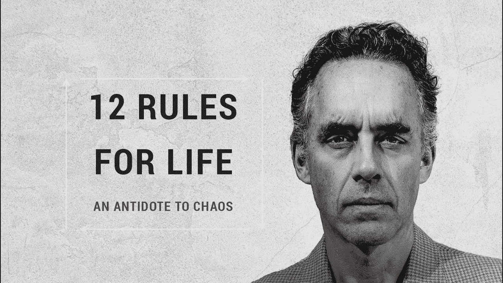

# 我从乔丹·彼得森那里学到了什么

> 原文：<https://medium.com/hackernoon/what-i-learnt-from-jordan-peterson-ebad8d48d575>

去年 12 月，我还没有听说过乔丹·彼得森，但当我在网上看到他的视频时，我就被吸引住了。

不折不扣。

我订购了他的新书，一个周末就狼吞虎咽地看完了，总共 370 页。我甚至读给我的孩子听。

以下是我学到的。

# 高高在上(或者至少表现得像这样):

鉴于我们生活的这个世界，我们很容易指责资本主义(或其他东西)创造了富人和穷人，富人和穷人。

事实证明，社会等级制度几乎从复杂生活一开始就存在了。我们没有发明它。

社会等级和社会结构已经有一百万年的历史了。我们的大脑建立在它的基础上，甚至龙虾的大脑也是如此。

在等级制度中，上层的人要轻松得多。他们实际上活得更长，更快乐。底层的人过着更不快乐、更严酷、更短暂的生活。

但是，在一个充满等级制度的世界里，我们可以利用'**发信号**'来为自己谋利。

**表示你是“高地位”的人，你也会被如此对待。**

**发出信号表明你“地位低下”，你也会被如此对待。**

如果你想名列前茅，那么:

1.  微笑
2.  抬头挺胸
3.  进行眼神交流
4.  大声点
5.  明确你想要什么

不要像我一样——我曾经抱怨自己是个移民或者内向的人——在我决定承担一些责任之前，这两个借口我都用了很多年。

# 负责任:

你并且只有你对自己负责——表现得像它。

**重复一下:**我负责。我有责任。我有责任。

责任越大，力量越大。相信我。

**扪心自问:**

1.  今天我能做些什么来变得更好？
2.  我生命中有哪些破碎的东西是我可以修复的？
3.  今天我该如何安排我的生活？

开始对你的生活负责，开始让它变得更好，一次一个任务。

# 爱你自己:

原来我们太了解自己了。

我们看到我们的每一个错误，我们看到每一个错误的决定，每一个错过的机会。很容易讨厌自己。

我们最终会认为自己不够好。

毕竟你还没见过其他人犯这么多错误。

这慢慢让我们相信自己不够好。我们不值得。我们不值得关注。

在你意识到之前，你已经在喝酒，吃得很差，和错误的人在一起。这一切都是因为你认为自己不够好。

我经常有这种感觉。非常经常。

但你必须持相反的观点。

相信你能让好事发生。你很棒。

相信让好事发生是你的责任。

如果你相信这一点，你会怎么做？

如果你真的在乎自己，你的生活会是什么样子？

你会和谁在一起，你会读什么，如果你真的在乎自己，你会做什么？

# 寻求真相:

在你的信念、事实和观点中保持精确是至关重要的。

别瞎编。

清楚地观察你的现实是什么样子。

> 有时候我们没有注意到一些事情，因为我们不想知道。我们不想有冲突。我们不想面对事实。

我的第一次婚姻以离婚告终。我的前妻欺骗了我。我真的没看见。不想看。我不能承认。

多年后，我前妻的女儿不得不告诉我这个事实。然后就很明显了！

**寻求真理带来和平。现实对我们有利。**

**但是寻求真理也意味着经历混乱。也意味着苦难。**

真正寻求真理。寻求与自己相反的意见和观点。

# 投资您的未来:

牺牲今天，投资未来。

今天做有意义的事。今天做正确的事。不是权宜之计。做能创造秩序、减少世界混乱的事情。即使是像整理床铺或支付账单这样简单的事情。

记得每天仔细观察你会变成什么样。你的角色每一秒都在被定义。

你能做的最重要的事情就是时刻强化你的性格和决心。

你正在成为你引以为豪的人吗？你信任的人？

# 下一个级别:

我们是一群致力于帮助下一代的金融老手。我在华尔街学到的是让你更聪明、更富有、更快乐。[注册](http://www.wilowallstreet.com)获取我们关于任何工作的网络电子书，并获得我们每周的 VIP 电子邮件。