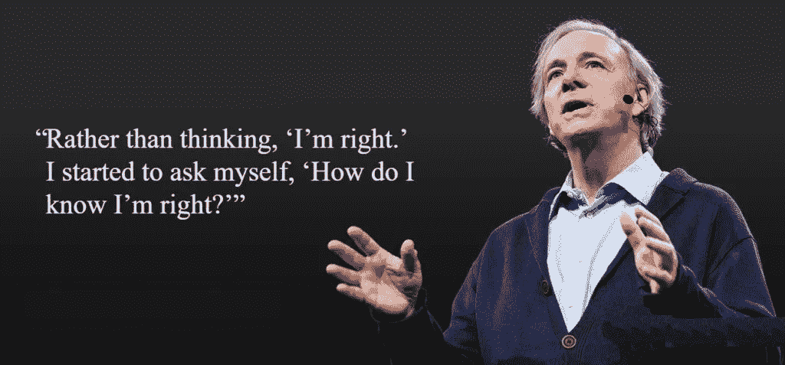

# 我从雷伊·达里奥的原则中学到了什么

> 原文：<https://medium.com/hackernoon/what-i-learnt-from-ray-dalios-principles-a099b228a87b>

当我第一次听说雷伊·达里奥在写书时，我想“又来了！”

2012 年，我在 Bridgewater 网站上读过“原则”文件，不知道把它写成一本 550 页的书有什么意义。

人们一直告诉我要读这本书，而我一直是个憎恨者。

最终，有一天我收到了这本书作为礼物。

我打开了它。

# 以下是我从雷那里学到的:

多么大的转变。

我意识到，我在生活中常常是一个被动的接受者。一个偶然的旁观者，或者是这个世界的机器中的一个简单的工人。

雷的建议是不要成为机器中的人，而是成为你的机器的设计师。这适用于你的工作，你的关系，你的生活。

**设计机器，按照你想要的目的设计你的生活。**

如果机器没有产生你想要的结果，想办法修理它，得到你想要的输出(生活)。

**或者如雷在书中所说:**

> 根据#2 ，自己思考决定 1)你想要什么 2)什么是真的以及 3)你应该做什么来实现#1

**这可以分解成以下五个思路:**

1.  不要混淆你希望是真实的和真实的。
2.  不要担心看起来好不好——担心实现你的目标。
3.  相对于二阶和三阶，不要过重一阶后果。
4.  不要让痛苦成为前进的绊脚石。
5.  不要把不好的结果归咎于任何人，除了你自己。

# 梦想+现实+决心=成功的人生

# 强大的生活问题:

1.  你想要生活的规则和原则是什么？
2.  对你来说什么是重要的，你在解决什么？
3.  你如何确保你在寻求真理？
4.  你是谁，你是如何构成的？他是迈尔斯-布里格斯和其他类似测试的忠实粉丝。我也是。(顺便说一句，我是 ISTJ 人)。
5.  你将如何得到你想要的？

# 决策制定:

《原则》实际上是一本关于良好决策的书。

生活只是一系列的决定，所以做出更好的决定会让生活更美好。

简化——你能把这个看似复杂的问题简化成另一个问题吗？你以前见过这个吗？有时候你需要退后一步，从更高的层面来看待机器。

思想彻底开放——不要让对他人想法的恐惧阻挡你的道路。寻求真相，诊断问题的根源。你在寻找最佳答案，而不是你想出的最佳主意。

**关注期望值** —所有决策都应关注提高期望值。你能增加正确的概率吗？你能做些什么来增加确定性？

**寻找有经验的人** **他们可以帮你对真相进行三角分析**——谁以前做过这种事，谁更有可能是对的？这里谁成功了？小心那些没什么经验却有很多观点的人。

**犯错没关系**——错了也没关系。不向他们学习是不行的。你犯的最大的错误是什么？你什么时候犯这些错误？你经常犯哪些特定类型的错误？

# 我最喜欢的观点是:如果你不回想一年前的自己，不做鬼脸，说明你成长得不够快。

# 奖金:

如果你还没看过他的《经济机器是如何运转的》,那你就大错特错了！！

在[https://afewthings.substack.com/](https://afewthings.substack.com/)注册获取更多信息