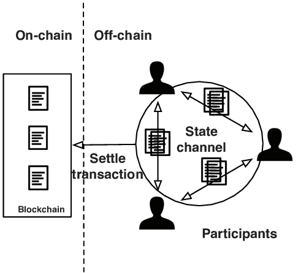
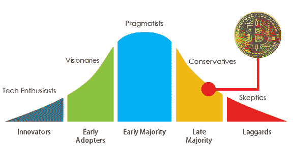
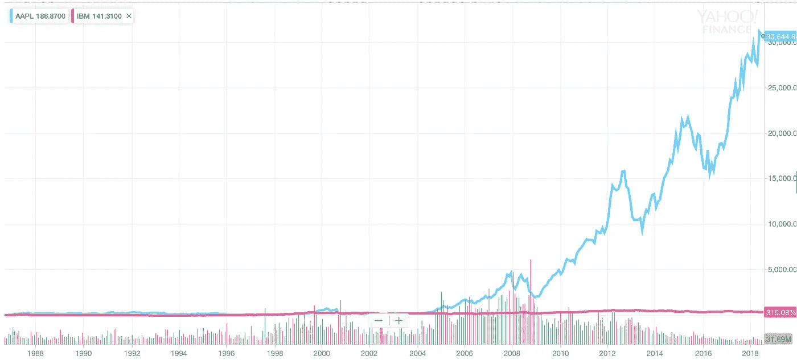
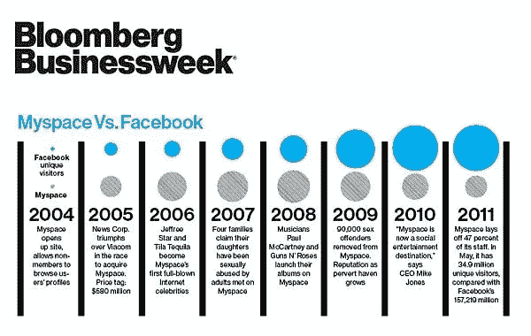
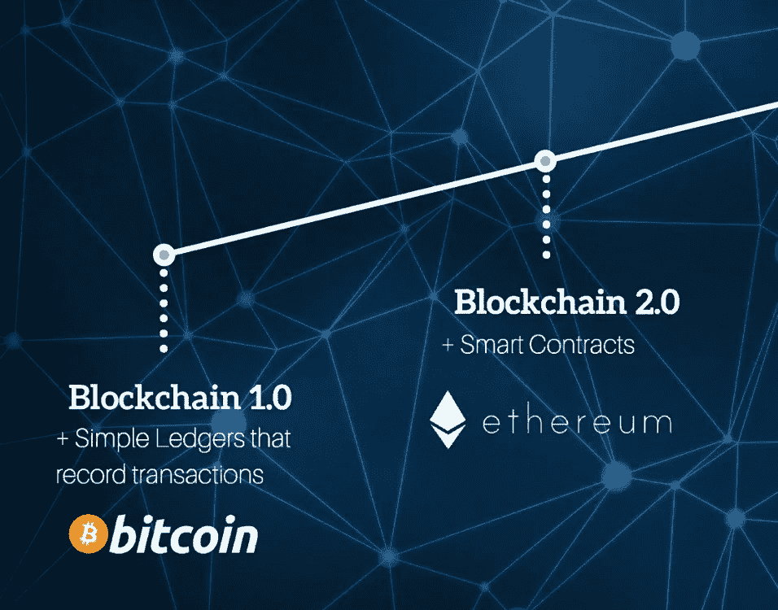
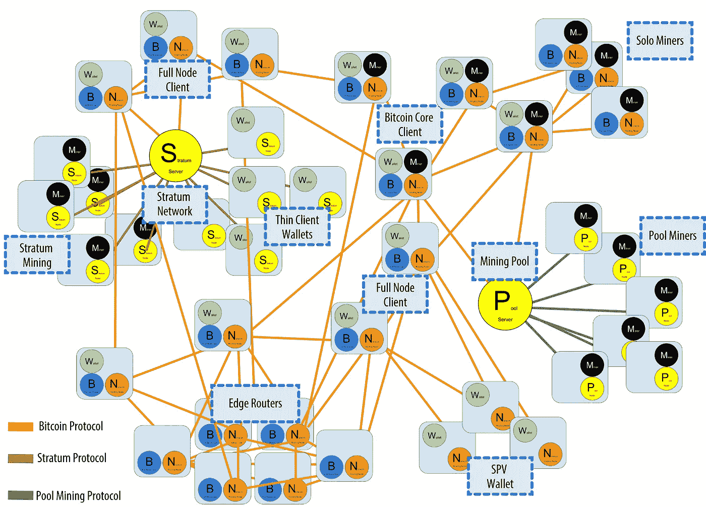
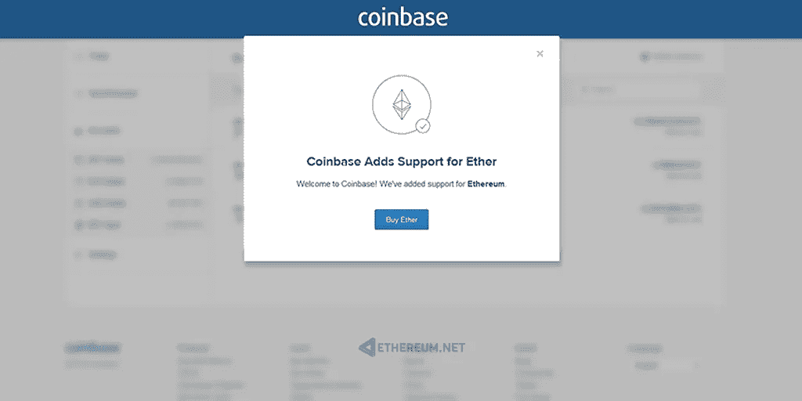
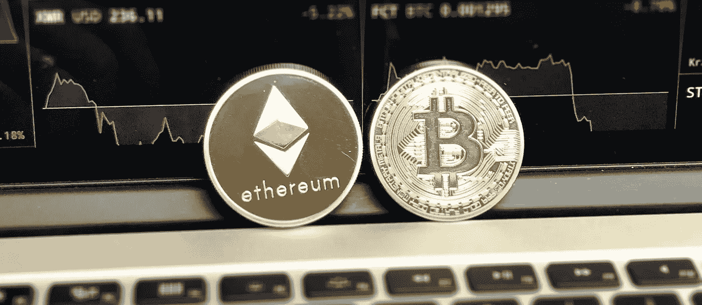
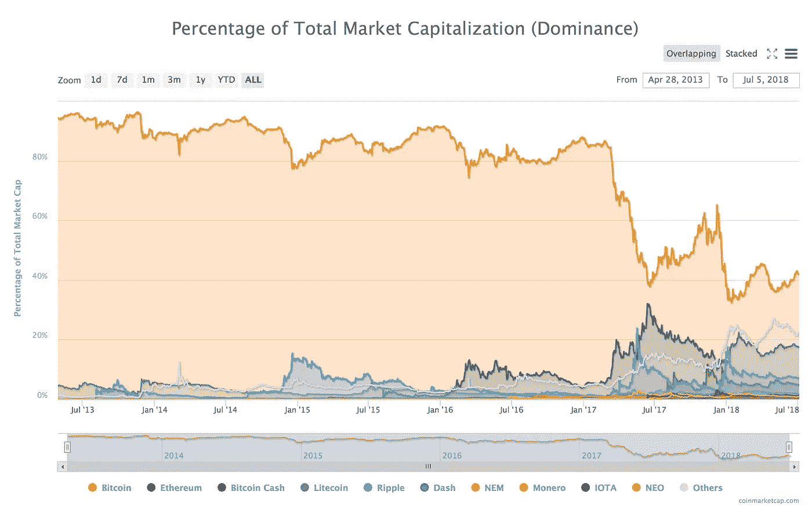

# 如果比特币在价值上可以被超越会怎样？这可能吗？？

> 原文：<https://medium.com/hackernoon/what-if-bitcoin-could-be-surpassed-in-terms-of-values-is-that-possible-6531835d3734>

我知道，有了这个故事，可能所有的比特币爱好者都会开始讨厌我，但我认为必须有人来分析这个威胁。

# 摘要

如果你在网上做一个简单的搜索，每个人都认为比特币是数字黄金，也许曾经是，任何人都会谈论这个简单的问题:

> 比特币的市值会被其他加密货币超越吗？

通常在我看来，当一项投资作为一种现状变得明显对每个人都有利时，就像 2008 年的房地产一样，我开始持怀疑态度……我认为必须有人通过对密码世界正在发生的事情进行严肃而务实的分析来论证这种威胁。

此外，就我个人而言，我从不投资没有未来用例的技术，只是因为人们相信它。所以，我开始思考，如果比特币的市值被超越，如果这种情况真的发生，会发生什么？

# 分析 1 |技术前景

让我们来谈谈比特币的技术，

> 比特币是第一代区块链技术，旨在无需中介即可存储和交易价值。

人类历史上第一次，我们能够在没有中介，尤其是不信任任何实体的情况下交易价值，而是基于匿名矿工(验证者)和数学算法的民主和开源治理。比特币引入了可信分类账的逻辑，而没有通过交易区块系统的聪明想法消除数据的可能性。

这个概念很棒，并开始破坏我们对安全、信任和价值观的概念，但现在我们在 2018 年，每个加密硬币都有相同的标准，许多替代硬币都设计成做同样的事情，但比比特币更快更便宜，甚至 Dogecoin 也有一些改进，因为谁没有听说过 Dogecoin，这是一种加密硬币，因为他的风格和他的有趣的狗 meme 而成为 43 种最有价值的硬币。

> PS:我爱 DogeCoin 是有史以来最有趣的网络迷因之一！

比特币的区块链是整个区块链社区中最慢、开销最大的之一，除了照明网络之外没有任何改善计划，这只不过是一个国家通道结构，不是真正的改善，但对于不同的用例来说，这里我想消除一个神话:

Lightning 是一种状态通道，就像以太坊上的 Raiden，这不是一种解决方案，因为 lightning 网络中的每个交易都不会被分散，而只会是连接的第一个状态和最后一个状态，所以比特币大使像出售升级一样出售它以提高可扩展性是非常危险的。

在科技行业，先发优势从来不是一个杀手级应用，但有时是一个差距，因为科技市场的历史告诉我们，如果公司不能迅速重塑自己，与雅虎/谷歌、IBM/苹果、Myspace/脸书、PayPal/Stripe 或易贝/亚马逊等拥有后发优势甚至最后一发优势的公司竞争，先发优势可能会很糟糕。

这并不意味着先行者通常会失败，但他们为那些真正了解如何从先行者的成功和失败数据中扰乱市场的人打开了市场。

> [先行者何时获得奖励，何时没有|**HBR**](https://hbr.org/2015/08/when-first-movers-are-rewarded-and-when-theyre-not)
> 
> [让我们摧毁比特币| **麻省理工科技评论**](https://www.technologyreview.com/s/610809/lets-destroy-bitcoin/)
> 
> [比特币没有任何一点让它成为一种很好的价值储存手段。| **黑客月**](https://hackernoon.com/there-is-nothing-about-bitcoin-that-makes-it-a-good-store-of-value-de6033b02d1)
> 
> [比特币 HODL 的末日| **迈克尔·斯潘塞**](/futuresin/the-end-of-bitcoin-hodl-661eb7bf0078)
> 
> [缩放密码:比特币闪电网络 vs 以太坊雷电网络| **月密**](https://steemit.com/bitcoin/@mooncryption/scaling-cryptos-bitcoin-lightning-network-vs-ethereum-raiden-network)

# 分析 2 |社区

在科技市场，快速、有远见和强有力的领导至关重要。比特币与他的社区有太多不同的观点和不同的需求。投机者希望提高价格，采矿者希望减少支出，开发者希望提高交易速度，爱好者不想更新中本聪 WP 的任何东西，最终，比特币背后的技术是加密生态系统中最停滞不前的，因为任何人都愿意遵循愿景。

比特币的早期社区非常棒，他们改变了我们存储价值的方式，在我个人看来，这项技术是科技界有史以来最重要的发明。

但是早期采用者社区和早期开发者不再存在，他们出现在其他项目中，如以太坊、EOS、AION 等。在 Medium 上，有很多关于他们的故事，关于这个社区是如何改变的，以及他们是如何离开的。

今天的比特币社区是由投机者而不是创新者推动的，今天的社区由保守的落后者主导，它处于技术采用生命周期的终点，通常这个时期对每个与技术相关的公司来说都是危险的。

今天的比特币社区处于保守状态，事实上，像比特币现金、比特币黄金、比特币原子等比特币的持久分叉来自不喜欢社区中大多数人的保守和停滞方法的人。

> [中本聪不相关|**Hackernoon**](https://hackernoon.com/satoshi-nakamoto-is-not-relevant-b049880df46e)
> 
> [投机者正在腐蚀比特币| **马克图希**](https://cryptoslate.com/opinion-speculators-are-corroding-bitcoin/)
> 
> [【The Flippening】&我是如何学会不再热爱比特币的| **Hackernoon**](https://hackernoon.com/the-flippening-how-i-learned-to-stop-loving-bitcoin-663e5db40707)

# 分析 3 |历史能帮助我们理解接下来会发生什么吗？

在科技史上，我想与 IBM、MySpace 或诺基亚做一些比较。

在 80 年代，IBM 拥有巨大的先发优势，它是当时最大的计算机公司，人们认为不可能超越他的价值。但这种想法并不正确，事实上在那种情况下，IBM 并没有失败，但其他公司，如苹果，由于后发优势，发展得更快更好。

## 今天，IBM 的市值是 800 亿美元，苹果的市值是 9500 亿美元

IBM 没有苹果发展得快，因为它在创新和向大众提供正确产品方面停滞不前。比特币今天有这个问题，而不是其他具有 3/5 年战略的项目，伟大的领导力，基于创新者的社区，以及在现实世界中比单纯的金融交易更多的应用。我将在下一章讨论这个问题。

另一个有趣的比较是与诺基亚，在 it 早期最著名的细胞生产公司。和 IBM 一样，诺基亚被带触摸显示屏的智能手机的想法超越甚至颠覆，这种想法将手机的使用扩展到许多新的应用，而不仅仅是通话和短信。

社交媒体领域的 Myspace 可能是另一个有趣的关联。Myspace 是消费者采用的第一个大型社交网络，其次是 Badoo、Netlog 和 Live Messanger。但他们当时不明白的是，存储和使用数据作为一种商业模式的想法，而不是向用户出售东西或支付会员费或太多不关心用户体验的随意添加的旧概念。

社交媒体的第一波浪潮当时被 Twitter 和脸书打乱了，因为由于他们的后发优势，他们理解数据的价值，而不仅仅是在线业务，这是巨大的。

> [比特币会成为加密货币的 MySpace 吗？| **INC**](https://www.inc.com/joseph-steinberg/bitcoin-will-it-become-myspace-of-cryptocurrencies.html)

# 分析 4 |使用案例

## 为了介绍这一部分，我必须设置与以下内容的区别:

区块链 1.0 技术，一种旨在存储和交易金融价值的网络。(比特币、Dogecoin、莱特币等。)

区块链 2.0 技术，一种旨在分散和交易价值和逻辑的网络，其结构类似于分散应用程序、智能合同和分散数据的操作系统。(以太坊、EOS、NEO 等。)

比特币的使用案例并不清楚，因为它作为支付系统失败了，速度慢，不可扩展，而且昂贵。在区块链 1.0 生态中，有更高效、更廉价的项目。

在区块链 2.0 中，挑战更困难，应用更大，在这里每个人在交易和可扩展性方面都比比特币更高效。

那么它的真正价值和真正用途是什么呢？

投机？也许是的，因为使用比特币架构，你无法分散应用程序、数据或真正可能对未来产生影响的东西，你只能进行缓慢而昂贵的价值交易。

> [十年过去了，还没有人想出区块链| **哈克农**的用法](https://hackernoon.com/ten-years-in-nobody-has-come-up-with-a-use-case-for-blockchain-ee98c180100)
> 
> [比特币作为货币正在失败| **Engadget**](https://www.engadget.com/2017/12/14/bitcoin-is-failing-as-a-currency/)
> 
> [比特币——价值储存是一个无用的用例| **Hackernoon**](https://hackernoon.com/bitcoin-store-of-value-is-a-useless-use-case-f786b2ddbb25)

# 分析 5 |比特币治理是否还是去中心化的？

这种威胁比其他威胁更难分析，因为我们处于一个哲学领域，去中心化将带来普遍的不信任，从工作证明的底部，就比特币而言，到社区驱动的决策结构。

我想分析的问题是更实际的，如果我们处于一个没有领导者的场景中，决策是由投机者或对这项技术没有远见的人做出的，或者仅仅是为了他们个人的钱包而不是项目的未来做出决策，这是正确的吗？这是我们想要的文化驱动的未来吗？这是一种从长远来看不能破坏一个项目的方式吗？

顺便说一句，比特币是分散的，我喜欢这一点，但许多其他项目也是分散的，所以这不是一个独特的竞争优势。

> [现在谁真正拥有比特币？| **金融时报**](/financial-times/who-really-owns-bitcoin-now-bcccc5aa0014)
> 
> [以太坊(Ethereum)的维塔利·布特林(Vitalik Buterin)谈比特币泡沫和运营 1250 亿美元的区块链| **金融时报**](/financial-times/ethereums-vitalik-buterin-on-the-bitcoin-bubble-and-running-a-125bn-blockchain-4ce5f25e7046)
> 
> [比特币真的去中心化了吗？| **被黑**](https://hacked.com/is-bitcoin-decentralized/)
> 
> [谁控制区块链？|**HBR**](https://hbr.org/2017/04/who-controls-the-blockchain)

# 分析 6 |比特币还是黄金吗？

在过去的 8 年里，比特币被解释为数字黄金，因为它是唯一可以轻松兑换成美元的加密货币，并且每一枚替代比特币都是用比特币的价格来计算价值的。

在这种被称为比特币的情况下，数字黄金非常有意义。但在最近两年，以太坊发布后，比特币肯定不再是唯一的数字黄金，因为分散交易所是基于以太坊的，同时每个集中交易所都在使用以太坊作为 BTC 像黄金一样。

每一个新的区块链相关项目，特别是在 2017 年 ICO 泡沫之后，都只能在 ETH 中交换，ETH 可以轻松地与美元和比特币交换。这将意味着，在两年内，许多加密价值并不直接与比特币相关，而是只与以太坊的价格相关，以太坊的价格可能会推动比特币的价格，反之亦然，因为比特币也可以很容易地与美元兑换。

> [为什么比特币永远不能成为数字黄金| **BitFalls**](https://bitfalls.com/2017/12/26/bitcoin-can-never-digital-gold/)
> 
> [比特币可能是加密黄金。但是以太坊是一种加密硅| **迈克尔·k·斯潘塞**](/@Michael_Spencer/bitcoin-might-be-the-crypto-gold-but-ethereum-is-the-crypto-silicon-f4f4153580d1)
> 
> [为什么比特币可能终究不是数字黄金| **财富**](http://fortune.com/2018/01/30/bitcoin-gold-cryptocurrency-citi/)
> 
> [不，比特币不是数字黄金(但它是……)|**克林特·西格纳**](https://www.fxstreet.com/analysis/nope-bitcoin-is-not-digital-gold-but-heres-what-it-is-201802051702)
> 
> [以太不是“商品”，比特币也不是“数字黄金”| **Hackernoon**](https://hackernoon.com/etherium-is-not-a-commodity-and-bitcoin-isnt-digital-gold-26cd5408f33f)

# 分析 7 |财务

从加密金融价值的角度分析，“比特币的统治地位”从 2017 年 3 月开始大幅下降。

就市值而言，比特币一直占据 85%-90%的主导地位，今天这一主导地位为 40%，2018 年 1 月达到 33%。

与此同时，在比特币占主导地位的底部，以太坊在 2017 年 7 月达到高点，为 31%对比特币的 38%，在 2018 年 1 月为 21%对比特币的 33%。这一金融场景清楚地表明，有史以来第一次，比特币作为加密生态系统中的主导货币开始受到质疑。

我想问读者一个问题，2017 年的 BTC 价格高点有没有可能是 ETH 和 ICOs 的 FOMO 价格推动的？有人有相反的证据吗？

另一个可能降低比特币价格的关键问题是由 Cboe 的“XBT”等非加密交易所制作的期货，因为这种期货是在常规银行的常规市场上，它们可能会在加密世界中没有任何要价相关性的情况下抬高 BTC。

问题是比特币没有公司或基金会，所以在未来，比特币社区无法阻止这种投机，这就像硬币的另一面是一个没有任何政府监管问题的世界范围的社区。

> [比特币期货会预示着比特币的终结吗？| **贾斯汀·达内曼**](/@justindanneman/will-bitcoin-futures-herald-the-end-of-bitcoin-1a4a6ccfdf92)
> 
> [第四维:比特币——操纵——卡特尔——价格——抑制是目标| **超级密码**](/@super.crypto1/4th-dimension-bitcoin-manipulation-cartel-can-it-be-burnt-no-way-c53de65c166a)
> 
> [BTC 统治地位的终结| **隐代**](https://cryptoyoda1338.wordpress.com/2017/05/16/the-end-of-btc-dominance/)
> 
> [统治力|**Coinmarketcap.com**](https://coinmarketcap.com/charts/#dominance-percentage)

# 判决

问题是，是什么让比特币比其他区块链 1.0 项目，如 DogeCoin、liteCoin 或任何其他只能转移价值的加密技术更有价值？

如果没有早期采用者的参与，没有技术驱动的愿景，特别是没有现实世界的用例，这听起来就像一种宗教……比特币作为未来几年安全的价值储存手段的概念，在我看来，这听起来就像 2008 年泡沫之前人们如何谈论真正的国家投资:将房屋作为安全可靠的投资，而不关心整个金融生态系统中正在发生的事情。

> 在市值方面，BTC 可能会被以太坊 EOS、AION、卡尔达诺等项目超越？

我个人的答案是肯定的，基于他们的区块链 2.0 结构、巨大的愿景和真实世界的用例，这并不是不可能的。

> 如果 BTC 不再是最有价值的加密货币，接下来会发生什么？

如果 BTC 将被超越，数字黄金的神话将被打破，人们开始思考是什么让它比其他区块链 1.0 项目更有价值？一个隐藏得很好的问题，我想问社区。

通过这篇文章，我不想说比特币是一个坏的或好的投资或他的技术是无用的，但驱散了关于比特币类似数字黄金的神话。