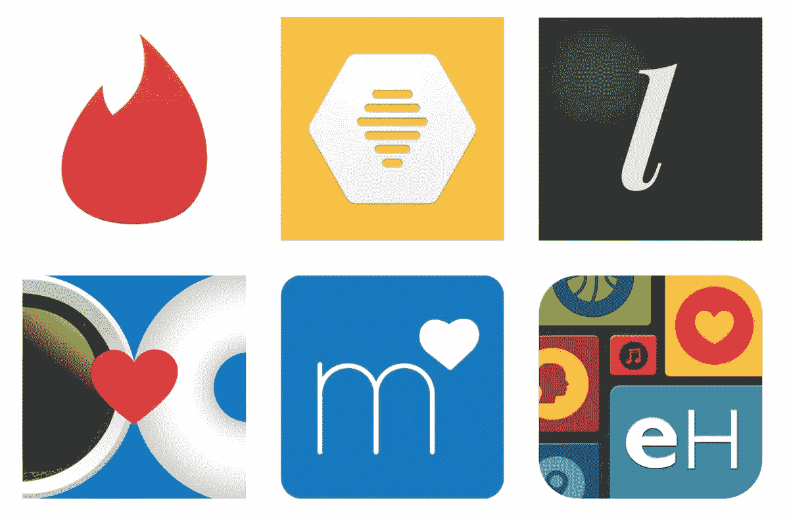
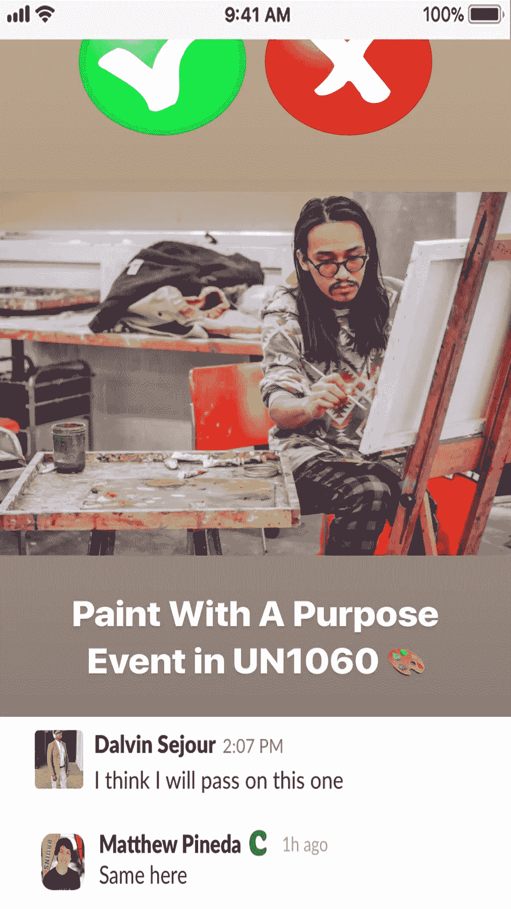

# 如果约会应用不仅仅是约会会怎样？

> 原文：<https://medium.com/hackernoon/what-if-dating-apps-did-more-than-just-dating-9eca8b5a47d7>

Collection of Dating Apps

像 Tinder、Bumble 和 OkCupid 这样的约会应用程序在创造浪漫关系方面确实很棒，但是像结识新朋友这样的非浪漫关系呢？如果你可以使用一个应用程序，让你找到一个去徒步旅行的伙伴，一个 FortNite 小队的额外队友，或者教你如何烹饪的活动，那将是非常棒的。幸运的是，我们正在进行这项研究，它不是那么遥不可及。

我们制作了偶遇机会浏览界面，让这一愿景成为现实(图 1)。这款应用背后的概念是“遇到机会浏览”,它要求用户浏览他们周围的各种社交机会。然后，他们可以“喜欢”或“不喜欢”他们看到的机会，这可以通知匹配算法向他们推荐社交接触的类型。

figure 1\. App Interface

关于潜在的社交接触，用户想要什么样的信息？我们对蒙特克莱尔州立大学的学生进行了一项用户研究来探索这个问题。这项研究的主要收获是:

# **调查结果**

1.  **参与者更喜欢照片和视频，而不是纯文本**

图像比 1000 个单词更有价值，这是显而易见的，但是我们不想自己去假设。因此，我们通过向学生展示一个只有文本的界面和一个只有图像的界面来测试这个概念。虽然学生们能够理解这个活动是什么，但这并不能真正说服他们去参加这个活动。引用一位参与者 Tony 的话可以很好地总结这一发现，“[这种偶遇机会]看起来就像是你将与其他人一起享受的一大堆乐趣，因为它似乎包含了所有人，而不是独自一人。”。媒体的丰富性真的会驱使人们去参与。

2.在决定参加活动时，参与者比陌生人更看重朋友的评论

决定参加一个活动可能是一个伤脑筋的过程，尤其是当评论区有这么多不同的意见时。然而，我们总是可以依靠我们的朋友来影响我们的最终判断。事实是，对我们来说，朋友比评论区里随机出现的人更可信，因为你不知道评论的人是活动策划人的朋友还是随机出现的用户。然而，有人在你身边作为个人顾问将有助于你做出最后的判断。

**未来工作**

这项研究还处于起步阶段，但有了诸如[媒体丰富度](https://en.wikipedia.org/wiki/Media_richness_theory)、[保证](https://onlinelibrary.wiley.com/doi/abs/10.1111/comt.12033)和[信号](https://onlinelibrary.wiley.com/doi/full/10.1111/j.1083-6101.2007.00394.x)等理论，我们有了重复这项研究并继续进行进一步研究的基础支持。

*这篇博客的目的是通过总结一篇提交给*[*CSCW 2018*](https://dl.acm.org/citation.cfm?doid=3272973.3274096)*的论文，来阐明人机交互* [*计算机科学*](https://hackernoon.com/tagged/computer-science) *的一个分支。这将让人们对该领域正在发生的事情有一个新的视角，并可能激发学生对 UX 设计等角色的兴趣。*