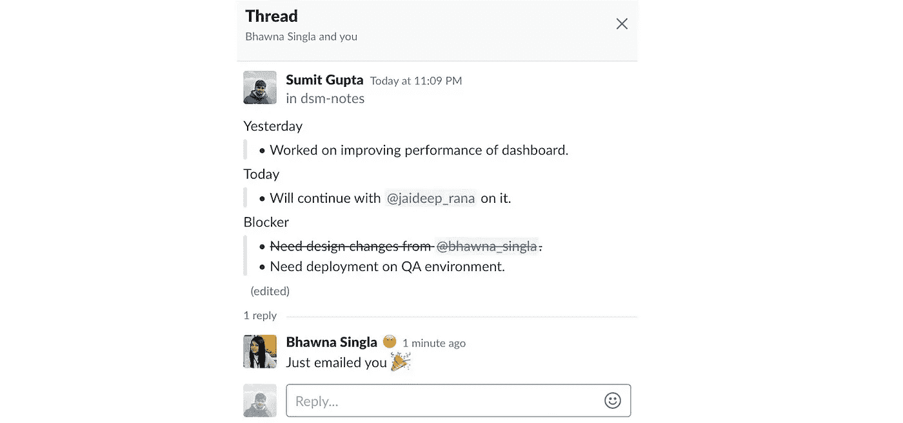

# 如果我们每天都在懈怠中挣扎/站立会怎么样？

> 原文：<https://medium.com/hackernoon/what-if-we-do-daily-scrum-stand-up-over-slack-59e61d72dc8b>

## 让我们开始节省时间吧。避免这种大型耗时的仪式。它太老了，我们已经进化过了它。

我已经实践敏捷方法有一段时间了。我见过的敏捷团队最常见的仪式是起立，也称为每日 scrum [会议](https://hackernoon.com/tagged/meeting)。

我不会深入讨论什么是 stand up 或 daily scrum，以及它带来了什么价值。
我欣赏它带来的价值，并鼓励团队虔诚地遵循这个仪式。

我见过的每个团队都以类似的方式开会。他们站成一圈，每个人都提供他们的更新。这个方法听起来不错，但实施起来却有许多问题。

我已经列出了我看到的一些问题。

*   站起来就是开会。不管方便与否，每个人都亲自参加或随叫随到。有些人可能喜欢晚一点开会，但其他人可能想在上午 9 点开会。将会议推迟可能是一个挑战。为什么？看下一题。
*   站立往往成为一天的开始。我合作过的每个团队都有这个问题。大多数团队成员在会议前或中途来到办公室。即使他们来得早，他们也不会开始工作，因为他们知道再过 15 分钟左右就要开会了。
*   人们可能会忘记重要的更新，因为他们在最后一分钟或很晚才出现，而且没有准备好。
*   不出现的人会错过大家的更新。每个人都错过了他们的更新。
*   单口相声要花很多时间。它们旨在缩短时间，但通常会超出时间限制。我见过小团队专注于更新，大团队有太多的人有模糊的更新。
*   不是每个人都对每个人的更新感兴趣。对于更大的团队来说尤其如此。
*   人们开始在站立会议中解决问题或引发讨论。有人可能知道一个阻碍的解决方案，他们觉得必须解释它。有人可能会用它来讨论新的想法。一个问题可能会导致人们在会议中途重新计划事情。

人们可以争辩说，所有这些都可以用这样或那样的方法解决。但是所有这些方法都很难实现，需要每个人都保持警觉。

解决所有这些问题的另一种方法是使用像 [Slack](https://slack.com/) 这样的即时通讯应用。

创建一个群组或频道，让每个人都可以发布他们的更新，如要点或清单。

我看到的一些好处。

*   最大的，少一个要参加的会议。
*   何时共享/读取更新的灵活性。人们可能想在一天结束时分享更新，更容易记住你做了什么。或者在早上拉屎的时候。
*   没有开始一天的仪式。每个人多出来的时间加起来很多。
*   人们在写下时不会忘记更新，他们会有时间思考。
*   没有人会错过任何人的更新。
*   休假的成员也可以阅读旧的更新，加快速度。
*   人们可以浏览不相关的更新。
*   没有人的时间浪费在冗长的会议和不合时宜的讨论上。
*   成员可以使用 slack 来讨论更新。此外，有时这些更新和讨论是重要的，现在你有一个地方可以回顾。

也有 slack 机器人来简化这个过程。你也可以探索它们。或者您可以将更新作为消息发布。人们可以通过回复消息来创建主题。

这是松弛状态下的线程的样子。人们可以回复，讨论也可以进行。

创建讨论线索可以清除混乱，让阅读更新变得轻而易举。

我还没试过用 Slack 来代替 stand up。但是在站立会议上，每当讨论开始时，我都会幻想。

在你的站立会议中，你面临类似的挑战吗？

很想知道什么对你有用。

## 如果你喜欢这篇文章，请点击👏按钮并分享，帮助其他人找到它！欢迎在下方留言评论。

在我的[博客](https://www.plightofbyte.com/)上查看更多我的文章。