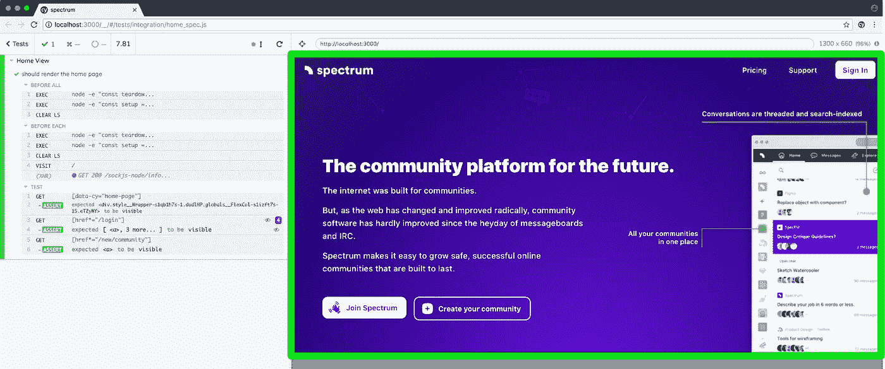

# 如果您的 e2e 测试生成了您的用户文档会怎么样？

> 原文：<https://medium.com/hackernoon/what-if-your-e2e-tests-generated-your-user-documentation-baefe3ebaee9>

访问 https://www.mikenikles.com 的****获取我的最新博文。****

**和我一起裸露一会儿，而我散发一些光💡在那上面。**

**我认为公平地说，软件开发人员理解编写测试的重要性；近年来，我确实看到了这方面的巨大进步👍。
公平地说，最新的文档在许多层面上都非常有帮助:开发人员提升得更快，非开发人员同事更好地理解系统，最重要的是，面向用户的文档(如果写得好并被用户阅读)提高了用户满意度。**

## **编写测试**

**引用吉列尔莫·劳赫的话:**

**坦白地说，这在过去非常耗时。时代已经变了，像 cypress . io([https://www.cypress.io/](https://www.cypress.io/))这样的工具并没有过度承诺“*对任何在浏览器中运行的东西进行快速、简单和可靠的测试。***

**在这篇博文中，我将重点介绍 Cypress.io 的视频记录以及如何利用它。想了解更多，推荐[https://docs . cypress . io/guides/guides/screen-and-Videos . html # Videos](https://docs.cypress.io/guides/guides/screenshots-and-videos.html#Videos)。**

## **编写文档**

**知道了如何编写集成/端到端测试，让我们把注意力集中在目前仍然相当黑暗的领域(基于我的经验):文档。**

**作为开发人员，我们中的许多人喜欢构建功能、解决问题、部署代码，这样的例子不胜枚举。我很少看到“写文档”被列在拉式请求模板的任务列表中，更不用说当同事被要求写文档时脸上的兴奋了😜。**

**同样，这是因为它很耗时，比 e2e 测试更耗时，很快就会变得陈旧，对读者来说毫无用处或令人困惑。**

***(如果你确实想撰写和发表文档，值得研究一下*[*https://docusaurus.io/*](https://docusaurus.io/)*)。***

**那么，如果文档可以自动生成并与源代码保持同步，那么 web 应用程序中的用户界面将与文档中呈现的内容 100%相同——永远如此😮！**

## **让测试生成文档**

**我最近开始花一些空闲时间为 https://github.com/withspectrum/spectrum 做贡献，努力回报我真正相信的一个项目，以及我向朋友和同龄人推荐的一个产品，以便在许多网络社区中与志同道合的人联系。**

**Spectrum 使用 Cypress.io 进行端到端测试。在撰写本文时，存在 104 个测试，大约在 15 分钟内完成。现在，还记得我上面提到 Cypress.io 的视频录制功能吗？这在 Spectrum 的代码中启用，在我运行测试后，我有了一个视频文件，我可以观看、暂停和继续，以获得 Spectrum 功能的高级概述。**

**在我作为软件开发人员的职业生涯中，我第一次对跳入现有的代码库感到兴奋！**

## **下一步:生成用户文档**

**到目前为止，我们已经:**

*   **产品特性的端到端测试(愉快的经历和错误的案例)**
*   **一段 15 分钟的视频，直观展示如何使用产品功能**

**那么为了生成用户文档，我们下一步需要什么呢？**

****较短的视频，理想情况下每个产品功能一个视频。在 Spectrum 的例子中:展示如何注册账户的视频或解释如何加入社区的视频。
解决方案可能是:测试代码可以使用`describe('', () => {})`或`it('', () => {})`块的命名约定来指示哪些测试应该独立运行，从而创建单独的视频。类似于`it('DOC: Register for an account', () => {})`的东西。然后，一个脚本运行`DOC:`测试，并将生成的视频复制到一个`./docs/videos`文件夹中，在那里可以在 web 应用程序的内嵌帮助功能中引用它们。****

****将视频裁剪成对用户重要的内容** cypress . io 生成的一个视频截图是这样的:**

****

**Screenshot of a video generated by Cypress.io e2e tests**

**对于最终用户文档，我们需要的是 web 应用程序本身，即标有绿色矩形的部分。作为视频，左侧描述的步骤按顺序执行，在右侧显示 web 应用程序。
捕获绿色部分的解决方案是在 Cypress.io 中设置一个标志，或者找到一种以编程方式裁剪视频的方法。**

****将视频显示为内嵌帮助** 这部分可以通过添加一个内嵌帮助指示器来实现(通常是一个简单的？)在用户没有与之互动的产品功能旁边。一点击那个？，生成的视频就如何使用该功能播放。**

## **结论**

**凭借 Cypress.io 的视频录制功能、一个 web 应用内联帮助系统和一点胶水代码，我看到了一个未来，web 开发人员将专注于编写健壮、经过良好测试的代码，并或多或少地免费获得一口大小的最终用户视频文档。**

**几个星期以来，我一直在考虑这个想法。如果任何人有一些想法，请不要犹豫，伸出手来。**