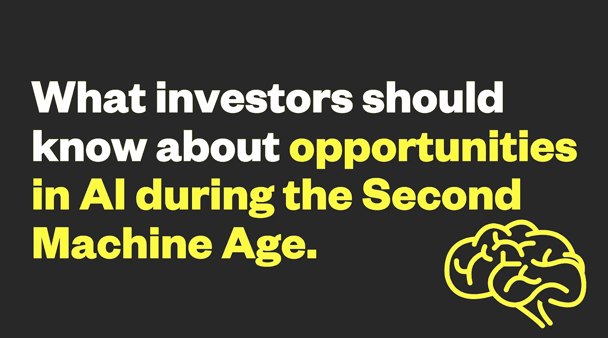
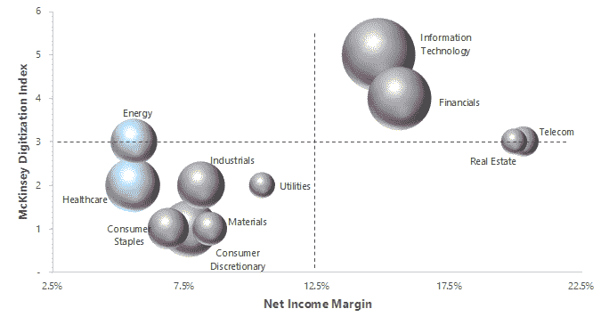

# 投资者应该了解第二个机器时代的人工智能机遇

> 原文：<https://medium.com/hackernoon/what-investors-should-know-about-opportunities-in-ai-during-the-second-machine-age-3beaf62a01bb>

MBA 暑期助理马利克·纳布西

> “人工智能问题被认为是让一台机器以人类可以称之为智能的方式运转的问题。”
> 
> *— 1955 年达特茅斯研究项目建议书*

人工智能(AI)作为一个概念，已经有几十年的历史了。但是，直到现在，我们才看到这种科幻小说般的技术在现实生活中的应用。人工智能于 1955 年正式诞生，在过去的半个世纪里，它经历了几个大肆宣传和停滞不前的时期。这种波动部分是由于所需基础设施(数据和处理芯片)和机器学习(ML)方法(计算机如何从数据中学习)的错误开始。但是，去年对人工智能/人工智能初创公司的创纪录的 60 亿美元风险投资，以及最近在深度学习方面的突破，都指向一个共识:人工智能永远在这里。企业如何以及何时在运营中采用人工智能将是在“第二个机器时代”保持竞争力的核心。

在 Lerer Hippeau 的 MBA 暑期实习期间，我选择更深入地研究人工智能采用的关键推动因素，并将真正的风险投资机会与当前融资环境中的噪音区分开来。我对制造业和 B2B 行业的可防御性的观点，是通过在这些行业的五年咨询和投资而形成的，在我的研究和与人工智能专家的交谈中得到了扩展。

我着手定义人工智能和机器学习技术，探索投资和采用之间的关系，并为投资者提供一个在该领域实现风险规模成果的框架。这是我的外卖。

Malik Nabulsi is going into his second year at the University of Chicago Booth School of Business. He’s spent the last three months as a Summer Associate.

# 人工智能:目标、应用、驱动因素

人工智能可以分解为一组机器任务(或目标)和实现这些目标的技术。

人工智能旨在实现各种目标，从识别图像中的物体，到为自动驾驶汽车和应用机器人提供动力。实现这些目标的最流行的技术之一是机器学习(包括[深度学习](https://www.forbes.com/sites/bernardmarr/2016/12/08/what-is-the-difference-between-deep-learning-machine-learning-and-ai/#427d6df326cf))，或计算机科学的一个领域，使计算机能够在没有显式编程的情况下学习。自 21 世纪初以来，公司一直在使用人工智能来增强工作流应用程序(如 InsideSales)或优化产品推荐(如亚马逊)，但[最近在深度学习方面的突破](https://www.technologyreview.com/s/513696/deep-learning/)迎来了新一波将人工智能作为核心价值主张的公司。

“[以人工智能为中心的](https://venturebeat.com/2017/11/25/ai-adoption-is-limited-by-incurred-risk-not-potential-benefit/)”和“[人工智能支持的](https://venturebeat.com/2017/11/25/ai-adoption-is-limited-by-incurred-risk-not-potential-benefit/)”解决方案是当今人工智能技术最先进的应用。以人工智能为中心的解决方案解决了低风险的用例，并完全围绕人工智能构建。换句话说，如果底层的人工智能失败了，这些应用程序充其量只是商品化的工作流解决方案。自动安排约会的 Lerer Hippeau 投资组合公司 X.ai 是一家以人工智能为中心的公司的绝佳例子。

另一方面，人工智能应用只有在最近机器学习取得突破的情况下才有可能实现。这些解决方案使用人工智能来帮助预测未来的事件或结果。例如，投资组合公司 [Augury](https://www.augury.com/) 利用其专有的机器振动和声学特征数据库，在工业设备故障发生前对其进行预测。

在我们看到的人工智能进化的拐点背后有三个关键驱动力:

1.  **数据激增**:随着物联网和日益数字化的服务的兴起，产生了海量的数字数据。
2.  **更快的硬件**:支持机器学习计算的处理芯片正以更低的成本变得更加强大。在 2002 年，今天普通游戏 PC 中的处理芯片将被列为世界上最强大的超级计算机。
3.  **更好的算法**:谷歌的 TensorFlow 等开源框架已经向全球开发者提供了强大的机器学习算法，加速了更高级用例的开发。

这些促成因素为人工智能的变革潜力开启了更广阔的空间。随着实时预测技术的进步，企业可以**更准确地预测**增长。考虑到工作流程和输入的优化，制造商可以**更高效地生产**产品。营销人员可以利用个性化和针对性来推广转化率更高的活动。品牌可以**通过自动化和便利性提供**更多增强的用户体验。

# 投资与采用

作为回应，在过去十年中，对该领域的投资一直保持着创纪录的增长趋势。2017 年，风投对 643 家美国人工智能/人工智能初创公司投资了 60 亿美元，是 2008 年投资额的 12 倍。尽管如此，这个数字只是麦肯锡估计包括谷歌和百度在内的大型科技公司 2016 年内部研发支出 200-300 亿美元的一小部分。然而，仔细看看所有行业的人工智能采用率，就会发现与全球投资的速度和规模惊人的矛盾。根据波士顿咨询公司的调查数据，在全球最大的经济体中，只有 16%的公司在一个或多个用例中实施了人工智能。

解开这一差距的原因是理解 AI/ML 中存在风险规模机会的第一步:

1.  生产率悖论:我们看到差距的第一个原因与人工智能作为“通用技术”(GPT)的分类有关，就像电力或互联网一样。今年夏天早些时候，[芝加哥大学的经济学教授 Chad Syverson 就这个话题](https://www.dallasfed.org/-/media/Documents/research/events/2018/18ted-syverson.pdf)向达拉斯美联储发表演讲。具体来说，他解释说，GPT 需要在采用和生产力真正起飞之前发明和安装补充资产。总之，人工智能可能需要几年，如果不是几十年的话，才能实现标准化，因为利益相关者必须首先了解并应用该技术到他们特定的商业案例中。
2.  **横向(相对于纵向)AI:** 第二个原因与迄今为止投资资本流向有关。人工智能的大部分投资都投向了水平人工智能，而不是垂直人工智能。前者寻求在各种用例中实现机器任务的民主化。例子包括谷歌的 DeepMind 或寻求推进自然语言处理的初创公司。如今，这一领域面临的挑战是，相对于大型科技公司的替代品，初创公司越来越多地面临价格和数据方面的劣势。更重要的是，横向 AI 不会围绕客户的核心问题定制解决方案和工作流。

商业采用需要用例特定的解决方案，加上迄今为止大多数投资都投向了横向人工智能，这两个因素的结合为垂直人工智能解决方案的投资创造了一个令人兴奋的窗口。

# 风险规模的机会:

> **通过识别从人工智能采用中获益最多的行业，并与寻求用人工智能/人工智能解决优先行业问题的创始人合作，投资者可以更有效地识别该领域的风险投资机会。**

## 最有前途的部门

投资者应该考虑现状盈利能力(和生产力)、总可寻址市场(TAM)和行业数字基础设施的质量，以最好地识别人工智能的投资机会。为了直观显示整个标准普尔 500 的情况，我根据下图中的三个变量绘制了每个行业的地图:

The size of the bubbles in the graph represents the relative size of the industry. The x-axis measures the average industry profit margin, and the y-axis measures digital maturity. This index, developed by McKinsey, captures the quality and magnitude of the digital data that each sector generates.

这里的关键要点是，能源和医疗保健这两个相对较大的 tam 最有可能被人工智能破坏，因为它们的数字基础设施(“数据领域”)的质量在不断改善。

**医疗保健**:2016 年美国医疗支出为 3.3 万亿美元，这代表着人工智能在整个行业实现成本节约的巨大机会。根据麦肯锡[的调查数据](https://www.mckinsey.com/~/media/McKinsey/Industries/Advanced%20Electronics/Our%20Insights/How%20artificial%20intelligence%20can%20deliver%20real%20value%20to%20companies/MGI-Artificial-Intelligence-Discussion-paper.ashx)，垂直领域的早期采用者预计，到 2020 年，人工智能将通过自动化劳动密集型工作流程，将运营利润率提高 5 个百分点。

*   **建议**:在价值 650 亿美元的药物研发和临床试验市场中，医疗保健行业的初创公司在降低风险和提高效率方面有很大的发展空间。加速药物管道对制药公司来说至关重要，随着大型企业寻求减轻科学发现、临床试验注册和医疗坚持方面的结构性低效，投资者应该会看到并购活动加剧。

**能源**:2016 年美国能源支出为 1.0 万亿美元，代表着人工智能颠覆的又一个充满希望的机会。智能电网、物联网和储能技术的最新进展旨在进一步数字化一个历史上一直在数据可用性和波动性方面苦苦挣扎的行业。

*   **建议**:人工智能计划潜在影响最大的领域是石油和天然气行业，考虑到该行业的资本密集型性质，以及现在将地质数据与历史生产数据相结合的能力。高盛(Goldman Sachs)估计，由人工智能推动的库存和生产成本 1%的改善将在十年内节省 1400 亿美元。

## 垂直人工智能商业模式蓄势待发

数据聚合和统一不再足以在人工智能领域建立长期竞争优势。以人工智能为中心和支持人工智能的应用程序的兴起，要求投资者评估产品防御性的方式发生范式转变。因此，投资者应关注以下价值驱动因素:

1.  **全栈产品**:该公司是否提供全栈、完全集成的解决方案来解决一个主要的行业问题？通过拥有从用户界面到底层机器学习模型和功能的完整数据价值链，垂直人工智能初创公司可以更有效地改进他们的算法，并获得更好的定价能力。
2.  **领域+ ML 专长**:创始团队是否包括主题和数据科学专家的组合？这种伙伴关系在高风险用例中尤其重要，如医疗保健和能源，在这些用例中，规模需要客户和管理团队之间的信任。
3.  **专有数据**:公司是否已经建立了一种价值复合且难以复制的数据资产？这个因素对于防御能力来说是最关键的，包括为训练机器学习模型而获取的数据，以及来自客户的持续数据流。
4.  **AI 优先**:AI/ML 驱动核心价值主张吗？底层 AI/ML 技术必须是为客户创造价值的核心，而不是仅仅作为一个优化层或功能。

## 跟上我们的社区。订阅[每日综合报道](http://lererventures.us6.list-manage.com/subscribe?u=d34b43a395d6f0cc105a42bf1&id=68fc2c8f4e)，在[推特](https://twitter.com/LererHippeau)和 [Instagram](https://www.instagram.com/lererhippeau/) 上关注我们。