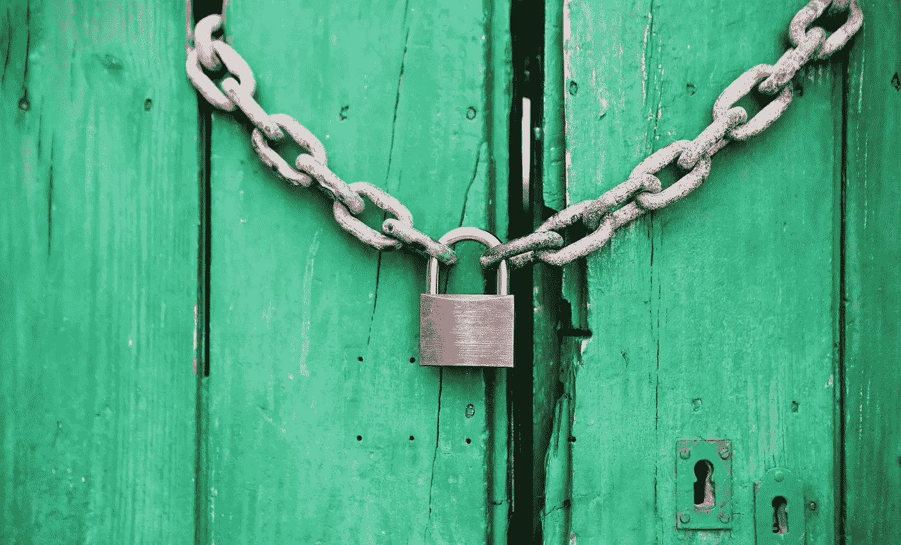
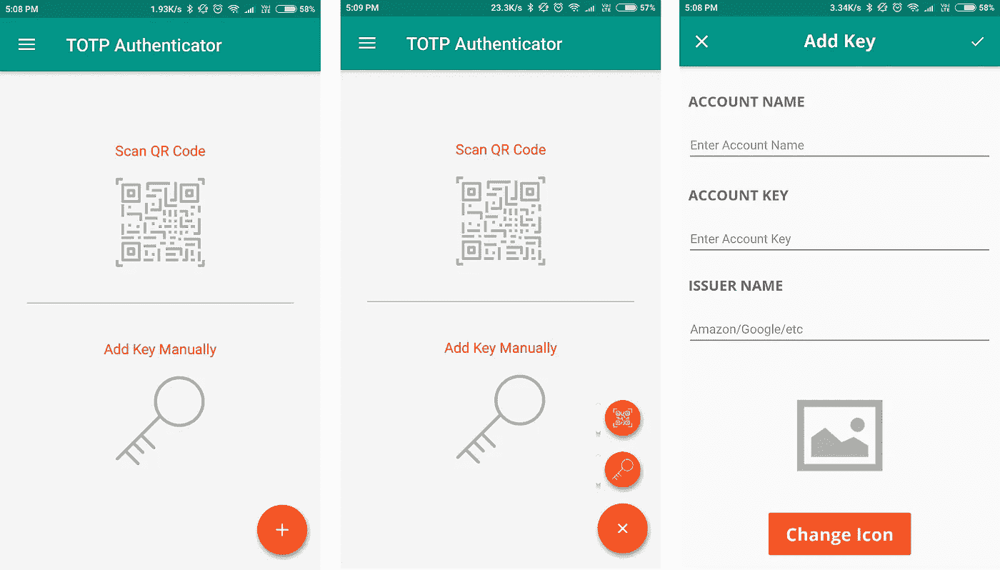
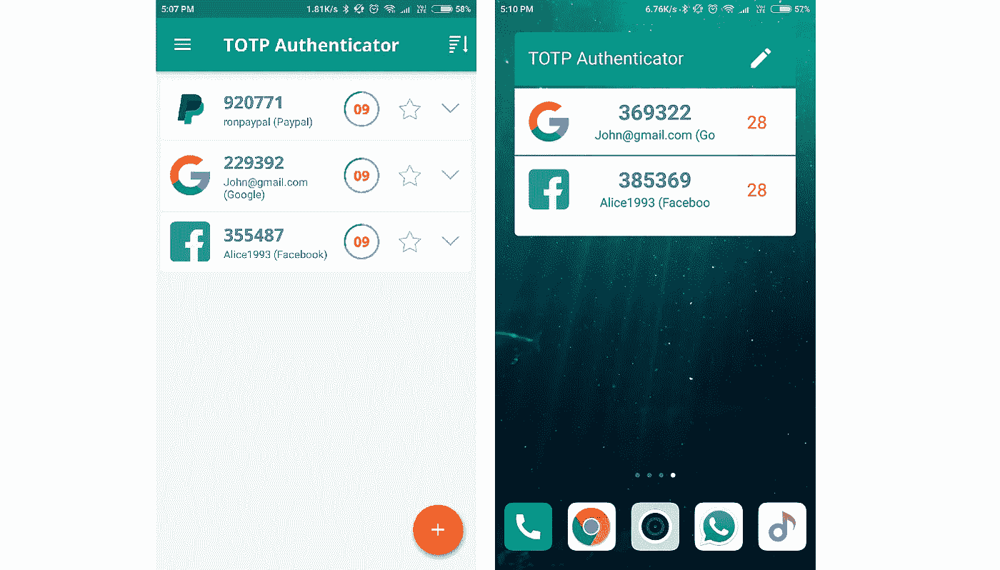

# 什么是双因素身份认证，为什么要关注它？

> 原文：<https://medium.com/hackernoon/what-is-2-factor-authentication-and-why-you-should-care-e8af5808d499>

在我们生活的数字世界中，我们的虚拟身份变得和真实身份一样重要。我们越来越意识到我们的虚拟存在、社会活动以及我们在网上的行为和形象。

随着数字欺诈和黑客攻击创下新高，保护你的账户和数据安全成为每个人的首要任务。

一旦有人进入你的账户，他们不仅会给你造成经济损失，还会损害你的声誉和形象。根据[威瑞森 2017 年数据泄露调查报告](https://www.ictsecuritymagazine.com/wp-content/uploads/2017-Data-Breach-Investigations-Report.pdf)，81%的黑客入侵利用了被盗和/或弱密码。

因此，越来越多的网站比以往任何时候都更加重视网络安全[。可以将任何一个小单词作为密码的日子已经一去不复返了。现在大多数网站要求你在密码中使用数字、特殊符号或两者的组合。这大大提高了您抵御暴力攻击的安全性。](https://hackernoon.com/tagged/security)

使用复杂的密码并不能完全解决安全问题。由于我们倾向于在任何地方重复使用相同的密码，如果您的一个帐户受到威胁，可能会产生巨大的后果。根据 TeleSign 进行的一项调查，73%的网上账户受到重复密码的保护，54%的人在整个网络生活中使用五个或更少的密码。

我们倾向于在所有的数字锁中使用相同的钥匙，使得钥匙的丢失具有很高的风险。

> 81%的黑客入侵利用了被盗和/或弱密码。—2017 年威瑞森数据泄露调查报告

解决这个问题的一个方法是为每个帐户使用一个唯一的密码。但除非你有超强的记忆力，否则这是不可行的。试图记住每个网站不同的密码是不现实的。相反，你可以使用像 [LastPass](https://www.lastpass.com/) 这样的密码管理器将你所有的密码保存在一个安全的保险箱里。

但是设置唯一的密码是不够的。尤其是对于重要的账户，如电子邮件账户、社交媒体网站和存有您财务信息的网站。

这些网站确实了解他们的责任，并倾向于提供高级安全选项。任何网络安全漏洞不仅会影响用户，也会影响这些组织。从大公司到小企业再到初创公司，所有组织都可能因为黑客攻击而遭受严重的财务和声誉损失。

尽管网站以加密格式保存你的敏感信息，如密码，但这只是故事的一半。这确实有助于防止服务器级别的数据泄露，但它没有考虑到用户自身的错误和故障。

> 73%的网上账户由重复密码保护，54%的人在整个网络生活中使用五个或更少的密码。—由 TeleSign 进行的调查

这就是为什么越来越多的公司开始重视用户的安全。实现这一点的步骤之一是使用双因素身份认证。

# 什么是双因素身份认证？

在传统的流程中，只有一层安全，那就是你的密码。你输入密码，瞧，你就可以进入你的账户了。但如上所述，这个过程是好的，但不是伟大的。

双因素身份验证(2FA)为登录过程增加了另一层安全层，减少了帐户被黑的机会。在这种情况下，仅仅知道并输入您的密码是不够的。这个新层可以是任何东西，比如发送到您手机上的 OTP、自动生成的代码或您拥有的设备上的生物特征验证。所有这些额外的步骤都是时间敏感的，使它们更加安全。

根据网络安全公司赛门铁克(Symantec)的一项研究，80%的数据泄露可以通过使用双因素身份认证来消除。

2FA 的工作原理类似于为什么网站会要求你确认你的邮件。他们想确定这个请求是来自你。这里也是如此。2FA 确保密码不足以让人冒充你。双因素身份认证通常以两种方式之一工作:

## **1。OTP(一次性密码)**

在这种情况下，输入密码后，公司/网站会通过电子邮件、短信或电话向您发送一次性密码。该随机密码范围可以从数字代码到字母数字串。一旦您输入此代码，您就可以访问您的帐户。

OTP 代码是在服务器上生成的，因此用户需要某种连接才能接收代码。

这种方法在银行业越来越受欢迎。这有助于银行防止欺诈，以防信用卡信息落入他人之手。但是因为发送 SMS 或呼叫需要资源并且可能给组织或用户带来财务负担。

> 使用双因素身份认证可以消除 80%的数据泄露。—赛门铁克的研究。

## 2.TOTP(基于时间的一次性密码)

这种认证方法避免了上述方法的连接需求。在这种情况下，使用预定义的标准 RFC 6238 算法在您自己的设备上生成安全代码。该算法会定期自动生成临时密码，而无需连接到互联网或蜂窝网络。输入密码后，您可以使用此代码登录您的帐户。

该代码是通过共享密钥和当前时间戳的组合生成的。时间戳部分确保密码每次都是唯一的。该代码每 30 秒重新生成一次，使得任何黑客都很难伪造该代码。

脸书、Twitter 等大公司广泛使用 TOTP 来为用户提供更好的安全性。尽管双因素身份验证在默认情况下是关闭的，但您可以轻松打开它并设置您的设备。

## 我如何设置 TOTP 安全？

要设置 TOTP 身份验证，您需要:

1.  在网站上启用双因素安全选项。
2.  下载一个方便的应用程序/获得一个硬件安全设备。(两者都会为您生成代码。)

## 1.为帐户启用 2FA

要启用 2FA，您首先需要检查网站是否支持双因素身份验证。转到您想要为其启用该功能的网站的设置页面，看看是否可以找到双因素身份验证的选项。提示:它通常在安全标签下。)

例如，在脸书上，进入“设置”>“安全和登录”>“使用双重身份验证”来启用该功能。

一旦你选择启用该功能，你会收到一个二维码，然后你可以用你的身份验证应用程序扫描它。或者，屏幕上也会显示一个字母数字键，您可以手动输入，而不是扫描二维码。

在某些情况下，还会为您提供备份代码，以便在您无法访问身份验证应用程序时提供帮助。您可以将这些代码保存在安全的地方或打印出来。

差不多就是这样，无论你下次什么时候想登录网站，你都需要输入你的静态密码，然后输入应用/硬件设备生成的代码。需要记住的一点是，代码每 30 秒自动生成一次。

## 2.设置和使用验证器应用程序

市场上有许多支持 TOTP 的应用程序，如 Google Authenticator、Authy、Microsoft Authenticator 等。

但是根据我们的研究和经验，我们在 [BinaryBoot](http://www.binaryboot.com) 觉得即使这些应用是免费的，它们都缺少这样或那样的功能。例如，Google Authenticator 不允许你备份或复制你账户的密钥，因此在你的手机丢失的情况下，你会感到无助。

我们开发了 TOTP 认证应用程序来解决这个问题。我们的目标是开发一个具有无缝用户体验的应用程序，提供用户在身份验证应用程序中需要的所有功能。这款应用可以在 iOS 平台和安卓平台上运行。

双因素认证器应用程序的好处是，大多数这些应用程序通常具有相同的设置过程和基本功能。出于本教程的目的，我将使用 TOTP 认证应用程序的例子。要为新帐户设置应用程序，流程如下:

1.  **扫描二维码/手动输入钥匙。**

您可以点击屏幕右下角的“+”符号，选择是“扫描二维码”还是“手动输入密钥”。如果你扫码，帐户会自动添加到应用程序中。但如果选择手动输入密钥，你需要输入帐户名称(如登录电子邮件 id)，密钥和发行人名称(如脸书，推特)。在这两种情况下，您也可以选择或上传您选择的图标。

***提示*** *: TOTP 认证器允许你以加密格式备份你的帐户名和密钥。您可以将此备份保存在您的设备或云上。您也可以在切换手机时导入相同的备份。*

You can either scan the QR code to setup or manually enter the details.

2.**使用代码。**

初始设置后，您可以在没有网络连接的情况下使用该应用程序。

该应用程序将显示每个帐户的密码，以及代码处于活动状态的时间段。密码每 30 秒过期一次，并被新密码取代。您还可以添加一个 widget，在主屏幕上显示密码，以便更快地访问。

You can access the codes either inside the app or by adding a widget.

**注意:**你也可以得到一个硬件安全令牌生成器，而不是手机 app。硬件设备消除了你对手机代码的依赖，但你必须携带另一个设备。还有，要花钱。

## 双因素身份认证的局限性

也许和 2FA 一样好，但它不是防弹的。您的手机可能会没电，或者意外停止工作，从而锁定您的帐户。

万一你的手机被盗，你很容易受到攻击，因为其他人可以访问代码来冒充你。尽管有这些限制，2FA 是大幅提高虚拟安全性的最简单的方法。

## 您应该使用 2FA 的客户

对于保存个人或敏感数据的网站和服务，强烈建议使用双因素身份认证。我们强烈推荐使用 2FA 的一些站点有:

1.  谷歌账户(它是我们大多数虚拟存在的支柱)
2.  电子邮件帐户(如果您不使用 Gmail 帐户)
3.  银行网站(不言自明)
4.  云存储帐户(Dropbox、OneDrive 等)
5.  社交网络(脸书、推特、LinkedIn 等)
6.  密码管理器(最后一遍)
7.  通信应用程序(Slack、Skype、MailChimp 等)

# 行动呼吁

您的数字安全非常重要，而且风险比您想象的要大。双重身份认证使网络罪犯更难侵犯您的隐私。

如果你是用户，最好为所有提供该功能的网站设置 2FA。每次你想登录你的帐户时，这可能需要一些额外的努力，但与你在帐户被劫持的情况下可能面临的麻烦相比。如果你正在寻找一个简单而功能丰富的认证应用程序，你可以尝试 TOTP 认证。[ [点击此处](https://itunes.apple.com/us/app/totp-authenticator/id1404230533?mt=8)下载 iOS 版] [ [点击此处](https://play.google.com/store/apps/details?id=com.authenticator.authservice2)下载 Android 版]

如果您是 web 开发人员或企业所有者，您应该评估您的服务的安全性，以及提供双因素身份验证工具是否适合您。

注意安全:)