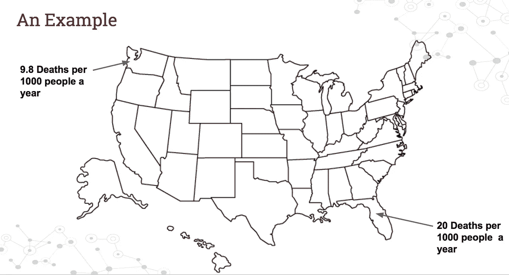
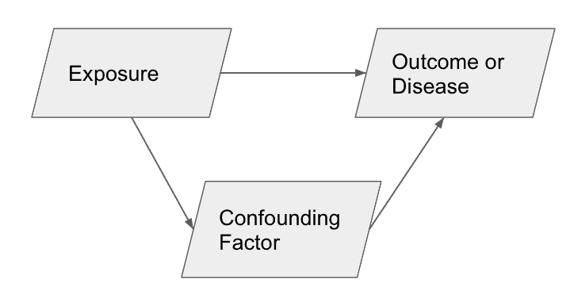
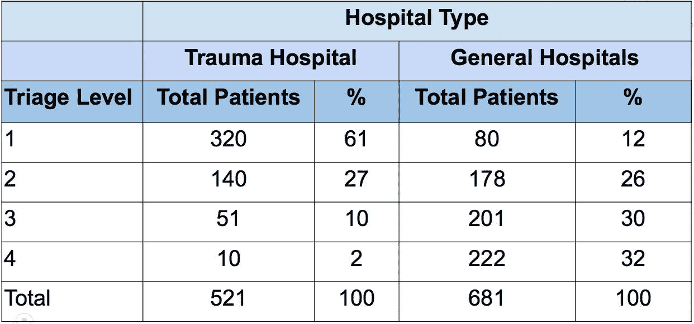
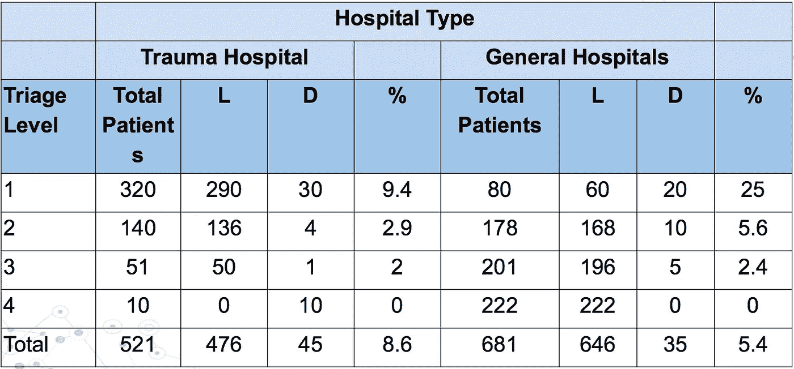
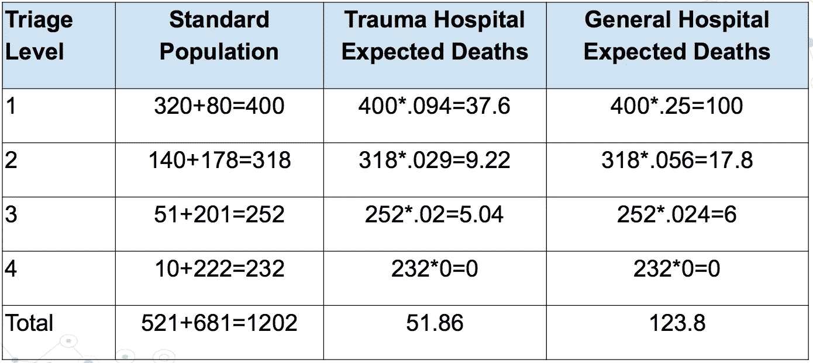

# 什么是混杂变量

> 原文：<https://medium.com/hackernoon/what-is-a-confounding-factor-6f30487de3e9>

假设一组研究人员或数据科学家发现，佛罗里达州的死亡率是每年每 1000 人中有 20 人死亡，而华盛顿州是每 1000 人中有 9.8 人死亡。

由于非常担心，这些研究人员提出了一项耗资数百万美元的提案，试图找出如何降低佛罗里达州的死亡率。但是，他们忘了再深入挖掘一点。他们忘了检查这两个州人口的平均年龄。如果佛罗里达州的平均年龄是 52 岁，而华盛顿是 25 岁，这可能是死亡率的一个因素。在这种情况下，年龄扮演了一个**混杂变量**的角色。

未被考虑但在事件结果中起作用的变量被认为是混杂因素。

在流行病学中，混杂变量是指作为疾病风险因素的变量，或与疾病暴露相关但不是实际暴露的变量。混杂变量不仅限于一种疾病。在为产品推荐开发算法时， [A/B 测试](https://www.optimizely.com/optimization-glossary/ab-testing/)或市场细分混淆变量可能会潜入并误导希望创建有效算法的数据科学家和分析师。

这可能导致无效的结论和不正确的比较。例如，就华盛顿和佛罗里达的死亡率而言，你是在比较两个不同的人群。这更像是把[苹果比作](https://www.kdnuggets.com/2016/07/clevertap-how-compare-apples-oranges-variance-part3.html)橘子。虽然在这种情况下，你是在比较人与人，但人群有不同的属性，这使得他们进行比较是不公平的。

为了减轻这种情况，有两个具体的选择。一个是将人口发展成更集中的类别，如年龄。另一种可用于标准化死亡率等测量值的方法是使用直接调整率。使用直接调整比率可以创建标准化的

If you would prefer, you can watch a video that will discuss this same concept.

# 混淆变量的真实例子

假设你想比较两个群体的结果。在这种情况下，假设您正在比较创伤医院和普通医院的病死率。这个例子实际上是基于真实的研究完成的[,因为医院很难保持他们的创伤中心开放](https://www.nejm.org/doi/full/10.1056/NEJMsa052049)。

假设创伤医院的[病死率](https://www.britannica.com/science/case-fatality-rate)为 8.6%，而综合医院的病死率为 5.6%。从这个角度来看，如果我们去综合医院似乎会更安全，因为去创伤医院似乎会导致更大的死亡机会。这是一些人通过阅读这些数字得出的假设，而且这并不是基于这些数字得出的一个很遥远的结论。

然而，在这种情况下，我们忽略了访问两家医院的患者在入院时可能受到的伤害或创伤程度。在这种情况下，我们称之为分类级别。技术上有 5 个级别。为了减少数学量，我只考虑 1-4。希望…当他们被认为是 5 级时，不会有太多的病人死亡。

观察去外伤医院或综合医院的不同病人的分布。你可能会注意到，不同类型的病人去了不同的地方。我们发现，与普通医院相比，到创伤医院就诊的 1 级伤检分类患者比例要高得多(创伤医院 320 例，普通医院 80 例)。这是有道理的，你应该把更多的一级伤检分类病例转到创伤医院。

然而，两个数据集之间的差异在下表中变得更加明显。

This graph depicts the amount of patients who live and died after their hospital experience. L stands for lived, D stands for died.

这里我们看到了每一个分流级别死亡率的差异。因此，尽管创伤医院的总体病死率要高得多，但综合医院一级分流的总体死亡率更高(创伤医院为 9.4%，综合医院为 25%)。这意味着，如果有更多的患者被送到综合医院进行一级分类，他们的病死率很可能会更高。

现在，下一个问题是，我们如何调整比率，以便更公平、更简明地比较每种医院类型的病死率？

这就是这张决赛桌发挥作用的地方。目标是通过将两个群体相加来创建一个标准化群体。然后，我们在新的标准化人群中使用每种医院类型的死亡率百分比。

这使得两个群体的比较更加公平。最终，创伤医院的 1202 人中没有 51 人死亡，普通医院的 1202 人中没有 123 人死亡。

这反过来提供了一个非常不同的故事，一个更公平的比较。现在，创伤医院的新死亡率为 4.3%，而普通医院为 10.3%。

当这些数字提供给医院管理者时，他们会对实际发生的事情有一个更清晰的了解。有了这些信息，他们可以做出更明智的决定，而不必问太多的背景，如果他们这样做了，那么你可以解释你的方法。然而，这种方法避免了在没有先问好问题的情况下做出错误的假设。

混杂变量存在于研究相关性的每个领域。因此，重要的是要超越最初的结果，质疑你所看到的数字是否有潜在的原因。

为董事和经理编写报告时，重要的是考虑如何简化复杂的概念，如混淆变量。而是讲述一个完整的故事。当您能够跨多个数据点和图表简明地陈述一个点时，就会出现这种情况。

如果您的团队正在寻找一个数据专家团队来帮助开发您的医疗保健分析，请立即联系我们。

如果您有兴趣阅读更多关于数据科学的信息:

[时间序列模型开发:基本模型](https://www.youtube.com/watch?v=8cKeAH2aGVI&t=51s)

[如何衡量预测模型的准确性](http://www.acheronanalytics.com/acheron-blog/how-to-measure-the-accuracy-of-predictive-models)

[什么是决策树](http://www.acheronanalytics.com/acheron-blog/brilliant-explanation-of-a-decision-tree-algorithms)

[算法如何变得不道德和有偏见](http://www.acheronanalytics.com/acheron-blog/how-do-machines-learn-bias-data-science)

[男装店如何利用数据科学竞赛](https://www.theseattledataguy.com/how-mens-wearhouse-could-use-data-science-cont/)

[R 中时间序列介绍](https://www.youtube.com/watch?v=8cKeAH2aGVI)

[如何开发鲁棒算法](/@SeattleDataGuy/how-to-develop-a-robust-algorithm-c38e08f32201)

[4 数据科学家必备技能](https://www.theseattledataguy.com/4-skills-data-scientist-must-have/)