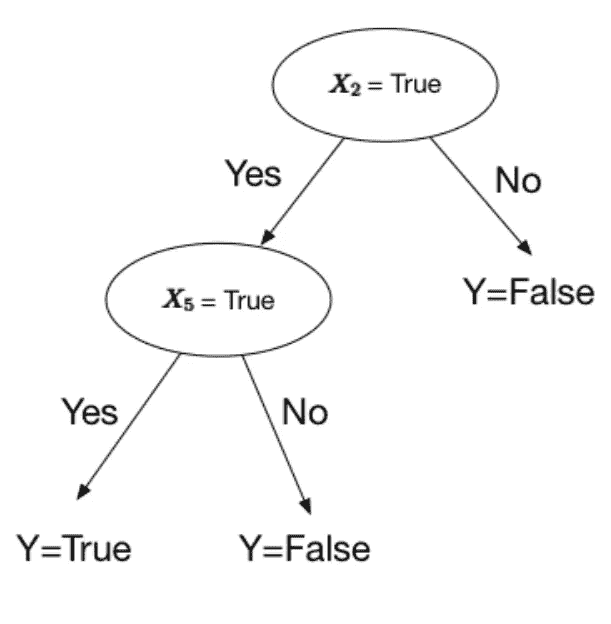
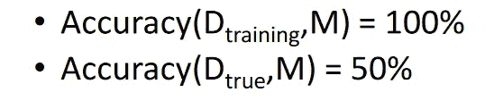

# 什么是机器学习中的决策树？

> 原文：<https://medium.com/hackernoon/what-is-a-decision-tree-in-machine-learning-15ce51dc445d>


决策树，最简单也是最有用的机器学习结构之一。决策树，顾名思义，就是决策的[树](/brandons-computer-science-notes/trees-the-data-structure-e3cb5aabfee9)。

**这篇文章的更新版本可以在这里找到:**

 [## 什么是机器学习中的决策树？

### 决策树，最简单也是最有用的机器学习结构之一。决策树，顾名思义…

skerritt.blog](https://skerritt.blog/what-is-a-decision-tree-in-machine-learning/) 

Taken from [here](https://becominghuman.ai/understanding-decision-trees-43032111380f)

你有一个问题，通常是一个是或不是(二进制；2 个选项)从树中引出两个分支(是和否)的问题。您可以获得两个以上的选项，但是对于本文，我们只使用两个选项。

树在计算机科学中是怪异的。它们不是从根部向上生长，而是向下生长。把它想象成一棵倒挂的树。

在这个例子中，最上面的项目是“我饿了吗？”被称为**的*根*的**。这是一切开始的地方。 ***分支*** 就是我们所说的各条线。一片 ***叶*** 是除了根或分支以外的一切。

树在机器学习中很重要，因为它们不仅让我们可视化算法，而且是机器学习的一种类型。以这个算法为例。


Taken from [here](https://www.wikiwand.com/en/Decision_tree_learning)

这个算法预测了一名乘客在泰坦尼克号上幸存的概率。

" *sibsp* "是船上配偶或兄弟姐妹的数量。每片叶子下面的数字显示了存活的可能性。

对于机器学习树，粗体文本是一个条件。不是数据，是问题。树枝还是叫树枝。叶子是“ ***决定*** ”。这棵树决定了一个人的生死。

这种类型的树是**分类**树。我在这里多讲讲分类。简而言之；我们想把船上的每个人归类为更有可能死亡或幸存的人。

在现实生活中，决策树并不总是那么容易。看看这张照片，振作起来。我会尽可能多地描述它。


😴 — Me when I have to look at this image

这是一棵决策树。它想回答“我能吃这个蘑菇吗？”


Taken from [here](https://www.wikiwand.com/en/Mushroom)

给定一个蘑菇的图像(如左图),我们想知道它是否可以食用。

你看到顶部那些看起来像变量赋值的东西了吗？那些是 if 语句。让我们来看看其中的一个。

*“气味= a:e(400.0)”*

如果蘑菇的气味(*气味*)是杏仁的 *a* ，那么它是可食用的( *e* )，我们有 *400.0* 点信心它是可食用的。这些语句中的每一条都是**的一个特性**。

特征只是对象的属性。自行车的特点是:它有轮子，有把手等等。

我们继续这样做，直到我们到达气味中性的点( *n* )，在这一点上，我们开始检查蘑菇的更多**特征**。

# 使用正式语言制作决策树

好吧，我们可以画出来，但是我们怎么写决策树呢？对此有一个很好的注释。

让我们直接看一个例子。


Sorry for the blurry formula. It’s a problem with screen shotting LaTeX 😢

花里胡哨的小“***”^***的意思是“*和*”。这是一些奇特的数学符号。更多类似的注释，请查看我写的另一篇文章。在这个符号中，当我们看不到连接两个项目的任何东西(如 *x2* 和 *x5* )时，我们假设它是“*和*”。我们想要一个当 *x2* 和 *x5* 都为真时返回**真**的决策树。



好吧，让我们看看另一个。


这个有更多的逻辑符号。你可能想看看我写的这篇文章。好的，“∨”符号的意思是“*或*”，“的意思是“*而不是*”。


Notice how the X1 decision becomes True if X1 is **not** true. This is because of the “not” symbol before it in the formal notation.

# 在树中拆分候选人

决策树是通过从根节点获取数据并将数据分割成多个部分来制作的。


Taken from [here](https://www.wikiwand.com/en/Decision_tree_learning)

以之前的泰坦尼克号为例，我们分割数据，使其最有意义，并与我们现有的数据保持一致。

决策树的一个问题是“*分割数据的最佳方式是什么？有时你会本能地知道，有时你需要算法*

我们希望设计一个函数，当给定一个数据集时，它将相应地拆分数据。

如果我们有数字特征，我们可以根据我们看到的数据来分割它。有许多不同的拆分方式。我们可以对数据集中的所有值进行排序，并决定不同类的实例之间的分割阈值。我们也可以直接从中间切开。分裂算法太多，这里不讨论了。所以我们将通过一个简单的算法。

```
(1, a), (2, b), (1, c), (0, b), (3, b)
```

所以我们有 3 个班级(a，b，c)。我们做的第一件事是把它们分成不同的类别。

```
{(0, b)}, {(1, a), (1, c)}, {(2, b)}, {(3, b)}
```

现在我们有 4 套不同的*电视机*。关于集合论的更多内容，点击这里。

让我们在这里选择一些任意的数字。我们会像这样把它们分开:

```
Split 1 <= 0.5
Split 2 <= 1.5 but > 0.5
Split 3 > 1.5
```


我们现在有一个分离的决策树。如果我们不分割数据，树看起来就不太像树。想象一下，如果我们的分割是“*所有数据小于 3* ”，那么树会是什么样子。一切都会在那里！它不会很像树。

# 奥卡姆剃刀


Image of William of Ockham, from [here](https://www.wikiwand.com/en/William_of_Ockham).

奥卡姆剃刀是 14 世纪奥卡姆的威廉提出的一种哲学。简而言之，引用的是:

> “当你有两个相互竞争的理论做出完全相同的预测时，简单的那个更好。”

我们可以在机器学习中使用这个原则，特别是在决定何时拆分决策树的时候。

> "对训练实例进行精确分类的最简单的树将在以前看不见的实例上很好地工作."

最简单的树往往是最好的树，只要所有其他可能的树产生相同的结果。

# 寻找最佳分割

Gif from [Giphy](https://giphy.com/gifs/rupaulsdragrace-episode-10-rupauls-drag-race-E0Z06zqqlm7jSG6hV2). Sometimes, the subject you’re teaching is just plain old boring. Gif provided to try to alleviate the boredom.

试图找到并返回对训练集进行准确分类的最小可能决策树是非常非常困难的。事实上，这是一个 [NP-hard](https://www.wikiwand.com/en/NP-hardness) 问题。

相反，我们将试图接近最佳结果，而不是得到最佳结果。我们会讲很多概率和统计，如果你想了解更多概率和统计[点击这里](/brandons-computer-science-notes/an-introduction-to-probability-statistics-3f5630824411)。

我们想要的是明确地将数据一分为二的信息。我们不想要既包含男性又包含女性的东西，我们想要纯洁。每次拆分一个单独的类。

这种纯度的度量被称为信息。它表示指定一个新实例应该被分类为左拆分还是右拆分所需的预期信息量。

为了找到最好的劈叉，我们必须先了解一些有趣的事情。

# 预期值

这部分讲的是随机变量。关于随机变量的更多信息，请查看我写的这篇关于统计概率的文章。

期望值就是它听起来的样子，你期望的值是什么？你可以用它来计算 6 次掷骰子的平均分，或者任何与概率相关的有价值的属性。

假设我们正在计算自行车的种类，我们有 4 辆自行车。我们给每辆自行车分配一个代码，如下所示:


对于每辆自行车，我们都给它一个号码。对于每个编码，我们可以看到我们使用 2 位。不是 0 就是 1。对于期望值，我们不仅需要变量的值，还需要概率。每辆自行车都有相等的概率。所以每辆自行车都有 25%的几率出现。

计算期望值时，我们将概率乘以 2 位，得到:


如果概率不相等呢？


我们需要做的是用概率乘以位数


# 熵

这种对*纯度*的度量被称为 [**信息**](https://en.wikipedia.org/wiki/Information_theory) 。它表示[预期的](https://en.wikipedia.org/wiki/Expected_value)数量的[信息](https://en.wikipedia.org/wiki/Self-information)，在给定到达节点的示例的情况下，需要这些信息来指定一个新实例(名字)应该被分类为男性还是女性。我们根据节点上的男女类数量来计算。

还记得之前我们谈到的纯洁吗？熵是杂质的量度。而是事情有多不确定。熵的公式是:


熵试图给事物的不确定性一个数字。

你也可以有条件熵，看起来像这样:


## 信息增益示例

让我们用一个例子来说明这一点。


在湿度上分裂的信息增益是多少？


An example of splitting on humidity

我们有 9+和 5-。那是什么意思？这意味着在表中，我们有 9 个数据为正的特征和 5 个数据为否的特征。因此，在 PlayTennis 表中，计数 9 次为正(是)和 5 次为负(否)。

现在我们想找出湿度的信息增益。如果湿度很高，我们会查看数据，并计算有多少人认为湿度很高。所以当湿度高时，我们有 3+和 4-。3 正 4 负。


D indicates the specific sample, D.


信息增益是不确定性之间的差距。我们总共有 14 组数据，分母总是 14。现在我们用公式来计算它们。湿度大时打网球(是)的信息增益为:


3 yes’s and 4 no’s

而湿度正常时打网球的信息增益是:


6 yes’s and 1 no.

这不是某件事发生的可能性有多大，而是我们从中获得了多少信息。当我们想要分割某物时，我们使用信息增益。在下面的例子中，我们想知道是按湿度还是按风力来划分更好。


现在我们知道了每次分裂的信息增益是多少，我们应用信息增益公式。


在我们的样本中，湿度分裂的信息增益 D 是 0.151。

如果我们在风的部分使用相同的熵公式，我们得到这些结果:


如果我们把它们放入信息增益公式，我们得到:


由于湿度具有更高的信息增益，因此最好根据湿度而不是风来分割。

# 精确度的定义

我们想做的是检验一个机器学习模型的准确度。


M(x)表示给定一个样本，X，我们给出预测的分类。标签。lx 其实才是真正的标签。这个样本已经被贴上标签，所以我们知道真正的标签。这组样本表明这些标签是正确的。

我们所做的是向算法提供一个样本集，其中我们已经知道该样本集中每一项的分类。然后，我们测量机器学习算法正确的次数。

# 用噪声数据过度拟合

看下面的例子。我们有这个公式和嘈杂的数据。


有噪声的数据意味着数据不正确。我们的公式是 X1，X2 =真。我们嘈杂的数据是真的假的=真的，这是错的。

x3、x4、x5 都是附加功能。我们不关心它们，但这只是一个例子，表明有时我们在机器学习模型中有许多我们不关心的附加功能。

我们建立一个决策树，可以完美匹配训练数据。


精确度是


问题是它与训练数据完全匹配，100%，但由于噪音数据，它在真实数据上的表现不是很好。这一个小错误会形成一个更大的决策树，并导致它在现实世界中表现不佳。

如果我们建立一个能够很好地处理真实数据的决策树，我们会得到这样的结果:


尽管它在训练集中表现较差，但由于不用担心噪声数据，它在真实世界数据中表现完美。

让我们来看另一个过度拟合的例子。

# 用无噪声数据过度拟合


以下是每种情况的概率:


有 50%的可能性，结果 *x3* 为真。有 0.66%的可能性，结果 *Y* 为真。

对于我们的第一个模型，让我们快速浏览一下。


精确度为:



它在训练数据上表现很好，但在真实世界数据(D_true)上表现不佳。由此可知，过度拟合已经发生。

# 防止过度拟合

过度拟合的原因是因为训练模型试图尽可能好地拟合训练数据，即使数据中有噪声。第一个建议是尽量减少数据中的噪音。

另一种可能性是没有噪声，但是训练数据很小，导致与真实样本的差异。更多的数据会起作用。

很难给出如何防止过度拟合的确切想法，因为每个型号都不相同。

## 你喜欢这篇文章吗？在社交媒体上与我联系，讨论所有与计算机科学相关的事情😁

[推特](https://twitter.com/brandon_skerrit)|[insta gram](http://instagram.com/brandon.codes)|[LinkedIn](https://www.linkedin.com/in/brandonls/)

别忘了点击那个👏拍手声👏按钮，以示感谢！

**我写这篇文章没有得到报酬。如果你想支持我或喜欢这篇文章，请随时给我买杯茶或下面的东西😍✨**

[](https://www.paypal.me/brandonskerritt) [## 用贝宝支付布兰登·斯凯里特。我

### 去 paypal.me/BrandonSkerritt 输入金额。既然是 PayPal，那就简单又安全。没有 PayPal…

www.paypal.me](https://www.paypal.me/brandonskerritt) [](https://monzo.me/brandonskerritt) [## 通过 Monzo.me 即时支付 Brandon

### 点击链接向布兰登付款。你不需要创建一个账户，而且完全免费。

monzo.me](https://monzo.me/brandonskerritt)