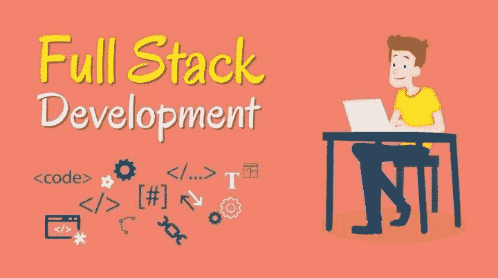
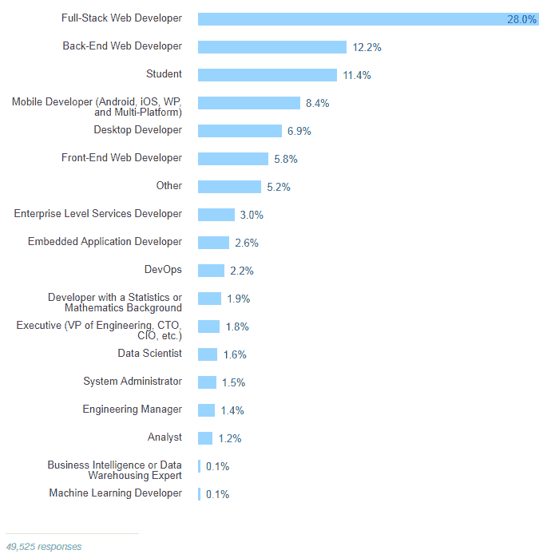
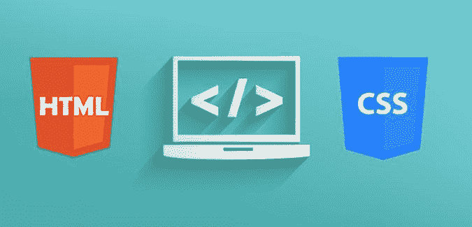
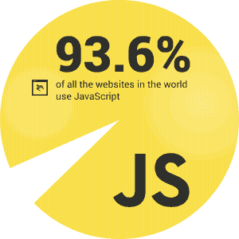
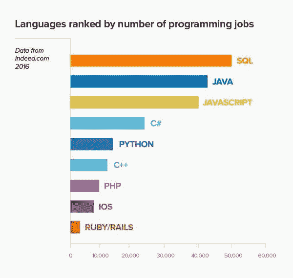

# 2018 年什么是全栈开发者，如何成为一名？

> 原文：<https://medium.com/hackernoon/what-is-a-full-stack-developer-in-2018-and-how-to-become-one-ca82e8906c87>

[https://www.eventshigh.com/](https://www.eventshigh.com/)

2017 年创造了有史以来对全栈开发者的最高需求。为什么会这样？一言以蔽之，如今你在你的职业中拥有的技能越多，你就变得越有价值。拥有一个对应用程序开发了如指掌的人是多么大的好处啊！但现实中那些人是谁？

一个不能用简单的几句话来回答的问题。如果你正在寻找一个多面手开发者或者想成为一名开发者，这里有一个关于如何做的指南。

# **是什么让全栈开发者在 2018 年变得特别**

如果我们看看一些理论方面，我们会了解到**【全栈开发者】**最广泛的含义。它是一个专家，喜欢在后端和前端工作得一样好。

这个术语与你在标准软件理论中可能遇到的术语相去甚远。由于技术发展中的进化，这种通用专家出现了。他们从未停止学习新技术，并将其应用于项目中。

进化过程给劳动力市场带来了果实。[Stack Overflow 在 2016 年举办的开发者调查](https://insights.stackoverflow.com/survey/2016)让我们看到，绝大多数开发者认为自己是全栈技术人员。

[https://insights.stackoverflow.com/](https://insights.stackoverflow.com/)

后端开发人员遥遥领先，位居第二。由于这项研究，我们知道全栈开发人员可以使用 5-6 种语言和框架，而其他专家选择其中的 4 种。

**全栈开发者的个人特质**

如果你决定专注于全栈开发，你应该首先了解你是否具备必要的个人特质来应对这份工作。这些是你在工作机会中可能会遇到的要求:

*   *分析头脑*
*   *耐心*
*   *热爱学习*
*   *关注细节*
*   *创意视觉*
*   *纪律*

如果你觉得这个列表不错，你的信心变得更加强大，那么是时候谈谈这个问题的技术方面了。

# **2018 年全栈开发者技术技能**

如果你同时专注于后端和前端，你不一定会成为每项技术的大师。但真正重要的是你理解正在发生的一切并使之发挥作用的能力和热情。如果你是一名技术人员，这是一份需要学习的东西的清单；如果你是一名企业主，这是一份需要询问的东西的清单。

**HTML 和 CSS**

[https://www.sololearn.com/](https://www.sololearn.com/)

HTML 和 CSS 是两个基础，在任何编程课程的开始，你都会首先遇到它们。之所以这样做，是因为有了 HTML，你可以在网页上添加材料，而 CSS 有助于赋予它某种风格。

**从这些事情开始:**

*   *语义 HTML。*
*   *学习 CSS 盒子模型，这样你就可以知道它的原理和特点。*
*   *CSS 前置处理器——它们对于* [*软件开发*](https://hackernoon.com/tagged/software-development) *的好处。*
*   *自举。*

**JavaScript**

[https://insights.stackoverflow.com/](https://insights.stackoverflow.com/)

到底为什么是 [JavaScript](https://hackernoon.com/tagged/javascript) ？正如在[栈溢出的调查](https://insights.stackoverflow.com/survey/2016)中提到的，这种编程语言是三类开发者的首选(包括全栈)。新工具经常出现，所以你必须时刻保持警惕。

**从这些事情开始:**

*   *学习 DOM 和 JSON 的工作原理。*
*   关注语言的重要特征:原型继承、事件委托等。
*   把你的大部分注意力放在你选择的一个框架上。
*   *对测试框架有共同的理解。*

**后端语言**

这里重要的一点是，你必须选择一种语言并专注于它。换句话说，你要详细了解它的工作原理，以及你到底能做什么。完全理解——这是雇主更喜欢的。我们为您提供了一些统计数据，以减轻您的顾虑:

Indeed.com

**数据库和存储**

如何明智地存储数据？你应该知道这个问题的确切答案。注意你在这方面的知识，因为数据是你的主要设备。

**从这些事情开始:**

*   了解 NoSQL 数据库以及选择某个数据库的情况。
*   *关系数据的特性。*
*   *了解如何链接数据库和你选择的后端语言。*
*   *网络存储。*

**HTTP**

应用协议 HTTP 允许客户端和服务器保持持续的连接。例如，您可以通过 JavaScript 代码创建一个请求，该请求将被发送到后端代码。多亏了 HTTP，它才会发生。

不久以前，软件专家开始面临 HTTP 协议的许多安全问题。问题是 HTTP 数据没有加密，给网站用户创造了一个极其不安全的环境。现在，我们有一个叫做 HTTPS 的安全版本。无论你在哪个网站工作，了解 HTTPS 都是至关重要的事情。如果你的网站存储敏感数据，那么这种类型的协议对你来说是最重要的。

**从这些事情开始:**

*   *学习关于休息的基本要点。*
*   *设计 RESTful API。*
*   *使用 Chrome DevTools。*
*   *了解有关 SSL 证书的更多信息。*

**架构**

如果你处理了上面的所有事情，那么高级部分就来了。当你专注于复杂的项目时，了解应用架构是至关重要的。您应该知道如何将代码和数据按顺序排列，在哪里存储大文件，如何分离某些文件，以及许多其他方面。

**从这些事情开始:**

*   *收集关于平台即服务的信息。*
*   *致力于 app 的优化。*
*   *MVC。*
*   从 GitHub 大型项目中学习代码库——那里的人知道他们在做什么。

**Git**

[https://think201.com/blog/](https://think201.com/blog/)

Git 是最著名的版本控制系统。如果你明白它是如何工作的，你将会成功地与从事同一项目的其他开发人员合作。当有任何变化时，你会抓住应用程序的脉搏:获取最新数据并更新它，进行必要的修复，等等。

**从这些事情开始:**

*   学习 Git 命令的完整列表。
*   *研究 Git 使用的基础教程。*

**从哪里学基本功**

不断学习——这是[全栈开发人员](https://tecsynt.com/services/mobile-application-development)取得成功的关键。因为有许多领域需要拥抱，所以对最新的工具和技术更新保持警惕是你每天关心的事情。但是应该从哪里开始呢？这里有一些资源可以帮助你:

*   *Mozilla 开发者网络*
*   *MySQL 文档*
*   *W3Schools 教程*
*   *超文本预处理器*
*   *来自网络的在线培训*
*   *帮助非营利组织*

任何理论知识都不能代替经常性的实践。作为复杂项目的一部分，你可以接触到产品的方方面面，了解更多关于应用架构的知识。

**应该提到的缺点**

一开始，了解一些你不可避免要面对的负面因素是很有用的。有些人会说什么都知道就意味着什么都不知道。因此，任何全栈开发人员都应该跟踪自己的知识，以跟上技术的进步。你学到的任何技巧都应该写在博客或个人记事本上。这么细致的工作不是每个人都能做的。

当你迈出全栈开发的第一步时，不要期望你会被赋予很多责任。任何这类专家都应该证明自己的技能，所以你可能只会得到未来自主权的一部分。准备好在途中争取更多的任务。

**知识满栈力量**

全栈开发非常适合那些不喜欢专注于一个领域而喜欢复杂任务的人。你自己的知识数据库会不断增长，所以你应该注意跟踪它。

同时，企业可以从与[全栈技术人员](https://tecsynt.com/approach)的合作中获益。无论项目如何变化，他们都知道软件构建的所有方面。