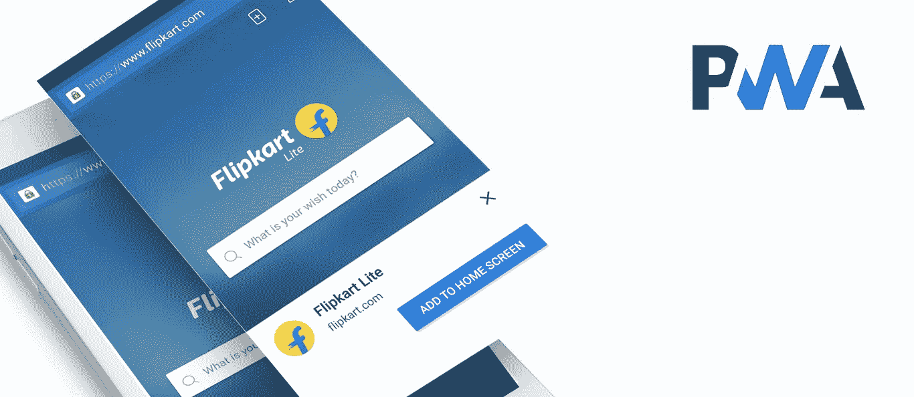
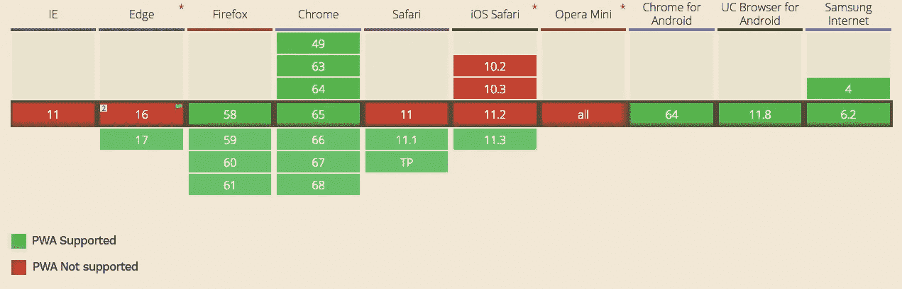

# 什么是渐进式网络应用？

> 原文：<https://medium.com/hackernoon/what-is-a-progressive-web-app-e31d5244c06f>

每当我们听到“应用”这个词，我们脑海中浮现的第一件事就是原生的[移动](https://hackernoon.com/tagged/mobile)应用，通常是[安卓](https://hackernoon.com/tagged/android)，iOS 或 Windows phone 应用。但如果你关注最近的科技流行语，“渐进式网络应用”就是其中之一。本地应用已经存在很长时间了，而渐进式网络应用(PWA)在这个城市还是相对较新的事物，有很多讨论正在发生。我们的客户和朋友多次问我关于 PWA 的问题，我想写一篇文章来介绍一下 PWA。

## 什么是渐进式 Web App？

Progressive web App (PWA)是一款基于现代 Web 技术的 Web 应用程序，其行为类似于移动应用程序，可以完成许多类似的任务，在某些情况下具有更多功能，但构建成本更低。PWA 易于长期维护。

我认为你的网站，当从移动设备访问时，就像一个移动应用程序。

如果你仍然对[网络应用和所谓的网站](http://www.redelegant.com/blog/difference-between-website-web-application/)感到困惑，请在这里阅读。

## PWA 是如何工作的？

PWA 可以在传统服务器和后端设置上运行。几乎没有什么新东西。即使你愿意，你也可以在几分钟内将你的整个网站或 WordPress 博客转换成渐进式网络应用程序，但要充分利用渐进式网络应用程序的效率，需要开发人员的参与，以使其完全符合 PWA 标准，这需要时间来完成。

基本上，现在每个项目都是通过服务/API 运行的。因此，更不用说 PWA 是以这样的方式设计的，它在基于服务的应用程序中工作得最好。所以要运行 PWA，你需要的只是一个前端开发。因为您的服务/API 不会受到影响。

现在在前端部分，它基本上与 JavaScript、HTML、CSS 或任何其他前端库的工作相同，同时 Google 引入了一个名为 ServiceWorker 的新脚本，它在浏览器的后台运行。所有在浏览器中本地保存数据的传统方法都被这种单一的方法所取代。因此，在这里您需要定义前端开发中使用的所有文件，您希望这些文件保存在本地。因此，当用户在没有任何网络连接的情况下打开应用程序时，它不会显示无聊的“无网络”消息，而是从本地存储(不是浏览器中的本地存储，而是设备的本地存储)打开文件。因此用户体验不会受到影响。它的行为就像一个应用程序。即使您愿意，也可以在 serviceworker 上存储动态数据，这些数据可以在没有网络连接的情况下显示。

> 如果你认为你的网络应用是骨架，那么服务工作就是 PWA 的灵魂。开发的越好，你的 PWA 表现越好。

## 您当前的产品/服务是否需要 PWA？

首先，你必须很好地理解你的项目，必须了解它需要多少与移动硬件组件的交互，如 NFC、蓝牙、接近传感器、唤醒锁等。

> 当涉及到提供与智能手机硬件相关功能的集成时，渐进式网络应用程序的能力有限

如果你的应用不需要上面提到的硬件依赖，你应该选择 PWA。原因是许多网速慢的人和买得起的智能手机可以通过 PWA 更容易地使用你的网络应用。在这些情况下，PWA 是最佳选择，因为它只需几秒钟就能加载，您的用户可以立即开始工作。

如果你有一个成熟的网络应用程序，PWA 很有可能最适合你。

## 要考虑的浏览器依赖性

由于 PWA 运行在浏览器中，我们还需要考虑浏览器的兼容性。以下是考虑到对 PWA 支持的广泛移动浏览器的统计数据

## 原生应用与渐进式网络应用

如上所述，当我们谈论本地移动应用程序与渐进式网络应用程序时，存在一些硬件限制。

除此之外，平均而言，从用户第一次接触应用程序到用户开始从应用程序中获得价值，每走一步，[应用程序就会失去 20%](http://blog.gaborcselle.com/2012/10/every-step-costs-you-20-of-users.html) 的用户。用户必须首先在应用商店中找到该应用，或者从谷歌上下载、安装，然后最后打开它，否则它可能会有一个繁琐的注册过程。在大多数情况下，整个经历变得漫长。

但是，

当用户发现你的渐进式网络应用程序，他们将能够立即开始使用它，消除不必要的下载和安装阶段。当用户再次返回应用程序时，他们将被提示安装应用程序。这将为他们提供类似应用程序的体验，并确保更高的保留率。这是我最爱的部分。之后，用户可以像点击手机主屏幕上的快捷图标一样打开你的网络应用程序，并像使用应用程序一样使用它。

想了解更多关于原生应用和 PWA 的区别？查看这篇文章

TL；速度三角形定位法(dead reckoning)

*   **PWA=一款行为类似本地移动应用的网络应用**
*   **没有必要为手机开发单独的代码库。**
*   **你不必从 Google Play 或 App Store 安装任何东西。**
*   **现有网站/博客可轻松转换为渐进式网络应用。**
*   **比开发所有平台的原生应用相对便宜。**

如果您需要帮助开发或讨论 PWA，[联系我们](https://www.redelegant.com/start/)，我们只需点击一下鼠标。

—

***关于作者***

Ranit Sanyal 是设计驱动开发工作室**的联合创始人。这篇文章最初出现在* [*RE 博客*](https://www.redelegant.com/blog/what-is-progressive-web-app/)*

**如果你喜欢这篇文章，请点击* **💚** *这样别人也可以享受了:)**