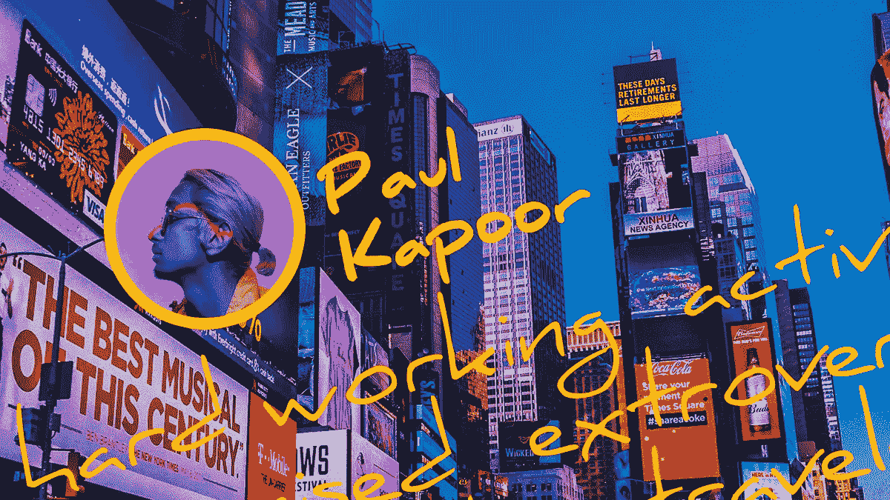

# 什么是用户角色，它与 UX 有什么关系？

> 原文：<https://medium.com/hackernoon/what-is-a-user-persona-and-how-is-it-relevant-to-ux-aeb3e6f02077>

在本帖中，我们将尝试理解用户角色的概念，有时也被称为买家角色，它与你的产品的 [UX](https://hackernoon.com/tagged/ux) 的相关性，以及如何在 UX 过程中有效地利用用户角色。

作为奖励，我还将分享一个*用户角色模板*，我们通常在我们的大多数代理项目中使用它。

# 什么是用户角色？

用户角色是根据用户的期望、需求、目标和观察到的行为模式而假设的真实用户的原型。

就我个人而言，用户角色不满足期望，暗示一些解决问题的途径，并最终帮助我获得潜在的更好的用户体验。

作为标准产品[设计](https://hackernoon.com/tagged/design) UX 工艺，我质疑以下…
*1。我们设计的目的是什么？
2。我们在为谁设计？*

用户角色回答并详细记录了后者。

尽管它们代表虚构的角色，但它们的理解和表现通常(也应该)基于关键的用户洞察。

> 如果你不和你的客户交谈，你怎么知道如何和你的客户交谈？~威尔·埃文斯

艾兰·库伯通常被认为是用户角色之父，这是 80 年代中期最重要的用户体验设计策略之一。Cooper 写了一篇关于人物角色起源的有趣的文章，特别是在从事“计划*它”，一个项目管理程序的时候。

> 我正在编写一个关键路径项目管理程序，我称之为“计划”在项目的早期，我采访了大约七八个同事和熟人，他们很可能是使用项目管理程序的候选人。特别是，我与一位在卡里克广告公司工作的名叫凯西的女士进行了长时间的交谈……凯西是我第一个原始角色的基础。

[阅读更多](https://www.cooper.com/journal/2008/05/the_origin_of_personas) *关于人物角色的起源*。

# 为什么用户角色是相关的？

简答:**你不是用户**

也许设计中最古老的突破口就是设计你自己想用的产品。

长回答:继续读…

用户体验设计中常见的两种错误共识效应，要么关注自我，要么关注一个有着良好记录的领导巨头，作为最终的信念。

*苹果的例子&谷歌高居榜首！*

大多数人认为，如果苹果和谷歌走的是 UX 路线，那对每种产品来说都是最好的 UX 方式。

所有产品都有独特的个性、产品和目标——用户也是独一无二的。我们必须研究这些用户，绘制他们的日常生活、生活方式、[行为模式](https://hackernoon.com/the-psychology-of-rating-systems-3103e26fddd8)等等，以便能够创造出适合他们使用的东西。*不是我们的！*

> 我们往往会被自己头脑中的声音分散注意力，这些声音告诉我们设计应该是什么样子。~迈克尔·比鲁特

用户角色是简化这些关于目标用户群的发现的好方法。这就像一份清单，列出了哪些对用户有用，哪些没用。从用户角色中需要注意的一个关键观点是建立用户(或部分用户)对当前主题的理解。

让我问你一件事！

如果你被委托做一个 UX 项目，其中一组重要的用户是社交媒体影响者，并且创始人绝对确定他们的主要目标是所有的明星社交媒体影响者，你会问用户什么问题？

此外，当你完成研究*(稍后)*和设计用户角色时，你会观察到一些明显的事实！
**1。几乎没有人理解“影响者”这个术语。用他们自己的话说，这些用户大多是“博客写手”，或者有时是“明星微博用户”或“YouTube 名人”。
②**。明星影响者认为没有必要出现在这个平台上。**对他们来说没有什么痛点需要解决。**

*你会和你的客户分享什么，并提出什么建议？*

棘手？
这是 2014 年委托给我们的一个实际项目，当时我们也处于类似的情况。

有趣的是，我们发现了两个用户角色，这两个用户角色立即跳跃出惊人的洞察力元素和明显的*(研究后)*痛点。
**1。美容博主们——他们不喜欢寻求报酬的部分。协商博客付款、开发票、跟进付款等的整个过程。很累、很无聊或者“没有很好地利用”他们的时间。
2**2。上大学的兼职科技博客写手——他们渴望获得名利。任何与某个品牌的关联*(阅读项目)*，对于他们的投资组合来说，都将是一件大事。****

在此过程中，我们还注意到了上述两种人物角色类型经常使用的移动应用程序，因此，他们会有意识或无意识地意识到这些应用程序。它极大地帮助了平台视觉语言基础的起草。

# 如何起草用户角色

我经常在我的设计研讨会上开玩笑说，设计用户角色就像是自愿创建一个只有你知道的朋友的社交网络档案，当然是为了更理智的目的。

起草用户角色的另一个有趣的方法是写一部小说！

把自己想象成一个小说作者，尝试一个虚构的故事。故事不是以你为主角。然而这个故事需要一个主角。

*   *谁是主角？他们的背景、生活方式、性格和志向是什么？*
*   *谁是主角的支持者？想想侧面人物！他们和主角是什么关系？*

研究是第一步，也许和起草用户角色本身一样重要。虽然这是一个可以接受的实践，但是只使用假设对于人物角色来说是一个较弱的前提。

采访和调查是一些“给定的”练习，以收集足够的见解/信息来起草这些虚构的主角和他们的支持者。不过，最好的练习恰好是观察！在 UX 的研究场景中，这也被称为阴影。

确保你有足够的材料来起草一些相关的问题进行研究，也称为用户角色互动。你可以从基本的背景调查开始。

用户去看牙医的频率，可能与聊天应用的用户角色无关。虽然这可能是一个与健康相关的数字产品研究的潜在预热问题。

## 快速 5 步创建用户角色交互的相关性

1.  **写下产品的主要意图**
2.  **起草产品的问题陈述**
3.  **重新定义意图和陈述**
4.  **根据#3** 创建问题
5.  **用 3-4 种不同的方式重新表述问题**

## 如何起草互动问题

1.  **提出更多开放式问题**
    即，请解释您上次使用手机应用程序叫出租车的经历
2.  **不要以问题**
    开头，即当应用崩溃时，你的*沮丧程度*是多少？
3.  定义用多种方式来表达同一个问题，以获得有见地的答案
    例如，你为什么在网上购物？*也可以问为* 有哪些你无法想象在网上购买的物品？
4.  **避免猜测性问题**
    即，如果你最喜欢的应用在你最需要的时候崩溃，你会有什么感觉？

**奖励:** [下载我们的用户角色模板](http://sparklin.com/resources/user-persona)

*如果你喜欢上面的故事，有意见或者希望有讨论，* [*我就一个推文带走*](https://twitter.com/SparklinGuy) *！*