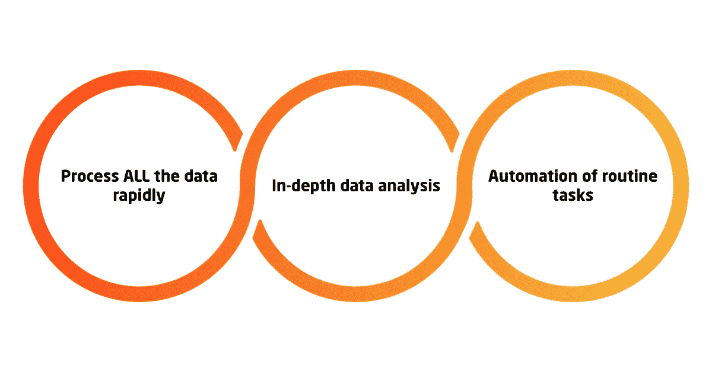

# 什么是 ai ops:devo PS 服务的下一个级别

> 原文：<https://medium.com/hackernoon/what-is-aiops-the-next-level-of-devops-services-f011d6d04c24>

AIOps 是一个总括术语，指使用复杂的基础架构管理和云解决方案监控工具来自动化数据分析和日常开发运维。

10 年甚至 5 年前构建的系统监控工具的主要缺陷是，它们不是为了满足大数据的 3 V 需求而构建的。它们既不能处理输入数据的绝对**量**，也不能处理所有**种类**的数据类型，或者与数据输入的**速度**保持一致。根据经验，此类[云监控解决方案](https://itsvit.com/blog/5-parts-svit-logging-monitoring-toolkit/)必须将数据分割成块，分离看似重要的内容，删除看似不需要的内容，通过焦点小组和统计样本进行操作，而不是处理数据的整体完整性。

最重要的结果是，在数据分析的[数据可视化](https://itsvit.com/blog/big-data-visualization-principles/)阶段，一些重要的模式可能会被忽略，并完全从图片中排除。这使得整个过程完全无用，就好像大数据分析不能产生可操作的业务洞察力，它不能提供大数据的第四个也是最重要的 V—**价值**。

# AIOps 进入现场

当然，人类不可能按时处理所有机器生成的数据。然而，这正是像深度学习模型这样的人工智能算法擅长的任务。唯一剩下的问题是:如何将这些[机器学习(ML)](https://itsvit.com/blog/future-ai-deep-learning-much/) 工具应用到 DevOps 工程师的日常生活中？

以下是 AIOps 如何帮助您的 IT 部门:

*   迅速处理所有数据。一个 ML 模型可以被训练来处理由你的系统产生的所有类型的数据——并且它将在未来这样做。如果必须添加新类型的数据，可以相对容易地调整和重新训练模型，从而保持前所未有的高性能。这将确保数据的完整性和保真度，从而产生全面的分析和切实的结果。
*   **深度数据分析**。当所有的数据都被分析后，隐藏的模式就显现出来，可操作的洞察力也随之出现。然后，DevOps 工程师可以区分基础架构调整的需求，以避免性能瓶颈，并获得针对基础架构优化和运营改进的具体数据建议。
*   **日常任务的自动化**。当事件模式被识别时，可以设置自动触发器。因此，当统计数据显示某些事件总是导致特定(负面)结果，并且必须执行某些操作来纠正问题时，DevOps 工程师可以创建触发器并自动响应此类事件。

也就是说，如果监控解决方案报告由于连接数增加等原因导致 CPU 使用率增加。，Kubernetes 可以增加额外的应用程序实例，并使用负载平衡来分配访问者流量和减少负载。这是最简单的场景，真实世界的用例要复杂得多，并且允许自动执行几乎任何例行的 DevOps 任务，使 ML 模型能够在特定条件下启动它并预先处理问题，而不是在停机发生后。

# 使用 AIOps 的业务优势

部署 AIOps 解决方案可以实现以下积极成果:

*   **不间断的产品供应**，带来积极的最终用户体验
*   **先发制人解决问题**，而不是永久救火
*   **消除数据孤岛和根本原因补救**，这是因为分析了您的企业生成的所有数据，而不是使用剥离的样本
*   **日常任务的自动化**，让您的 IT 部门能够专注于改善基础设施和流程，而不是处理重复性和耗时的任务
*   **更好的协作**，因为日志的深入分析有助于显示管理决策的影响，并评估所采用的业务策略的效率

# 关于什么是 AIOps 及其重要性的最终想法

如您所见，选择 AIOps 工具和解决方案对您的业务大有裨益。这可能看起来是 AIOps 解决方案供应商的一个营销噱头……但是目前还没有。后大多数企业仍在努力向 DevOps 文化过渡，并进行数字化转型。

与此同时，真正创新的公司已经在努力将人工智能算法、ML 模型和 DevOps 系统结合起来，以提供未来尖端的云监控和基础设施自动化解决方案。应用这些实践会带来更好的客户体验、更短的产品上市时间、更有效的基础设施使用以及团队内部更好的协作。
然而，即使是这些创新者也没有现成的解决方案来满足他们的需求，他们不得不使用[流行的 DevOps 工具](https://itsvit.com/blog/must-have-devops-tools-make-things-right-get-go/)，如 Splunk、Sumologic、Datadog、Prometheus+Grafana、Kubernetes 和 Terraform 等，自己构建这样的系统。更重要的是，虽然这个想法本身非常重要，但实现它所需的基础设施管理技能水平远远超出了一般公司的能力。

这就是像 IT Svit 这样的[托管服务提供商](https://clutch.co/it-services/msp)开始行动的地方。我们在以下领域拥有丰富的经验:

*   云基础设施设计和实施，
*   性能优化
*   云监控、日志记录和警报
*   人工智能部署和 ML 培训
*   为大数据分析构建复杂的分布式系统

将所有这些技能结合起来，使我们能够交付复杂而高效的系统，使我们的客户能够为他们的产品用户创造更多价值。数据完整性支持高效的策略分析、更好的资源分配以及团队内部和与最终用户的更好的交互。我们的工作质量没有改变，这使得广受欢迎的国际商业评级机构 Clutch 将 IT Svit 列为 2017-2018 年乌克兰 IT 外包市场的[领导者之一](https://clutch.co/it-services/ukraine/leaders-matrix)。

如果您希望您的想法成为我们下一个成功的项目，请[联系我们](https://itsvit.com/contacts/)，我们随时准备为您提供帮助！

*原载于 2018 年 8 月 29 日*[*itsvit.com*](https://itsvit.com/blog/aiops-next-level-devops-services/)*。*