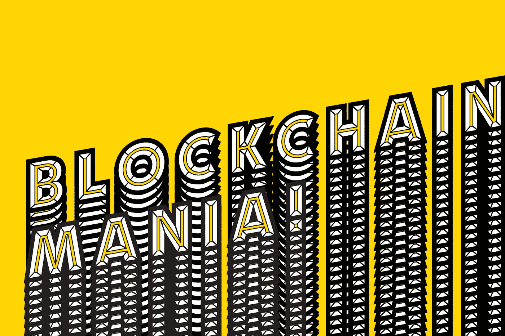

# 什么是区块链？

> 原文：<https://medium.com/hackernoon/what-is-blockchain-cf827e183340>

(Image credits: Fortune)

## 为什么很难找到一个好的定义？让我们从 ABC 开始。

区块链现在无处不在。我们都谈论它。我们都读到过。区块链为此。区块链就是这样。但是我们经常不能完全理解它。事实上，很难找到简单易行的定义。

毕竟，理解区块链是什么和它是如何工作的，以及识别关于它的潜力和可能的应用的神话是更好地理解技术未来的第一步。

这里收集了一些区块链的定义——除了比特币和加密货币——我觉得非常有用，也很容易理解。

在 2017 年[哈佛商业评论](https://medium.com/u/7ddfe8a6bc4f?source=post_page-----cf827e183340--------------------------------) [的一篇文章](https://hbr.org/2017/01/the-truth-about-blockchain)中，马可·伊恩西提和[卡里姆·r·拉哈尼](https://medium.com/u/8d2c6b661c4a?source=post_page-----cf827e183340--------------------------------)将区块链定义为“比特币和其他虚拟货币的核心技术”，以及“一个开放、分布式的账本，可以有效地以可验证和永久的方式记录双方之间的交易。”

他们补充道:“有了区块链，我们可以想象这样一个世界:合同被嵌入数字代码，存储在透明的共享数据库中，在那里它们受到保护，不会被删除、篡改和修改。在这个世界上，每一份协议、每一个流程、每一项任务和每一笔付款都有一个数字记录和签名，可以被识别、验证、存储和共享。像律师、经纪人和银行家这样的中间人可能不再需要。个人、组织、机器和算法可以自由地进行交易，相互之间几乎没有摩擦。这就是区块链的巨大潜力。”

在国际治理创新中心(CIGI)发布的一段视频中，区块链被定义为“一整套分布式账本技术的简称，可以通过编程来记录和跟踪任何有价值的东西，从金融交易到医疗记录甚至是土地所有权。”

该视频继续解释道，“区块链成批存储信息，这些信息被称为块，按时间顺序连接在一起，形成一条连续的线，比喻为块链。如果您对特定块中记录的信息进行了更改，您不会重写它。相反，更改存储在新的块中，显示 X 在特定的日期和时间更改为 Y。

区块链的这一特性，再加上其分散、分布的性质和加密元素，降低了数据被篡改的风险，从而建立了对数据的信任。

下面是马克·桑达斯基，ConsenSys 的视频和动画负责人，在一个非常短的视频中解释区块链。

“区块链基本上是一种由一群人组成的网络共同维护一个不属于任何个人或实体的真相数据库的方式，”马克解释道。

几个月前，在一次关于“区块链用于政府和外交”的小组讨论中，有人问 Consensys Civic(美国政府实践)副总裁 Tori Adams，如何向一个昏迷 20 年后醒来的人定义区块链。

她的回答令人大开眼界:

> 别担心。

“我想了很多，因为我试图向我的父亲解释，”托里说，解释了她如何看待这个问题的两种方式。“一种是对人们说‘别担心’。你知道你的手机是怎么工作的吗？我一点也不知道我的电话是如何工作的。我们谈论的不是电话如何工作，而是 TCP/IP 和互联网如何工作。我们不需要知道它是如何工作的才能知道它是如何工作的。因此，一方面，不要担心它，看看基于它的应用程序和它提供的服务。你不需要了解互联网是如何工作的，就能在网上预订机票。你只需要知道它是有效的。”

然而，托里对区块链的定义更进了一步，称其为“真理保存机器”她解释道:“如果某件事在某一点上是真的，那么在另一点上也会是真的。如果你不信任别人，那么保持真相的活动是非常重要的事情。从概念上来说，这确实是它所做的:它允许你在你不信任的人之间分享你担心的信息。那是一件相当好的事情！”