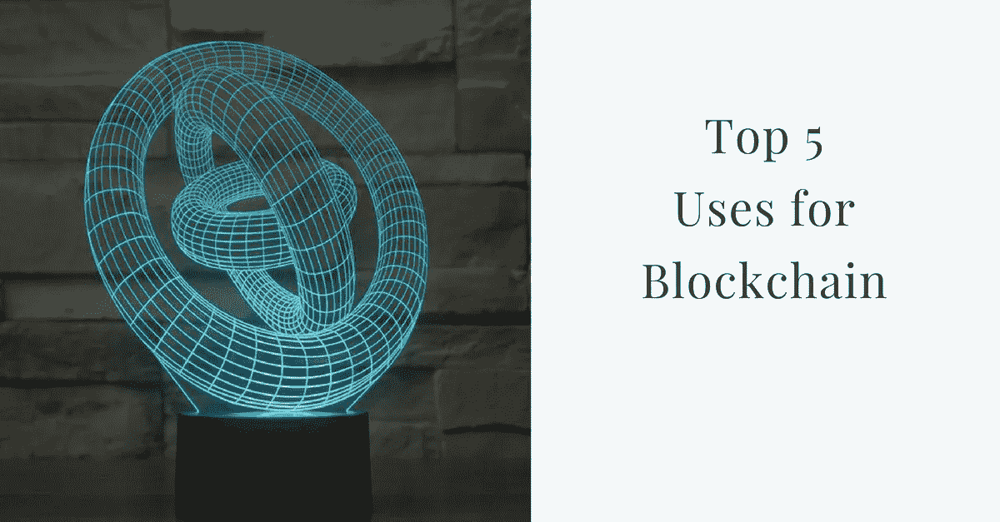

# 区块链有什么用？5 大用途。

> 原文：<https://medium.com/hackernoon/what-is-blockchain-good-for-top-5-uses-dc8e74ade5ee>

在技术发展的早期阶段，区块链的实际用途不一定清楚。然而，如果我们看看这个领域的主要组织、政府和最有趣、最具潜在破坏性的初创公司都在用区块链做什么，我们就可以知道它在未来会被如何利用。

# **金融**

“资产管理-令牌化”，资产/股票的“分割”和“数字化”将消除投资交易流程中的一个主要痛点，即大量资产难以细分或转移。分散交易所的使用也将使投资民主化，因为它允许双方在不需要第三方的情况下进行交易。管理更少，成本更低！

清算和结算-澳大利亚证券交易所在 2017 年底宣布，计划使用区块链技术来管理股票的清算和结算。[最近有报道称](https://www.ft.com/content/b9b17762-2c0e-11e8-9b4b-bc4b9f08f381)香港证券交易所也在考虑利用分布式分类账系统来削减成本，这表明区块链在金融领域的实施正在全球加速。

跨境交易——全球约有 20 亿人没有银行账户。在发展中国家的许多城市，西联银行的分支机构比所有国际银行加起来还多。向另一个国家汇款是一项复杂而昂贵的任务，而这本来应该是一项简单的交易。区块链点对点支付可以使这成为一个无摩擦的过程。

# 身份

像脸书这样的社交媒体公司通过向广告商出售我们的个人信息来赚钱。区块链可以提供一种新的符合 [GDPR](https://www.eugdpr.org/) 的使用模式，通过这种模式，客户可以允许公司在有限的时间和有限的用途内访问一定级别的数据。在这种模式下，你不需要广告拦截软件，因为你可以选择你看到的广告，并为此获得报酬。埃森哲公司(Accenture Plc)和微软公司(Microsoft Corp .)合作建立了一个使用区块链技术的数字身份网络，这是联合国支持的一个项目的一部分，该项目旨在为全球 10 亿多没有官方文件的人提供合法身份。

# 土地和财产

如果你对你的土地/财产没有有效的所有权，你就不能用它来贷款创业，也不能为你的财务未来做计划。大约 70%的世界人口没有正式的产权制度。这为经纪人和倡导者与政府合作处理这一过程创造了空间。腐败和高收费在发展中国家尤其普遍。区块链可以帮助将个人的土地/财产与他或她的详细信息联系起来。不仅仅是像洪都拉斯和肯尼亚这样的发展中国家希望利用这项技术，瑞典也有雄心勃勃的先进计划在私人区块链上实现土地注册。

# 社会公益

2017 年，世界银行启动了一个区块链实验室，以试点可以改善发展中国家治理和社会成果的项目。世界粮食计划署(WFP)在区块链的项目取得了实实在在的积极成果。例如，世界粮食计划署的一个项目通过位于难民营的超市向难民发放食品券，为约旦难民营中的 10，000 多名难民提供食物。收银员配备了虹膜扫描仪，既能识别顾客身份，又能通过与联合国数据库核对数据来支付他们应得的款项。基于区块链的交易日志还可以跟踪食品分配，提高效率和防止欺诈。用一种[碳货币](https://www.weforum.org/agenda/2017/09/carbon-currency-blockchain-poseidon-ecosphere/)进行碳信用交易将允许消费者进行气候友好型购买，因为碳排放和信用可以被透明可靠地跟踪。

# 旅行

全球最大的旅游公司途易(TUI)最近宣布，计划将其所有数据转移到区块链。该公司将利用区块链技术追踪内部合同，并推出一款名为 BedSwap 的应用程序，以保持酒店库存的实时记录。单一、安全和透明的分布式分类账可以通过简化银行支付和结算，大幅降低航空公司、酒店和旅行社的成本。

**关于作者:**保罗·亨德森是一名内容战略家，拥有为包括彭博和微软在内的公司以及当地政府卫生部门开发数字内容项目的背景。他是咨询公司 [**Blockheads**](http://www.blockheads.co/) 的创始人，该公司为区块链和金融科技初创公司提供内容战略和社交媒体营销方面的建议。