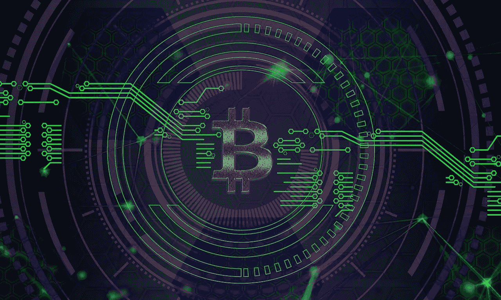

# 什么是区块链技术？它是如何工作的？

> 原文：<https://medium.com/hackernoon/what-is-blockchain-technology-how-does-it-work-cd843e611497>

Pixabay

围绕[加密货币](https://hackernoon.com/the-cryptocurrency-trading-bible-43d0c57e3fe6)的大肆宣传使得有必要了解这个术语。区块链技术也称为分布式账本技术，更简单的说就是一种与你不信任的人共享数据的安全方式。

在区块链上共享的信息不是存储在一个地方，而是同时存储在多个地方，这意味着存储的数据是公开的，因此互联网上的每个人都可以访问。这些信息没有集中的版本，容易被黑客攻击，因为数据同时由数百万台设备托管。

**是什么让区块链安全？**

[区块链](https://hackernoon.com/learn-blockchains-by-building-one-117428612f46) —一个对等网络于 2008 年 10 月推出。引入虚拟货币系统的比特币应用完全是区块链技术的产物。

现在的问题是，是什么让区块链变得安全？这有两个方面:

**-【节点】网络**:

节点可以是任何设备，如笔记本电脑、计算机或电话。它应该是活动的，并且有一个 IP 地址。节点在此过程中发挥着重要作用，因为它们通过保存区块链的副本来支持网络，该副本在加入[区块链网络](https://www.meetrv.com/blockchain-is-future/)时会自动下载。

加密指纹作为一个印章，因为它是唯一的每个块，以确保设备注册。这些节点还同意双方同意的历史共享。这有助于使区块链防篡改。

**-分权与集权:**

从术语来看，这里的去中心化是指在数百万台笔记本电脑、平板电脑或手机上托管区块链网络，称为“节点”。

与集中式网络相比，分散式网络相对更安全。后者容易遭到黑客攻击，因为所有数据都存储在一个设备上。因此，使用分散式网络可以确保更高的安全性。

**有看起来那么安全吗？**

无论区块链协议看起来有多安全，黑客总是可以侵入最受保护的协议。即使开发人员使用经过试验和测试的方法来保证区块链的安全，也很容易以不安全的方式存放数据。

区块链网络上的节点必须持续通信，以便处理数据比较。如果攻击者获得了一个节点的通信，他可能会欺骗它接受虚假的交易。

加密货币黑客和诡计清楚地表明了区块链网络的安全程度。

**区块链网络的用户有哪些？**

医疗保健、航运、能源、区块链是趋势，因为它们被应用于多个行业。目前，区块链网络广泛应用于金融服务技术。

根据世界银行的报告，2015 年汇款超过 4300 亿美元。根据报告，区块链开发者的需求也很高。

为区块链设计的最常见的 GUI 是钱包应用程序，人们用它来用比特币买东西，并把它和其他加密货币一起储存。

**公立 vs 私立区块链:**

公共区块链允许每个人发送或查看事务，只要它们是一致同意过程的一部分。公共区块链需要计算机处理能力来确认交易。这个过程被称为采矿。

另一方面，专用区块链将对分布式分类帐的编辑权限限制在限定数量的组织或一组员工。没有网络上其他设备的同意，任何一方都不能编辑或删除任何块。

**区块链技术:共享经济的福音**

像[亚马逊](https://www.amazon.com/)、Flipkart、Paytm 这样的公司提供[亚马逊优惠券](http://getamazoncoupons.com)、 [paytm 返现优惠](https://indiakaaoffer.com/paytm-cashback-offer.html)、[亚马逊大印度节特卖期间的交易和优惠](https://indiakaaoffer.com/amazon-great-indian-festival-sale.html)和 [flipkart 大十亿日优惠清单](https://indiakaaoffer.com/flipkart-big-billion-days-sale-offer-90-off.html)。也有很多买家和卖家。这项技术满足了平衡供需图的共享网络的需求。

只有通过区块链技术才能促进点对点的安全支付，因此共享经济确实是成功的！