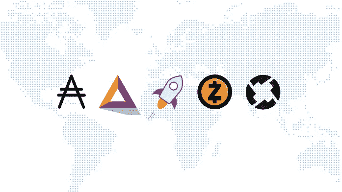
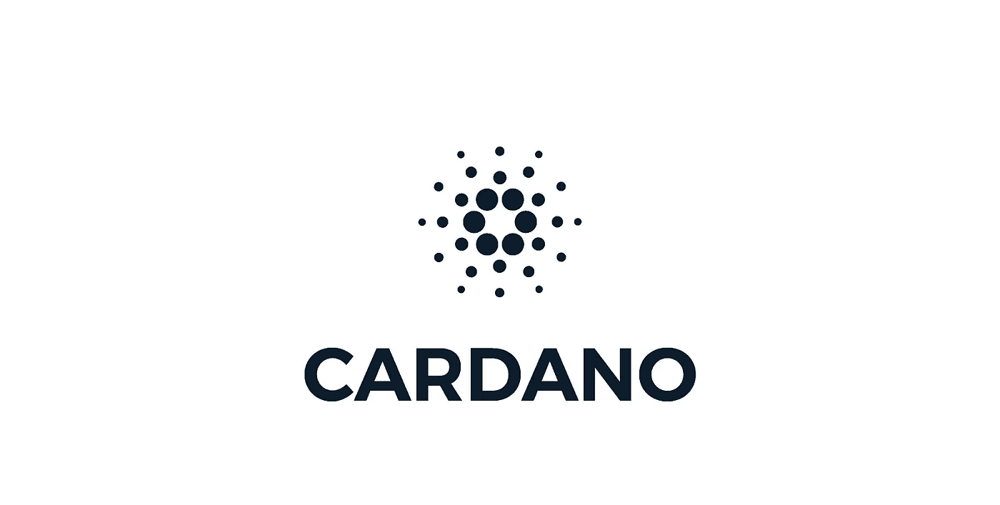
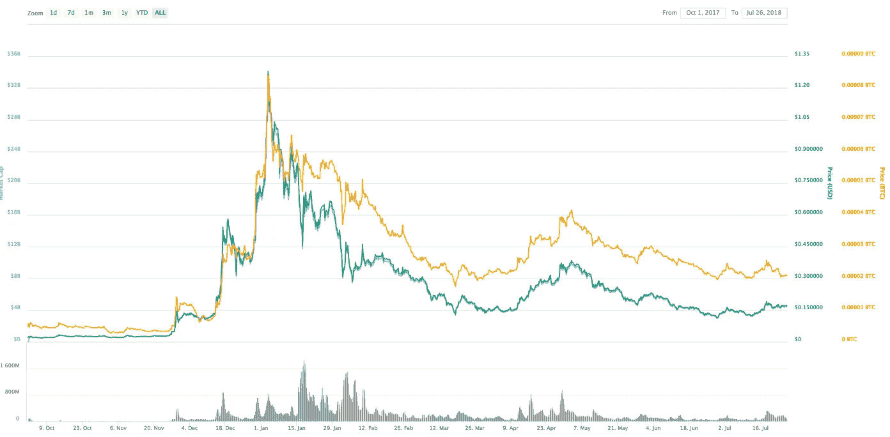

# 卡尔达诺是什么？(阿达):检查比特币基地潜在的新加密货币

> 原文：<https://medium.com/hackernoon/what-is-cardano-ada-examining-coinbases-potential-new-cryptocurrencies-98a2e4a75681>

## Cardano 是什么？潜在的比特币基地上市对它有什么帮助或伤害？

如果你关注加密货币市场，你可能听说过有 [5 种新硬币](https://www.cnbc.com/2018/07/13/coinbase-considers-five-new-coins-for-its-platform.html)比特币基地正在考虑在他们的交易所上市， [CoinbasePro](http://coinbasepro.com) (从 GDAX 更名而来)。7 月 13 日，他们在媒体博客上发布了一份官方声明。他们宣布的硬币之一是 Cardano 和它的加密货币 ADA。

The Coinbase 5

**比特币基地可能加入的加密货币有:**

1.  *卡尔达诺(阿达)*
2.  *恒星流明(XLM)*
3.  *0x (ZRX)*
4.  *基本注意力令牌(BAT)*
5.  *兹卡什(ZEC)*

当我听到这个消息时，我的第一反应是给自己几个耳光，因为几个月来我一直想进入 Cardano，0x 和 Stellar，但还没有扣动扳机。然后，我决定尽可能多地做尽职调查，尝试并确定哪些将被添加到比特币基地。以及总的来说哪些是最有前途的项目。因为，说实话，我们都很好奇，如果上市的话，ADA 的价格会怎么样。比特币现金加入币安导致了一场惨败，导致加密货币的价格爆炸式上涨。紧接着几乎是崩溃。但是也许比特币基地已经改进了新硬币的上市程序，他们已经显示出比上次宣布可能增加的硬币更加透明。

旁注:我个人对 BCH 在比特币基地惨败的经历。
我记得比特币现金上市的确切时刻。在比特币基地上市前几个月，我将投资组合的很大一部分投资到了 BCH。我投资几周后，BCW 经历了一轮强劲的牛市。我没有卖，因为我是个白痴。很快我就出现了赤字，因为我最初的投资亏损了。我坚持 BCH，因为我很固执，不想把损失算在我的损益上。当我发现它在比特币基地上市时，我正在健身房。如果我在锻炼中没有出足够的汗，当我意识到一枚我几乎放弃的硬币即将爆炸时，我肯定会出足够的汗。我抛弃了坐在长椅上的朋友，他含漱的呼救声仅仅是一个回声，而我的脑海里却在想着盈利的可能性。我冲向更衣室，把我的脏衣服塞进我的运动包里，一次也没有离开我的手机。BCH 价格每秒钟都在快速移动。意识到我可能没有足够的时间跑回家，把我的 BCH 转移到比特币基地，我在手机上开始了这个过程。当它砸到我的比特币基地钱包时，我把它全部卖掉了。想到我刚刚抓到的 10 倍，我的眼睛几乎闪闪发光。我的快乐持续了大约 30 秒。这就是我意识到比特币基地已经崩溃，我的订单没有得到执行的时间。我轻点那个卖出按钮，就像我的生命依赖于它一样，直到它最终关闭，就在我最初投资的盈亏平衡点。最重要的是，我的朋友整整两个星期没有和我说话。

*我离题了，让我们从阿达开始，我认为它是比特币基地最有可能在未来几个月上市的硬币之一。*

## ***【卡丹诺(ADA)*** *。*

*旁注:我不拥有任何 Cardano，也不隶属于其任何团队成员。我计划在不久的将来购买一些，但想先分享我的意见。如果卡尔达诺团队的任何人正在阅读这篇文章，我们很乐意采访你！*

## 卡尔达诺是什么？

Cardano 是智能合约领域的新玩家。它与以太坊竞争，但有几个关键的区别。它有自己的区块链，并且正在建立一个分散的网络，开发者可以在这个网络上建立分散的应用程序。然而，它在预期用途上有所不同，最适合 Cardano (ADA)的 dApps 适用于大型组织、公司、B2B 业务等。

*比特币促进了价值转移，而卡尔达诺则促进了去中心化应用的发展。*

Cardano 团队正在开发一种叫做 Haskell 的新语言，根据他们的说法，这种语言更侧重于数学，以增加协议的安全性和可靠性。他们还自诩为“研究优先”的方法，声称将投入大量时间和资金进行发现和规划。与该领域其他开发团队所见的更敏捷的方法相反。

在可能加入比特币基地的硬币中，它的市值排名第二，在我看来，这使它成为加入的有力竞争者。它的价格也相对较低，目前约为 17 美分。散户投资者对 Ripple 加入比特币基地的可能性失去了理智，因为它提供了进入加密货币的机会，他们可以购买大量的加密货币。较低的价格使它对一般比特币基地用户更有吸引力。

*注:价格上的同一点也可以扩展到 Stellar(我觉得 Cardano、Stellar、0x 最有可能加入，但那只是我的猜测。*

Cardano 团队希望解决以太坊中存在的低效率问题，并因此建立一个更好的分散网络。

**这是他们网站上解释加密货币及其效用的摘录:**

> 卡尔达诺是 [ADA 加密货币](https://www.cardano.org/en/buy-sell-ada/)的所在地，该货币可用于发送和接收数字资金。这种数字现金代表着货币的未来，它使快速、直接的转账成为可能，并通过使用加密技术保证其安全性。
> 
> 然而，Cardano 不仅仅是一种加密货币，它还是一个技术平台，能够运行目前全球个人、组织和政府每天使用的金融应用程序。

每当我听说一家公司试图收购以太坊，我都会犹豫是否支持他们。我有点偏见，以太坊是第一个将我引入加密货币世界的区块链项目。几年前我就听说过比特币，但对我来说，数字货币似乎并不十分创新，我是在玩电子游戏中长大的——数字货币具有价值的想法对我来说并不难理解。

另一方面，以太坊让我大吃一惊。我记得我躺在床上用笔记本电脑上网，直到凌晨 3-4 点，试图了解更多关于网络的信息。从那以后，我在以太坊之外进行了大量的多元化，不再像以前那样是一个狂热的粉丝了。但是如果你认为和以太坊竞争是一件容易的事情，那你就是在和自己开玩笑。老实说，我不知道是否有人会真正击败联邦理工学院，但也许有两个竞争对手有机会在这个领域存在，解决不同的利基——类似于优步和 Lyft。

在调查以太坊的潜在竞争对手时，我分析的第一个因素是他们的团队。如果他们想要竞争，他们将需要大量的信誉、经验和支持。

## 卡尔达诺团队

自 2017 年的 ICO 热潮以来，我们看到创始人对区块链几乎没有经验的项目越来越多。我们也看到一些公司把一些人放在他们的创始团队中，让他们更多地扮演象征性的领导角色，而不是真正的活跃成员。一个有名无实的领导是一个能增加公司可信度和市场价值的人，而不是在日常运营中增加价值的人。

ADAs 的创始人 Charles Hoskinson 与查理·李(Litecoin 的创始人)关系密切，在加密领域拥有一个庞大的重量级人物网络。区块链社区很小，拥有一个现有网络的创始人可以迅速加速增长。他还曾经担任以太坊的首席执行官——事实上，他离开了智能合约平台的当前市场领导者，转而加入竞争对手，这是 ADAs 的一大优势。尤其是考虑到他们声称能够解决以太坊中存在的问题。知道 ADA 的创始人之一亲身经历了以太坊的缺点，这种说法就更有分量了。

## **共识协议**

Cardano 利用了一种原始的利害关系证明(PoS)共识协议，称为 Oroboros。PoS 在很大程度上被视为工作证明(PoW)的演变，并通过支付利息来奖励“挖掘”用户。对 PoS 感兴趣被称为“下注”，当你“下注”你的硬币一段时间后，他们会“铸造”新的硬币，这些硬币会被放入你的钱包。这就是供给增加的方式。PoS 也有它的缺点，但总的来说被视为 PoW 协议的一个改进，因为使用 PoS“挖掘”一枚硬币所需的能耗大大降低。以太坊目前使用的是 PoW 共识协议，但 ETH 开发人员正在努力实现 Casper 协议，该协议将把网络切换到 PoS。从这个意义上来说，Cardano 已经领先于智能合同曲线，因为它已经开始使用 PoS。

## 基本原则

*2018 年 7 月 24 日数据快照*

[Source](https://coinmarketcap.com/currencies/cardano/)

## **令牌组学**

*市值:* $4，474，234，563
*流通供应量:* 25，927，070，538
*最大供应量:* 31，112，483，745
*现价:* $0.172570 美元/ 0.00002108 BTC
*起拍价*

## 兴趣/社会统计

*月流量:*45.36 万
*推特关注者:*14.3 万
*电报社区:*13092 名成员
*Reddit 社区:*6.67 万订阅者

## 比特币基地效应

问题依然存在:比特币基地(可能)让 Cardano 上市会对 ADA 币的价格产生什么影响？

这很难说，我会质疑任何有绝对把握做出声明的人。然而，我相信，从长远来看，在比特币基地上市将带来巨大的好处。

这完全是猜测，但我的*猜测*是:当硬币最初上市时，价格会短暂飙升，因为比特币基地用户吵着要获得平台上列出的最便宜的硬币。

一旦价格暴涨，ADA 持有者将会把他们的硬币一起送到比特币基地，届时将会出现大规模的抛售。然后，那些还没有进入 ADA，但希望在比特币基地新闻发布前进入的交易者，将会在低价抛售时进入。这将使硬币回到最初上市时的位置。

我不认为我们将在头几周看到的价格走势会反映比特币基地上市的长期影响。会有狂热，一些人会利用它赚很多钱，一些人会损失很多钱——就像比特币现金 BCH 上市时一样。

然而，我确实相信，比特币基地能给卡尔达诺带来的交易量的增加将会为硬币的未来升值提供强有力的支持。我对 ADAs 上市当天的价格走势不感兴趣，而是对一年后可能出现的价格走势感兴趣。

比特币基地有很大的用户群，更多的用户意味着更多的交易量。更多的交易量意味着更多的流动性，更多的流动性意味着这种投资工具现在对机构投资者来说是可行的，只要他们手头有一个托管解决方案，或者，我不知道，一个比特币 ETF 正在工作中，从他们手中消除托管问题。

> *比特币基地正在为机构投资者和比特币交易所交易基金开发托管解决方案*

在比特币基地上市还意味着，下一次当比特币达到 20，000 美元的历史高点时，我们看到大量用户涌入，Cardano 将是他们可以投资的最容易、最便宜的硬币之一。卡尔达诺目前约为 17 美分，其历史最高价超过 1 美元。对我来说，这意味着如果 Cardano 上市，它的市值将会增加，从而回到之前的高点。