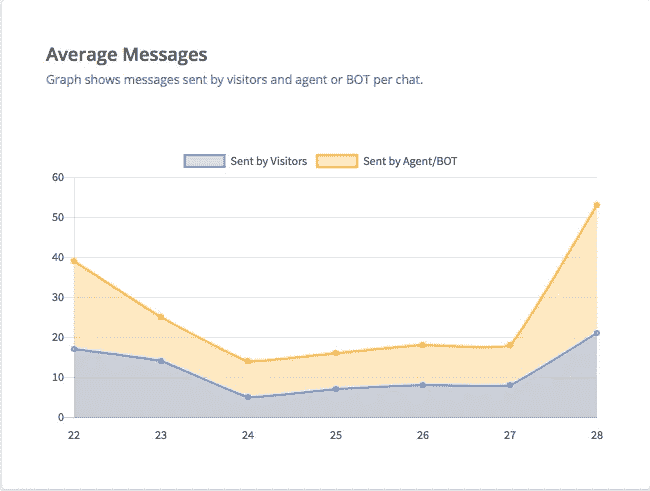

# 什么是对话式营销？

> 原文：<https://medium.com/hackernoon/what-is-conversational-marketing-ba5f49de2394>

## …您如何利用它来发展您的业务？

在过去的几年和几个月里，您可能听说过很多关于自动化的事情。从特斯拉试图自动化整个工厂，到半自动手术机器人，再到亚马逊的无人杂货店。所有拥有最大银行账户的大公司都在投资自动化；他们当然会，这是前进的方向。

但是你呢？您的公司如何实现流程自动化？

# 什么是对话自动化？

对话式[营销](https://hackernoon.com/tagged/marketing)被定义为公司和客户之间通过多种渠道进行的以反馈为中心的一对一沟通，旨在通过创造更人性化的购买体验来提高参与度、缩短销售周期、培养客户忠诚度、扩大客户群，并最终增加收入。

[对话式](https://hackernoon.com/tagged/conversational) [营销](https://hackernoon.com/tagged/marketing)不仅限于实时聊天，这是一场包罗万象的活动。从电子邮件和客户支持到客户忠诚度和成功计划，时间敏感和个性化永远不会过时。对话式营销不再是简单的文案和图片，而是重新开始，回答人们的问题，倾听他们的反馈，然后发现帮助他们的新方法。

人民已经说话了。有研究表明，只有 [43%](http://www.businesswire.com/news/home/20150729005275/en/ThinkingPhones-Report-Reveals-Optimal-Calling-Strategies-Enterprise) 的人接听陌生来电，平均邮件打开率约为 [20%](https://mailchimp.com/resources/research/email-marketing-benchmarks/) ，平均登陆页面转化率仅为 [2.35%](http://www.wordstream.com/blog/ws/2014/03/17/what-is-a-good-conversion-rate) 。传统的营销努力不仅对人们不利，对商业也不利。

但更重要的是，人民代表也发表了意见。GDPR 是数据囤积和电子邮件垃圾的死亡，营销人员现在需要证明他们为什么持有每一条个人信息，以及这些信息用于营销的法律依据。这意味着第三方领先的生成公司和列表提供商的终结，没有预先勾选的框，以及像假定同意和选择加入这样的法律规避的断头台。

互联网是人类历史上最强大的双向交流界面，那么为什么你只是用它来发送电子邮件呢？

是时候找一个新的斜面了。

或者说，企业中最古老的支柱。

甚至在人类会说彼此的语言之前，他们就开始交谈了。

Vasco Da Gama 和 Christopher Colombus 被广泛认为是第一次国际贸易繁荣的先驱，从那时起，会话式商务便蓬勃发展。回到过去的美好时光，人类和商业都是通过面对面的交谈来进行交易的。当直接与客户交谈不再是一种选择时，企业使用鸽子来交换信件，它们用莫尔斯电码编码和解码，交换电报，给对方发传真，给对方留语音邮件，淹没电子邮件收件箱；所有这些都是为了回归第一次人类互动的个性化和舒适性。

Photo by Anastasia Gubinskaya on Reshot

即使在无所不包的互联网时代，你仍然可以在今天的营销和销售领域看到对话。就在你妈妈去的那个街角小店，她在那里买了治疗背痛的药膏，因为那是店主推荐的。就在你当地的花店里，花店把那些绣球花准备好了，这样你就可以在你姐妹的毕业典礼上采摘了。在世界各地数以百万计的小企业中，一对一的人际对话推动着营销和销售。

在现代社会，我们已经改变了我们认为可接受的响应时间。不再需要两周就能在一个很棒的家庭聚会上发布消息，只需要两分钟和正确的 Whatsapp 群。通过数字网络，家人住得更近了，朋友更多了，老师可以更快地回答你的问题。

那么企业为什么不呢？

> 大多数公司不能因为没有更大的冒险精神而受到指责。
> 
> *营销就像扑克，是一场零和游戏。每一个赢家，都有一个输家。*

从贵公司购买的每件产品，都不是您的客户从竞争对手那里购买的产品。这就是为什么在营销和销售领域，坏习惯往往会根深蒂固；如果它能为一个人赚钱，所有人都会跟着做(读作电子邮件爆炸)。行为经济学称之为“风险厌恶”；这种现象被描述为“损失大于收益”

潜在失败的痛苦大于胜利的喜悦，因此企业有义务谨慎行事，不断重复。这很糟糕，因为今天大多数营销和销售解决方案都是为了自动化业务流程而设计的，而不是为了提供做出明智决策所需的智能。

对话式营销自古以来就有，那么为什么又有了新的兴趣呢？

这是因为我们现在拥有的技术不仅仅是进行一对一的对话，而是能够进行大规模的对话。这与重视个性化和易访问界面的消费者联系在一起，意味着对话式营销和销售变得比以往任何时候都更加重要。

# 对话式营销的优势在哪里？

## 时间永远不会停止

你的生意不仅仅是营业时间。你会有在任何时候访问你的网站的潜在客户，只有在回家后才会有问题和疑问的客户，以及希望在深夜讨论交易的企业。不要让他们填写静态的销售线索和联系表格( [1%](http://www.marketingprofs.com/charts/2015/27318/conversion-benchmarks-for-seven-types-of-online-forms) )，而是从简单的客户参与转向更能满足客户需求的方式。使用对话式营销和人工智能机器人，你可以一年 365 天、一天 24 小时产生线索、回答查询和预订会议，这样你就可以与你的客户实时互动。

对话式营销的另一个重要方面是，它们不会只发生在一次会面中，所以你的对话需要能够延续下去。不管是实时的，在他们结束会议后，还是晚上他们有空的时候，你的机器人应该能够从他们离开你的客户的地方继续并交付。

客户不在乎你是在和 10 个、100 个还是 1000 个其他人交谈，他们只关心他们需要解决的问题。

## 我们能大规模建造它吗？是的，我们可以！

所有的营销活动都不可避免地有一个单一的目标:增加口碑营销，让你的客户为你做广告。

[92%的消费者相信朋友或家人的推荐胜过任何其他形式的营销，这一统计数据的很大一部分源于与你的家人和朋友建立了联系。公司知道面对面的谈话是建立这些纽带的最好方式，但是这是不可扩展的。](https://norfolkva.minutemanpress.com/article/2017/10/12/the-importance-of-word-of-mouth-marketing)

无论是在客户支持、营销还是销售领域，扩展对话从来都不容易。为了同时与潜在客户或客户进行 100 次一对一的对话，你需要有 100 名员工；或者很多不满的人在等待。

当你停止推销并开始倾听对方的话时，对话会变得更加自然，并为交叉销售、鼓励分享、征求意见提供了机会，因为你可以在商务和支持之间顺畅地流动。

有了实时聊天/机器人功能来辅助您的对话营销功能，您可以与您的所有客户进行一对一的对话，或者允许机器人像您一样与他们交谈。

## 约会

老实说，我们已经到达了技术革命的一个点，你不再因为想要而检查你的电子邮件收件箱，而是因为你必须这样做。

虽然发送合同等一些事情可能不会被社会接受，但你几乎可以用手机做任何事情。消费者也同意。[据 TechCrunch](https://techcrunch.com/2017/03/03/u-s-consumers-now-spend-5-hours-per-day-on-mobile-devices/) 报道，消费者每天在手机上花费 5 个小时。如果你想知道那些该死的孩子花了这么多时间在什么上面，你可以看看[脸书的二月收入](https://www.recode.net/2018/2/1/16959804/whatsapp-facebook-biggest-messenger-instagram-users)，它声称 WhatsApp 和 Facebook Messenger 和 Instagram 分别拥有 15 亿和 13 亿和 11 亿月活跃用户。

现在是移动的，如果你和你的客户不在同一个平台上，他们就不会和你在一起。使用对话式营销，您可以在客户需要的时间、地点和方式与他们在一起，让您的受众控制他们自己的支持、销售查询或营销工作。

对话式营销不仅仅是为了方便使用它的人，它也是展示你公司文化的一种很好的方式。使用特定的内容工具，如文案、游戏、表情符号、视频和 gif，你可以与你的客户、伙伴公司和客户分享你的品牌个性。当客户使用机器人时，他们不仅了解了你的公司，还了解了你公司的产品。

## 由你制造，为像你一样的人

上下文是整体对话中最重要的方面之一。这就是为什么政客们经常用原声讲话，因为他们说的话会被原声报道。通过消除上下文，他们保持答案的一致性和清晰的审查。

背景是建立纽带的东西，是制造内部笑话和伟大故事讲述者的东西。通过对话式营销，你与潜在客户、客户或企业的每一次互动都建立在一个圆形的背景之上，这使得你的第一枪或抓住销售反弹成为更好的服务端体验。

使用对话式营销，你可以根据你的潜在客户在你网站的哪个页面，创造简单的快乐，比如定制的对话开场白，以丰富数据的线索资格。通过无缝地触及问题的核心，因为你不必浪费时间来整理你已经获得的信息，你可以创建更个性化和更有语境的对话。

## 数据

从传统营销中收集的传统数据存在一个传统问题。

由于以数据为中心，当前营销的动机是收集更多的数据，而不是为客户提供更令人满意的体验。今天的市场营销更注重数据驱动，而不是客户驱动。

我们已经准备好给我们的客户带来一系列没完没了的电子邮件、联系表格和电话，这样我们就可以把他们的名字放在电子表格中，这样只会产生更多的电子邮件、联系表格和电话。如果你不知道别人喜欢你产品的什么，那知道别人的名字又有什么意义呢？

虽然你可以把你的九个问题的联系表做得更长来适应这种情况，但它永远不会给你从完全成熟的一对一谈话中获得的深度和理解。使用人工智能的力量作为人类来收集信息，而不是简单地使用静态工具。

分析传统方法忽略的参与度、保留率、漏斗瓶颈、客户痛点和其他关键指标。

# 你如何利用它来发展你的业务？

我们理解所有这些可能看起来有点令人生畏。在纸上听起来很棒的东西，在现实生活中往往更难实现。对话自动化有几个需要逐步分解的细微差别。

所有这些都通过一个七步流程得以简化和实现，该流程将帮助您为您的公司建立一个对话式营销框架，并打破支持、销售和营销之间的壁垒。

## #1 —查看现有数据

成功的对话式营销框架的第一步是了解你的立场。为此，确定您现有的分析，如您的电子邮件流，您的聊天日志，聊天转储，票证处理，查询和关闭。

虽然对话营销是公司使用的一次性短语，但它只是拼图的一部分。对话需要贯穿您的所有产品、销售、支持和营销；一切。所有这些接触点都是你的机器人看起来像什么，它会说什么，它会处理什么的基础。

## #2 —你的目标群体是什么

一旦您确定并剖析了您的指标，您现在可以转向您的客户。如果你有一大群没有分裂的观众，你需要确保你的机器人对每个部分都是一样的，不会疏远任何人。这意味着多语言支持，没有地方性的停机时间，以及一个用户友好的、非歧视性的界面。瞄准特定的受众，定位你的对话平台，使其吸引尽可能多的潜在客户，不管他们的年龄、收入、性别、位置、生活方式、用途和职业。每个部分都应该有与你的实时聊天或机器人互动的预定目标，你将使用这些目标来设计机器人流程。

## #3 —定义你的特征

使用第 1 步和第 2 步，定义您希望纳入对话式营销的第一套产品。这可能意味着，如果你觉得大胆的话，你可以取消所有的联系表格和电子邮件订阅按钮，或者通过实时聊天或机器人并排运行它们。功能的数量和范围不应该试图完全取代您的客户支持，而是要增强它们的功能，使其更有效。如果随着时间的推移，你认为你的对话功能完全自动化可以实现更多，那么你可以在你的网站上到处放置你的实时聊天按钮，以最大限度地进行对话。

## # 4——个性

有了这个，你还必须定义和区分你的品牌的角色。你的公司文化和品牌形象会随着不同的对话特征而变化，比如。

>句子、单词、表情符号。>您回答的长度。>图片、视频和 gif 的使用。>表格和选择按钮的使用。

>何时触发主动对话。

机器人可以俏皮可爱，也可以专业中肯。对于年轻观众，你可以实现一个友好的机器人，使用表情符号和 gif 来帮助你的对话，使它看起来更像人类。如果你是 B2B 企业，你可以使用简短、有凝聚力的句子，并配以图表和数字。

## #5 —文案

你的对话式营销的力度取决于你用来把它带回家的话语。您的实时聊天或机器人完全建立在您训练它使用的单词上；它的文字是你产品的核心。为此，我们敦促公司使用专业帮助来撰写对话。

这一过程的关键分为四个步骤

*   编写场景
*   对场景进行优先级排序
*   发表对话
*   优化对话。

和你的文案和设计师坐下来，根据你的目标，创造一个好的对话的假设。

## #6 —衡量、优化、改进

一旦你完成了对话式营销框架的构建，你就可以开始运行它了。我们建议首先在一个测试组中运行它，这样您就可以在向您的整个客户群发布之前测量、优化和改进您的 bot 功能。

你可以运行 AB 测试，以确定某些单词是否比其他单词更能引发某些购买决定，你可以调整对话触发器，以查看客户是否更有可能在十秒钟或五秒钟内与机器人交谈。找出客户停止与你的机器人互动的障碍，并着手纠正它们。无论你的假设是什么，从机器人的语调，句子的复杂性，在慢速互联网连接上加载 gif 需要太长时间:运行一个独立的 ab 测试。

## #7 —冲洗并重复

重复并理解总有改进的空间是一个关键参数。随着您的 bot 提供商推出新功能，如更新的仪表板、机器学习驱动的 FAQ 自动化、滴滴活动支持，您可以不断提高其性能，并找到更多价值来解锁。真正的工作是进行实验，并始终努力接近你的最终目标:通过参与和有益的对话，帮助客户完成工作。

所有对话式营销的最终目标都很简单；再次把生意变得私人化。

## 阅读更多关于使用 VERLOOP 进行销售、支持和营销对话营销的公司的信息。

*原载于 2018 年 7 月 3 日*[*blog . verloop . io*](https://blog.verloop.io/what-is-conversational-marketing-and-how-can-you-use-it-to-grow-your-business/)*。*