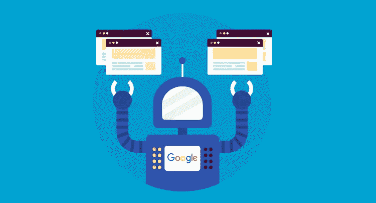
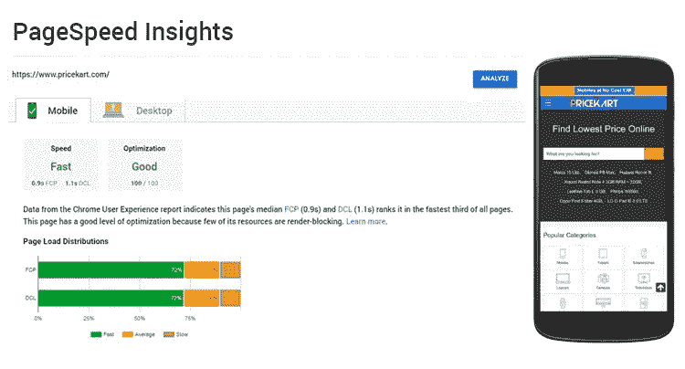
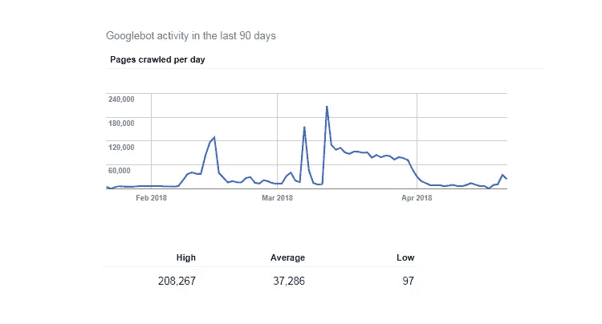
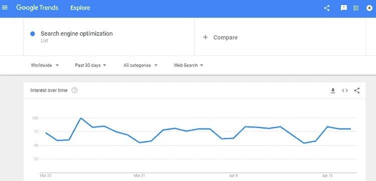

# 什么是抓取预算，它将如何影响你的网站排名？

> 原文：<https://medium.com/hackernoon/what-is-crawl-budget-and-how-it-will-affect-your-website-ranking-e09dcfaa8aba>

如今，搜索引擎优化并不仅仅是为正确的关键词优化内容和获得网站的反向链接。SEO 因素每年都在变化，因此，你必须付出更多的努力才能排名第一。SEO 是一个很大的概念，最好是跟上 SEO 世界中每一个新的术语。

你可能听过站长们谈论爬虫预算和 Googlebot。

想知道什么是爬网预算？

抓取预算和我的网站排名有关系吗？

让我们深入更新 SEO 知识。

# SEO 中的爬行是什么？

谷歌派出名为 Googlebot 或谷歌蜘蛛(可能没有真正的蜘蛛可怕)的机器人来抓取你的网页，并索引其中的单词和内容。一旦抓取完成，这些结果就会被放入 Google 的索引中。因此，重要的是谷歌应该很容易找到你所有的网页。因此，要让所有的 URL 都容易被 Googlebot 找到，sitemap 是必须的。

如果你的网站有几百个网址，那么搜索引擎会很容易抓取你的网站。但是，如果你的网站有数千个页面，并且每天自动生成许多新的 URL，那么谷歌可能不会抓取所有这些页面。因此，确定爬什么、什么时候爬以及爬多少的优先级变得很重要。

现在来看看爬行速度和爬行预算。

别担心——理解这个概念并不难。

# 什么是爬网预算？

爬行预算来源于两个非常重要的因素:爬行速率和爬行需求。考虑到你的网站的抓取率和抓取需求，我们可以将抓取预算定义为 Googlebot 能够或者想要从你的网站抓取的网页或者 URL 的数量’。

**抓取速率限制:**

引入抓取速度限制是为了让谷歌不要从你的网站抓取太多太快的页面，让你的服务器疲惫不堪。爬行速度限制阻止谷歌提出太多的请求，因为这可能会导致降低您的网站的速度。

爬行速率可能会上升或下降，具体取决于:

*   你的网站速度:如果你的网站速度慢或服务器响应时间低，那么抓取率限制下降，谷歌机器人只抓取你的一些页面。如果你的网站响应很快，那么抓取率可能会增加。
*   您可以在搜索控制台中设置爬网率限制。但是，设置高限制并不能保证高抓取率。

**抓取需求:**

如果索引你的网页的需求很低，那么 Googlebot 会避免抓取你的网页。谷歌表示，流行和更新的内容有更高的抓取率需求。抓取需求取决于网页的受欢迎程度以及内容的新鲜度和原创性。

因此，你的网站的抓取预算被定义为谷歌机器人能够或想要抓取的 URL 的数量，这取决于你的网站的抓取速率限制和相互的抓取需求。

*明白了吗？太好了！*

但底线是，你希望谷歌抓取你所有的网页，你希望谷歌机器人应该不断访问你的网站，寻找新的页面。显然，你不想错过那些没有被 Googlebot 抓取的页面的流量。

## 那么，我们来看看哪些因素会影响爬网预算。

*   添加低值或零值的页面将减少您的爬网预算。因此，确保你删除所有低附加值的网址。
*   过时的内容是不可取的。不时更新你的网站，给你的用户提供新鲜的内容。
*   重复的内容会毁了你的网站。拿出原创内容。
*   重复的 Meta 和 Title 标签会导致灾难。记住，没有 Meta 和 Title 标签比有重复标签要好。
*   没有人喜欢缓慢加载的网站。为移动和桌面视图优化您的网站速度。在这里你可以检查你的网站的速度:**。**
*   **用户第一。永远为你的用户而不是谷歌。满足用户的需求，而不是通过不必要的优化来打动谷歌。**

**这里有一张快照，展示了一家名为 Pricekart.com**的价格比较网站的 PageSpeed 洞察****

********

****现在是时候回答一些你可能会想到的问题了。****

# ****1)如何增加抓取预算？****

****您可以通过以下方式增加爬网预算:****

*   ****为用户提供新鲜和原创的内容。****
*   ****确保您的页面响应时间很快。****
*   ****避免网页中的无限空间和代理。****
*   ****确保你网站上的每个 URL 都应该为你的用户增加价值。这里是你可以让你的网站被审计的技术错误，这些错误阻止你的网站排名靠前: [**获取 SEO 审计报告**](http://www.nethority.com/seo-audit-plans-pricing/) 。****

# ****2)如何查看抓取预算？****

****可以使用 Google 自己给的免费工具， [**Google 搜索控制台**](https://www.google.com/webmasters/tools/home) 。你可以很容易地在这里查看你的抓取数据。此外，您可以检查服务器错误和抓取错误，并优化您的网站，以增加您的抓取预算。****

****这里有一个来自谷歌搜索控制台的快照，显示了 90 天内的抓取变化。****

********

# ****3)抓取预算会如何影响你的网站排名？****

****显然，如果你的许多网页没有被抓取，你将永远看不到这些网页的流量。低抓取预算会导致低排名，因为你的很多页面永远不会在谷歌排名。因此，你需要确保你所有的重要页面都必须被谷歌抓取。****

******注意:**高抓取预算并不能保证高排名。都是质量和需求的问题。为了提高你的网站排名，你可以选择我们的 [**职业 SEO 包**](http://www.nethority.com/packages/professional-seo-package/) 。我们是市场上最好的，为您提供所有您需要的 SEO 帮助。****

# ****4)如何检查抓取需求？****

****当一个主题或搜索查询变得流行并被用户频繁地在谷歌搜索框中搜索时，提供相关信息的网页的流行度也增加。因此，我们可以说，需求增加了，Googlebot 现在可以索引越来越多的页面，这些页面可以显示为 SERP，但要确保用户体验不会下降。你可以通过使用 [**谷歌趋势**](https://trends.google.com/trends/) 来查看什么是趋势，并尝试让你的内容围绕谷歌世界中的趋势。****

****这里有一个快照，显示了关键字“搜索引擎优化”的谷歌趋势统计。****

********

******判决:******

****抓取预算是为网站做 SEO 时要考虑的一个重要因素。****

****很低的抓取预算意味着谷歌不太喜欢你的网页。****

****非常高的爬行预算并不能保证高排名。此外，您不希望非常高的爬行，因为这可能会使您的服务器过载。****

****你不能通过简单地设置一些限制来增加或减少你网站的抓取预算。然而，你可以让你的网站有足够的能力有足够的爬行预算，通过照顾好独特的内容，更新的信息和高页面速度等因素。****