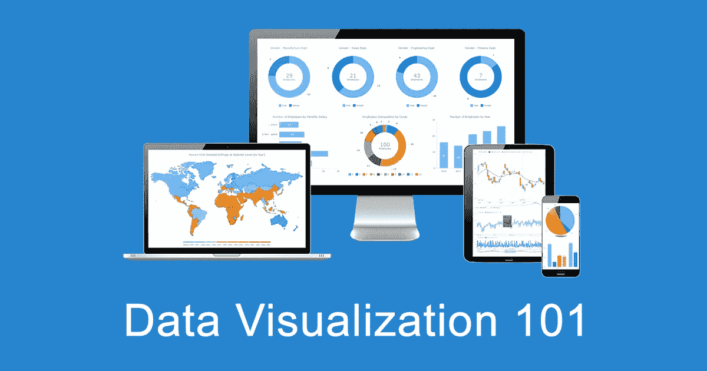
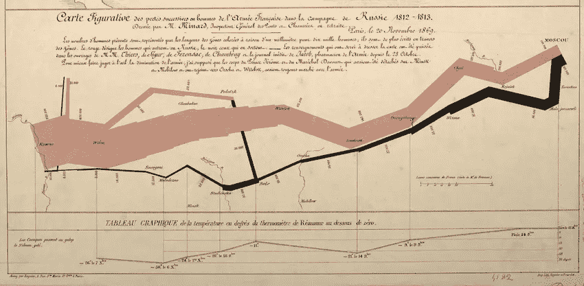
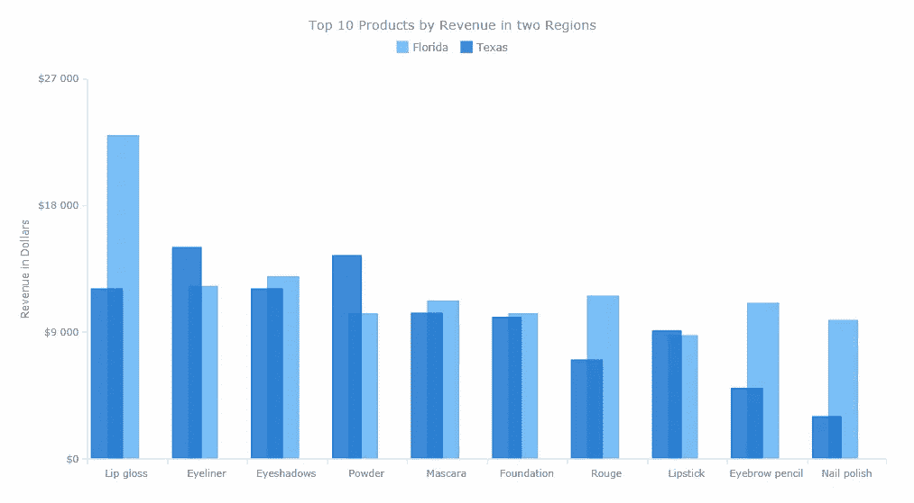
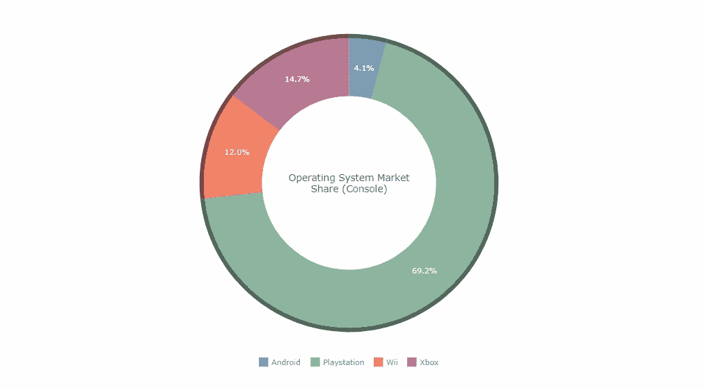
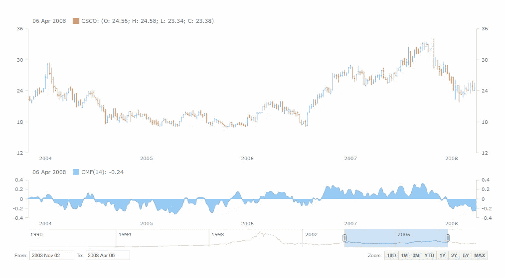
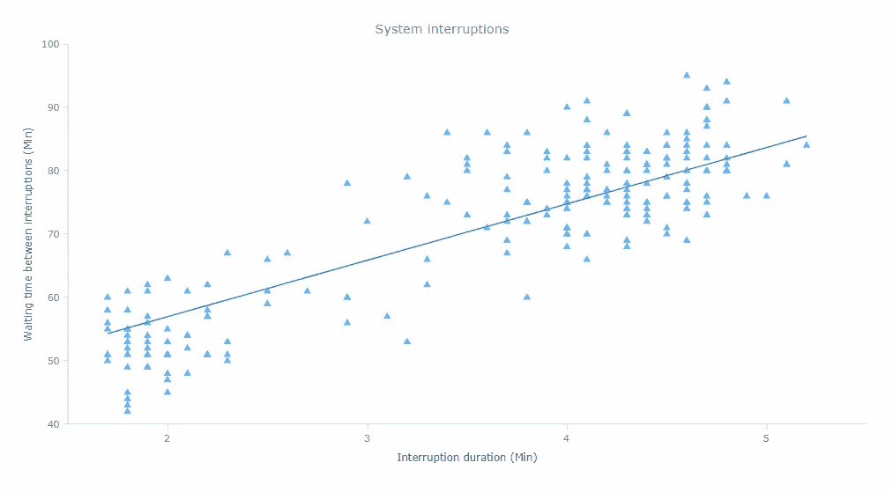
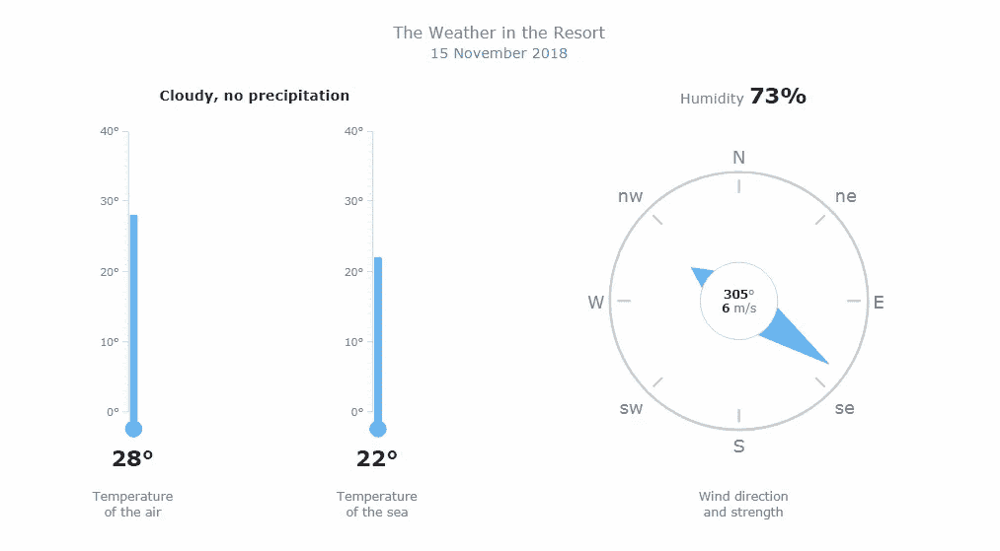
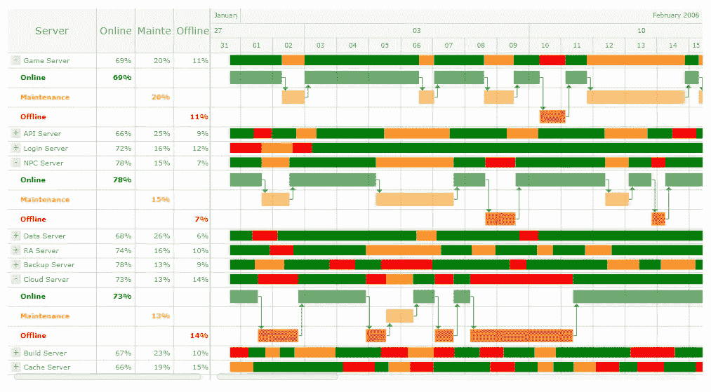
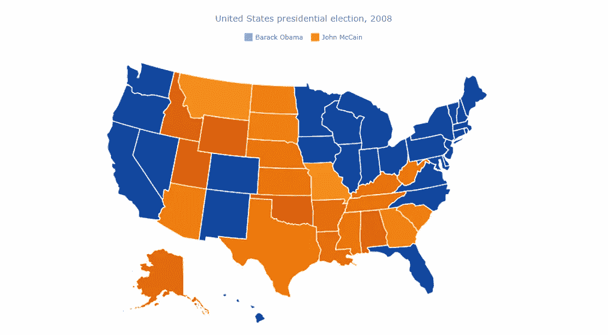
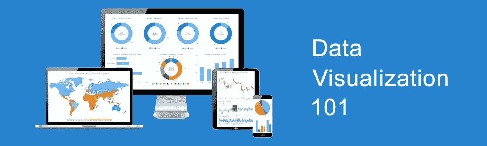

# 什么是数据可视化？定义、历史和示例

> 原文：<https://medium.com/hackernoon/what-is-data-visualization-definition-history-and-examples-e51ded6e444a>

**数据可视化**是将数据从原始数据转换成图形表示的实践，例如图形、地图、图表和复杂的仪表板。让我们看看是什么使它变得重要(意义)，它是如何发展的(历史)，以及它在现实生活中是如何工作的(例子)。加入我们的数据可视化 101 课程，介绍 dataviz 及其强大功能。

# 数据可视化的意义

为了理解数据可视化有多有意义，这里有一个简单的事实:与图形相比，当复杂数据以数字和文本编码时，人脑理解复杂数据要困难得多。Dataviz 技术利用了这一特性，有助于以最有效、最直观的形式呈现大量信息。

事实上，可视化显示的数据更容易掌握和分析，使决策者更快地找到模式，包括新的和隐藏的模式，并理解甚至是困难的概念。图表、图形、地图、仪表板—数据可视化有助于识别问题和不足，选择最佳产品和业务运营策略，预测销量和股价，微调项目管理和资源管理，等等。

# 数据可视化的历史

数据可视化的概念并不新鲜。此外，它已经存在了几个世纪。dataviz 项目最早和最明显的例子是地图。然后是饼状图，它在 19 世纪初首次出现。几十年后，查尔斯·约瑟夫·密纳德使用统计图绘制了拿破仑·波拿巴 1812 年的俄罗斯战役，结合了多种指标:军队数量、温度、距离、方向等等。

数据可视化历史上其他值得注意的里程碑包括但不限于尼科尔·奥雷斯姆、约瑟夫·普里斯特利和威廉·普莱费尔的作品。他们都对 dataviz 的发展做出了巨大的贡献。Oresme 是中世纪最伟大的思想家之一，可以说他[在 14 世纪发明了条形图](https://www.anychart.com/blog/2015/06/02/first-bar-chart-in-history/)，尽管后来是 Playfair 赋予了条形图我们今天所知道的形式。Priestley 在他的传记图表中，使用了一条带横条的时间线来比较多人的寿命。Playfair 还被认为是[首次使用面积图](https://www.anychart.com/blog/2015/12/23/first-area-charts-history/)。

要了解有关数据可视化历史的更多信息，请探索约克大学的 Michael Friendly 和 Daniel J. Denis 在他们的书《专题制图、统计图形和数据可视化历史上的里程碑:创新的图解年表》中提到的[最大的已知里程碑](https://www.math.yorku.ca/SCS/Gallery/milestone/Visualization_Milestones.pdf)

随着时间的推移，可视化数据的想法不断发展，随着计算机的出现和技术的快速发展，这门学科无疑向前迈进了一大步。如今，即使是海量数据——以及大数据本身——也可以由 dataviz 软件以非常高的速度进行处理，从而在数据分析和商业智能领域开辟了令人兴奋的新机遇。

# 数据可视化方法和示例

可视化最终是让数据说话的好方法。

随着时间的推移，出现了各种各样的数据可视化技术，为解决几乎任何 dataviz 任务提供了机会。根据您需要探索(或解释)的数据以及您希望它回答的分析问题，您可以选择一种或另一种方法。

有几十种可用的图表类型，每一种都适合特定的用途，这对[选择正确的图表类型](https://www.anychart.com/blog/category/choosing-chart-type/)是非常重要的。事实上，选择错误的形式是最常见的——也是最关键的——[可视化错误之一](https://www.anychart.com/blog/2017/08/29/data-visualization-mistakes-avoid/)。

让我们来看看数据可视化任务的七个常见示例，看看哪些图表类型通常是最适合的。单击相应的链接，了解更多信息并查看交互式图表示例。

# 1.比较数据

为了[比较数据](https://www.anychart.com/blog/2017/04/12/data-comparison-chart-type-visualization/)，以下图表类型通常很有帮助:

*   [条形图](https://www.anychart.com/chartopedia/chart-types/bar-chart/)(和[柱形图](https://www.anychart.com/chartopedia/chart-types/column-chart/) ) —用于按类别直接比较数量值。
*   [堆积图](https://www.anychart.com/chartopedia/chart-types/percent-stacked-area-chart/)(和 [100%堆积图](https://www.anychart.com/chartopedia/chart-types/percent-stacked-bar-chart/) ) —添加对构成的查看。
*   [雷达图](https://www.anychart.com/chartopedia/chart-types/radar-chart/)——对比周期性数据。

例如，您可以使用条形图按收入可视化产品，按用户流量可视化推荐来源；堆积图——按产品和地区划分的销售数字；雷达图——每月气温；等等。

# 2.探索数据的构成和部分到整体的关系

为了探究[的构成和部分到整体的关系](https://www.anychart.com/blog/2017/04/20/data-composition-part-whole-chart-type/)，以下图表类型通常是有帮助的:

*   [饼状图](http://www.anychart.com/chartopedia/chart-types/pie-chart/)(和[甜甜圈图](http://www.anychart.com/chartopedia/chart-types/donut-chart/) ) —基本查看一个值的百分比构成。
*   [金字塔图](http://www.anychart.com/chartopedia/chart-types/pyramid-chart/) —探究分层数据的构成。
*   [树形图](http://www.anychart.com/chartopedia/chart-types/treemap/) —查看复杂的分层数据。
*   [漏斗图](http://www.anychart.com/chartopedia/chart-types/funnel-chart/) —测量流程的各个阶段并发现瓶颈。

例如，您可以使用饼图或甜甜圈图来直观显示按零售渠道划分的整体销售额或按用户年龄划分的某个网站总流量；金字塔图表——OSI 模型或按管理级别划分的员工工资；树形图——按来源类别(和流量)划分的网络流量或按目的地国家划分的出口方向；漏斗图——销售漏斗；等等。

# 3.随着时间的推移跟踪数据

为了[跟踪一段时间内的数据](https://www.anychart.com/blog/2017/04/26/data-over-time-trend-chart-types/)，以下图表类型通常很有帮助:

*   [折线图](https://www.anychart.com/chartopedia/chart-types/line-chart/)(和[样条图](https://www.anychart.com/chartopedia/chart-types/spline-chart/) ) —显示趋势、峰值等的基本视图。
*   [面积图](https://www.anychart.com/chartopedia/chart-types/area-chart/) —作为另一种选择，例如用于累积数据。
*   [股票图表](http://www.anychart.com/chartopedia/chart-types/stock-chart/) —用于金融和股市数据等大数据集。
*   [烛台图表](http://www.anychart.com/chartopedia/chart-types/japanese-candlestick-chart/)(和 [OHLC 图表](http://www.anychart.com/chartopedia/chart-types/ohlc-chart/))——添加查看每个时间段内的值的分布。
*   [迷你图](http://www.anychart.com/chartopedia/chart-types/sparkline-chart/) —快速展示大图，不带坐标轴。

例如，您可以使用折线图、样条图或面积图来可视化一段时间内的销售或 web 流量；股票图表——股票价格变化(以及技术指标)；OHLC 和烛台图表——股票价格，着眼于在每个时间段内的价值波动范围；迷你图—过去 12 个月内的销售业绩概览或足球赛季的输赢结果；等等。

# 4.分析数据分布

为了[分析数据分布和数据集之间的关系](https://www.anychart.com/blog/2017/05/04/data-distribution-chart-types/)，以下图表类型通常很有帮助:

*   [点(散)图](http://www.anychart.com/chartopedia/chart-types/dot-chart/) —检查两个变量之间的分布和相关性趋势。
*   [气泡图](http://www.anychart.com/chartopedia/chart-types/bubble-chart/) —考虑数据的三维。
*   [盒须图](http://www.anychart.com/chartopedia/chart-types/box-chart/) —查看主要分布范围和中值。
*   [误差图表](http://www.anychart.com/chartopedia/chart-types/error-chart/)——检查误差分布。
*   [热图图](http://www.anychart.com/chartopedia/chart-types/heatmap/) —用于多个子类别的彩色矩阵视图。
*   [范围图表](http://www.anychart.com/products/anychart/gallery/Range_Charts/) —最大值和最小值之间的头脑范围。
*   [极坐标图](http://www.anychart.com/products/anychart/gallery/Polar_Charts/) —适用于具有空间视角的多元数据。

例如，您可以使用点/散点图通过等待时间、持续时间或实验结果来可视化系统中断；气泡图——运动员、力量和脉搏的训练数据；盒须图——按航班延误时间划分的目的地；误差图——产品销售的可变性；热图——风险矩阵；范围图——气温或处理器停机时间；极坐标图——无线电信号分布；等等。

# 5.评估当前性能数据

为了[评估绩效并将实际值与 KPI 值或定性范围进行比较](https://www.anychart.com/blog/2017/05/10/single-value-data-indicators-gauges/)，以及基本上将单值数据可视化为指标，以下图表类型通常很有帮助:

*   [圆形量规](http://www.anychart.com/chartopedia/chart-types/circular-gauge/)——用于径向标尺。
*   [线性规](http://www.anychart.com/chartopedia/chart-types/linear-gauge/)——用于线性标尺。
*   [项目符号图](http://www.anychart.com/chartopedia/chart-types/bullet-chart/) —在线性尺度上实现更高效的空间可视化。

例如，您可以使用圆形仪表来可视化速度(如速度计)或风向(采用基于指南针的外观)；线性仪表——空气温度(温度计)或油箱容积；项目符号图——当前与计划的销售或系统可用性数字；等等。

# 6.检查项目数据

为了[检查项目数据](https://www.anychart.com/blog/2017/05/17/resource-project-management-chart-types/)，以下图表类型通常很有帮助:

*   [甘特图](http://www.anychart.com/chartopedia/chart-types/gantt-chart/) —关注项目进度中的活动。
*   [资源图表](http://www.anychart.com/chartopedia/chart-types/resource-chart/) —查看资源占用情况。

例如，您可以使用甘特图来可视化项目活动的日程或计划进度与实际进度；资源图表—服务器状态；等等。

# 7.理解地理数据

为了[理解地理数据](https://www.anychart.com/blog/2017/05/24/geovisualization-chart-type-geo-data/)，以下地理可视化图表类型通常很有帮助:

*   [Choropleth 地图](http://www.anychart.com/chartopedia/chart-types/choropleth-map/)——识别不同地理区域的差异。
*   [点状图](http://www.anychart.com/chartopedia/chart-types/dot-map/)——了解地理分布趋势。
*   [气泡贴图](http://www.anychart.com/chartopedia/chart-types/bubble-map/)——在视觉中添加一个尺寸变量。
*   [连接器地图](http://www.anychart.com/chartopedia/chart-types/connector-map/)——看看地理连接。
*   [流程图](http://www.anychart.com/chartopedia/chart-types/flow-map/)——探索当方向很重要时，对象如何在位置之间移动。

例如，您可以使用 choropleth 地图来可视化全球的政府系统；点地图——销售点或飞机失事地点；气泡图——按收入划分的营业部或按震级划分的地震；连接图——航线或供应链；流程图——出口方向或军事策略；等等。

> *Head to*[*Chartopedia*](https://www.anychart.com/chartopedia/usage-type/)*了解 60 多种图表类型，包括如何正确使用它们、数据可视化示例等等。*
> 
> *查看*[*DataViz Weekly*](https://www.anychart.com/blog/category/data-visualization-weekly/)*博客，从网上获得更多基于图表和信息图的故事和项目的例子。*
> 
> *阅读* [*书籍*](https://www.anychart.com/blog/2015/06/30/top-5-books-about-data-visualization-and-charting/) *在著名专家的指导下深入钻研数据可视化和图表化。*

# 结论

我们提供了数据可视化的定义，解释了这一学科的重要性，提到了其发展史上的一些里程碑，并概述了数据可视化在实践中如何工作的例子。

通过将数据可视化最佳实践与现代数字技术相结合，许多必须处理大量信息的公司可以快速分析这些信息并获得数据驱动的洞察力，以便简化其运营的各个方面。所有行业和所有公司，无论规模和工作范围如何，都可以从 dataviz 和它带来的商业智能中受益。

*原载于 2018 年 11 月 20 日*[*【www.anychart.com】*](https://www.anychart.com/blog/2018/11/20/data-visualization-definition-history-examples/)*的博客 JavaScript 图表库* [*AnyChart*](https://www.anychart.com) *。*

